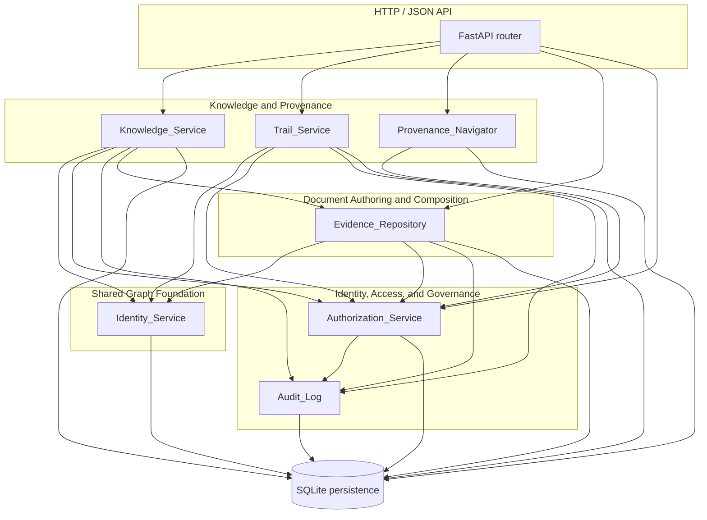
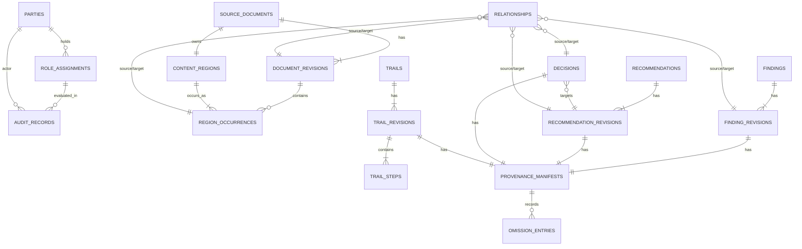

# Design Document

## Overview

This document specifies the design for the **first walking slice** of the Organizational Knowledge and Work System, a single thin end-to-end software realization of the pipeline:

```text
Source Evidence → Content Region → Finding → Recommendation → Authorized Decision
```

It satisfies the requirements in [`requirements.md`](./requirements.md) and implements *Slice 1 — Evidence to Decision* from [`06-thin-vertical-slices.md`](../../../documents/06-thin-vertical-slices.md), constrained by [`00-project-constitution.md`](../../../documents/00-project-constitution.md) §2 (the foundational Resource graph model) and [`ADR-HT-001`](../../../documents/13.01-adr-ht-001-durable-identity-strategy.md) (durable identity strategy).

### Design Goals

The slice is intentionally minimum-viable across all layers. It must:

1. Execute the five named demonstrations end-to-end: authorization-aware backlinks, one linear Trail, omission-aware provenance, denial of unauthorized decisions, and navigation back to exact Evidence.
2. Honor constitutional principles 5.1 through 5.30 within scope — in particular durable identity, immutable Revisions, explicit typed Relationships, append-only consequential records, explainable Projections, and authorization-aware discovery without inference leakage.
3. Stay deliberately thin. The slice excludes Slices 2–7 of the delivery sequence, all approval-controlled/live reference modes, governed historical withdrawal, portability export, automated-agent provenance, attention governance, and outcome measurement (per requirements.md §"Out-of-Scope Boundaries").
4. Be verifiable by both example-based and property-based tests, as Requirement 15 makes the property suite a first-class verification target.
5. Record interim choices for the open ADRs HT-002 through HT-005 so the slice can ship before those backlog ADRs are accepted (per requirements.md Gaps G-1 through G-5).

### Constitutional Posture

The slice operationalizes a small subset of the Resource graph. Its tangible deliverables are:

| Constitutional concept | Slice realization |
|---|---|
| Resource graph foundation (Principle 5.1) | `Identity_Service` + shared persistence with explicit Resource, Revision, Relationship, Region Occurrence, and Immutable Record tables. |
| Bounded contexts preserve meaning (Principle 5.2) | Service module per context: Document Authoring (`Evidence_Repository`), Knowledge (`Knowledge_Service`), Governance (`Authorization_Service`, `Audit_Log`), Shared Graph (`Identity_Service`, `Provenance_Navigator`), Knowledge/Trails (`Trail_Service`). |
| Text is canonical (Principle 5.3) | Document content stored as UTF-8 bytes with explicit canonical-form rules; manifests and JSON envelopes use a documented canonical serialization. |
| Authority and derivation distinct (Principle 5.4) | Recommendations and Decisions are separate Resource kinds; Decisions are Immutable Records; Trail target references are `Pinned` to exact Revisions. |
| Durable identity (Principle 5.5, ADR-HT-001) | UUIDv7 identifiers, canonical lowercase hyphenated form, never reused, opaque, distinct Resource-vs-Revision identity. |
| Durable history (Principle 5.6, 5.7) | `Document_Revisions`, `Finding_Revisions`, `Recommendation_Revisions`, `Trail_Revisions` are immutable; `Decisions` and `Audit_Records` are append-only. |
| Explicit typed Relationships (Principle 5.8) | `Relationships` table records source, target, type, optional source/target revisions, authoring Party, recorded time. |
| Provenance end to end (Principle 5.9) | Provenance manifest per synthesis; `Provenance_Navigator` traverses Decision → Recommendation → Finding → Region Occurrence → Document Revision. |
| Human and machine readability (Principle 5.11) | Persisted records are stable structured rows; exposed via JSON API documented in §"Components and Interfaces". |
| Dependencies visible before change (Principle 5.12) | Backlink endpoint exposes inbound Relationships, filtered by authority. |
| Reference adoption is governed (Principle 5.13) | This slice supports only `Pinned` selection for Trail Steps; Live/Approval-Controlled are explicitly out of scope. |
| Authority is explicit and auditable (Principle 5.25) | `Authorization_Service` evaluates role assignments with explicit effective period and scope; every consequential and denied action is appended to the `Audit_Log`. |
| Sensitive information governed (Principle 5.26) | Backlink and provenance responses are constructed to produce indistinguishable outputs when restricted Relationships exist. |
| Empirical learning constrains expansion (Principle 5.29) | This slice deliberately uses the smallest concept set required to validate the workflow. |
| System health observable (Principle 5.30) | Projections expose Projection Definition, sources, temporal boundary, and generated time alongside the projected status (Requirement 14). |

### Reading Order

The Architecture section describes the deployment shape and module boundaries. Components and Interfaces details each named sub-system and its public contract. Data Models defines the persistence schema and in-memory value objects. Correctness Properties states the universally quantified invariants the implementation must preserve. Error Handling and Testing Strategy close the document.

---

## Architecture

### High-Level Shape

The slice is a **modular monolith**, deployed as a single process exposing an HTTP/JSON API and backed by a single embedded relational store. This shape is chosen because:

- The slice's five demonstrations are exercised through one user-visible workflow; cross-process boundaries would add cost without proving any constitutional requirement.
- A modular monolith preserves bounded-context boundaries at the module level (Principle 5.2) while keeping persistence transactions atomic across `Audit_Log` and domain writes (Requirements 2.7, 6.4, 7.6, 13.6 all require audit-and-write in the same transaction).
- Single-process deployment is cheap enough to throw away if the pilot reveals a different boundary is needed (per requirements.md §"Open Questions" and Principle 5.29).

The module boundaries inside the process mirror the bounded contexts named in `03-context-map.md` and the sub-systems named in requirements.md §"Glossary":



### Architectural Decisions

The slice's architecture is anchored on these decisions. Each is traced to the constitutional principle or requirement that motivates it.

#### AD-WS-1 — Modular monolith, FastAPI + SQLite + Python

**Decision.** Implement the slice as a single Python 3.11+ process using FastAPI for the HTTP/JSON edge, Pydantic for request/response models, and SQLite (file-backed, `journal_mode=WAL`) as the embedded relational store accessed through SQLAlchemy Core.

**Rationale.**
- Python tooling already exists in the project (`scripts/validate_documentation.py`).
- Hypothesis is the canonical Python property-based testing library and is required by Requirement 15.
- SQLite gives ACID transactions across audit-and-write requirements without operational overhead.
- FastAPI exposes a documented OpenAPI surface and integrates cleanly with Pydantic validation.

**Constitutional alignment.** Principles 5.3 (text canonical — SQL schema is text-defined), 5.28 (openness and replaceability — SQLite is open and exportable), 5.29 (empirical learning constrains expansion — minimum stack).

**Replaceability.** The module-per-context boundary is preserved; the persistence module is the only one tightly coupled to SQLite and can be replaced without changing service contracts.

#### AD-WS-2 — UUIDv7 identifiers everywhere, canonical lowercase form

**Decision.** Every managed identity is a UUIDv7 in canonical lowercase hyphenated 8-4-4-4-12 hex form, generated by `Identity_Service`. No business meaning is embedded.

**Rationale.** ADR-HT-001 §1, §2; Requirements 1.1, 1.2, 1.6, 1.7; property 15.10 (identity opacity and uniqueness).

#### AD-WS-3 — Distinct identity columns for Resource and Revision

**Decision.** The schema holds `resource_id` and `revision_id` as two distinct columns on every Revision row, and `trail_id`/`trail_revision_id` as two distinct columns on every Trail Revision row. No Revision Identity is ever shared across Resources or Trails.

**Rationale.** ADR-HT-001 §4, Requirements 1.2 and 1.3.

#### AD-WS-4 — Append-only Immutable Records via insert-only tables and triggers

**Decision.** `Document_Revisions`, `Region_Occurrences`, `Finding_Revisions`, `Recommendation_Revisions`, `Decisions`, `Trail_Revisions`, `Trail_Steps`, `Provenance_Manifests`, `Omission_Entries`, and `Audit_Records` are insert-only. UPDATE and DELETE on these tables are rejected by database triggers and by the persistence layer.

**Rationale.** Principles 5.6, 5.7; Requirements 2.4, 6.6, 13.3, 13.5.

#### AD-WS-5 — Audit append in the same transaction as the originating write

**Decision.** Every consequential write opens one SQL transaction that inserts the domain row(s), the `Audit_Records` row, and the `Provenance_Manifests` row (where applicable) together. If any of those inserts fails, the transaction is rolled back and the operation returns an error.

**Rationale.** Requirements 2.5, 2.7, 6.4, 7.6, 13.1, 13.2, 13.6.

#### AD-WS-6 — Interim Content Region anchoring (input to ADR-HT-003)

**Decision.** A Region Occurrence stores `start_offset_bytes`, `end_offset_bytes`, `span_byte_length`, and `span_content_digest_sha256` of the bounded UTF-8 byte span inside the owning Document Revision. Offsets are in bytes, not codepoints or characters. This interim representation closes Gap G-1.

**Rationale.** Requirements 3.1, 3.2, 3.4 require resolvable spans with content digest. Byte offsets are deterministic against the immutable Document Revision content. Codepoint or structural anchoring are deferred to ADR-HT-003. The choice and its inputs are recorded in the `Interim_ADR_Records` table so the slice can be migrated when ADR-HT-003 is accepted.

#### AD-WS-7 — Interim Relationship lifecycle: immutable assertions (input to ADR-HT-004)

**Decision.** Every `Relationships` row (for types `Supports`, `Contradicts`, `Derived From`, `Addresses`) is an immutable assertion with a recorded time and an authoring Party. There is no "retract" verb in this slice; supersession is represented by a later Relationship of type `Supersedes`. This interim choice closes Gap G-2.

**Rationale.** Principle 5.8 (Relationships are explicit, typed, traceable), Requirement 4.2, Requirement 4.4; the simplest viable lifecycle that preserves history.

#### AD-WS-8 — Interim backlink indexing: on-demand reverse scan with a covering index (input to ADR-HT-005)

**Decision.** Backlink queries scan the `Relationships` table filtered by `target_id` and `target_revision_id`, using a composite index `(target_id, target_revision_id, relationship_type, recorded_time)`. Authorization filtering is applied after retrieval but before pagination is computed (see §"Provenance_Navigator" for the constant-time scaffolding). This interim choice closes Gap G-3.

**Rationale.** Requirement 8.1 (≤ 2 seconds for ≤ 500 backlinks), simplicity, and reversibility — switching to a dedicated reverse index or graph cache later does not change the public contract.

#### AD-WS-9 — Default Completeness Disclosure policy (closes Gap G-4)

**Decision.** The slice ships a single default Completeness Disclosure policy named `slice-default-2026`. Its rules:

1. If a node in a provenance chain or backlink set is `restricted` for the requesting Party, replace the node with a `redaction_marker` containing only `{"kind": "<node_kind>", "redacted": true}` and no identifier, attribute, or count.
2. If a node is `unavailable`, `stale`, or `unresolved`, return a gap descriptor containing only `stage`, `category`, and (if the next reachable node is visible to the requesting Party) the next reachable node's identity.
3. Restricted-vs-nonexistent observability is normalized: counts, pagination cursors, response sizes, and error wording produced for restricted nodes match those produced for nonexistent nodes, within the variation tolerances of Requirement 15 property 4.

**Rationale.** Requirement 10.5, Requirement 11.3, REQ-HT-014. The policy is recorded as a row in `Disclosure_Policies` so it can be replaced when ADR-HT-008 is accepted.

#### AD-WS-10 — Authority-basis enumeration (closes Gap G-5)

**Decision.** The slice's `authority_basis` field on Decisions and on Audit denial records accepts exactly:

- `role-grant-id` — identifies the `Role_Assignments.id` that granted the authority;
- `scope-id` — identifies the scope record that defined applicability;
- `delegation-chain-id` — identifies an explicit chain of role assignments where a delegated authority applies.

**Rationale.** Requirements 6.2, 12.1; satisfies the gap recorded in requirements.md G-5. The enumeration lives in `Authority_Bases` so it can be extended later.

#### AD-WS-11 — Recommendation outcomes restricted to {Accept, Reject, Defer} for the slice

**Decision.** The slice's `Decisions.outcome` column accepts only `Accept`, `Reject`, or `Defer`. Supersession (a fourth outcome permitted by REQ-KP-008) is out of scope for this slice.

**Rationale.** Requirement 6.2 and requirements.md G-6. Pilot feedback may reintroduce supersession in a later slice.

#### AD-WS-12 — Trail Step selection mode is `Pinned` only in this slice

**Decision.** Every Trail Step records `selection_mode = 'Pinned'` and references an exact Revision or Immutable Record identity. Live, Approval-Controlled, and Historical-As-Of modes are deferred.

**Rationale.** Requirement 9.3 and requirements.md scope §"Out of scope for this slice".

#### AD-WS-13 — Property-based testing with Hypothesis at ≥ 100 cases per property, seeded

**Decision.** The verification suite uses [Hypothesis](https://hypothesis.readthedocs.io/) as the property-based testing library, configured with `max_examples=100` minimum per property, deterministic seed capture via `--hypothesis-seed`, and Hypothesis's built-in shrinking for minimal counterexamples.

**Rationale.** Requirements 15.1 through 15.13.

### Cross-Cutting Concerns

**Time.** All recorded timestamps are UTC ISO-8601 with millisecond precision for audit (Requirements 2.5, 7.2, 13.1) and second precision for most domain fields (Requirements 4.2, 12.1, 12.5). The slice uses a single `Clock` protocol so tests can inject deterministic time.

**Identifier generation.** `Identity_Service.new_id()` calls `uuid.uuid7()` (via `uuid-utils` shim if needed to support Python's stdlib without v7) and validates the result against the canonical-form regex `^[0-9a-f]{8}-[0-9a-f]{4}-7[0-9a-f]{3}-[89ab][0-9a-f]{3}-[0-9a-f]{12}$`.

**Transactionality.** A single SQLite connection per request, with `BEGIN IMMEDIATE` for any write path. Writes either commit fully (domain rows + audit row + manifest rows, where applicable) or roll back fully.

**Authorization.** Every write endpoint resolves the calling Party from a bearer token (HMAC-signed JSON Web Token, signed by a slice-local key — the slice does not federate to an external IdP). The `Authorization_Service` evaluates effective role at the recorded time of the action, not at the time the token was issued.

**Privacy and inference leakage.** The `Provenance_Navigator` always materializes responses through a single function that takes a *fully-visible plan* and the *authorized projection*; it produces an output sized and shaped from the authorized projection so that restricted-vs-nonexistent observability is constant (Requirement 8.3, property 15.4).

---

## Components and Interfaces

Each component below maps to one of the seven sub-systems named in requirements.md §"Glossary". For each I describe its responsibilities, public surface (function signatures or HTTP endpoints), inputs and outputs, internal collaborators, and the requirements it satisfies.

The slice exposes a single FastAPI router at `/api/v1`. All endpoints accept and return `application/json` and require a `Authorization: Bearer <token>` header except for explicitly anonymous diagnostic endpoints.

### Identity_Service

**Responsibility.** Generate, validate, and resolve durable identities for every managed Resource, Resource Revision, Relationship, Content Region, Region Occurrence, Immutable Record, Trail, Trail Revision, Trail Step, and Provenance Manifest.

**Public surface (Python module-level).**

```python
class IdentityService:
    def new_resource_id(self) -> ResourceId: ...
    def new_revision_id(self) -> RevisionId: ...
    def new_relationship_id(self) -> RelationshipId: ...
    def new_region_id(self) -> RegionId: ...
    def new_immutable_record_id(self) -> ImmutableRecordId: ...
    def new_trail_id(self) -> TrailId: ...
    def new_trail_revision_id(self) -> TrailRevisionId: ...
    def new_trail_step_id(self) -> TrailStepId: ...
    def new_manifest_id(self) -> ManifestId: ...
    def validate_canonical(self, identifier: str) -> bool: ...
    def reject_if_duplicate(self, identifier: str, content_digest: str) -> None: ...
```

All `new_*` methods return a canonical UUIDv7 string. `reject_if_duplicate` raises `IdentityConflictError` if the supplied identifier already exists with a different content digest (Requirement 1.4).

**Internal collaborators.** None; this is a leaf service.

**Persistence.** Writes a row to `Identifier_Registry` for every issued identifier: `(identifier, kind, content_digest, issued_at)`. The unique index on `identifier` enforces non-reuse globally; the unique index on `(kind, content_digest)` is *not* applied (different domain contents may share a hash by coincidence in principle, but never share an identifier).

**Satisfies.** Requirements 1.1 through 1.7; property 15.10.

### Evidence_Repository

**Responsibility.** Persist Source Documents and their immutable Document Revisions, persist Content Region occurrences, and expose lookup by Resource Identity and Revision Identity.

**HTTP surface.**

| Method | Path | Purpose |
|---|---|---|
| `POST` | `/api/v1/documents` | Create a new Source Document and an initial Document Revision. |
| `POST` | `/api/v1/documents/{resource_id}/revisions` | Append a new Document Revision to an existing Source Document. |
| `POST` | `/api/v1/documents/{resource_id}/revisions/{revision_id}/regions` | Identify a Content Region occurrence within a Document Revision. |
| `GET` | `/api/v1/documents/{resource_id}/revisions/{revision_id}` | Read a Document Revision. |
| `GET` | `/api/v1/regions/{region_id}/occurrences/{revision_id}` | Read a specific Region Occurrence. |
| `PATCH` | `/api/v1/documents/{resource_id}/location` | Rename or relocate a Source Document without changing identity. |

**Request models.**

```python
class CreateDocumentRequest(BaseModel):
    content_bytes: bytes        # 1 <= len <= 100 * 1024 * 1024
    contributing_party_id: UUID
    external_identifier: Optional[str]   # 1..256 chars
    source_system_id: Optional[str]      # 1..128 chars
    authority: Literal["authoritative", "imported-replica", "imported-projection",
                       "imported-index", "imported-federation-point",
                       "reference-to-system-of-record"]

class CreateRegionRequest(BaseModel):
    start_offset_bytes: int     # 0 <= start < end <= len(content_bytes)
    end_offset_bytes: int
```

**Response models.** Each successful write returns `{ "resource_id": ..., "revision_id": ..., "recorded_time": "...", "content_digest": "..." }`.

**Internal collaborators.** `Identity_Service` (assign identifiers), `Authorization_Service` (authorize the contributing Party), `Audit_Log` (append creation record in the same transaction).

**Satisfies.** Requirement 2 (capture source Evidence), Requirement 3 (addressable Content Region), Requirement 1.3 (rename preserves identity), Requirement 13.1 (audit append for every create).

**Notes on Region anchoring (AD-WS-6).** Offsets are byte offsets into the immutable Document Revision content. The Region's `span_content_digest_sha256` is computed at occurrence creation time and used by `Provenance_Navigator` to verify resolvability (Requirement 11.2, property 15.9).

### Knowledge_Service

**Responsibility.** Persist Findings, Recommendations, Decisions, and the typed Relationships among them (`Supports`, `Contradicts`, `Derived From`, `Addresses`). Record the provenance manifest for every Finding, Recommendation, and Decision.

**HTTP surface.**

| Method | Path | Purpose |
|---|---|---|
| `POST` | `/api/v1/findings` | Create a Finding (with `Supports` Relationships or hypothesis flag). |
| `POST` | `/api/v1/findings/{finding_id}/contradictions` | Record a `Contradicts` Relationship between two Findings. |
| `POST` | `/api/v1/recommendations` | Create a Recommendation with `Derived From` Relationships to one or more Findings. |
| `POST` | `/api/v1/recommendations/{rec_id}/decisions` | Create an Authorized Decision on a Recommendation Revision. |
| `GET` | `/api/v1/findings/{finding_id}/revisions/{revision_id}` | Read a Finding Revision. |
| `GET` | `/api/v1/recommendations/{rec_id}/revisions/{revision_id}` | Read a Recommendation Revision. |
| `GET` | `/api/v1/decisions/{decision_id}` | Read a Decision Immutable Record. |

**Request models (excerpted).**

```python
class CreateFindingRequest(BaseModel):
    statement: str
    supporting_region_occurrences: list[SupportRef]   # may be empty if is_hypothesis = True
    is_hypothesis: bool = False
    assumptions: list[str] = []
    confidence_note: Optional[str]

class CreateRecommendationRequest(BaseModel):
    derived_from_findings: list[FindingRef]   # 1..50
    rationale: Optional[str]                  # 1..10000 if provided
    assumptions: list[str] = []               # 0..50, each 1..2000
    confidence: Optional[Literal["Low", "Medium", "High"]]

class CreateDecisionRequest(BaseModel):
    target_recommendation_id: UUID
    target_recommendation_revision_id: UUID
    outcome: Literal["Accept", "Reject", "Defer"]
    rationale: str                            # 1..4000
    applicable_scope: str
    authority_basis: AuthorityBasisRef
```

**Internal collaborators.** `Identity_Service`, `Authorization_Service` (Decision authority check), `Audit_Log` (consequential and denied records), `Evidence_Repository` (resolve Region Occurrences cited by `Supports` Relationships), `Provenance_Manifest_Writer` (internal helper that records material sources and Omission Entries per Requirement 10).

**Satisfies.** Requirements 4, 5, 6, 7, 10 (provenance side), 13.

#### Decision authority evaluation flow

1. The endpoint extracts the caller's Party Identity from the bearer token.
2. It resolves the target Recommendation Revision; rejects (404-shaped) if missing.
3. It rejects (409-shaped) if the Recommendation Revision is already the target of a finalized Decision (Requirement 6.5).
4. It calls `Authorization_Service.evaluate(party, action="approve.decision", target=recommendation_revision, at=now())`.
5. If `permit`, it begins a transaction that inserts: the Decision row, the `Addresses` Relationship row, the Audit record, the Provenance Manifest, any Omission Entries.
6. If `deny`, it inserts the Denial Record into `Audit_Log` (with retry up to 3 attempts per Requirement 7.6) and returns the indistinguishable denial response (per AD-WS-9).

### Authorization_Service

**Responsibility.** Record contextual role assignments and evaluate authority for every consequential action. Emit denial decisions that conform to AD-WS-9.

**Public surface.**

```python
class AuthorizationService:
    def assign_role(self, request: AssignRoleRequest) -> RoleAssignmentId: ...
    def evaluate(
        self,
        party_id: PartyId,
        action: ActionType,
        target: TargetRef,
        at: datetime,
    ) -> AuthorizationDecision: ...
```

`AuthorizationDecision` is `permit(authority_basis)` or `deny(reason_code, correlation_id)` where `reason_code ∈ {not-yet-effective, expired, revoked, out-of-scope, no-role-assignment}`.

**ActionType enumeration.**

- `view.<resource_kind>`
- `modify.<resource_kind>`
- `approve.decision`
- `create.finding`
- `create.recommendation`
- `create.trail`

**HTTP surface.**

| Method | Path | Purpose |
|---|---|---|
| `POST` | `/api/v1/roles/assignments` | Assign a contextual role (requires Resource Steward authority). |
| `POST` | `/api/v1/roles/assignments/{id}/revocations` | Revoke a role assignment. |

**Internal collaborators.** `Audit_Log` (one record per evaluation per Requirement 12.5), `Identity_Service`.

**Satisfies.** Requirements 7, 12; supports every other service for authority checks.

**Note on three distinct authority types (Requirement 12.3, 12.4).** The `Role_Assignments.authorities_granted` column is a JSON array drawn from `{"view", "modify", "approve"}`. `evaluate` chooses the required authority by the `action` ActionType and never substitutes one for another.

### Trail_Service

**Responsibility.** Persist Trails, Trail Revisions, and Trail Steps for the slice. Enforce the linear-5-step shape (Requirement 9).

**HTTP surface.**

| Method | Path | Purpose |
|---|---|---|
| `POST` | `/api/v1/trails` | Create a new Trail with an initial Trail Revision. |
| `POST` | `/api/v1/trails/{trail_id}/revisions` | Append a new Trail Revision to an existing Trail. |
| `GET` | `/api/v1/trails/{trail_id}/revisions/{revision_id}` | Read a Trail Revision and its steps. |

**Request model (excerpted).**

```python
class CreateTrailRevisionRequest(BaseModel):
    purpose: str                                  # 1..500
    audience_id: str
    ordering_rationale: Optional[str]             # 0..500
    steps: list[TrailStepInput]                   # exactly 5

class TrailStepInput(BaseModel):
    ordinal: int                                  # 1..5 unique
    target_ref: TargetRef                         # must resolve to immutable target
    selection_mode: Literal["Pinned"]             # only Pinned in this slice
    annotation: Optional[str]                     # 0..2000
```

**Validation order (Requirements 9.5, 9.7).**
1. Validate structural shape: exactly 5 steps, ordinals `{1,2,3,4,5}` contiguous, target kinds per ordinal match `{Document Revision, Region Occurrence, Finding Revision, Recommendation Revision, Decision}`.
2. Resolve each target reference against persistence. If any does not resolve, reject the entire request and return an error identifying each unresolved step by ordinal (no partial persistence).
3. If structural and resolvability checks pass, open transaction; insert Trail Revision and 5 Trail Steps; insert Audit record.

**Material-change detection (Requirement 9.4).** When a `POST /trails/{trail_id}/revisions` request is made and the same Trail Identity already has a Revision, the service compares the canonical-form of (purpose, audience_id, ordering_rationale, ordered list of (ordinal, target_ref, annotation)) against the prior Revision. If they differ, a new immutable Trail Revision is created with `predecessor_revision_id` set to the prior Revision Identity.

**Internal collaborators.** `Identity_Service`, `Authorization_Service`, `Audit_Log`, `Evidence_Repository`, `Knowledge_Service` (to resolve targets).

**Satisfies.** Requirement 9; supports properties 15.5 and 15.6.

### Provenance_Navigator

**Responsibility.** Provide three navigation operations: backlink discovery, end-to-end provenance traversal from a Decision back to exact Evidence, and resolution of Content Region occurrences. Apply authorization filtering and the Completeness Disclosure policy (AD-WS-9).

**HTTP surface.**

| Method | Path | Purpose |
|---|---|---|
| `GET` | `/api/v1/backlinks/{node_kind}/{node_id}` | Inbound Relationships for a node, filtered by authority. |
| `GET` | `/api/v1/decisions/{decision_id}/provenance` | Decision → Recommendation → Finding(s) → Region Occurrence(s) → Document Revision chain. |
| `GET` | `/api/v1/findings/{finding_id}/provenance` | Provenance manifest of a Finding. |
| `GET` | `/api/v1/recommendations/{rec_id}/provenance` | Provenance manifest of a Recommendation. |
| `GET` | `/api/v1/trails/{trail_id}/revisions/{revision_id}/provenance` | Trail Revision provenance manifest. |
| `GET` | `/api/v1/regions/{region_id}/occurrences/{revision_id}/text` | Bounded text span for a Region Occurrence. |

**Backlink query algorithm (constant-time observability — supports property 15.4).**

```python
def list_backlinks(target_id, target_revision_id, party):
    # Step 1: load all candidate inbound relationships (ignoring authority).
    candidates = db.execute(
        SELECT * FROM Relationships
        WHERE target_id = :target_id
          AND (target_revision_id IS :target_revision_id OR target_revision_id = :target_revision_id)
        ORDER BY recorded_time ASC, relationship_id ASC
        LIMIT 500
    )

    # Step 2: build "authorized projection".
    visible = []
    for r in candidates:
        if authz.evaluate(party, "view.relationship", r, at=now()).is_permit and \
           authz.evaluate(party, f"view.{r.source_kind}", r.source_endpoint, at=now()).is_permit:
            visible.append(r)
        # else: r is silently dropped; the response is constructed from `visible` alone.

    # Step 3: shape the response identically regardless of dropped candidates.
    cursor = compute_cursor_from(visible)   # cursor depends only on visible set
    return serialize(visible, cursor)
```

The crucial invariant: response *count*, *cursor*, *response size*, and *latency profile* are computed from `visible` alone, so a party who could not see relationship `R` receives an identical response to one issued to a party in a universe where `R` does not exist (Requirement 8.3, property 15.4). The "latency within 100 ms variation" property is met by deferring response construction until a fixed-latency timer has elapsed (the slice uses `await asyncio.sleep_until(latency_baseline)` shaped from response size, not query timing).

**Provenance traversal algorithm (Requirement 11, property 15.8 idempotence).**

```python
def navigate_decision(decision_id, party, at):
    chain = []
    d = load_decision(decision_id)
    if not authz.permit(party, "view.decision", d, at):
        return not_found_indistinguishable_response()
    chain.append(serialize(d))

    rec = load_revision(Recommendation, d.target_recommendation_id, d.target_recommendation_revision_id)
    chain.append(node_or_redaction(rec, party, at, kind="recommendation"))

    findings = list_derived_from_findings(rec, party, at)
    chain.append([node_or_redaction(f, party, at, kind="finding") for f in findings])

    region_occurrences = list_supports_for_findings(findings, party, at)
    chain.append([occurrence_or_redaction(o, party, at) for o in region_occurrences])

    docrevs = [load_document_revision(o.doc_resource_id, o.doc_revision_id) for o in region_occurrences]
    chain.append([node_or_redaction(d, party, at, kind="document_revision") for d in docrevs])

    return chain
```

Idempotence is guaranteed by the immutability of all referenced records and by using `at` as the effective time for authority evaluation.

**Internal collaborators.** `Authorization_Service` (all read authority decisions), `Audit_Log` (no append on reads in this slice; reads are not consequential), `Evidence_Repository` and `Knowledge_Service` (load nodes).

**Satisfies.** Requirements 8, 10 (read side), 11; supports properties 15.3, 15.4, 15.7, 15.8, 15.9.

### Audit_Log

**Responsibility.** Append-only store of every consequential action and every denied action, with insertion order preserved.

**Public surface.**

```python
class AuditLog:
    def append_consequential(self, actor_id, action, target_id, target_revision_id,
                             recorded_time, correlation_id, payload_digest) -> AuditRecordId: ...
    def append_denial(self, actor_id, attempted_action, target_id, target_revision_id,
                      recorded_time, reason_code, correlation_id) -> AuditRecordId: ...
```

Both methods participate in the caller's transaction. Failure raises `AuditAppendError`, which the caller must propagate (the originating transaction rolls back per Requirements 2.7, 13.6).

**Persistence.** Insert-only `Audit_Records` table with composite primary key `(recorded_time, append_sequence)` and database-level rejection of UPDATE/DELETE.

**Read surface.** No HTTP endpoint in this slice; reads occur via internal tooling and verification harnesses. Exposing audit reads is deferred until Slice 2 or later.

**Satisfies.** Requirements 13.1 through 13.6; supports properties 15.11, 15.12.

### Application-Level Composition

The FastAPI router wires components together via constructor injection. Each request creates a `RequestContext` bundle:

```python
@dataclass
class RequestContext:
    party_id: PartyId
    token_correlation_id: str
    clock: Clock
    db: Session
    ids: IdentityService
    authz: AuthorizationService
    audit: AuditLog
```

Endpoints accept `RequestContext` and the parsed request body. Internal services accept `RequestContext` rather than reading globals — this is essential for property tests to inject deterministic clocks and isolated SQLite instances.

---

## Data Models

This section defines the persistent schema and the in-memory value objects used at module boundaries. Every immutable table is enforced insert-only via SQL triggers (AD-WS-4).

### Logical Schema Overview



### Table-by-Table Specification

#### `Identifier_Registry`

| Column | Type | Notes |
|---|---|---|
| `identifier` | TEXT PRIMARY KEY | UUIDv7 canonical lowercase form. |
| `kind` | TEXT NOT NULL | One of: `resource`, `revision`, `relationship`, `region`, `region_occurrence`, `immutable_record`, `trail`, `trail_revision`, `trail_step`, `manifest`. |
| `content_digest` | TEXT | SHA-256 hex of the content that first bound the identifier, or NULL when not applicable. |
| `issued_at` | TIMESTAMP NOT NULL | UTC, millisecond precision. |

Index: `UNIQUE(identifier)` (enforces non-reuse globally). No DELETE, no UPDATE.

#### `Parties`

| Column | Type | Notes |
|---|---|---|
| `party_id` | TEXT PRIMARY KEY | Resource Identity (UUIDv7). |
| `kind` | TEXT NOT NULL | `person`, `organization`, `team`, `automated_agent` — slice only seeds `person`. |
| `display_name` | TEXT |  |
| `created_at` | TIMESTAMP NOT NULL |  |

#### `Role_Assignments`

| Column | Type | Notes |
|---|---|---|
| `role_assignment_id` | TEXT PRIMARY KEY |  |
| `party_id` | TEXT NOT NULL REFERENCES `Parties(party_id)` |  |
| `role_name` | TEXT NOT NULL | E.g., `decision_maker`, `researcher`, `analyst`, `resource_steward`. |
| `scope` | TEXT NOT NULL | Scope expression (slice uses simple opaque scope identifiers). |
| `authorities_granted` | TEXT NOT NULL | JSON array, subset of `["view","modify","approve"]`. |
| `effective_start` | TIMESTAMP NOT NULL |  |
| `effective_end` | TIMESTAMP | NULL = open-ended. |
| `revoked_at` | TIMESTAMP | NULL until revoked. |
| `assigning_authority_id` | TEXT NOT NULL |  |
| `recorded_at` | TIMESTAMP NOT NULL |  |

Immutable except `revoked_at` (which is a one-shot field, set once and never overwritten — enforced by a trigger that rejects updates if `revoked_at` is already non-NULL).

#### `Source_Documents`

| Column | Type | Notes |
|---|---|---|
| `resource_id` | TEXT PRIMARY KEY | Stable across renames (Requirement 1.3). |
| `current_location` | TEXT | Mutable display path; identity is independent. |
| `external_identifier` | TEXT | 1..256 chars when present. |
| `source_system_id` | TEXT | 1..128 chars when present. |
| `authority` | TEXT NOT NULL | Enum per Requirement 2.3. |
| `created_at` | TIMESTAMP NOT NULL |  |

#### `Document_Revisions` (immutable)

| Column | Type | Notes |
|---|---|---|
| `revision_id` | TEXT PRIMARY KEY |  |
| `resource_id` | TEXT NOT NULL REFERENCES `Source_Documents` |  |
| `parent_revision_id` | TEXT | NULL for first revision; references this table. |
| `content_bytes` | BLOB NOT NULL | 1..(100*1024*1024) bytes. |
| `content_digest_sha256` | TEXT NOT NULL | Computed at write time over full byte content. |
| `contributing_party_id` | TEXT NOT NULL REFERENCES `Parties` |  |
| `recorded_at` | TIMESTAMP NOT NULL | UTC ms precision. |
| `change_description` | TEXT |  |

Indexes: `(resource_id, recorded_at)`. Triggers reject UPDATE/DELETE.

#### `Content_Regions`

| Column | Type | Notes |
|---|---|---|
| `region_id` | TEXT PRIMARY KEY |  |
| `parent_resource_id` | TEXT NOT NULL REFERENCES `Source_Documents` |  |
| `created_at` | TIMESTAMP NOT NULL |  |

#### `Region_Occurrences` (immutable)

| Column | Type | Notes |
|---|---|---|
| `region_id` | TEXT NOT NULL REFERENCES `Content_Regions` |  |
| `document_revision_id` | TEXT NOT NULL REFERENCES `Document_Revisions` |  |
| `start_offset_bytes` | INTEGER NOT NULL | ≥ 0 |
| `end_offset_bytes` | INTEGER NOT NULL | > start, ≤ length(content_bytes) |
| `span_byte_length` | INTEGER NOT NULL | = end - start |
| `span_content_digest_sha256` | TEXT NOT NULL |  |
| `recorded_at` | TIMESTAMP NOT NULL |  |

PRIMARY KEY: `(region_id, document_revision_id)` — one occurrence per Region per Revision (per Trail Domain Model §3, Region Occurrence is keyed by revision).

Triggers reject UPDATE/DELETE. The schema permits a Region to have occurrences in multiple Revisions, preserving REQ-KP-004's historical addressability.

#### `Findings` and `Finding_Revisions`

```sql
Findings(finding_id TEXT PK, created_at TIMESTAMP NOT NULL)

Finding_Revisions(
  finding_revision_id TEXT PK,
  finding_id TEXT NOT NULL REFERENCES Findings,
  parent_revision_id TEXT,
  statement TEXT NOT NULL,
  is_hypothesis INTEGER NOT NULL,           -- 0 or 1
  authoring_party_id TEXT NOT NULL,
  assumptions_json TEXT NOT NULL,           -- JSON array of strings
  confidence_note TEXT,
  recorded_at TIMESTAMP NOT NULL
)
```

Triggers reject UPDATE/DELETE on `Finding_Revisions`.

#### `Recommendations` and `Recommendation_Revisions`

```sql
Recommendations(recommendation_id TEXT PK, created_at TIMESTAMP NOT NULL)

Recommendation_Revisions(
  recommendation_revision_id TEXT PK,
  recommendation_id TEXT NOT NULL REFERENCES Recommendations,
  parent_revision_id TEXT,
  rationale TEXT,                            -- 1..10000 when present
  assumptions_json TEXT NOT NULL,            -- 0..50 entries, each 1..2000
  confidence TEXT,                           -- Low/Medium/High or NULL
  authoring_party_id TEXT NOT NULL,
  recorded_at TIMESTAMP NOT NULL
)
```

Triggers reject UPDATE/DELETE.

#### `Decisions` (Immutable Record)

```sql
Decisions(
  decision_id TEXT PK,
  target_recommendation_id TEXT NOT NULL,
  target_recommendation_revision_id TEXT NOT NULL,
  outcome TEXT NOT NULL,                     -- Accept | Reject | Defer
  rationale TEXT NOT NULL,                   -- 1..4000
  deciding_party_id TEXT NOT NULL,
  authority_basis_type TEXT NOT NULL,        -- role-grant-id | scope-id | delegation-chain-id
  authority_basis_id TEXT NOT NULL,
  applicable_scope TEXT NOT NULL,
  recorded_at TIMESTAMP NOT NULL,
  UNIQUE(target_recommendation_id, target_recommendation_revision_id)
                                             -- enforces Requirement 6.5: one decision per Recommendation Revision
)
```

Triggers reject UPDATE/DELETE.

#### `Relationships`

```sql
Relationships(
  relationship_id TEXT PK,
  relationship_type TEXT NOT NULL,           -- Supports | Contradicts | Derived From | Addresses | Supersedes
  source_kind TEXT NOT NULL,                 -- e.g., 'finding_revision'
  source_id TEXT NOT NULL,
  source_revision_id TEXT,
  target_kind TEXT NOT NULL,
  target_id TEXT NOT NULL,
  target_revision_id TEXT,
  authoring_party_id TEXT NOT NULL,
  recorded_at TIMESTAMP NOT NULL
)
```

Indexes:
- `(target_id, target_revision_id, relationship_type, recorded_at)` — backlink scan (AD-WS-8).
- `(source_id, source_revision_id, relationship_type)` — outbound traversal.

Triggers reject UPDATE/DELETE (AD-WS-7).

#### `Trails`, `Trail_Revisions`, `Trail_Steps`

```sql
Trails(trail_id TEXT PK, created_at TIMESTAMP NOT NULL, current_revision_id TEXT)

Trail_Revisions(
  trail_revision_id TEXT PK,
  trail_id TEXT NOT NULL REFERENCES Trails,
  predecessor_revision_id TEXT,
  purpose TEXT NOT NULL,                     -- 1..500
  audience_id TEXT NOT NULL,
  ordering_rationale TEXT,                   -- 0..500
  authoring_party_id TEXT NOT NULL,
  recorded_at TIMESTAMP NOT NULL
)

Trail_Steps(
  trail_step_id TEXT PK,
  trail_revision_id TEXT NOT NULL REFERENCES Trail_Revisions,
  ordinal INTEGER NOT NULL CHECK(ordinal BETWEEN 1 AND 5),
  selection_mode TEXT NOT NULL CHECK(selection_mode = 'Pinned'),
  target_kind TEXT NOT NULL,                 -- 'document_revision','region_occurrence','finding_revision','recommendation_revision','decision'
  target_id TEXT NOT NULL,
  target_revision_id TEXT,                   -- NULL for decision and region_occurrence (occurrence carries its own composite key)
  region_id TEXT,                            -- non-NULL only when target_kind = 'region_occurrence'
  annotation TEXT,                           -- 0..2000
  UNIQUE(trail_revision_id, ordinal)
)
```

A CHECK constraint enforces `target_kind` matches `ordinal`:
- ordinal 1 → `document_revision`
- ordinal 2 → `region_occurrence`
- ordinal 3 → `finding_revision`
- ordinal 4 → `recommendation_revision`
- ordinal 5 → `decision`

Triggers reject UPDATE/DELETE on `Trail_Revisions` and `Trail_Steps`. The `current_revision_id` pointer on `Trails` is a mutable convenience field (Principle 5.23: a projection from the immutable Revisions), not authoritative.

#### `Provenance_Manifests` and `Omission_Entries`

```sql
Provenance_Manifests(
  manifest_id TEXT PK,
  subject_kind TEXT NOT NULL,                -- finding_revision | recommendation_revision | decision | trail_revision
  subject_id TEXT NOT NULL,
  subject_revision_id TEXT,                  -- NULL when subject is Decision
  authoring_party_id TEXT NOT NULL,
  recorded_at TIMESTAMP NOT NULL,
  included_sources_json TEXT NOT NULL,       -- JSON array of {kind, resource_id, revision_id, recorded_at}
  is_complete INTEGER NOT NULL DEFAULT 1     -- 0 if any omission category in {unavailable,restricted,stale,unresolved} is unresolved
)

Omission_Entries(
  omission_entry_id TEXT PK,
  manifest_id TEXT NOT NULL REFERENCES Provenance_Manifests,
  excluded_source_id TEXT NOT NULL,
  excluded_source_revision_id TEXT,
  category TEXT NOT NULL CHECK(category IN ('intentional','unavailable','restricted','stale','unresolved')),
  rationale TEXT NOT NULL,                   -- 1..2000
  authoring_party_id TEXT NOT NULL,
  recorded_at TIMESTAMP NOT NULL,
  resolved_at TIMESTAMP                      -- set when the omission is later resolved
)
```

Triggers reject UPDATE on `Provenance_Manifests` (subject and contents immutable) and on `Omission_Entries` (except `resolved_at` which is one-shot).

Source Freshness Window (Requirement 10.3) is checked at manifest creation time: if any consulted source's most recent Revision is older than 24 hours and a refresh has not been attempted within the window, an Omission Entry with `category = 'stale'` is added.

#### `Audit_Records` (append-only)

```sql
Audit_Records(
  audit_record_id TEXT PK,
  append_sequence INTEGER NOT NULL,          -- monotonic per database
  actor_party_id TEXT NOT NULL,
  action_type TEXT NOT NULL,                 -- e.g., 'create.finding','approve.decision','deny.decision'
  outcome TEXT NOT NULL,                     -- 'permit' or 'deny' or 'consequential'
  target_id TEXT,
  target_revision_id TEXT,
  evaluated_role_assignment_id TEXT,
  authorities_required TEXT,                 -- JSON array
  authorities_held TEXT,                     -- JSON array
  reason_code TEXT,                          -- for denials
  correlation_id TEXT NOT NULL,
  recorded_at TIMESTAMP NOT NULL,            -- UTC ms precision
  UNIQUE(append_sequence)
)
```

Indexes: `(recorded_at, append_sequence)` for ordered scans.

Triggers reject UPDATE/DELETE.

#### `Interim_ADR_Records`

```sql
Interim_ADR_Records(
  record_id TEXT PK,
  motivating_requirement TEXT NOT NULL,      -- e.g., 'R3.1','R3.2'
  motivating_criterion TEXT NOT NULL,
  observable_behavior TEXT NOT NULL,
  recorded_at TIMESTAMP NOT NULL,
  backlog_adr_id TEXT NOT NULL,              -- 'ADR-HT-002' ... 'ADR-HT-005' (or 'ADR-HT-008')
  resolved_by_adr_id TEXT,
  resolved_at TIMESTAMP
)
```

This table makes the Gap G-1 through G-5 interim decisions retrievable by backlog ADR identifier, satisfying Requirement 16.3.

#### `Disclosure_Policies`

```sql
Disclosure_Policies(
  policy_id TEXT PK,
  policy_name TEXT NOT NULL UNIQUE,          -- 'slice-default-2026' in this slice
  ruleset_json TEXT NOT NULL,
  effective_start TIMESTAMP NOT NULL,
  superseded_by TEXT
)
```

### In-Memory Value Objects

These are the cross-module DTOs used at service boundaries. All are `frozen` Pydantic models.

```python
class ResourceRef(BaseModel):
    kind: str
    resource_id: UUID
    revision_id: Optional[UUID]    # required when kind addresses a revisioned target

class FindingRef(ResourceRef):
    kind: Literal["finding"] = "finding"

class RegionOccurrenceRef(BaseModel):
    region_id: UUID
    document_revision_id: UUID

class Span(BaseModel):
    start_offset_bytes: int
    end_offset_bytes: int
    bounded_text: bytes
    content_digest_sha256: str
    document_revision_id: UUID

class AuthorityBasisRef(BaseModel):
    type: Literal["role-grant-id","scope-id","delegation-chain-id"]
    id: UUID

class ProvenanceNode(BaseModel):
    kind: str
    resource_id: Optional[UUID]
    revision_id: Optional[UUID]
    attributes: dict[str, Any]     # only the authority-permitted attributes
    redacted: bool = False

class GapDescriptor(BaseModel):
    stage: str                     # 'recommendation' | 'finding' | 'region' | 'document'
    category: Literal["unavailable","restricted","stale","unresolved"]
    next_reachable: Optional[ResourceRef]
```

### Persistence Invariants Summary

1. **Identifier non-reuse.** `Identifier_Registry.identifier` is globally UNIQUE; AD-WS-2 guarantees once-bound never-rebound. Supports property 15.10.
2. **Resource ≠ Revision identity.** Schema enforces distinct PK columns; FK from revisions to resources is explicit. Supports Requirement 1.2.
3. **Immutability.** UPDATE/DELETE triggers on all "Immutable Record" tables reject mutation. Supports Requirements 2.4, 6.6, 13.3, properties 15.11, 15.12.
4. **One Decision per Recommendation Revision.** UNIQUE constraint on `Decisions(target_recommendation_id, target_recommendation_revision_id)`. Supports Requirement 6.5.
5. **One Region Occurrence per Region per Revision.** Composite PK on `Region_Occurrences(region_id, document_revision_id)`. Supports Requirement 3.3.
6. **Trail Step ordinal uniqueness.** UNIQUE on `Trail_Steps(trail_revision_id, ordinal)` plus CHECK on ordinal range 1..5. Supports Requirements 9.2, 9.7, property 15.5.
7. **Trail Step target kind matches ordinal.** CHECK constraint plus application-level validator. Supports Requirements 9.2, 9.7.
8. **Append-only audit.** UPDATE/DELETE triggers reject; UNIQUE on `append_sequence` preserves order. Supports Requirements 13.3, 13.4, property 15.12.
9. **Provenance completeness.** `Provenance_Manifests.is_complete = 0` if any unresolved `Omission_Entries` row exists with category in `{unavailable,restricted,stale,unresolved}`. Supports Requirement 10.3, property 15.7.


---

## Correctness Properties

*A property is a characteristic or behavior that should hold true across all valid executions of a system — essentially, a formal statement about what the system should do. Properties serve as the bridge between human-readable specifications and machine-verifiable correctness guarantees.*

This slice is suited to property-based testing because every named demonstration is a universal invariant over a wide input space: identifiers, byte content, regions, Findings, authority sets, Relationship graphs, and Trail shapes are all randomly generated. The slice's core surface is pure or near-pure (the persistence layer is the only side effect, and tests run against an isolated SQLite per case), so 100+ iterations per property are cost-effective and meaningfully discover edge cases.

The properties below are the authoritative verification target for the slice. Requirements 4 through 14 enumerate worked examples that remain valid as scenario-level checks; Requirement 15 names the property suite and Properties 1 through 13 below are the suite (consolidated and clarified after prework reflection). Properties 14 and 15 are supplementary properties not separately enumerated in Requirement 15 but motivated by Principle 5.5 and Requirement 16.3 respectively.

### Property 1: Evidence support

For all Findings persisted by the `Knowledge_Service`, every non-hypothesis Finding has at least one `Supports` Relationship whose target is a Content Region Occurrence that resolves at query time, whose start anchor, end anchor, bounded length, and content digest match a recorded Region Occurrence in the `Evidence_Repository`, and whose owning Document Revision Identity resolves to a stored Document Revision.

**Validates: Requirements 4.1, 4.2, 4.3, 4.5, 15.1**

### Property 2: Decision authority

For all Decision Immutable Records, there exists a Role Assignment for the deciding Party whose granted authorities include `approve`, whose scope covers the target Recommendation Revision, and whose effective period encloses the Decision's recorded time. No Decision Record exists without a matching authority record.

**Validates: Requirements 6.1, 6.2, 7.1, 7.3, 7.5, 12.2, 12.3, 12.4, 15.2**

### Property 3: Backlink bidirectionality

For all Relationships `R` recorded between in-scope endpoints (Source Document Revisions, Content Region Occurrences, Finding Revisions, Recommendation Revisions, Decision Immutable Records, Trail Step identities), and for all requesting Parties `P` who hold view authority on both `R` and its source endpoint, the `Provenance_Navigator` returns `R` from the target's backlink query if and only if `R` is returned from the source's outbound query, and the Relationship attribute values returned from both directions are identical.

**Validates: Requirements 1.5, 8.1, 8.2, 15.3**

### Property 4: Non-leakage of restricted information

This is a metamorphic property. For all pairs of Parties `P` and `P′` differing only in that `P′` lacks view authority on some Relationship, Resource Revision, Region Occurrence, Decision, Trail Step, Omission Entry, or other in-slice node, the response surfaces returned to `P′` are indistinguishable from responses produced in a universe where the restricted node does not exist, across these observable channels:

- result count;
- identifier set;
- ordering positions;
- pagination cursor length, value space, and presence;
- response size in bytes;
- error category and wording;
- response latency within a 100-millisecond variation tolerance.

This invariant holds across `Provenance_Navigator` backlink queries, decision-provenance traversals, finding/recommendation provenance reads, denied write responses, and Trail Revision provenance reads.

**Validates: Requirements 7.4, 8.3, 8.5, 10.5, 11.3, 11.7, 15.4**

### Property 5: Trail linearity

For all Trail Revisions created within this slice, the ordered Trail Steps form one totally-ordered sequence of exactly five Trail Steps with exactly one step at each of the five pipeline stages (Document Revision, Region Occurrence, Finding Revision, Recommendation Revision, Decision), no Trail Step carries an alternative or branch attribute, the `selection_mode` of every step is `Pinned`, and the ordinals are the contiguous integers 1, 2, 3, 4, 5.

**Validates: Requirements 9.1, 9.2, 9.3, 9.7, 15.5**

### Property 6: Trail target resolvability

For all Trail Revisions, every Trail Step target reference resolves to an immutable target Revision or Immutable Record at Trail Revision creation time, OR the Trail Revision records an explicit Omission Entry covering that step that names the affected stage, the omission category drawn from `{intentional, unavailable, restricted, stale, unresolved}`, and a non-empty rationale.

**Validates: Requirements 9.5, 15.6**

### Property 7: Provenance non-omission

For all Findings, Recommendations, Decisions, and Trail Revisions, every material source actually consulted to produce the synthesis (drawn from Source Document Revisions, Content Region Occurrences, Finding Revisions, Recommendation Revisions, and Decision Immutable Records) is either listed in the Provenance Manifest as an included source, or is listed in an Omission Entry that records its category and a non-empty rationale. No material contributing source is silently absent from the manifest.

**Validates: Requirements 10.1, 10.2, 10.3, 15.7**

### Property 8: Provenance traversal idempotence

For all Decision Records `D`, requesting Parties `P`, and effective-time inputs `t`, repeated invocations of provenance traversal `navigate(D, P, t)` return equal results across at least 5 repetitions per generated case, where "equal results" means identical node identities, identical node attribute values, and identical ordering, provided the underlying Records and authority assignments are unchanged.

**Validates: Requirements 11.5, 15.8**

### Property 9: Navigation back to exact Evidence

For all Decision Records `D` whose provenance chain is fully visible to a requesting Party, traversal from `D` yields at least one Content Region Occurrence for which the returned span fields (start offset, end offset, bounded text, content digest, Document Revision Identity) are present and the returned content digest equals the digest recorded on that Region Occurrence, and the returned bounded text is byte-equivalent to `content_bytes[start_offset:end_offset]` of the resolved Document Revision.

**Validates: Requirements 3.4, 11.1, 11.2, 15.9**

### Property 10: Identity opacity and uniqueness

For all identifiers issued by the `Identity_Service` within a single test session, identifiers are unique within the session, conform to canonical UUIDv7 lowercase hyphenated 8-4-4-4-12 hex form (regex `^[0-9a-f]{8}-[0-9a-f]{4}-7[0-9a-f]{3}-[89ab][0-9a-f]{3}-[0-9a-f]{12}$`), and do not contain any substring equal to display names, role names, scope values, content excerpts, or other business attributes attached to the entity that received the identifier.

**Validates: Requirements 1.1, 1.2, 1.4, 1.6, 1.7, 15.10**

### Property 11: Audit completeness for consequential and denied actions

For all consequential actions completed by the slice (creation of a Document Revision, Region Occurrence, Finding Revision, Recommendation Revision, Decision, Trail Revision, Trail Step, Relationship, Role Assignment, or Role Assignment revocation) and for all denied attempts produced by `Authorization_Service` rejection, a matching `Audit_Records` row exists with the correct `actor_party_id`, `action_type`, `target_id`, `target_revision_id` (where applicable), `outcome`, `recorded_at`, and `correlation_id`. For denied attempts, `reason_code` is drawn from `{not-yet-effective, expired, revoked, out-of-scope, no-role-assignment}` and no Decision Record (or other in-flight write) exists for that attempt.

**Validates: Requirements 2.5, 6.4, 7.2, 7.6, 12.5, 13.1, 13.2, 15.11**

### Property 12: Append-only immutability across all immutable tables

For all sequences of operations applied to the immutable tables (`Document_Revisions`, `Region_Occurrences`, `Finding_Revisions`, `Recommendation_Revisions`, `Decisions`, `Relationships`, `Trail_Revisions`, `Trail_Steps`, `Provenance_Manifests`, `Omission_Entries` except their `resolved_at` one-shot field, `Audit_Records`), at any two observation points in the test, the byte content of every previously inserted row is identical. No operation rewrites, reorders, or deletes an earlier row. `Audit_Records` additionally preserves a monotonically non-decreasing `append_sequence` ordered by `recorded_at`.

**Validates: Requirements 2.4, 2.7, 4.4, 6.6, 7.5, 13.3, 13.4, 13.5, 13.6, 15.12**

### Property 13: Repeatable property runs (operational)

The property-based test suite executes at least 100 generated cases per property, records the seed of every test invocation, and on re-execution with the same seed produces identical pass/fail outcomes and identical minimal counterexamples for failing properties.

**Validates: Requirements 15.13**

### Property 14: Identity survives rename and relocation

This is a supplementary property motivated by Principle 5.5 (identity is independent of location); it is not separately enumerated in Requirement 15. For all Source Document Resources, for any sequence of rename and relocation operations applied to that Resource, the Resource Identity and every existing Document Revision Identity remain byte-equivalent to their pre-operation values, and no new Resource Identity or Revision Identity is generated.

**Validates: Requirements 1.3**

### Property 15: Interim ADR records retrievable by backlog ADR identifier

This is a supplementary property motivated by the constitutional process; it is not separately enumerated in Requirement 15. For all interim behaviors implemented by the slice that motivate a backlog ADR (`ADR-HT-002`, `ADR-HT-003`, `ADR-HT-004`, `ADR-HT-005`, `ADR-HT-008`), the `Interim_ADR_Records` table contains a row identifying the motivating Requirement number, motivating criterion, observable behavior, recorded date, and backlog ADR identifier. For any given backlog ADR identifier, querying the table by that identifier returns the complete set of interim records that name it.

**Validates: Requirements 16.3**

---

## Error Handling

This section specifies how the slice surfaces failures uniformly. The principle is that failures must be safe (no partial persistence, no acknowledged work lost), auditable (denials and consequential failures recorded), and minimally informative across authority boundaries (no inference leakage).

### Error Categories

| Category | HTTP shape | Caller signal | Audit behavior |
|---|---|---|---|
| Validation failure | `400` + `{error_code, detail_pointing_to_field}` | Caller should fix request shape. | Not audited (no consequential effect occurred). |
| Authorization denial | `404` for view-authority-missing; `403` for action-authority-missing on a visible target | Generic indicator + `reason_code` + `correlation_id` only (AD-WS-9). | Denial Record appended (Requirement 7.2, 13.2). |
| Conflict (duplicate / immutability violation) | `409` + `{error_code, conflicting_identifier_or_revision}` | Caller can re-fetch and retry with corrected state. | Audited as a denied write attempt where applicable (Requirement 6.5, 6.6). |
| Resource not found | `404` indistinguishable from authorization-denial-404 | Single shape per AD-WS-9. | Not audited unless paired with an action attempt. |
| Transactional rollback (audit append failure, manifest persistence failure) | `503` + `{error_code, retry_recommended}` | Caller should retry after backoff. | An audit-failure indicator is surfaced to the operator (Requirement 7.6); the originating row is not persisted (Requirement 2.7, 10.6, 13.6). |
| Performance-bound violation | Returns the result anyway but logs a `slow_operation` warning event | None (functional behavior unaffected). | Logged but not audited; performance regressions are surfaced to the operator. |

### Specific Failure Paths

#### Identifier conflict (Requirement 1.4)

When `Identity_Service.reject_if_duplicate` detects a previously bound identifier with a different content digest:

1. The originating operation's transaction rolls back.
2. A Denial Record is appended to `Audit_Records` with `reason_code = 'identifier-conflict'` in the same transaction (separate transaction from the rolled-back one).
3. The caller receives `409` with `{error_code: "identifier_conflict", conflicting_identifier: "..."}`.

#### Document Revision write failure paired with audit failure (Requirement 2.7)

The transaction order is:

1. Insert `Document_Revisions` row.
2. Insert `Audit_Records` row.
3. Commit.

If step 2 fails, step 3 never commits and step 1 is discarded. The caller receives `503 audit_append_failed`. No `Document_Revisions` row is observable post-rollback (Property 12).

#### Decision attempt by Party without authority (Requirement 7.1)

The `Authorization_Service` returns `deny(reason_code, correlation_id)`. The `Knowledge_Service`:

1. Starts a new transaction.
2. Appends a `Denial Record` to `Audit_Records` with `outcome='deny'`, `action_type='approve.decision'`, `target_id=<recommendation_id>`, `target_revision_id=<rec_revision_id>`, `reason_code`, `correlation_id`.
3. Commits this audit-only transaction.
4. Returns the indistinguishable denial response per AD-WS-9.

If the audit append fails, retry up to 3 times with exponential backoff. If all retries fail, surface `audit_failure` to the operator-visible log and still deny the action (deny-bias on audit failure preserves Principle 5.25's auditability requirement).

#### Backlink query for restricted relationships (Requirement 8.3, Property 4)

The handler always:

1. Loads candidate relationships ignoring authority.
2. Filters to the authorized projection.
3. Constructs the response (count, cursor, ordering) entirely from the authorized projection.
4. Waits until a fixed latency baseline (computed from authorized response size, not query effort) before responding.

A party who lacks authority on a relationship sees a response indistinguishable from one issued to a party in a universe where the relationship does not exist.

#### Trail Revision with unresolved targets (Requirement 9.5)

Validation happens before the transaction opens:

1. Structural validation (count, ordinal map, target_kind per ordinal).
2. Target resolution for every step.
3. If any target unresolved, return `400` with `{error_code: "trail_target_unresolved", unresolved_steps: [{ordinal, target_ref}, ...]}` — no partial persistence.
4. Only if all checks pass do we open a transaction and insert Trail Revision + 5 Trail Steps + Audit Record.

#### Provenance manifest persistence failure (Requirement 10.6)

The Knowledge_Service finalization transaction contains: domain row, Provenance Manifest row, Omission Entries, Audit Record. If any step fails, the entire transaction rolls back, the originating draft is preserved in client memory (drafts are not persisted by this slice), and `503` is returned with `{error_code: "provenance_manifest_persistence_failed"}`.

### Timeouts and Performance Bounds

The requirements specify performance bounds for many operations (Requirements 2.1, 5.1, 6.1, 7.1, 8.1, 9.1, 10.4, 11.5). The slice meets them by:

- WAL-mode SQLite for concurrent read throughput;
- Composite indexes on `Relationships(target_id, target_revision_id, relationship_type, recorded_time)` and `(source_id, source_revision_id, relationship_type)`;
- Bounded result sets at 500 entries (Requirement 8.6);
- Lazy traversal in `Provenance_Navigator` (only load the nodes needed for the requested depth).

A `slow_operation` warning event fires when an operation exceeds 50% of its budgeted bound; the operation still returns normally. These events are logged for operational learning, not audited.

---

## Testing Strategy

The slice uses a **dual testing approach**: example-based tests cover specific scenarios and edge cases, while property-based tests verify the universal invariants from §"Correctness Properties". Both are required; neither alone is sufficient.

### Stack

- **Test runner:** `pytest`.
- **Property-based testing library:** [Hypothesis](https://hypothesis.readthedocs.io/) (`hypothesis>=6.x`). Hypothesis is the canonical Python PBT library and supports composable strategies, deterministic seeds, and minimal counterexample shrinking — all required by Property 13 / Requirement 15.13.
- **HTTP testing:** `httpx.AsyncClient` against the FastAPI app in-process.
- **Database isolation:** Each property and example test gets a fresh SQLite database (file URL with unique suffix) seeded with a minimal Party + Role set. The database is torn down after the test.
- **Clock injection:** Tests pass a deterministic `Clock` to every service so timestamps are predictable.

### Unit / Example Tests

Example-based tests verify specific behaviors named in Requirements 2 through 14 and in the upstream Acceptance Specifications AS-001.1 through AS-002.4, AS-010.1 through AS-012.3. Coverage targets:

| Coverage area | Example tests |
|---|---|
| Document creation happy path | Capture a 100-byte UTF-8 document, assert revision created with correct digest. |
| Region creation happy path | Identify a 5-byte span in a 100-byte document, assert occurrence stored, assert text retrievable. |
| Region survives later Revision | Create a region in revision 1, append revision 2 with different content, assert region occurrence in revision 1 is byte-equivalent. |
| Finding requires support or hypothesis | One example per branch. |
| Recommendation with Derived From | One example with 1, one with 5, one with 50. |
| Decision happy path | Decision Maker accepts a Recommendation; assert Decision row + Addresses Relationship + Audit row. |
| Unauthorized Decision denial | Party without authority attempts decision; assert 403 + Denial Record. |
| Backlink visible to authorized party | Two parties, one authorized; assert visible result. |
| Trail 5-step happy path | Construct full pipeline, build Trail; assert ordinals and target kinds. |
| Trail material change → new Revision | Edit annotation; assert new Revision linked to predecessor. |
| Provenance traversal | Navigate from Decision back to Document Revision span; assert bytes match. |
| Confidence enumeration | Three examples covering Low / Medium / High. |
| AS-001.3 Historical citation survives later Revision | One example per upstream acceptance scenario. |
| AS-002.4 Decision provenance navigable | End-to-end example. |

Avoid writing one example per acceptance criterion sub-clause; rely on property tests for universal coverage. Use examples for specific scenarios, integration smoke tests, and named upstream Acceptance Specifications.

### Property Tests

Each property from §"Correctness Properties" is implemented as exactly one Hypothesis test. The minimum configuration per property test is:

- `@settings(max_examples=100, deadline=2000)` — at least 100 cases (Requirement 15.13) and a 2-second per-case deadline.
- A comment tag immediately above the test that references the design property, in the required format:

```python
# Feature: first-walking-slice, Property 3: Backlink bidirectionality
@given(graph=relationship_graph_strategy(), party=party_strategy())
@settings(max_examples=100, deadline=2000)
def test_backlink_bidirectionality(graph, party):
    ...
```

The 15 property tests are:

| Test name | Design property |
|---|---|
| `test_evidence_support` | Property 1 |
| `test_decision_authority` | Property 2 |
| `test_backlink_bidirectionality` | Property 3 |
| `test_non_leakage_indistinguishable` | Property 4 |
| `test_trail_linearity` | Property 5 |
| `test_trail_target_resolvability` | Property 6 |
| `test_provenance_non_omission` | Property 7 |
| `test_provenance_traversal_idempotence` | Property 8 |
| `test_navigation_to_exact_evidence` | Property 9 |
| `test_identity_opacity_and_uniqueness` | Property 10 |
| `test_audit_completeness` | Property 11 |
| `test_append_only_immutability` | Property 12 |
| `test_repeatable_property_runs` | Property 13 |
| `test_identity_survives_rename` | Property 14 |
| `test_interim_adr_records_retrievable` | Property 15 |

### Hypothesis Strategies (Generators)

Custom strategies for the slice's domain types are defined in `tests/strategies.py`:

- `document_content_strategy()` — bytes 1..max_size with mixed UTF-8, ASCII, and binary; explicit boundary cases at 1 byte and at `max_size` (configurable per environment; production target is 100 MB, CI uses a smaller cap with explicit boundary examples).
- `valid_span_strategy(content_length)` — `(start, end)` with `0 <= start < end <= content_length`.
- `invalid_span_strategy(content_length)` — empty, out-of-range, start >= end.
- `relationship_graph_strategy()` — generates a coherent graph: Documents, Revisions, Regions, Findings, Recommendations, Decisions plus a set of Relationships among them with authoring Party and recorded time.
- `party_with_role_strategy(role_name, scope, time_range)` — generates a Party plus a Role Assignment with random effective period and revocation state.
- `unauthorized_party_strategy()` — generates a Party whose role lacks the required authority for a given action.
- `trail_step_input_strategy(pipeline_state)` — generates valid 5-step Trail input given a pre-built pipeline of Document Revision → Region Occurrence → Finding → Recommendation → Decision.

Strategies compose; for example `relationship_graph_strategy` builds on `document_content_strategy`, `valid_span_strategy`, and the entity strategies.

### Edge Cases Surfaced via Generators

The following edge cases are encoded in the generators so they are exercised by 100 iterations of each property automatically (covering Requirements 2.1, 2.6, 3.5, 4.1, 5.6, 9.7):

- Empty content rejected (Requirement 2.6).
- Single-byte content accepted at boundary (Requirement 2.1).
- Spans at the start or end of the byte content.
- Spans of length 1.
- Documents with only ASCII, only multi-byte UTF-8, mixed, or non-decodable bytes.
- Findings with `is_hypothesis=true` and zero supports.
- Findings with `is_hypothesis=false` and zero supports (must reject).
- Findings with up to 10 supports.
- Recommendations with exactly 1, 25, and 50 Derived From references.
- Role assignments effective in the past, future, currently effective, expired, and revoked.
- Trail Steps where target kind matches ordinal (accepted) and mismatches (rejected).

### Performance Bounds in Tests

Performance bounds (Requirements 2.1, 5.1, 6.1, 7.1, 8.1, 9.1, 10.4, 11.5) are tested with example-based timing assertions wrapped around the same fixtures used by property tests. Property tests use `deadline=2000` (2 seconds per case) as a soft regression guard; sustained breaches indicate either a performance regression or an over-generous generator. They are not the authoritative performance check; the dedicated performance examples are.

### Seed Capture (Requirement 15.13 / Property 13)

The pytest invocation uses `--hypothesis-seed=<n>` when reproducing failures. The CI pipeline records the seed of every property test invocation to a build artifact. Replaying with the same seed reproduces identical pass/fail outcomes and identical minimal counterexamples.

### Test Pyramid Shape

```text
Property tests          ~15 (each runs >= 100 cases)
Example / unit tests    ~40
End-to-end HTTP tests   ~12  (one per HTTP endpoint smoke)
Smoke / config tests    ~5   (DB schema, trigger presence, ADR records seeded)
```

### Out-of-Scope Test Categories

This slice intentionally does *not* test:

- Outcome measurement, Learning Records, Publications, portfolio reporting (Slices 2–7).
- Approval-Controlled, Live, or Historical-As-Of reference modes.
- Multi-trail or branched-trail behavior.
- Cryptographic erasure or governed withdrawal (REQ-HT-015, REQ-HT-016).
- Portability export round-trips (REQ-HT-017, REQ-HT-018).
- Automated Agent contribution provenance beyond recording that an authoring Party is human.
- UI rendering or accessibility.

These will return as the corresponding capability is added.

### Manual Verification

Beyond automated tests, the pilot validation step (per `06-thin-vertical-slices.md` §10 Acceptance Examples) is a manual end-to-end run where a Researcher captures an interview, an Analyst creates a Finding and Recommendation, a Decision Maker records a Decision, and a Reviewer navigates the provenance chain back to the exact Region. The same flow is replayed by an unauthorized Party to confirm denial. This manual run is recorded in the slice's `Interim_ADR_Records` and contributes evidence toward moving the constitutional ledger entries from `Specified` to `Verified`.
