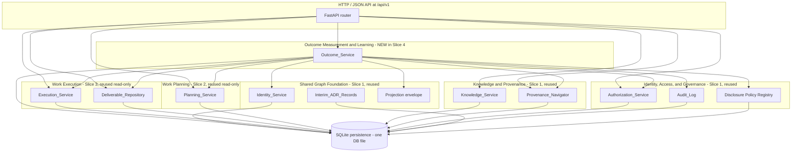

# Design Document

## Overview

This document specifies the design for the **fourth walking slice** of the Organizational Knowledge and Work System. It satisfies the requirements in [`requirements.md`](./requirements.md) and realizes *Release 1D — Deliverable to Outcome Review* from [`07-user-story-map.md`](../../../documents/07-user-story-map.md) §4, constrained by:

- [`00-project-constitution.md`](../../../documents/00-project-constitution.md) §5.21 (Intent / Work / Output / Outcome are distinct), §5.22 (Organizational Learning Is a Closed Loop), §5.23 (events vs. projections), §5.27 (External Authorities Remain Explicit), §5.30 (System Health Must Be Observable), §5.25 (access is explicit and auditable), §5.26 (sensitive information governed), §5.6 (durable states are historical), §5.9 (provenance preserved end to end), §5.29 (empirical learning constrains expansion).
- [`02-domain-model.md`](../../../documents/02-domain-model.md) §3 (Resource invariants), §4 (Resource Revision invariants), §7.4 (Intent and Specification Record contract — intended vs observed Outcome, invariant 6), §8 (Immutable Record model), §8.4 (Audit Event), §8.5 (Governance Decision Immutable Record), §10.2 (Derived From), §10.5 (Relates To), §10.7 (Cites/Supports), §10.9 (Addresses), §19 (Provenance graph).
- [`03-context-map.md`](../../../documents/03-context-map.md) §2.5 (Work Planning), §2.6 (Work Execution), §2.8 (Outcome Measurement and Learning), §2.9 (Identity, Access, and Governance), §2.10 (Integration and External Systems), §3 cross-context rules.
- The first walking slice (its design at [`../first-walking-slice/design.md`](../first-walking-slice/design.md) and AD-WS-1 through AD-WS-13), the second walking slice (its design at [`../second-walking-slice/design.md`](../second-walking-slice/design.md) and AD-WS-14 through AD-WS-22), and the third walking slice (its design at [`../third-walking-slice/design.md`](../third-walking-slice/design.md) and AD-WS-23 through AD-WS-31).

### Design Goals

Slice 4 is deliberately small and additive over Slices 1, 2, and 3. It carries a Slice 3 Completion Record forward through one or more Measurement Records, an Observed Outcome, a Success-Condition Assessment, and an issued Outcome Review, and demonstrates six named behaviors:

1. **Completion-to-Outcome-Review traceability.** Every Outcome Review Record traces back through an unbroken chain Outcome Review → Success-Condition Assessment → Observed Outcome Revision → Measurement Record(s) → Measurement Definition Revision → Intended Outcome Revision → Objective → Slice 1 Decision, with a parallel chain Outcome Review → Cites Completion Record → produced Deliverable Revision(s) (Requirements 51, 55).
2. **Intended/Observed separation enforced from the outcome side.** No Slice 4 write mutates any Intended Outcome Resource/Revision, Deliverable Expectation, Plan Revision, or any Slice 3 execution Record; no outcome-measurement row carries an intended-side attribute (Requirement 53).
3. **Output is not Outcome, re-asserted from the outcome side.** No Observed Outcome, Success-Condition Assessment, or Outcome Review is derived automatically from a Completion Record; every Outcome Review carries an explicit attribution stance (Requirement 54, Principle 5.21).
4. **Four pairwise-distinct authority types.** `define_measurement`, `record_measurement`, `assess_outcome`, and `issue_outcome_review` extend the cumulative enumeration `{view, modify, review, approve, assign, contribute, accept_milestone, complete}` additively to twelve values; no new authority substitutes for any other in either direction (Requirement 52).
5. **External authority preservation for imported Measurement Records.** Every Measurement Record carries an origin indicator `∈ {native, imported}`; imported Records additionally preserve source-system identifier, source-system record identifier, source-system authority designation `∈ {authoritative, replica, projection, index, federation}`, source-system retrieval time, and import time, and never default the authority designation to `authoritative` (Requirement 46, Principle 5.27).
6. **Indistinguishable denial for unauthorized outcome-measurement actions.** Every denial path on the new endpoints reuses the cumulative `slice-default-2026` policy, additively extended to the new node kinds, with no information leakage (Requirements 50, 58).

It also satisfies the cross-cutting slice obligations established by Slices 1–3: durable identity (Requirement 43), immutable append-only Records (Requirements 44–49), audit atomicity (Requirement 57), authorization-aware backlinks (Requirement 56), an explainable Projection of current outcome status (Requirement 59), strict additivity over prior slices (Requirement 60), and verification by Hypothesis property tests at ≥ 100 cases per property (Requirement 61).

### Constitutional Posture

| Constitutional concept | Slice 4 realization |
|---|---|
| Resource graph foundation (5.1) | Two new Resource kinds (Measurement Definition, Observed Outcome) and three new Immutable-Record kinds (Measurement Record, Success-Condition Assessment, Outcome Review) reuse the same `Identifier_Registry`, `Audit_Records`, `Disclosure_Policies`, `Disclosure_Policy_Coverage`, `Relationships`, and `Interim_ADR_Records` Slices 1–3 own. |
| Bounded contexts preserve meaning (5.2) | One new `walking_slice.outcome` module package subordinate to the Outcome Measurement and Learning bounded context ([`03-context-map.md`](../../../documents/03-context-map.md) §2.8) owns all five Outcome_Service writes; cross-context calls into Planning, Execution, Deliverable_Repository, Identity, Audit, Authorization, Provenance, and Disclosure use those modules' public read APIs unchanged. |
| Authority and derivation distinct (5.4) | Measurement Definition and Observed Outcome are Resources with immutable Revisions (§§3, 4, 7.4). Measurement Records and Success-Condition Assessments are Immutable Records (§8). Outcome Reviews are Governance Decision Immutable Records (§8.5). Imported Measurement Records preserve external authority explicitly (5.27). |
| Durable identity (5.5) | Every new identity is a UUIDv7 minted by the existing `IdentityService`; no business meaning embedded. Seven new disjoint identifier roles are tagged on `Identifier_Registry.resource_kind` (Requirement 43.8). |
| Durable history (5.6, 5.7) | All seven new tables are insert-only with append-only triggers (AD-WS-36, AD-WS-37). New evidence creates a new Observed Outcome Revision via an explicit predecessor chain rather than overwriting (Requirement 47.3). |
| Intent / Work / Output / Outcome distinct (5.21) | Schema-level CHECK constraints and an API-boundary attribute guard reject intended-side attributes on every outcome-measurement row, and reject auto-derivation of Outcome from Completion (Requirements 53, 54). |
| Closed learning loop (5.22) | The slice records the Measurement → Observation → Assessment → Review legs of the loop; Learning Records and Adaptation Decisions are deferred to Release 1E. |
| Operational events vs. projections (5.23) | One `ProjectionEnvelope`-wrapped outcome-status Projection is derived from source Records and labelled with a derivation indicator; it is never aliased as an Observed Outcome or Outcome Review (Requirement 59). |
| External authorities remain explicit (5.27) | Imported Measurement Records carry an explicit source-system authority designation that never defaults to `authoritative`; the source-system attributes are treated as restricted attributes by the disclosure policy (Requirements 46, 58, AD-WS-38). |
| Sensitive information governed (5.26) | Backlink, provenance, and denial responses for new node kinds are materialized through the existing constant-time response shaper, producing indistinguishable observability with Slices 1–3 (Requirements 50, 55, 56, 58). |
| Empirical learning constrains expansion (5.29) | Slice 4 introduces only the two Resource kinds, three Record kinds, and four roles required for Release 1D; replacement Measurement Definitions, Measurement-Record supersession, multi-reviewer Outcome Review, statistical inference, and portfolio rollups are deferred. |

### Writing Order

The Architecture section maps Slice 4's module onto the existing process and records the new architectural decisions AD-WS-32 through AD-WS-41. Components and Interfaces details each new sub-component and its public HTTP surface. Data Models defines the new tables, append-only triggers, and value objects. Correctness Properties states the universally quantified invariants the implementation must preserve (written after running the `prework` tool over every acceptance criterion). Error Handling and Testing Strategy close the document.

---

## Architecture

### High-Level Shape

Slice 4 extends the cumulative modular monolith. There is **one process**, **one SQLite database file**, **one FastAPI router**, and **one HTTP endpoint surface** to which Slice 4 adds new routes. One new module boundary is introduced: `walking_slice.outcome/` (the Outcome_Service) under the Outcome Measurement and Learning bounded context. It is the only new bounded-context module Slice 4 introduces.



The Outcome_Service is **one Python module package** rather than an independent service or process. The single-process, single-database layout matches Slices 1–3's granularity (one module package per bounded context) and keeps the audit-and-write atomic-transaction contract simple. The Outcome_Service is distinct from the Slice 2 Planning_Service, the Slice 3 Execution_Service, and the Slice 3 Deliverable_Repository: it records Measurements and Observed Outcomes and the reviews thereof, and never aliases, mutates, or replaces another context's Records (Requirement 60).

### Architectural Decisions

Slice 4 introduces the following decisions, numbered **AD-WS-32 through AD-WS-41**, continuing the cumulative numbering started in Slice 1 (AD-WS-1..13), extended in Slice 2 (AD-WS-14..22), and extended in Slice 3 (AD-WS-23..31). Slice 4 does not modify any AD-WS-1..AD-WS-31 text or behavior. Each decision is traced to the constitutional principle, the requirement that motivates it, the prior-slice decision it extends, and (where it closes a Gap) the placeholder backlog ADR identifier reserved by Requirement 60.4.

#### AD-WS-32 — Outcome_Service as a single new module package

**Decision.** Implement Slice 4 as one new package:

- `src/walking_slice/outcome/` — one module per write surface (`measurement_definitions.py`, `measurement_records.py`, `observed_outcomes.py`, `success_condition_assessments.py`, `outcome_reviews.py`), plus shared `outcome/_persistence.py` for the new tables and triggers, `outcome/_routes.py` for FastAPI routes, `outcome/_projection.py` for the outcome-status Projection, `outcome/_disclosure.py` for additive `Disclosure_Policy_Coverage` rows, `outcome/_provenance.py` for the additive `navigate_*` traversals, `outcome/_interim_adr.py` for AD-WS-33..AD-WS-38 Interim ADR seeding, `outcome/_helpers.py` for the prohibited-attribute guard, and `outcome/models.py` for frozen Pydantic value objects.

The package depends on the existing `walking_slice.identity`, `walking_slice.audit`, `walking_slice.authorization`, `walking_slice.knowledge`, `walking_slice.provenance`, `walking_slice.disclosure`, `walking_slice.interim_adr`, `walking_slice.persistence`, `walking_slice.projection`, `walking_slice.clock`, `walking_slice.planning`, `walking_slice.execution`, and `walking_slice.deliverables` modules through their public APIs only.

**Rationale.** Requirement 60 (Reuse and Non-Modification of Slice 1, Slice 2, and Slice 3 Contexts) and Principle 5.2. The package boundary aligns with the Outcome Measurement and Learning bounded context per [`03-context-map.md`](../../../documents/03-context-map.md) §2.8 and is held separate from `planning/`, `execution/`, and `deliverables/` so the four services can never be confused at the module level (Requirement 60.1).

**Replaceability.** A future split into an independent Outcome_Service process requires only relocating the file group; no schema or HTTP route changes.

#### AD-WS-33 — Additive `define_measurement`, `record_measurement`, `assess_outcome`, `issue_outcome_review` authority values (closes Gap G-17; backlog `ADR-HT-019`)

**Decision.** Extend the canonical authority enumeration the Authorization_Service validates from the Slice 3 eight-value set `{view, modify, review, approve, assign, contribute, accept_milestone, complete}` to the twelve-value set adding `define_measurement`, `record_measurement`, `assess_outcome`, `issue_outcome_review`. The change is a single additive update to the constant `_VALID_AUTHORITIES` in `src/walking_slice/authorization.py`; it appends four literal values, removes or renames none, and does not alter the non-substitution rule (`evaluate` continues to require the exact authority named by the action's `_required_authority` mapping).

The `_required_authority` mapping is extended additively with:

- `create.measurement_definition` → `define_measurement` (Requirements 44, 52.6)
- `create.measurement_record` → `record_measurement` (Requirements 45, 46, 52.7)
- `create.observed_outcome` → `assess_outcome` (Requirements 47, 52.8)
- `create.success_condition_assessment` → `assess_outcome` (Requirements 48, 52.8)
- `create.outcome_review` → `issue_outcome_review` (Requirements 49, 52.9)

An Interim ADR row is inserted into `Interim_ADR_Records` with `backlog_adr_id = 'ADR-HT-019'` carrying the chosen additive values, the recorded date, and the motivating Requirement 52 acceptance criteria.

**Rationale.** Requirement 52 and Gap G-17. Four new values rather than overloading prior types preserve the Slice 1 Requirement 12.4 / Slice 2 Requirement 11.6 / Slice 3 Requirement 32.10 non-substitution invariant and extend it to the cumulative twelve-type enumeration.

**Compatibility.** Existing Slice 1 + Slice 2 + Slice 3 role assignments and audit rows carry the eight-value set and remain valid; new rows may carry any of the twelve values.

#### AD-WS-34 — Additive Disclosure-policy extension via new coverage rows, with per-attribute restriction for imported Measurement Records (closes Gap G-18; backlog `ADR-HT-020`)

**Decision.** Extend the `slice-default-2026` Disclosure policy to cover the new Slice 4 node kinds by inserting one `Disclosure_Policy_Coverage` row per new kind: `measurement_definition`, `measurement_definition_revision`, `measurement_record`, `observed_outcome`, `observed_outcome_revision`, `success_condition_assessment_record`, and `outcome_review_record`. The existing `Disclosure_Policies` row is not mutated; the `Disclosure_Policy_Coverage` table (Slice 2 AD-WS-16) is reused. The Provenance_Navigator and the Outcome_Service look up coverage through the existing `walking_slice.disclosure.policy_for(node_kind)` function.

For imported Measurement Records, the policy is additionally configured to treat the source-system attributes (`source_system_id`, `source_system_record_id`, `source_system_authority`, `source_system_retrieval_at`, `import_at`) as **restricted attributes**: when the requesting Party lacks view authority on the imported Measurement Record, the whole Record is replaced with the redaction marker `{"kind": "measurement_record", "redacted": true}`, and the source-system attributes never leak through partial or summary representations (Requirement 58.5). This per-attribute restriction is recorded on the coverage row as a `restricted_attributes_json` payload — an additive field on the coverage row interpreted by the response shaper; the coverage-row schema is the same one Slice 2 introduced, with the JSON payload populated only for the `measurement_record` kind.

An Interim ADR row carries `backlog_adr_id = 'ADR-HT-020'`.

**Rationale.** Requirement 58, Principle 5.27, and Gap G-18. Coverage rows give an additive surface that does not alter the policy identity, the Slice 1–3 rule set, or any prior behavior.

**Replaceability.** When a future ADR formalizes a versioned policy schema, the coverage rows migrate into the future representation without altering the policy identity `slice-default-2026`.

#### AD-WS-35 — Canonical Relationship Types and semantic-role markers for Slice 4 (closes Gap G-19; backlog `ADR-HT-021`)

**Decision.** The slice's Relationships use the following canonical Relationship Types and semantic-role markers, all permitted by [`02-domain-model.md`](../../../documents/02-domain-model.md) §§10.5, 10.7, 10.9:

| Source | Type | Target | `semantic_role` |
|---|---|---|---|
| Measurement Definition Revision | `Addresses` | target Intended Outcome Revision (Slice 2) | `NULL` |
| Measurement Record | `Cites` | target Measurement Definition Revision | `measurement_basis` |
| Observed Outcome Revision | `Addresses` | target Intended Outcome Revision (Slice 2) | `NULL` |
| Observed Outcome Revision | `Cites` | each cited Measurement Record | `observation_basis` |
| Success-Condition Assessment Record | `Addresses` | target Intended Outcome Revision (Slice 2) | `NULL` |
| Success-Condition Assessment Record | `Cites` | sourced Observed Outcome Revision | `assessment_basis` |
| Outcome Review Record | `Addresses` | target Intended Outcome Revision (Slice 2) | `NULL` |
| Outcome Review Record | `Cites` | each cited Success-Condition Assessment Record | `review_assessment` |
| Outcome Review Record | `Cites` | each cited Completion Record (Slice 3) | `review_completion` |
| Outcome Review Record | `Cites` | each cited produced Deliverable Revision (Slice 3) | `review_deliverable` |

The `semantic_role` markers are written into the existing `Relationships.semantic_role` column added additively by Slice 2 AD-WS-19. No new column or table is required.

**Rationale.** Requirements 44–49 and Gap G-19. `Addresses` is the precise type for "intent to satisfy / respond to" an Intended Outcome (matching Slice 2 Plan Approvals → Plan Revisions and Slice 3 Completion → Plan Revision). `Cites` (the §10.7 evidence-citation type) is the precise type for "this Record draws on that Record/Revision as its evidentiary basis"; the `semantic_role` markers disambiguate the several `Cites` relationships an Outcome Review carries. An Interim ADR row carries `backlog_adr_id = 'ADR-HT-021'`.

#### AD-WS-36 — Slice 4 Records/Resources are append-only; Observed Outcome Revisions form an explicit predecessor chain; no supersession path (closes part of Gap G-20; backlog `ADR-HT-022`)

**Decision.** Every Slice 4 Resource (`Measurement_Definitions`, `Observed_Outcomes`), every Revision (`Measurement_Definition_Revisions`, `Observed_Outcome_Revisions`), and every Immutable Record (`Measurement_Records`, `Success_Condition_Assessment_Records`, `Outcome_Review_Records`) is insert-only. UPDATE and DELETE triggers reject every mutation, matching Slice 1 AD-WS-4, Slice 2 AD-WS-19, and Slice 3 AD-WS-27.

Observed Outcome evolution (Requirement 47.3) is modelled as an append-only **predecessor chain**: each `Observed_Outcome_Revisions` row carries `predecessor_revision_id` (NULL on the initial Revision, equal to the immediately prior Revision Identity for the same Observed Outcome Resource on later Revisions). A new assessment creates a new Revision row; prior Revisions remain byte-equivalent. The "most recent Revision" used for optimistic concurrency (Requirement 47.3/47.4) is the unique Revision for the Resource that is not named as any other Revision's predecessor.

No supersession path is implemented in this slice: Measurement Records cannot be withdrawn or corrected (Requirement out-of-scope §); Measurement Definitions cannot be replaced (Requirement 44.3); exactly one Outcome Review per Intended Outcome Revision (Requirement 49.3). A later slice will introduce governed supersession consistent with Principle 5.6.

**Rationale.** Requirements 44.7, 45.6, 47.3, 47.7, 48.6, 49.7, 49.3, 61 §4 (immutability), and Gap G-20. The append-only stance keeps Slice 4's verification surface aligned with Slices 1–3. An Interim ADR row carries `backlog_adr_id = 'ADR-HT-022'`.

#### AD-WS-37 — Per-kind tables with append-only triggers; new `resource_kind` values on `Identifier_Registry` (closes part of Gap G-20; backlog `ADR-HT-022`)

**Decision.** The new schema adds seven SQLite tables, all insert-only, all with UPDATE/DELETE triggers that reject mutation:

- `Measurement_Definitions`, `Measurement_Definition_Revisions`
- `Measurement_Records`
- `Observed_Outcomes`, `Observed_Outcome_Revisions`
- `Success_Condition_Assessment_Records`
- `Outcome_Review_Records`

No new column is added to any Slice 1, Slice 2, or Slice 3 table. Slice 4 emits seven new `resource_kind` values `{measurement_definition, measurement_definition_revision, measurement_record, observed_outcome, observed_outcome_revision, success_condition_assessment_record, outcome_review_record}` on the existing `Identifier_Registry.resource_kind` column (with `kind ∈ {'resource', 'revision', 'immutable_record'}`). The existing `UNIQUE(identifier)` index enforces global non-reuse; the `resource_kind` tag provides the seven-disjoint-roles assertion checked by Requirement 43.8.

**Rationale.** Requirement 43.8 (seven disjoint identifier roles), Requirement 61 §4 / §13, and Gap G-20. Per-kind tables match Slices 1–3's pattern. An Interim ADR row carries `backlog_adr_id = 'ADR-HT-022'` (shared with AD-WS-36, since both record the chosen persistence representation for Gap G-20).

#### AD-WS-38 — Origin enumeration and source-system authority enumeration as registered enumeration columns (closes Gap G-16; backlog `ADR-HT-018`)

**Decision.** Every `Measurement_Records` row carries an `origin TEXT NOT NULL CHECK (origin IN ('native','imported'))` column. Imported rows additionally carry `source_system_authority TEXT CHECK (source_system_authority IN ('authoritative','replica','projection','index','federation'))` per Principle 5.27. Native rows hold `source_system_authority IS NULL` and hold every other source-system attribute NULL; imported rows require all source-system attributes non-null (enforced by a table-level CHECK keyed on `origin`). The source-system authority designation is **never defaulted to `authoritative`**: the column is required on the imported request body and rejected if absent (Requirement 46.4, 46.7).

The two enumerations' member semantics are recorded as additive rows in the `Interim_ADR_Records` registry under `backlog_adr_id = 'ADR-HT-018'` (one row recording the chosen `{native, imported}` and `{authoritative, replica, projection, index, federation}` member sets and their meanings as input to the backlog ADR).

**Rationale.** Requirement 46 and Gap G-16. Encoding the enumerations as CHECK-constrained columns keeps native and imported Records in one table (one Record kind) while keeping the origin and authority designation explicit and queryable.

#### AD-WS-39 — Idempotency key for imported Measurement Records

**Decision.** `Measurement_Records` enforces a partial `UNIQUE(target_measurement_definition_revision_id, source_system_id, source_system_record_id) WHERE origin = 'imported'` index. A second imported Measurement Record whose `(source_system_id, source_system_record_id)` pair matches an already-finalized imported Record against the same Measurement Definition Revision is rejected with no second Record persisted; the response identifies the existing Measurement Record Identity only when the caller holds view authority on it, otherwise it is indistinguishable from a non-existent endpoint (AD-WS-9).

**Rationale.** Requirement 46.3, 61 §11. The partial index scopes idempotency to imported Records so native Records (which carry no source-system identifiers) are unaffected.

#### AD-WS-40 — Cross-context resolution uses existing Planning_Service, Execution_Service, and Deliverable_Repository read APIs

**Decision.** When recording outcome-measurement entities, the Outcome_Service resolves prior-slice targets through public read functions only:

- Intended Outcome Revision resolution and `outcome_kind = 'intended'` verification (Requirements 44.4, 47.4, 48.3, 49.4) via an additive `IntendedOutcomeService.get_revision(intended_outcome_revision_id)` read on `walking_slice.planning`.
- Completion Record resolution (Requirement 49.4) via the existing Slice 3 `CompletionService` read API.
- Produced Deliverable Revision resolution (Requirement 49.4) via the existing Slice 3 `DeliverableRepositoryService.get_revision(...)` read API.

No Slice 4 code path issues INSERT/UPDATE/DELETE against any prior-slice table; reads go through public APIs so the Outcome_Service is decoupled from prior-slice schemas (Principle 5.2, [`03-context-map.md`](../../../documents/03-context-map.md) Cross-Context Rule 2). The single anchor used to match a cited Measurement Record to an Intended Outcome (Requirement 47.2/47.4) is the Measurement Definition Resource that `Addresses` the same Intended Outcome Resource.

**Rationale.** Requirement 60 (no prior-slice mutation), Principle 5.2. Reading through public APIs keeps the prior-slice append-only triggers as the database-level backstop while the Outcome_Service never even attempts a prior-slice write.

#### AD-WS-41 — Authority basis enumeration reused unchanged

**Decision.** The `authority_basis.type` value persisted on Success-Condition Assessment Records and Outcome Review Records, and on Slice 4 authorization-evaluation audit rows, is drawn from the existing Slice 1 enumeration `{role-grant-id, scope-id, delegation-chain-id}` (AD-WS-10). Slice 4 does not extend the enumeration.

**Rationale.** Requirements 48.2, 49.2 explicitly defer to AD-WS-10. Avoiding extension keeps the authority-basis enumeration stable across all four slices.

### Cross-Cutting Concerns

**Transactionality.** Every Outcome_Service consequential write opens one SQL transaction that inserts every artifact of the action: the Resource and/or Revision and/or Record rows, every Relationship row (`Addresses`, `Cites`), and the consequential `Audit_Records` row. The audit append participates in the same transaction (AD-WS-5). If any insert fails, the entire transaction rolls back (Requirements 44.6, 45.5/45.7, 47.6, 48.5, 49.6, 57.1, 57.6).

**Time.** Recorded timestamps are UTC ISO-8601 millisecond precision via the existing `Clock` protocol from `walking_slice.clock`. Audit-row recorded times match domain-row recorded times within the same transaction. Observation times, source-system retrieval times, and import times are validated against the ordering rules in Requirements 45.2/45.3 and 46.2/46.4 (observation time within the observation window; observation time ≤ retrieval time ≤ recorded time; import time = recorded time).

**Identifiers.** Every new identity is a UUIDv7 minted by the existing `IdentityService` and registered in `Identifier_Registry` with one of the seven Slice 4 `resource_kind` values (AD-WS-37). Measurement Definition and Observed Outcome hold distinct Resource Identity and Revision Identity values (Requirement 43.2).

**Authorization.** The existing `Authorization_Service.evaluate(connection, party_id, action, target, at)` is called for every Slice 4 consequential write. Action strings follow the Slice 1 form `<prefix>.<resource_kind>`; see AD-WS-33 for the mapping. The deny path uses the separate-transaction Denial-Record pattern from Slice 1 `KnowledgeService.create_decision`, Slice 2 `PlanApprovalService`, and Slice 3 `CompletionService`, with the 3-attempt retry (backoff 0.01/0.02/0.04s) and audit-failure surfacing required by Requirements 50.6 and 57.6.

**Privacy and inference leakage.** Every response from a Slice 4 endpoint is materialized through the existing `walking_slice.provenance._shape_response_constant_time(...)` helper, ensuring restricted-vs-nonexistent observability remains constant (Requirements 50.7, 55.7, 56.3, 58.4). The `outcome._disclosure.seed_outcome_coverage()` step adds seven new `Disclosure_Policy_Coverage` rows so the helper's `policy_for(node_kind)` lookup returns the `slice-default-2026` rule set for every Slice 4 node kind, with the imported-Measurement-Record per-attribute restriction from AD-WS-34.

**Prior-slice non-mutation (Requirements 53.1, 60, Property 50, Property 57).** No Slice 4 code path issues INSERT/UPDATE/DELETE against any Slice 1, Slice 2, or Slice 3 table. The append-only triggers on every prior-slice table reject mutations at the database level; the Slice 4 code reinforces the rule by reading through public APIs (AD-WS-40). Property 57 verifies this by snapshotting every prior-slice table at test setup and comparing after every Slice 4 sequence.

**Attribute guard (Requirements 53, 54).** A shared helper `outcome._helpers._reject_prohibited_attributes(request_body, prefixes)` rejects any top-level request key matching a prohibited intended-side prefix (`success-condition-`, `attribution-assumption-`, `planned-`, `plan-review-`, `plan-approval-`, `milestone-acceptance-outcome-`, `completion-outcome-`, `intended-`) or any field whose stated purpose is to assert Outcome from Completion or to alias a Completion Record as an Observed Outcome, returning a 400 with no row persisted. Permitted cross-slice references are only the explicit `Addresses`/`Cites` Identity references named in Requirements 44–49.

---

## Components and Interfaces

The Outcome_Service exposes one FastAPI router segment under `/api/v1` and a set of module-level service classes. Each write surface has its own module and service class; the package shares a single `_persistence.py` for schema definitions and a single `_routes.py` for HTTP wiring. Every service is a frozen dataclass injected with the reused `Clock`, `IdentityService`, `AuditLog`, and `AuthorizationService` plus the read-only prior-slice readers it needs (AD-WS-40).

### Outcome_Service.MeasurementDefinitions

**Responsibility.** Persist a Measurement Definition Resource and an initial immutable Measurement Definition Revision, plus the `Addresses` Relationship to the target Intended Outcome Revision. Enforce at most one Measurement Definition Resource per target Intended Outcome Resource (Requirement 44.3).

**Public surface.**

```python
@dataclass(frozen=True)
class MeasurementDefinitionService:
    clock: Clock
    identity_service: IdentityService
    audit_log: AuditLog
    authorization_service: AuthorizationService
    intended_outcome_reader: IntendedOutcomeService  # get_revision() reads only (AD-WS-40)

    def create_measurement_definition(
        self,
        connection: Connection,
        *,
        target_intended_outcome_revision_id: str,
        measurand_description: str,        # 1..4000 chars
        unit_of_measure: str,             # 1..200 chars
        observation_window: str,          # 1..1000 chars
        cadence: str,                     # 1..1000 chars
        data_source: str,                 # 1..1000 chars
        authoring_party_id: str,
        applicable_scope: str,
        engine: Engine,
        correlation_id: Optional[str] = None,
    ) -> CreateMeasurementDefinitionResult: ...

    def get_definition_for_intended_outcome(
        self, connection: Connection, *, intended_outcome_resource_id: str
    ) -> Optional[MeasurementDefinitionRow]: ...
```

**HTTP surface.**

| Method | Path | Purpose |
|---|---|---|
| `POST` | `/api/v1/measurement-definitions` | Create a Measurement Definition Resource + first Revision (Measurement Designer). |
| `GET` | `/api/v1/measurement-definitions/{measurement_definition_id}` | Read a Measurement Definition Resource (view authority). |
| `GET` | `/api/v1/measurement-definitions/{measurement_definition_id}/revisions/{revision_id}` | Read a Measurement Definition Revision. |

**Authority.** `create.measurement_definition` → `define_measurement`. Deny path identical to the cumulative separate-transaction Denial-Record pattern.

**Validation order.**
1. Pydantic input validation; `_reject_prohibited_attributes` for intended-side prefixes (Requirement 53).
2. Resolve the target Intended Outcome Revision via `intended_outcome_reader.get_revision(...)`; reject if it does not resolve or its `outcome_kind != 'intended'` (Requirement 44.4).
3. Uniqueness pre-check: reject if a Measurement Definition Resource already addresses the same target Intended Outcome Resource (Requirement 44.3); the DB enforces it with `UNIQUE(target_intended_outcome_resource_id)`.
4. Authorization evaluation: `evaluate(party=authoring_party_id, action="create.measurement_definition", target=intended_outcome_ref, at=now())`; on deny, separate-transaction Denial Record (AD-WS-9).
5. On permit, open the caller's transaction, insert `Measurement_Definitions`, `Measurement_Definition_Revisions`, the `Addresses` Relationship row (`semantic_role IS NULL`), and the consequential `Audit_Records` row.

**Satisfies.** Requirements 43, 44, 52 (define_measurement), 53, 57, 60.

### Outcome_Service.MeasurementRecords

**Responsibility.** Persist native and imported Measurement Records keyed to a Measurement Definition Revision, plus the `Cites` Relationship to that Revision. Preserve external authority for imported Records (AD-WS-38) and enforce import idempotency (AD-WS-39).

**Public surface.**

```python
@dataclass(frozen=True)
class MeasurementRecordService:
    clock: Clock
    identity_service: IdentityService
    audit_log: AuditLog
    authorization_service: AuthorizationService
    definition_reader: MeasurementDefinitionService

    def create_native_measurement(
        self,
        connection: Connection,
        *,
        target_measurement_definition_revision_id: str,
        observed_value: Decimal,           # <= 6 fractional digits
        observed_value_unit: str,          # must match definition unit_of_measure
        observation_time: datetime,        # UTC ms; within observation window; <= recorded_at
        recording_party_id: str,
        applicable_scope: str,
        engine: Engine,
        correlation_id: Optional[str] = None,
    ) -> CreateMeasurementRecordResult: ...

    def create_imported_measurement(
        self,
        connection: Connection,
        *,
        target_measurement_definition_revision_id: str,
        observed_value: Decimal,
        observed_value_unit: str,
        observation_time: datetime,        # within window; <= source_system_retrieval_time
        source_system_id: str,             # 1..200 chars
        source_system_record_id: str,      # 1..200 chars
        source_system_authority: Literal["authoritative","replica","projection","index","federation"],
        source_system_retrieval_time: datetime,   # <= recorded_at
        importing_party_id: str,
        applicable_scope: str,
        engine: Engine,
        correlation_id: Optional[str] = None,
    ) -> CreateMeasurementRecordResult: ...
```

**HTTP surface.**

| Method | Path | Purpose |
|---|---|---|
| `POST` | `/api/v1/measurement-records` | Create a native Measurement Record (`origin = native`). |
| `POST` | `/api/v1/measurement-records/imported` | Create an imported Measurement Record (`origin = imported`). |
| `GET` | `/api/v1/measurement-records/{measurement_record_id}` | Read a Measurement Record (view authority; source-system attributes redacted per AD-WS-34). |

**Authority.** `create.measurement_record` → `record_measurement` (both native and imported).

**Native validation (Requirement 45).** Reject if: the target Measurement Definition Revision does not resolve; the observed value has more than six fractional digits; the unit string does not match the Definition's `unit_of_measure`; the observation time is outside the Definition's observation-window descriptor; the observation time is later than the recorded time; the observed value, unit, observation time, or applicable scope is omitted; or any source-system attribute reserved for imported Records is supplied (Requirement 45.3). Persist `origin = 'native'` with all source-system columns NULL (AD-WS-38).

**Imported validation (Requirement 46).** Reject if any of the additional source-system attributes is omitted, the source-system authority is outside the enumerated set, the observation time is later than the source-system retrieval time, the source-system retrieval time is later than the recorded time, or the origin is supplied as anything other than `imported` (Requirement 46.4). Set `import_at = recorded_at` (Requirement 46.2). Enforce the AD-WS-39 idempotency key (Requirement 46.3). The returned representation distinguishes `origin = imported`, surfaces the source-system authority designation explicitly, and never aliases the Record as native or defaults the authority to `authoritative` (Requirement 46.7).

**Satisfies.** Requirements 43, 45, 46, 52 (record_measurement), 57, 58 (per-attribute restriction), 60.

### Outcome_Service.ObservedOutcomes

**Responsibility.** Persist an Observed Outcome Resource and successive immutable Observed Outcome Revisions (predecessor chain, AD-WS-36), each with `outcome_kind = 'observed'`, an `Addresses` Relationship to the target Intended Outcome Revision, and one `Cites` Relationship per cited Measurement Record.

**Public surface.**

```python
@dataclass(frozen=True)
class ObservedOutcomeService:
    clock: Clock
    identity_service: IdentityService
    audit_log: AuditLog
    authorization_service: AuthorizationService
    intended_outcome_reader: IntendedOutcomeService
    measurement_reader: MeasurementRecordService
    definition_reader: MeasurementDefinitionService

    def create_observed_outcome(
        self,
        connection: Connection,
        *,
        target_intended_outcome_revision_id: str,
        assessment_summary: str,           # 1..4000 chars
        cited_measurement_record_ids: Sequence[str],   # >= 1
        authoring_party_id: str,
        applicable_scope: str,
        engine: Engine,
        correlation_id: Optional[str] = None,
    ) -> CreateObservedOutcomeResult: ...

    def revise_observed_outcome(
        self,
        connection: Connection,
        *,
        observed_outcome_id: str,
        predecessor_revision_id: str,      # must equal current most-recent Revision
        assessment_summary: str,
        cited_measurement_record_ids: Sequence[str],
        authoring_party_id: str,
        applicable_scope: str,
        engine: Engine,
        correlation_id: Optional[str] = None,
    ) -> CreateObservedOutcomeResult: ...
```

**HTTP surface.**

| Method | Path | Purpose |
|---|---|---|
| `POST` | `/api/v1/observed-outcomes` | Create an Observed Outcome Resource + initial Revision (Outcome Assessor). |
| `POST` | `/api/v1/observed-outcomes/{observed_outcome_id}/revisions` | Append a new Observed Outcome Revision. |
| `GET` | `/api/v1/observed-outcomes/{observed_outcome_id}/revisions/{revision_id}` | Read an Observed Outcome Revision. |

**Authority.** `create.observed_outcome` → `assess_outcome`.

**Validation (Requirement 47).** Reject if: the target Intended Outcome Revision does not resolve or its `outcome_kind != 'intended'`; zero Measurement Records are cited; any cited Measurement Record does not resolve or its target Measurement Definition Resource does not match the Measurement Definition Resource that addresses the target Intended Outcome Resource (Requirement 47.2/47.4); on revision, the supplied `predecessor_revision_id` does not equal the current most-recent Revision for the Resource (optimistic concurrency, AD-WS-36); the assessment summary or applicable scope is omitted; or `outcome_kind` is supplied with any value other than `observed`. Every Revision records `outcome_kind = 'observed'` and never mutates the addressed Intended Outcome Revision (Requirement 47.8).

**Satisfies.** Requirements 43, 47, 52 (assess_outcome), 53, 57, 60.

### Outcome_Service.SuccessConditionAssessments

**Responsibility.** Persist a Success-Condition Assessment Immutable Record against a target Intended Outcome Revision and a sourced Observed Outcome Revision, with one `Addresses` Relationship and one `Cites` Relationship.

**Public surface.**

```python
@dataclass(frozen=True)
class SuccessConditionAssessmentService:
    clock: Clock
    identity_service: IdentityService
    audit_log: AuditLog
    authorization_service: AuthorizationService
    intended_outcome_reader: IntendedOutcomeService
    observed_outcome_reader: ObservedOutcomeService

    def create_assessment(
        self,
        connection: Connection,
        *,
        target_intended_outcome_revision_id: str,
        sourced_observed_outcome_revision_id: str,
        assessment_category: Literal["Satisfied","Partially_Satisfied","Not_Satisfied","Unassessable"],
        assessment_rationale: str,         # 1..4000 chars; >= 200 chars when Unassessable
        assessing_party_id: str,
        authority_basis: AuthorityBasisRef,  # type in AD-WS-10 set
        applicable_scope: str,
        engine: Engine,
        correlation_id: Optional[str] = None,
    ) -> CreateAssessmentResult: ...
```

**HTTP surface.**

| Method | Path | Purpose |
|---|---|---|
| `POST` | `/api/v1/success-condition-assessments` | Create a Success-Condition Assessment Record (Outcome Assessor). |
| `GET` | `/api/v1/success-condition-assessments/{assessment_id}` | Read a Success-Condition Assessment Record. |

**Authority.** `create.success_condition_assessment` → `assess_outcome`.

**Validation (Requirement 48).** Reject if: the target Intended Outcome Revision does not resolve or its `outcome_kind != 'intended'`; the sourced Observed Outcome Revision does not resolve; the sourced Observed Outcome Revision's `Addresses` target does not equal the named target Intended Outcome Revision (Requirement 48.3); the assessment category is outside the enumerated set; the assessment rationale, authority basis, or applicable scope is omitted; or the category is `Unassessable` and the rationale is fewer than 200 characters. The addressed Intended Outcome Revision and the sourced Observed Outcome Revision remain byte-equivalent (Requirement 48.7).

**Satisfies.** Requirements 43, 48, 52 (assess_outcome), 53, 57, 60.

### Outcome_Service.OutcomeReviews

**Responsibility.** Persist an Outcome Review Governance Decision Immutable Record against a target Intended Outcome Revision, citing at least one Success-Condition Assessment and at least one Slice 3 Completion Record, with the `Addresses` and `Cites` Relationships from AD-WS-35. Enforce at most one Outcome Review per Intended Outcome Revision (Requirement 49.3) and that the Review is never auto-derived from Completion (Requirement 49.9).

**Public surface.**

```python
@dataclass(frozen=True)
class OutcomeReviewService:
    clock: Clock
    identity_service: IdentityService
    audit_log: AuditLog
    authorization_service: AuthorizationService
    intended_outcome_reader: IntendedOutcomeService
    assessment_reader: SuccessConditionAssessmentService
    completion_reader: CompletionService            # Slice 3 read API (AD-WS-40)
    deliverable_reader: DeliverableRepositoryService  # Slice 3 read API (AD-WS-40)

    def create_outcome_review(
        self,
        connection: Connection,
        *,
        target_intended_outcome_revision_id: str,
        review_outcome: Literal["Achieved","Partially_Achieved","Not_Achieved","Inconclusive"],
        attribution_stance: Literal["Asserted","Partial","Unattributed","Contradicted"],
        confidence: Literal["High","Moderate","Low"],
        review_rationale: str,             # 1..4000 chars
        attribution_evidence_reference: str,   # 0..4000 chars; >= 1 char when Asserted/Contradicted
        cited_assessment_ids: Sequence[str],          # >= 1
        cited_completion_ids: Sequence[str],          # >= 1
        cited_produced_deliverable_revision_ids: Sequence[str],   # 0..N
        reviewing_party_id: str,
        authority_basis: AuthorityBasisRef,
        applicable_scope: str,
        engine: Engine,
        correlation_id: Optional[str] = None,
    ) -> CreateOutcomeReviewResult: ...
```

**HTTP surface.**

| Method | Path | Purpose |
|---|---|---|
| `POST` | `/api/v1/outcome-reviews` | Create an Outcome Review Record (Outcome Reviewer). |
| `GET` | `/api/v1/outcome-reviews/{outcome_review_id}` | Read an Outcome Review Record. |
| `GET` | `/api/v1/outcome-reviews/{outcome_review_id}/provenance` | Walk the Outcome Measurement Provenance Chain. |

**Authority.** `create.outcome_review` → `issue_outcome_review`.

**Validation (Requirement 49).** Reject if: the target Intended Outcome Revision does not resolve or its `outcome_kind != 'intended'`; the target is already the target of a finalized Outcome Review (Requirement 49.3, `UNIQUE(target_intended_outcome_revision_id)`); any cited Assessment does not resolve or its `Addresses` target does not equal the named target; any cited Completion Record does not resolve; any cited produced Deliverable Revision does not resolve; the review-outcome category, attribution stance, or confidence indicator is outside its enumerated set; the attribution stance is `Asserted` or `Contradicted` and the attribution-evidence reference is zero characters; zero Assessments or zero Completion Records are cited; or the review rationale, authority basis, or applicable scope is omitted. The Review is created only by explicit request and never as a side effect of any Slice 3 finalization (Requirement 49.9, 54.1).

**Satisfies.** Requirements 43, 49, 52 (issue_outcome_review), 53, 54, 57, 60.

### Provenance_Navigator (extended)

**Responsibility (additive).** Add new traversals to the existing `walking_slice.provenance` module without modifying any existing function:

1. **`navigate_outcome_review(outcome_review_id, party, at)`** — walks the Outcome Measurement Provenance Chain: Outcome Review → Success-Condition Assessment(s) → Observed Outcome Revision → Measurement Record(s) → Measurement Definition Revision → Intended Outcome Revision → Objective → Slice 1 Decision, delegating to the existing `navigate_decision` for the Decision → Recommendation → Finding → Region → Document Revision tail. In parallel, walks Outcome Review → Cites Completion Record(s) → (delegates to Slice 3 `navigate_completion`) → Slice 3 Execution Provenance Chain → produced Deliverable Revision(s). Returns a single tree rooted at the Outcome Review whose leaves are Document Revisions and produced Deliverable Revisions.
2. **`navigate_outcome_node(node_kind, node_id, party, at)`** — short-form traversal beginning at any Success-Condition Assessment, Observed Outcome Revision, Measurement Record, or Measurement Definition Revision; returns the chain rooted lower (Requirement 55.1).

Both are additive functions; `navigate_decision` (Slice 1) and `navigate_completion` (Slice 3) are reused unchanged. The backlink algorithm `list_backlinks(node_kind, node_id, party)` is extended to recognize the seven new Slice 4 node kinds by appending to the existing `_authorized_source_kinds` set; the algorithm itself is unchanged (Requirement 56).

**Public surface.**

```python
# Additive functions in walking_slice.outcome._provenance (registered with walking_slice.provenance)
def navigate_outcome_review(
    connection: Connection, *, outcome_review_id: str, party_id: str, at: datetime
) -> OutcomeProvenanceTree: ...

def navigate_outcome_node(
    connection: Connection, *, node_kind: str, node_id: str, party_id: str, at: datetime
) -> OutcomeProvenanceTree: ...
```

**HTTP surface (additive).**

| Method | Path | Purpose |
|---|---|---|
| `GET` | `/api/v1/outcome-reviews/{outcome_review_id}/provenance` | Walk the chain rooted at an Outcome Review Record. |
| `GET` | `/api/v1/measurement-records/{id}/provenance` | Walk the chain rooted at a Measurement Record. |
| `GET` | `/api/v1/observed-outcomes/{id}/revisions/{rid}/provenance` | Walk the chain rooted at an Observed Outcome Revision. |
| `GET` | `/api/v1/backlinks/{node_kind}/{node_id}` | Reuse the existing backlink endpoint; extended to recognize Slice 4 node kinds. |

**Chain behavior.** When a node is restricted to the requesting Party, it is replaced with a redaction marker `{kind, redacted: true}` (Requirement 55.3, 58.2). Unresolved/stale/unavailable links produce a gap descriptor `{stage, category, next_reachable_node?}` with `category ∈ {unavailable, restricted, stale, unresolved}` (Requirements 51.3, 55.4). Region Occurrence nodes include the exact start anchor, end anchor, and bounded text span, digest-matching the recorded content digest (Requirement 55.2). Measurement Record nodes include the origin indicator and, for imported Records visible to the Party, the source-system identifier and authority designation (Requirement 55.8). Each `navigate_*` function is read-only over append-only tables, so repeated invocations for the same `(node_id, party_id, at)` return byte-equivalent trees (idempotent retrieval, Requirements 51.4, 55.5).

**Satisfies.** Requirements 51, 55, 56, 58.

### Outcome-status Projection (single explainable Projection)

**Responsibility.** Compute one explainable Projection of current outcome status for a given Intended Outcome Revision Identity, derived from source Slice 4 Records. It is the only derived view Slice 4 surfaces; per Requirement 59.3 it does **not** include percent-attainment, cost-per-outcome, ROI, budget-variance, forecast-attainment, causal-attribution probability, or any cross-Outcome aggregate.

**Projection Definition.** Given an Intended Outcome Revision Identity `O`:

1. Resolve `O` via the Planning_Service read API; require `outcome_kind = 'intended'`.
2. Find the Measurement Definition Resource addressing `O`'s Resource. If none, return `Intended Outcome unmeasured`.
3. Find Measurement Records citing any Revision of that Definition. Mark `Intended Outcome measured` when ≥ 1 exists; otherwise `Intended Outcome measurement defined`.
4. Find Observed Outcome Revisions addressing `O`. Mark `Intended Outcome observed` when ≥ 1 exists.
5. Find Success-Condition Assessments addressing `O`. Mark `Intended Outcome success condition <satisfied|partially satisfied|not satisfied|unassessable>` from the most-recent Assessment's category.
6. Find the Outcome Review (if any) addressing `O`. Mark `Intended Outcome reviewed` when present.
7. The projected status is the most-progressed label observed; fall back to `Provenance incomplete` when a required source link is unresolved.

The Projection is wrapped in the existing `walking_slice.projection.ProjectionEnvelope` carrying the Projection Definition, source Record Identities, source Revision Identities, applicable temporal boundary (ISO-8601 ≥ second precision), generated time, and a derivation indicator (Requirement 59.1/59.2). On unresolvable Projection Definition or missing source Record, the projected status is withheld and an explanation-unavailable indicator names the missing element (Requirement 59.5).

**Public surface.**

```python
# walking_slice.outcome._projection
@dataclass(frozen=True)
class OutcomeStatusProjection:
    intended_outcome_revision_id: str
    projected_status: Literal[
        "Intended Outcome unmeasured",
        "Intended Outcome measurement defined",
        "Intended Outcome measured",
        "Intended Outcome observed",
        "Intended Outcome success condition satisfied",
        "Intended Outcome success condition partially satisfied",
        "Intended Outcome success condition not satisfied",
        "Intended Outcome success condition unassessable",
        "Intended Outcome reviewed",
        "Provenance incomplete",
    ]
    envelope: ProjectionEnvelope

def project_outcome_status(
    connection: Connection, *, intended_outcome_revision_id: str, party_id: str, at: datetime
) -> OutcomeStatusProjection: ...
```

**HTTP surface.**

| Method | Path | Purpose |
|---|---|---|
| `GET` | `/api/v1/intended-outcomes/{intended_outcome_revision_id}/outcome-status` | Return the outcome-status Projection wrapped in `ProjectionEnvelope`. |

**Authority.** Requires `view` authority on the target Intended Outcome Revision; restricted targets return AD-WS-9-shaped indistinguishable responses.

**Distinction from Observed Outcome (Requirement 59.6).** The Projection is labelled as a *projection of outcome-measurement progress*, never as an Observed Outcome Resource, Observed Outcome Revision, Success-Condition Assessment, or Outcome Review, and is never cited from any Outcome Review.

**Satisfies.** Requirement 59 (explainable Projection), Requirement 60 (no source-Record mutation when generating the Projection).

### Reused Slice 1 + Slice 2 + Slice 3 components

- **`Identity_Service`** — unchanged. New identifiers are minted through the existing factory methods plus the seven new `resource_kind` tags on `Identifier_Registry`.
- **`Audit_Log`** — unchanged. New action types are written through the existing `append_consequential` and `append_denial` methods.
- **`Authorization_Service`** — extended only by AD-WS-33 (adds four values to `_VALID_AUTHORITIES` and extends `_required_authority`).
- **`Knowledge_Service`** — read-only consumer when an Outcome Measurement Provenance Chain walk reaches a Slice 1 Decision (via `navigate_decision`).
- **`Planning_Service`** — read-only consumer through the additive `IntendedOutcomeService.get_revision(...)` read method; no write paths added.
- **`Execution_Service` / `Deliverable_Repository`** — read-only consumers through existing `CompletionService` and `DeliverableRepositoryService.get_revision(...)` read APIs for Outcome Review citation resolution and the parallel provenance leg.
- **`Provenance_Navigator`** — extended by two additive `navigate_*` functions and an extended `_authorized_source_kinds` set.
- **`Disclosure` registry** — extended only by seven `Disclosure_Policy_Coverage` rows seeded at startup (AD-WS-34), one carrying the imported-Measurement-Record restricted-attributes payload.
- **`Interim_ADR_Records`** — extended by five additive rows for `ADR-HT-018`..`ADR-HT-022` at startup (Requirement 60.4).
- **`Projection` envelope** — unchanged. Slice 4 status responses wrap their projected status in `ProjectionEnvelope`.

---

## Data Models

### Schema Additions

The following seven tables are added to the existing Slice 1 + Slice 2 + Slice 3 SQLite database (one file, same connection). Every table is insert-only; UPDATE and DELETE triggers reject mutation (AD-WS-36).

**Conventions for every table below.** UTF-8 text columns; all timestamps stored as ISO-8601 strings with millisecond precision; every Resource row carries `created_at` matching the recorded time of its first Revision; every Record and Revision row carries `recorded_at` in UTC ISO-8601 ms matching the consequential `Audit_Records` row; `applicable_scope` is the scope identifier supplied by the request and persisted byte-equivalent. Prior-slice identity references (e.g. `target_intended_outcome_revision_id`) are FK-enforced in application code through the prior-slice read APIs (AD-WS-40), not by SQL FOREIGN KEY, so the Outcome_Service stays decoupled from prior-slice schemas.

#### Measurement_Definitions and Measurement_Definition_Revisions

```sql
CREATE TABLE Measurement_Definitions (
  measurement_definition_id            TEXT PRIMARY KEY,
  target_intended_outcome_resource_id  TEXT NOT NULL UNIQUE,   -- Requirement 44.3 (at most one per Intended Outcome)
  created_at                           TEXT NOT NULL
);

CREATE TABLE Measurement_Definition_Revisions (
  measurement_definition_revision_id   TEXT PRIMARY KEY,
  measurement_definition_id            TEXT NOT NULL REFERENCES Measurement_Definitions(measurement_definition_id),
  target_intended_outcome_resource_id  TEXT NOT NULL,
  target_intended_outcome_revision_id  TEXT NOT NULL,          -- Addresses target (Slice 2)
  measurand_description                TEXT NOT NULL CHECK (length(measurand_description) BETWEEN 1 AND 4000),
  unit_of_measure                      TEXT NOT NULL CHECK (length(unit_of_measure) BETWEEN 1 AND 200),
  observation_window                   TEXT NOT NULL CHECK (length(observation_window) BETWEEN 1 AND 1000),
  cadence                              TEXT NOT NULL CHECK (length(cadence) BETWEEN 1 AND 1000),
  data_source                          TEXT NOT NULL CHECK (length(data_source) BETWEEN 1 AND 1000),
  authoring_party_id                   TEXT NOT NULL REFERENCES Parties(party_id),
  applicable_scope                     TEXT NOT NULL,
  recorded_at                          TEXT NOT NULL
);

-- Triggers reject UPDATE / DELETE on both tables.
CREATE INDEX idx_md_revisions_by_definition ON Measurement_Definition_Revisions(measurement_definition_id, recorded_at);
CREATE INDEX idx_md_revisions_by_intended_outcome ON Measurement_Definition_Revisions(target_intended_outcome_revision_id, recorded_at);
```

#### Measurement_Records

```sql
CREATE TABLE Measurement_Records (
  measurement_record_id                       TEXT PRIMARY KEY,
  target_measurement_definition_id            TEXT NOT NULL REFERENCES Measurement_Definitions(measurement_definition_id),
  target_measurement_definition_revision_id   TEXT NOT NULL REFERENCES Measurement_Definition_Revisions(measurement_definition_revision_id),
  origin                                      TEXT NOT NULL CHECK (origin IN ('native','imported')),   -- AD-WS-38
  observed_value                              TEXT NOT NULL,    -- Decimal serialized; <= 6 fractional digits
  observed_value_unit                         TEXT NOT NULL,    -- must match Definition unit_of_measure
  observation_time                            TEXT NOT NULL,    -- UTC ms; within observation window
  -- Imported-only columns (NULL for native rows):
  source_system_id                            TEXT NULL CHECK (source_system_id IS NULL OR length(source_system_id) BETWEEN 1 AND 200),
  source_system_record_id                     TEXT NULL CHECK (source_system_record_id IS NULL OR length(source_system_record_id) BETWEEN 1 AND 200),
  source_system_authority                     TEXT NULL CHECK (source_system_authority IS NULL OR source_system_authority IN ('authoritative','replica','projection','index','federation')),
  source_system_retrieval_at                  TEXT NULL,
  import_at                                   TEXT NULL,        -- = recorded_at for imported rows
  recording_party_id                          TEXT NOT NULL REFERENCES Parties(party_id),
  applicable_scope                            TEXT NOT NULL,
  recorded_at                                 TEXT NOT NULL,
  CHECK (observed_value GLOB '[0-9]*' OR observed_value GLOB '-[0-9]*'),
  CHECK (observation_time <= recorded_at),
  -- Native rows carry no source-system attributes; imported rows carry all of them (Requirements 45.3, 46.2/46.4):
  CHECK (
    (origin = 'native'
       AND source_system_id IS NULL AND source_system_record_id IS NULL
       AND source_system_authority IS NULL AND source_system_retrieval_at IS NULL AND import_at IS NULL)
    OR
    (origin = 'imported'
       AND source_system_id IS NOT NULL AND source_system_record_id IS NOT NULL
       AND source_system_authority IS NOT NULL AND source_system_retrieval_at IS NOT NULL AND import_at IS NOT NULL
       AND observation_time <= source_system_retrieval_at
       AND source_system_retrieval_at <= recorded_at
       AND import_at = recorded_at)
  )
);

-- Triggers reject UPDATE / DELETE on Measurement_Records.
-- AD-WS-39 import idempotency key (imported rows only):
CREATE UNIQUE INDEX idx_measurement_records_import_idempotency
  ON Measurement_Records(target_measurement_definition_revision_id, source_system_id, source_system_record_id)
  WHERE origin = 'imported';
CREATE INDEX idx_measurement_records_by_definition_revision
  ON Measurement_Records(target_measurement_definition_revision_id, recorded_at);
```

The observed-value six-fractional-digit rule and the unit-match-to-Definition rule are enforced in application code before INSERT (the GLOB CHECK only guards gross malformation); the Decimal value is normalized before persistence.

#### Observed_Outcomes and Observed_Outcome_Revisions

```sql
CREATE TABLE Observed_Outcomes (
  observed_outcome_id                  TEXT PRIMARY KEY,
  target_intended_outcome_resource_id  TEXT NOT NULL,
  created_at                           TEXT NOT NULL
);

CREATE TABLE Observed_Outcome_Revisions (
  observed_outcome_revision_id         TEXT PRIMARY KEY,
  observed_outcome_id                  TEXT NOT NULL REFERENCES Observed_Outcomes(observed_outcome_id),
  outcome_kind                         TEXT NOT NULL CHECK (outcome_kind = 'observed'),   -- §7.4 invariant 6
  target_intended_outcome_resource_id  TEXT NOT NULL,
  target_intended_outcome_revision_id  TEXT NOT NULL,          -- Addresses target (Slice 2)
  assessment_summary                   TEXT NOT NULL CHECK (length(assessment_summary) BETWEEN 1 AND 4000),
  predecessor_revision_id              TEXT NULL REFERENCES Observed_Outcome_Revisions(observed_outcome_revision_id),  -- AD-WS-36 chain
  authoring_party_id                   TEXT NOT NULL REFERENCES Parties(party_id),
  applicable_scope                     TEXT NOT NULL,
  recorded_at                          TEXT NOT NULL
);

-- Triggers reject UPDATE / DELETE on both tables.
-- At most one successor per predecessor keeps the chain linear (no forking):
CREATE UNIQUE INDEX idx_oo_revisions_one_successor
  ON Observed_Outcome_Revisions(predecessor_revision_id) WHERE predecessor_revision_id IS NOT NULL;
CREATE INDEX idx_oo_revisions_by_resource ON Observed_Outcome_Revisions(observed_outcome_id, recorded_at);
CREATE INDEX idx_oo_revisions_by_intended_outcome ON Observed_Outcome_Revisions(target_intended_outcome_revision_id, recorded_at);
```

The cited Measurement Records on each Observed Outcome Revision are recorded as `Cites` Relationship rows (AD-WS-35), not as a column, so a Revision may cite many Records.

#### Success_Condition_Assessment_Records

```sql
CREATE TABLE Success_Condition_Assessment_Records (
  assessment_id                        TEXT PRIMARY KEY,
  target_intended_outcome_resource_id  TEXT NOT NULL,
  target_intended_outcome_revision_id  TEXT NOT NULL,          -- Addresses target (Slice 2)
  sourced_observed_outcome_id          TEXT NOT NULL REFERENCES Observed_Outcomes(observed_outcome_id),
  sourced_observed_outcome_revision_id TEXT NOT NULL REFERENCES Observed_Outcome_Revisions(observed_outcome_revision_id),  -- Cites target
  assessment_category                  TEXT NOT NULL CHECK (assessment_category IN ('Satisfied','Partially_Satisfied','Not_Satisfied','Unassessable')),
  assessment_rationale                 TEXT NOT NULL CHECK (length(assessment_rationale) BETWEEN 1 AND 4000),
  assessing_party_id                   TEXT NOT NULL REFERENCES Parties(party_id),
  authority_basis_type                 TEXT NOT NULL CHECK (authority_basis_type IN ('role-grant-id','scope-id','delegation-chain-id')),
  authority_basis_id                   TEXT NOT NULL,
  applicable_scope                     TEXT NOT NULL,
  recorded_at                          TEXT NOT NULL,
  -- Requirement 48.3: Unassessable requires >= 200-char rationale.
  CHECK (assessment_category != 'Unassessable' OR length(assessment_rationale) >= 200)
);

-- Triggers reject UPDATE / DELETE on Success_Condition_Assessment_Records.
CREATE INDEX idx_sca_by_intended_outcome ON Success_Condition_Assessment_Records(target_intended_outcome_revision_id, recorded_at);
CREATE INDEX idx_sca_by_observed_outcome ON Success_Condition_Assessment_Records(sourced_observed_outcome_revision_id, recorded_at);
```

#### Outcome_Review_Records

```sql
CREATE TABLE Outcome_Review_Records (
  outcome_review_id                    TEXT PRIMARY KEY,
  target_intended_outcome_resource_id  TEXT NOT NULL,
  target_intended_outcome_revision_id  TEXT NOT NULL UNIQUE,   -- Requirement 49.3 (at most one per Intended Outcome Revision)
  review_outcome                       TEXT NOT NULL CHECK (review_outcome IN ('Achieved','Partially_Achieved','Not_Achieved','Inconclusive')),
  attribution_stance                   TEXT NOT NULL CHECK (attribution_stance IN ('Asserted','Partial','Unattributed','Contradicted')),
  confidence                           TEXT NOT NULL CHECK (confidence IN ('High','Moderate','Low')),
  review_rationale                     TEXT NOT NULL CHECK (length(review_rationale) BETWEEN 1 AND 4000),
  attribution_evidence_reference       TEXT NOT NULL CHECK (length(attribution_evidence_reference) BETWEEN 0 AND 4000),
  reviewing_party_id                   TEXT NOT NULL REFERENCES Parties(party_id),
  authority_basis_type                 TEXT NOT NULL CHECK (authority_basis_type IN ('role-grant-id','scope-id','delegation-chain-id')),
  authority_basis_id                   TEXT NOT NULL,
  applicable_scope                     TEXT NOT NULL,
  recorded_at                          TEXT NOT NULL,
  -- Requirement 49.4: Asserted / Contradicted require a non-empty attribution-evidence reference.
  CHECK (attribution_stance NOT IN ('Asserted','Contradicted') OR length(attribution_evidence_reference) >= 1)
);

-- Triggers reject UPDATE / DELETE on Outcome_Review_Records.
CREATE INDEX idx_outcome_reviews_by_intended_outcome ON Outcome_Review_Records(target_intended_outcome_revision_id);
```

The cited Success-Condition Assessment Records, cited Completion Records, and cited produced Deliverable Revisions are recorded as `Cites` Relationship rows with the `semantic_role` markers from AD-WS-35 (`review_assessment`, `review_completion`, `review_deliverable`), not as columns, so a Review may cite many of each. The "≥ 1 Assessment and ≥ 1 Completion cited" rule (Requirement 49.1/49.4) is enforced in application code in the same transaction as the Relationship inserts.

### Relationships rows written by Slice 4

The new rows inserted into the existing `Relationships` table use the additive `semantic_role` column from Slice 2 AD-WS-19. No new column or table is required. The `source_kind`, `target_kind`, `relationship_type`, and `semantic_role` strings are listed in AD-WS-35. The existing backlink index `idx_relationships_backlinks ON Relationships(target_id, target_revision_id, relationship_type, recorded_at)` (Slice 1 AD-WS-8) covers the new node kinds; no additional index is required.

### In-Memory Value Objects

The Outcome_Service uses one new module `walking_slice.outcome.models` containing frozen Pydantic value objects:

```python
# walking_slice.outcome.models
class MeasurementDefinitionRef(BaseModel):
    measurement_definition_id: UUID
    measurement_definition_revision_id: UUID
    target_intended_outcome_revision_id: UUID

class MeasurementRecordRef(BaseModel):
    measurement_record_id: UUID
    target_measurement_definition_revision_id: UUID
    origin: Literal["native", "imported"]
    source_system_authority: Optional[Literal["authoritative","replica","projection","index","federation"]] = None

class ObservedOutcomeRef(BaseModel):
    observed_outcome_id: UUID
    observed_outcome_revision_id: UUID
    outcome_kind: Literal["observed"]
    target_intended_outcome_revision_id: UUID
    predecessor_revision_id: Optional[UUID] = None

class SuccessConditionAssessmentRef(BaseModel):
    assessment_id: UUID
    target_intended_outcome_revision_id: UUID
    sourced_observed_outcome_revision_id: UUID
    assessment_category: Literal["Satisfied","Partially_Satisfied","Not_Satisfied","Unassessable"]

class OutcomeReviewRef(BaseModel):
    outcome_review_id: UUID
    target_intended_outcome_revision_id: UUID
    review_outcome: Literal["Achieved","Partially_Achieved","Not_Achieved","Inconclusive"]
    attribution_stance: Literal["Asserted","Partial","Unattributed","Contradicted"]
    confidence: Literal["High","Moderate","Low"]
```

The reused `AuthorityBasisRef`, `TargetRef`, `ProvenanceNode`, `GapDescriptor`, `ProjectionEnvelope`, `RequestContext`, and `Clock` value objects come from Slices 1–3 unchanged.

### Persistence Invariants Summary

1. Every new Slice 4 table is insert-only; UPDATE/DELETE triggers reject mutation. (AD-WS-36, AD-WS-37)
2. Foreign Keys target either Slice 4 tables or prior-slice Identities by value; prior-slice tables are never mutated. (Requirement 60)
3. Every Revision and Record row carries `recorded_at` in UTC ISO-8601 ms matching its consequential `Audit_Records` row. (AD-WS-5)
4. `Identifier_Registry` holds every Slice 4 identifier with `kind ∈ {'resource','revision','immutable_record'}` and `resource_kind ∈ {measurement_definition, measurement_definition_revision, measurement_record, observed_outcome, observed_outcome_revision, success_condition_assessment_record, outcome_review_record}` — seven disjoint identifier roles. (AD-WS-37, Requirement 43.8)
5. `Disclosure_Policy_Coverage` carries seven additive rows, one per Slice 4 node kind, all with `policy_id = 'slice-default-2026'`; the `measurement_record` row carries the imported-source-system restricted-attributes payload. (AD-WS-34, Requirement 58)
6. `Measurement_Definitions` enforces `UNIQUE(target_intended_outcome_resource_id)`; `Outcome_Review_Records` enforces `UNIQUE(target_intended_outcome_revision_id)`; imported `Measurement_Records` enforce the AD-WS-39 idempotency key. (Requirements 44.3, 49.3, 46.3)
7. Every `Observed_Outcome_Revisions` row carries `outcome_kind = 'observed'`; the predecessor chain is linear (at most one successor per predecessor). (Requirement 47, AD-WS-36)
8. Native `Measurement_Records` carry NULL for every source-system attribute; imported rows carry all of them non-null, with the source-system authority never defaulted. (AD-WS-38, Requirement 46)
9. Slice 4 inserts no row that mutates any Slice 1, Slice 2, or Slice 3 row. (Requirement 60.3/60.4)

---

## Correctness Properties

*A property is a characteristic or behavior that should hold true across all valid executions of a system — essentially, a formal statement about what the system should do. Properties serve as the bridge between human-readable specifications and machine-verifiable correctness guarantees.*

**Suitability for PBT.** The Outcome_Service is a deterministic, pure-modulo-I/O service whose behavior varies meaningfully with input — Resource/Record kinds, request bodies, Party identities, role-assignment effective periods, scope strings, observation/retrieval/import times, source-system designations, predecessor-chain sequences, and time inputs. The slice's invariants are exactly the kind PBT excels at: round-trip (backlink bidirectionality, import idempotency), idempotence (provenance traversal), structural (anchoring, relationship structure, identity uniqueness, immutability), external-authority preservation, and metamorphic (indistinguishable denial under authority-difference pairs).

The Slice 4 property suite extends the cumulative Slice 1 + Slice 2 + Slice 3 suites. The 15 properties from each prior slice continue to apply unchanged; the Slice 4 properties below add 15 new properties numbered **46 through 60** to avoid collision with Slice 1 (1–15), Slice 2 (16–30), and Slice 3 (31–45), keeping a single global numbering scheme. Each property corresponds to a Requirement 61 acceptance criterion (the slice's own enumeration of fifteen verification targets) and is annotated with the upstream requirements it validates. Redundant per-Requirement creation-success, audit, immutability, and denial criteria have been consolidated into single comprehensive properties per the Property Reflection in the prework.

### Property 46: Intended-Outcome anchoring and creation success

*For any* authorized outcome-measurement creation request (Measurement Definition, native or imported Measurement Record, Observed Outcome Revision, Success-Condition Assessment, or Outcome Review) that passes input validation and authority checks, exactly one Resource and/or Revision and/or Record row, exactly one consequential `Audit_Records` row, and the prescribed `Addresses` and `Cites` Relationship rows per AD-WS-35 are persisted in one transaction with byte-equivalent recorded times; and every Measurement Definition Revision, Observed Outcome Revision, Success-Condition Assessment, and Outcome Review has exactly one `Addresses` Relationship to an Intended Outcome Revision Identity that resolves in the Planning_Service with `outcome_kind = 'intended'`. No Measurement Definition Revision, Observed Outcome Revision, Success-Condition Assessment, or Outcome Review exists without a matching `intended` Intended Outcome Revision.

**Validates: Requirements 44.1, 44.2, 45.1, 45.2, 46.1, 46.2, 47.1, 47.2, 48.1, 48.2, 49.1, 49.2, 61.1**

### Property 47: Outcome-Record authority correctness

*For all* persisted Slice 4 entities, the authoring/recording/assessing/reviewing Party held an effective Role Assignment at the recorded time whose granted authorities include the precise authority required by the action — `define_measurement` for Measurement Definition, `record_measurement` for native and imported Measurement Records, `assess_outcome` for Observed Outcome Revisions and Success-Condition Assessments, `issue_outcome_review` for Outcome Reviews — whose scope covers the target's applicable scope, and whose effective period encloses the recorded time. No outcome-measurement entity exists without a matching effective authority record.

**Validates: Requirements 44.5, 45.4, 46.5, 47.5, 48.4, 49.5, 50.1, 50.3, 52.6, 52.7, 52.8, 52.9, 61.2**

### Property 48: Authority non-substitution across twelve types

*For all* outcome-measurement entities, the twelve authority types `{view, modify, review, approve, assign, contribute, accept_milestone, complete, define_measurement, record_measurement, assess_outcome, issue_outcome_review}` are pairwise distinct in the Role-Assignment evaluation function; no Measurement Definition exists whose authoring Party held only a single non-`define_measurement` authority among the twelve; no Measurement Record exists whose recording Party held only a single non-`record_measurement` authority; no Observed Outcome Revision or Success-Condition Assessment exists whose authoring Party held only a single non-`assess_outcome` authority; no Outcome Review exists whose reviewing Party held only a single non-`issue_outcome_review` authority. No prior authority is substituted for a new authority and vice versa, in either direction.

**Validates: Requirements 52.1, 52.2, 52.3, 52.4, 52.5, 52.10, 52.11, 61.3**

### Property 49: Outcome-entity immutability

*For all* Measurement Definition Revisions, Measurement Records, Observed Outcome Revisions, Success-Condition Assessment Records, and Outcome Review Records finalized at any observation point in the test session, at every later observation point the Resource row (where applicable), the Revision or Record row, every constituent field, and every `Addresses` and `Cites` Relationship sourced from or targeting it are byte-equivalent to their state at first finalization; the corresponding `Audit_Records` rows are also byte-equivalent. Attempts to UPDATE or DELETE any of these rows or their Relationships are rejected and append a Denial Record.

**Validates: Requirements 44.7, 45.6, 47.7, 48.6, 49.7, 57.3, 57.5, 61.4**

### Property 50: Intended/Observed separation enforced from the outcome side

*For all* request bodies submitted to any Outcome_Service endpoint, if the body contains any field whose name matches a prohibited intended-side prefix (`success-condition-`, `attribution-assumption-`, `planned-`, `plan-review-`, `plan-approval-`, `milestone-acceptance-outcome-`, `completion-outcome-`, `intended-`) beyond the explicit Identity references named in Requirements 44–49, or an `outcome_kind` other than `observed` on an Observed Outcome Revision, the request is rejected with no row persisted. No persisted outcome-measurement entity carries any intended-side attribute as a value on the row itself; and no Intended Outcome Resource/Revision, Objective, Project, Deliverable Expectation, Plan Revision, Plan Review Revision, Plan Approval Record, or any Slice 3 execution Record is mutated as a consequence of any Slice 4 action.

**Validates: Requirements 53.1, 53.2, 53.3, 53.4, 47.8, 48.7, 61.5**

### Property 51: Output is not Outcome, re-asserted from the outcome side

*For all* Outcome Review Records, no Review was created by automatic derivation from any Slice 3 Completion Record, Milestone Acceptance, Deliverable Production, or produced Deliverable Revision finalization; every Review carries an explicit attribution stance drawn from `{Asserted, Partial, Unattributed, Contradicted}`; and an attribution stance of `Asserted` or `Contradicted` is accompanied by an attribution-evidence reference of at least one character. *For all* request bodies, any field whose stated purpose is to assert that a Completion Record by itself satisfies the addressed Intended Outcome, or to alias a Completion Record as an Observed Outcome, is rejected with no row persisted.

**Validates: Requirements 49.9, 54.1, 54.2, 54.3, 54.4, 61.6**

### Property 52: Outcome-status Projection envelope and contents

*For all* status-bearing responses returned by the Outcome_Service that surface a derived outcome status (`Intended Outcome unmeasured`, `Intended Outcome measurement defined`, `Intended Outcome measured`, `Intended Outcome observed`, `Intended Outcome success condition satisfied / partially satisfied / not satisfied / unassessable`, `Intended Outcome reviewed`, or `Provenance incomplete`), the response body contains a `ProjectionEnvelope` carrying the Projection Definition, source Record Identities, source Revision Identities, applicable temporal boundary (ISO-8601 ≥ second precision), generated time, and a derivation indicator distinguishing the status from authoritative source Records and from the Outcome Review Record itself. The response contains no derived percent-attainment, cost-per-outcome, ROI, budget-variance, forecast-attainment, causal-attribution probability, or cross-Outcome aggregate value, and no field that would constitute an observed measurement, Observed Outcome value, or success-condition assessment. On unresolvable Projection Definition or missing source Record, the response withholds the status and returns an explanation-unavailable indicator naming the missing element; source Records remain byte-equivalent. The projected status is never aliased as an Observed Outcome, Success-Condition Assessment, or Outcome Review.

**Validates: Requirements 59.1, 59.2, 59.3, 59.4, 59.5, 59.6**

### Property 53: Outcome Measurement Provenance Chain end-to-end

*For all* Outcome Review Records whose entire Outcome Measurement Provenance Chain is visible to a requesting Party, traversal from the Review yields the ordered sequences Outcome Review → Success-Condition Assessment(s) → Observed Outcome Revision → Measurement Record(s) → Measurement Definition Revision → Intended Outcome Revision → Objective → Slice 1 Decision → Recommendation Revision → Finding Revision(s) → Content Region Occurrence(s) → Document Revision, and Outcome Review → Cites Completion Record(s) → Slice 3 Execution Provenance Chain → produced Deliverable Revision(s). Every node identity in the returned chains resolves; the returned Content Region Occurrence span fields are byte-equivalent to the recorded bytes and digest-match the recorded content digest; Measurement Record nodes carry the origin indicator (and, for imported Records visible to the Party, the source-system identifier and authority designation); the chains are byte-equivalent across at least five repeated invocations of `navigate_outcome_review(review, party, t)` (idempotent retrieval). For every node restricted to the Party the chain contains a redaction marker `{kind, redacted: true}`; for every unresolved/stale/unavailable node the chain contains a gap descriptor identifying the stage, category `∈ {unavailable, restricted, stale, unresolved}`, and (when applicable) the next reachable node identity.

**Validates: Requirements 51.1, 51.2, 51.3, 51.4, 55.1, 55.2, 55.4, 55.5, 55.8, 61.8**

### Property 54: Indistinguishable denial for outcome-measurement endpoints

*For all* Parties `P` and `P′` differing only in that `P′` lacks effective `define_measurement`, `record_measurement`, `assess_outcome`, or `issue_outcome_review` authority (or `view` authority) on some outcome-measurement target `R`, responses returned to `P′` for creation, read, backlink, provenance, or projection attempts on `R` are indistinguishable from responses produced when `R` does not exist, across observable channels result count, identifier set, ordering positions, pagination cursors, response size, response body keys, error category, error wording, and latency (within 100 milliseconds variation). The same indistinguishability holds when `R` is restricted by the `slice-default-2026` policy as extended by AD-WS-34, including the per-attribute restriction on imported Measurement Record source-system attributes: restricted-vs-nonexistent observability is constant.

**Validates: Requirements 50.2, 50.4, 50.5, 50.6, 50.7, 51.5, 51.6, 55.3, 55.6, 55.7, 56.3, 56.5, 58.2, 58.3, 58.4, 58.5, 61.9**

### Property 55: Backlink bidirectionality for outcome-measurement Resources

*For all* Relationships `R` recorded between outcome-measurement Resources or Records, between outcome-measurement Records and Slice 3 execution Records or produced Deliverable Revisions, between outcome-measurement entities and Slice 2 planning Resources, or between outcome-measurement entities and Slice 1 Resources, and *for all* requesting Parties `P` holding view authority on both `R` and its source endpoint, the Provenance_Navigator returns `R` from the target's backlink query if and only if `R` is returned from the source's outbound query, and the Relationship attribute values (Relationship Identity, Relationship Type, `semantic_role`, source endpoint Identity, source endpoint Type, source endpoint Revision Identity when applicable, authoring Party Identity, `recorded_at`) returned from both directions are identical. Returning a backlink grants `P` no authority on the source endpoint, the Relationship Identity, or any traversed Record, and the response is bounded to at most 500 Relationships with a continuation reference whose presence and values do not vary based on Relationships `P` lacks authority to know.

**Validates: Requirements 43.5, 56.1, 56.2, 56.4, 56.6, 61.10**

### Property 56: Uniqueness of Measurement Definition, Outcome Review, and imported Measurement Record

*For all* Intended Outcome Resource Identities created in any test session, at most one Measurement Definition Resource exists for a given target Intended Outcome Resource; a second creation attempt is rejected with no Measurement Definition persisted and the first left byte-equivalent. *For all* Intended Outcome Revision Identities, at most one Outcome Review Record exists for a given target Intended Outcome Revision; a second attempt is rejected with no Outcome Review persisted and the first left byte-equivalent. *For all* imported Measurement Records, the pair (source-system identifier, source-system record identifier) is unique per target Measurement Definition Revision Identity; a second imported Record with a matching pair against the same Definition Revision is rejected with no second Record persisted.

**Validates: Requirements 44.3, 46.3, 49.3, 61.11**

### Property 57: Slice 1, Slice 2, and Slice 3 non-modification under Slice 4 actions

*For all* test sessions exercising the Outcome_Service, at every observation point after any sequence of Slice 4 actions, every row created by Slice 1, Slice 2, or Slice 3 — `Audit_Records`, `Identifier_Registry`, `Interim_ADR_Records`, `Disclosure_Policies`, `Disclosure_Policy_Coverage` (apart from the additive coverage rows seeded by AD-WS-34), `Role_Assignments` (apart from the additive twelve-value enumeration permitted by AD-WS-33), `Decisions`, `Document_Revisions`, `Region_Occurrences`, `Finding_Revisions`, `Recommendation_Revisions`, `Relationships` (apart from new rows inserted by Slice 4 actions), `Trail_Revisions`, `Trail_Steps`, `Provenance_Manifests`, `Objective_Revisions`, `Intended_Outcome_Revisions`, `Project_Revisions`, `Deliverable_Expectation_Revisions`, `Activity_Plans`, `Plan_Revisions`, `Plan_Review_Revisions`, `Plan_Approval_Records`, `Work_Assignment_Records`, `Work_Event_Records`, `Time_Entry_Records`, `Deliverable_Production_Records`, `Milestone_Acceptance_Records`, `Completion_Records`, `Deliverable_Resources`, and `Deliverable_Revisions` — is byte-equivalent to its state before the Slice 4 actions began.

**Validates: Requirements 46.8, 47.8, 48.7, 49.8, 53.1, 53.5, 54.5, 60.1, 60.2, 60.3, 60.4, 61.12**

### Property 58: Identity uniqueness across all four slices

*For all* identifiers issued by the Identity_Service in any test session covering all four slices, identifiers are unique across all four slices and across every Resource kind and every Record kind, are in canonical UUIDv7 lowercase hyphenated 8-4-4-4-12 form, and embed no business metadata; Measurement Definition and Observed Outcome each hold distinct Resource Identity and Revision Identity with one Resource to one-or-more Revisions and no Revision shared across Resources; the seven Slice 4 identifier roles are disjoint from every Slice 1, Slice 2, and Slice 3 identifier; rename/relocate of a Measurement Definition or Observed Outcome Resource preserves its Resource Identity and every Revision Identity; and no once-assigned identifier is reused.

**Validates: Requirements 43.1, 43.2, 43.3, 43.4, 43.6, 43.7, 43.8, 61.13**

### Property 59: Audit completeness and atomicity for every outcome-measurement action

*For all* sequences of Slice 4 operations (Measurement Definition, native/imported Measurement Record, Observed Outcome Revision, Success-Condition Assessment, Outcome Review creation; denied attempts; attempted modifications of finalized entities), the `Audit_Records` table contains exactly one matching row per consequential write with `actor_party_id`, `action_type`, `target_id`, `target_revision_id` when applicable, `outcome`, `recorded_at`, and `correlation_id` consistent with the originating operation, appended in the same transaction; and exactly one matching Denial Record per denied attempt with the same required fields and a `reason_code` drawn from the Slice 1 enumeration. `Audit_Records.append_sequence` is monotonically non-decreasing by `recorded_at`. If the audit append fails for any test-generated finalization, the originating finalization is rolled back and is not observable from any query path.

**Validates: Requirements 44.6, 45.5, 45.7, 46.6, 47.6, 48.5, 49.6, 50.2, 57.1, 57.2, 57.4, 57.6, 61.14**

### Property 60: Repeatable property runs

*The* Slice 4 property-based test suite executes at least 100 generated cases per property under the Hypothesis library with `@settings(max_examples=100, deadline=2000)`, records the seed of every invocation, and on re-execution with the same seed produces identical pass/fail outcomes and identical minimal counterexamples for failing properties. *For all* backlog ADR identifiers in `{ADR-HT-018, ADR-HT-019, ADR-HT-020, ADR-HT-021, ADR-HT-022}`, querying `Interim_ADR_Records` by backlog ADR identifier returns at least one row whose motivating Requirement number, motivating criterion number, observable behavior chosen, recorded date, and backlog ADR identifier match the AD-WS-33..AD-WS-38 design decisions; these rows are byte-equivalent at every observation point after seeding and re-seeding is idempotent.

**Validates: Requirements 60.5, 61.15**

---

## Error Handling

The Outcome_Service follows the same error-handling discipline Slices 1–3 established. All errors return JSON bodies with stable `error_code` strings; consequential transactions roll back whenever any persistence step fails; every denial response is shaped through the existing `walking_slice.provenance._shape_response_constant_time(...)` helper so restricted-vs-nonexistent observability remains constant.

### Error categories

1. **Input validation (Pydantic + service-level)** — return HTTP 400 with `error_code` drawn from `{measurement_definition_validation_failed, measurement_record_validation_failed, observed_outcome_validation_failed, success_condition_assessment_validation_failed, outcome_review_validation_failed}` and a `failed_constraints` array listing each rejected attribute or constraint name. The shared helper `walking_slice.outcome._helpers._reject_prohibited_attributes(request_body, prefixes)` rejects any top-level key matching a prohibited intended-side prefix (`success-condition-`, `attribution-assumption-`, `planned-`, `plan-review-`, `plan-approval-`, `milestone-acceptance-outcome-`, `completion-outcome-`, `intended-`) or any aliasing-attribute whose stated purpose is to assert Outcome from Completion (Requirements 53, 54). Field-level validators enforce: measurand/unit/window/cadence/data-source length bounds (44.2); observed-value ≤ 6 fractional digits and unit-match-to-Definition (45.2/45.3, 46.2/46.4); observation time within the observation-window descriptor and the observation ≤ retrieval ≤ recorded ordering (45.3, 46.4); `Unassessable` rationale ≥ 200 chars (48.3); `Asserted`/`Contradicted` attribution-evidence ≥ 1 char (49.4); enumerated category/stance/outcome/confidence membership.

2. **Target resolution failures** — return HTTP 404 (or AD-WS-9-shaped indistinguishable response when the requesting Party lacks view authority on the target) with `error_code` drawn from `{target_intended_outcome_not_resolvable, target_intended_outcome_not_intended, target_measurement_definition_revision_not_resolvable, cited_measurement_record_not_resolvable, cited_measurement_record_definition_mismatch, sourced_observed_outcome_revision_not_resolvable, sourced_observed_outcome_address_mismatch, cited_assessment_not_resolvable, cited_assessment_address_mismatch, cited_completion_not_resolvable, cited_deliverable_revision_not_resolvable, observed_outcome_predecessor_stale}`.

3. **Authorization denials** — return HTTP 403 with an AD-WS-9-conformant body `{generic_denial_indicator, reason_code, correlation_id}` where `reason_code ∈ {not-yet-effective, expired, revoked, out-of-scope, no-role-assignment}` per Slice 1 Requirement 7.2. The Denial Record is appended in a separate transaction via the cumulative `_persist_denial` pattern; retries up to 3 attempts with backoff 0.01s / 0.02s / 0.04s, surfacing an audit-failure indicator if every retry fails (Requirements 50.6, 57.6).

4. **Duplicate / uniqueness violations** — return HTTP 409 with `error_code` drawn from `{measurement_definition_already_exists, outcome_review_already_exists, imported_measurement_duplicate, identifier_conflict}`. The body carries the existing entity Identity only when the caller holds view authority on it; otherwise the response is indistinguishable from a non-existent endpoint (AD-WS-9, AD-WS-39).

5. **Immutability violations** — return HTTP 409 with `error_code = outcome_record_immutable`. A Denial Record is appended per Slice 1 Requirement 13.5 and Requirement 57.5.

6. **Audit append failures** — return HTTP 503 with `error_code = audit_append_failed`; the originating transaction rolls back (Requirements 45.7, 57.6).

7. **External-authority / import errors (imported Measurement Records)** — return HTTP 400 with `error_code` drawn from `{source_system_authority_invalid, source_system_attribute_missing, observation_after_retrieval, retrieval_after_recorded, origin_indicator_invalid}` per Requirement 46.4. The source-system authority designation is never defaulted; an absent designation is rejected, not assumed `authoritative` (Requirement 46.7).

### Disclosure policy enforcement on error responses

Every error response goes through the same `walking_slice.provenance._shape_response_constant_time(...)` helper Slices 1–3 use. Restricted-vs-nonexistent observability is constant for all four AD-WS-9 cases: restricted node, non-existent node, denied for missing authority, and authentication failure. For imported Measurement Records, the per-attribute restriction from AD-WS-34 ensures the source-system attributes are omitted (and the whole Record redacted) for Parties lacking view authority, with no leakage through partial or summary representations (Requirement 58.5). Response size, body keys, error wording, and latency are normalized within the 100 ms variation tolerance prescribed by Property 54 / Requirements 50.7, 58.4.

### Outcome-write denial side-channel

Every Outcome_Service consequential write follows the cumulative `create_*` deny pattern verbatim:

1. Run input validation and target resolution before invoking authority evaluation, so unauthorized callers cannot probe prior-slice or Slice 4 target existence through validation error messages.
2. Run authority evaluation on a fresh `Engine.begin()` transaction so the evaluation audit row commits independently of the caller's transaction.
3. On `deny`, open a SEPARATE `Engine.begin()` transaction, append the Denial Record via `AuditLog.append_denial(...)`, retry up to 3 times with the documented backoff, and raise the corresponding `*AuthorizationError` (or `*AuditFailureError` if every retry fails, surfacing the failure indicator per Requirements 50.6 / 57.6).
4. On `permit`, continue inside the caller's transaction: insert the domain row(s), insert every prescribed Relationship row (per AD-WS-35), and append the consequential `Audit_Records` row. If any of these fails, the entire caller transaction rolls back.

### Non-mutation guard on every write

Every Outcome_Service method opens its transaction, performs every INSERT (domain rows, Relationship rows, audit rows), and commits — *without* issuing any UPDATE or DELETE against any Slice 1, Slice 2, Slice 3, or Slice 4 table. The append-only triggers on every table reject UPDATE/DELETE at the database level (AD-WS-4, AD-WS-19, AD-WS-27, AD-WS-36). The Slice 4 code never attempts such a statement; static review of `walking_slice.outcome.*` confirms there is no UPDATE or DELETE anywhere in the package (unlike Slice 3, Slice 4 introduces no `Identifier_Registry` back-fill — every Slice 4 identifier is registered with its `resource_kind` at mint time). This satisfies Requirements 53.1, 60.3, 60.4 and Property 57.

---

## Testing Strategy

The Slice 4 testing strategy mirrors Slices 1–3's. The verification surface comprises example-based unit tests, property-based tests using Hypothesis, and end-to-end HTTP integration tests against the FastAPI app.

### Property-Based Testing Approach

PBT is the appropriate primary verification approach for Slice 4 because:

- The Outcome_Service is a deterministic, pure-modulo-I/O service whose behavior varies meaningfully with input — Resource/Record kinds, request bodies, Party identities, role-assignment effective periods, scope strings, observation/retrieval/import times, source-system designations, Observed-Outcome predecessor sequences, and time inputs.
- Universal properties exist for every consequential write (anchoring, authority correctness and non-substitution, identity uniqueness, audit completeness, immutability, indistinguishable denial, provenance chain, external-authority preservation, uniqueness, prior-slice non-modification).
- 100+ iterations per property are cheap because the slice runs on SQLite with no external dependencies; Hypothesis runs thousands of cases per minute on commodity hardware.
- The slice's invariants are exactly the kind PBT excels at: round-trip (backlink bidirectionality, import idempotency), idempotence (provenance traversal), structural (anchoring, identity uniqueness, immutability), external-authority preservation, and metamorphic (indistinguishable denial under authority-difference pairs).

PBT configuration matches Slices 1–3's:

- **Library**: [Hypothesis](https://hypothesis.readthedocs.io/) for Python. Property-based tests are **not** implemented from scratch.
- **Min cases per property**: 100 (via `@settings(max_examples=100, deadline=2000)`); the `--hypothesis-seed` flag captures the seed of every invocation for re-execution.
- **Tag format on each property test**: `Feature: fourth-walking-slice, Property {number}: {property text}` per Slice 1 AD-WS-13.
- **Shrinking**: Hypothesis's built-in shrinking produces minimal counterexamples.
- Each of the 15 Slice 4 correctness properties is implemented by a **single** property-based test.

### Mapping properties to test files

Each of the 15 Slice 4 properties is implemented as one property-based test under `tests/property/slice4/`:

| Property | Test file | Strategies used |
|---|---|---|
| 46 | `test_outcome_creation_anchoring.py` | Strategies for each of the five creation request bodies; assert one persisted entity + Relationship rows + audit row per case and a resolving `intended` anchor |
| 47 | `test_outcome_authority_correctness.py` | Role-assignment strategy varying effective-start, expiration, revocation, scope, granted authority (all twelve values), combined with creation-request strategies |
| 48 | `test_authority_non_substitution.py` | Single-authority role assignments across the twelve types; assert each action requires exactly its authority in both directions |
| 49 | `test_outcome_entity_immutability.py` | Generate full pipelines then apply Hypothesis-drawn UPDATE/DELETE attempt sequences against every Slice 4 table; assert byte-equivalence + Denial Records |
| 50 | `test_intended_observed_separation.py` | Generate bodies with random prohibited intended-side prefix keys and `outcome_kind != observed`; assert rejection and prior-slice byte-equivalence |
| 51 | `test_output_not_outcome.py` | Generate Completion/Milestone finalizations then assert no Review auto-created; assert explicit attribution stance and evidence rule; reject aliasing bodies |
| 52 | `test_outcome_status_projection.py` | Generate pipelines at each stage (unmeasured → reviewed); assert `ProjectionEnvelope` contents, derivation indicator, absence of prohibited derived fields, explanation-unavailable path |
| 53 | `test_outcome_provenance_chain.py` | Generate full Slice 1–4 pipelines with random restrictions; navigate from Review / Measurement Record / Observed Outcome Revision; assert ordered chains, digest match, idempotence across 5 repetitions, redaction markers, gap descriptors, imported-attribute disclosure |
| 54 | `test_indistinguishable_denial_outcome.py` | Pair generator `(P, P′)` differing only in one authority on `R`; assert observable equality with non-existent-endpoint baseline across creation, read, backlink, provenance, projection endpoints incl. imported-attribute restriction |
| 55 | `test_backlink_bidirectionality_outcome.py` | Generated relationship graphs across all four slices; assert source/target query equality incl. `semantic_role`, no authority transfer, bounded cursor stability |
| 56 | `test_outcome_uniqueness.py` | Generated double-definition, double-review, and duplicate-import attempts; assert only the first persists |
| 57 | `test_slice123_non_modification.py` | Snapshot all Slice 1–3 tables before any Slice 4 action; run Hypothesis-drawn Slice 4 sequences; assert snapshot equality apart from documented additive columns/rows |
| 58 | `test_identity_uniqueness_cross_slice.py` | Interleaved Slice 1–4 entity creation; assert disjoint identifier sets, UUIDv7 form, distinct Resource/Revision identities, rename/relocate identity preservation |
| 59 | `test_audit_completeness_outcome.py` | Sequences of outcome operations incl. denials and injected audit failures; assert one audit row per write, one denial per denial, monotonic `append_sequence`, rollback under injected failure |
| 60 | `test_repeatable_runs_and_interim_adr.py` | Seed capture/replay; query `Interim_ADR_Records` by each Slice 4 backlog ADR identifier (`ADR-HT-018`..`ADR-HT-022`); assert presence, byte-equivalence, seeder idempotence |

### Unit and integration tests

Unit tests cover edge cases the property generators are unlikely to enumerate exhaustively:

- Per-attribute negative tests for each Pydantic model (missing field, over-long field, invalid enumeration value, malformed decimal observed value).
- Observed-value boundary values: exactly six fractional digits (accepted), seven (rejected); unit string matching/not matching the Definition.
- Observation-window boundary: observation time at the window edges (accepted), outside (rejected).
- Imported Measurement Record ordering: observation ≤ retrieval ≤ recorded (accepted); observation after retrieval (rejected); retrieval after recorded (rejected); import_at != recorded_at (rejected); each source-system authority value (accepted); missing designation (rejected, never defaulted to `authoritative`).
- Import idempotency: duplicate `(source_system_id, source_system_record_id)` against the same Definition Revision (rejected); same pair against a different Definition Revision (accepted).
- Observed Outcome predecessor chain: initial Revision with NULL predecessor; revise with the correct predecessor (accepted); revise with a stale predecessor (rejected); attempted forking (rejected by the one-successor index).
- Success-Condition Assessment: `Unassessable` with 199-char rationale (rejected), 200-char (accepted); sourced Observed Outcome Revision addressing a different Intended Outcome Revision (rejected).
- Outcome Review: `Asserted`/`Contradicted` with empty attribution-evidence (rejected); zero cited Assessments (rejected); zero cited Completion Records (rejected); second Review against the same Intended Outcome Revision (rejected).
- Measurement Definition uniqueness: second Definition against the same Intended Outcome Resource (rejected).
- Non-substitution: each creation attempt by a Party holding only an adjacent authority (rejected with AD-WS-9-shaped denial).
- Denial side-channel retry behavior with an injected audit failure.
- AD-WS-33 additive authority values: an Authorization_Service that pre-dates Slice 4 still loads existing role assignments unchanged.
- `Disclosure_Policy_Coverage` seeding for Slice 4 node kinds on app startup, including the imported-Measurement-Record restricted-attributes payload.
- Interim ADR seeding for `ADR-HT-018`..`ADR-HT-022` is idempotent.

End-to-end HTTP integration tests drive the FastAPI app via `httpx.AsyncClient` and exercise the full user journey:

1. Slice 1 happy path: Evidence → Finding → Recommendation → Decision.
2. Slice 2 happy path: Objective → Intended Outcome → Project → Deliverable Expectation → Activity Plan → Plan Revision → Plan Review → Plan Approval.
3. Slice 3 happy path: Work Assignment → Work Event → Time Entry → produced Deliverable → Deliverable Production → Milestone Acceptance → Completion.
4. Slice 4 happy path: Measurement Definition → native Measurement Record → imported Measurement Record → Observed Outcome (+ a second Revision) → Success-Condition Assessment → Outcome Review.
5. Navigate from the Outcome Review back to exact Document Revision text and forward to produced Deliverable Revisions (the Completion-to-Outcome-Review traceability demonstration).
6. Attempt Measurement Definition creation as a Party with only `record_measurement` authority; assert AD-WS-9-shaped denial and Denial Record (non-substitution).
7. Attempt Outcome Review as a Party with only `assess_outcome` authority; assert AD-WS-9-shaped denial.
8. Attempt to modify a finalized Outcome Review Record; assert rejection and Denial Record.
9. Attempt to record an intended-side attribute (e.g. `success-condition-...`) on an Observed Outcome; assert rejection with no row persisted and no Slice 2 row mutated.
10. Attempt to create an Outcome Review by replaying a Completion finalization; assert no Review is created (Output is not Outcome).
11. Read an imported Measurement Record as a Party lacking view authority; assert the source-system attributes are absent and the Record is redacted.
12. Request the outcome-status Projection at each stage; assert `ProjectionEnvelope` content and derivation indicator, and that it is never aliased as an Observed Outcome or Outcome Review.

### Test-data and fixture conventions

- A per-test SQLite file fixture is used, matching the Slice 1–3 pattern. Each test gets a fresh database file so property runs cannot leak state.
- A shared Hypothesis profile `outcome-default` sets `max_examples=100`, `deadline=2000`, and a shrinking-friendly random source.
- Test Parties, Role Assignments (across all twelve authority types), scopes, Clocks, and the prerequisite Slice 1–3 chain (Decisions, Recommendations, Findings, Region Occurrences, Document Revisions, Objectives, Intended Outcomes, Plan Revisions, Plan Approvals, Work Assignments, Completions, produced Deliverable Revisions) are generated through strategies under `tests/strategies/outcome/`, composing `tests/strategies/slice1/`, `tests/strategies/slice2/`, and `tests/strategies/execution/`.

### Cumulative verification with Slices 1, 2, and 3

The Slice 1, Slice 2, and Slice 3 property suites run unchanged. Slice 4 properties run alongside them in one Hypothesis configuration. The build artifact captures every seed so failures in any suite reproduce deterministically with `pytest --hypothesis-seed=<seed>`. Requirement 61.15 (operational; matching Slice 1 Property 13, Slice 2 Property 30, Slice 3 Property 45) covers the repeatable-property-runs behavior across all four slices.

### Review and Approval

This design document is the second deliverable in the requirements-first Slice 4 workflow. After review:

- If the design needs adjustment, the model returns to the design phase and updates the affected sections.
- If gaps are identified in the requirements (for example, an acceptance criterion that no design choice currently satisfies), the model offers to return to requirements clarification.
- Otherwise the workflow proceeds to the tasks phase.
