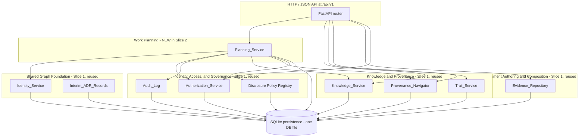

# Design Document

## Overview

This document specifies the design for the **second walking slice** of the Organizational Knowledge and Work System. It satisfies the requirements in [`requirements.md`](./requirements.md) and realizes *Release 1B — Decision to Planned Work* from [`07-user-story-map.md`](../../../documents/07-user-story-map.md) §4, constrained by:

- [`00-project-constitution.md`](../../../documents/00-project-constitution.md) §2 (foundational Resource graph model), §5.21 (Intent / Work / Output / Outcome are distinct), §5.23 (events vs. projections), and §5.25 (access is explicit and auditable).
- [`02-domain-model.md`](../../../documents/02-domain-model.md) §7.4 (Intent and Specification Record contract), §7.6 (Collaboration Record contract — Review Decision kind), §8.5 (Governance Decision Immutable Record), §10.6 (Supersedes), §10.9 (Addresses).
- [`03-context-map.md`](../../../documents/03-context-map.md) §2.5 (Work Planning bounded context).
- The first walking slice (its design at [`../first-walking-slice/design.md`](../first-walking-slice/design.md) and its 13 architectural decisions AD-WS-1 through AD-WS-13).

### Design Goals

The slice is deliberately small and additive. It must:

1. **Anchor planned work to recorded intent.** Every Objective traces to an authorized Slice 1 Decision; every Plan Approval traces through the Planning Provenance Chain back to exact Content Region Occurrences and Document Revisions.
2. **Enforce Plan/Execution separation in software.** No row, column, endpoint, or response field of the Planning_Service carries an execution attribute. Attempts to record execution facts are rejected at the API boundary (Requirement 12).
3. **Enforce Output/Outcome separation in software.** Intended Outcome rows carry `outcome_kind = 'intended'` and reject observed-outcome attributes; Deliverable Expectation rows reject produced-deliverable attributes (Requirement 13).
4. **Honor the indistinguishable-denial contract.** Every denial path on every new endpoint reuses the Slice 1 AD-WS-9 (`slice-default-2026`) policy, additively extended to cover the new node kinds (Requirements 10, 17).
5. **Be strictly additive over Slice 1.** Identity, Audit, Authorization, Evidence, Knowledge, Trail, Provenance, Disclosure, and Interim-ADR registries are reused; the only changes Slice 2 makes to Slice 1 code are additive enumeration values, additive registry rows, and additive Disclosure-policy coverage (Requirement 19).
6. **Match Slice 1's verification style.** Property-based tests with Hypothesis at ≥ 100 cases per property, deterministic seed capture, and an Interim ADR row for every new gap (Requirements 20, 21).

### Constitutional Posture

| Constitutional concept | Slice 2 realization |
|---|---|
| Resource graph foundation (5.1) | Eight new managed-Resource and Immutable-Record kinds reuse the same `Identifier_Registry`, `Audit_Records`, `Disclosure_Policies`, and `Interim_ADR_Records` Slice 1 owns. |
| Bounded contexts preserve meaning (5.2) | A new `walking_slice.planning` module subordinate to the Work Planning bounded context owns every Planning_Service write path; cross-context calls into Knowledge, Evidence, Authorization, Audit, and Disclosure use those modules' public APIs unchanged. |
| Authority and derivation distinct (5.4) | Plan Approval Records are Immutable Records (not Plan Revisions). Plan Approval is the consequential authority record; Plan Revision is the planned content. |
| Durable identity (5.5, ADR-HT-001) | Every new identity is a UUIDv7 minted by the existing `IdentityService`; no business meaning embedded. |
| Durable history (5.6, 5.7) | `Objective_Revisions`, `Intended_Outcome_Revisions`, `Project_Revisions`, `Deliverable_Expectation_Revisions`, `Plan_Revisions`, `Plan_Review_Revisions`, and `Plan_Approval_Records` are insert-only with append-only triggers per AD-WS-4. |
| Authority is explicit and auditable (5.25) | A new `review` authority value is added to the existing `{view, modify, approve}` enumeration; non-substitution rule extends to four authority types (Requirement 11). |
| Intent, Work, Output, Outcome are distinct (5.21) | Schema-level CHECK constraints reject any prohibited execution or observed-outcome attribute (Requirements 12, 13). |
| Sensitive information governed (5.26) | Backlink and provenance responses for new node kinds construct outputs from the authorized projection, producing indistinguishable observability with Slice 1 (Requirements 10, 17). |
| Empirical learning constrains expansion (5.29) | Slice 2 introduces only the eight Resource kinds and the four roles required for Release 1B; everything else is deferred. |

### Writing Order

The Architecture section maps Slice 2's modules onto Slice 1's existing process. Components and Interfaces details each new sub-component and the public HTTP surface. Data Models defines the new tables, append-only triggers, and value objects. Correctness Properties states the universally quantified invariants the implementation must preserve (written after running the `prework` tool over every acceptance criterion). Error Handling and Testing Strategy close the document.

---

## Architecture

### High-Level Shape

Slice 2 extends the Slice 1 modular monolith. There is **one process**, **one SQLite database file**, **one FastAPI router**, and **one HTTP endpoint surface** to which Slice 2 adds new routes. The new module boundary is the Planning_Service under `src/walking_slice/planning/`; it is the only new bounded-context module Slice 2 introduces.



The Planning_Service is **a single Python module package** (a directory `planning/` with one file per Resource kind plus shared helpers) rather than seven independent services. The single-package layout matches the Slice 1 boundary granularity (one module per bounded context: `evidence.py`, `knowledge.py`, `trails.py`, `provenance.py`) and keeps the audit-and-write atomic-transaction contract simple.

### Architectural Decisions

Slice 2 introduces these decisions. Each is traced to the constitutional principle, the requirement that motivates it, and (where applicable) the Slice 1 decision it extends or refines.

#### AD-WS-14 — Planning_Service as a single new module package, reusing Slice 1 stack

**Decision.** Implement Slice 2 in a new package `src/walking_slice/planning/` containing one module per Resource kind (`objectives.py`, `intended_outcomes.py`, `projects.py`, `deliverable_expectations.py`, `activity_plans.py`, `plan_revisions.py`, `plan_reviews.py`, `plan_approvals.py`) plus a shared `planning/_persistence.py` for the new schema and `planning/_routes.py` for the FastAPI routes. The package depends on the existing `walking_slice.identity`, `walking_slice.audit`, `walking_slice.authorization`, `walking_slice.knowledge`, `walking_slice.provenance`, `walking_slice.disclosure`, `walking_slice.interim_adr`, and `walking_slice.persistence` modules through their public APIs only.

**Rationale.** Requirement 19 (Reuse and Non-Modification of Slice 1 Contexts) and Principle 5.2 (Bounded contexts preserve meaning). The package boundary aligns with the Work Planning bounded context per [`03-context-map.md`](../../../documents/03-context-map.md) §2.5.

**Replaceability.** A future split into independent Objective_Service, Project_Service, and Plan_Service modules requires only moving file groups; no schema or HTTP route changes.

#### AD-WS-15 — Additive `review` authority value (closes Gap G-6)

**Decision.** Extend the canonical authority enumeration that the Slice 1 `Authorization_Service` validates from `{view, modify, approve}` to `{view, modify, review, approve}`. The change is implemented as a single additive update to the Slice 1 constant `_VALID_AUTHORITIES` in `src/walking_slice/authorization.py`; the change adds the literal value `review`, does not remove or rename any existing value, and does not alter the non-substitution rule (`evaluate` continues to require the exact authority named by the action's `_required_authority` mapping).

The Slice 1 `_required_authority` mapping is extended additively with:

- `create.plan_review` → `review` (Requirement 8, Requirement 11.4)
- `create.objective`, `create.intended_outcome`, `create.project`, `create.deliverable_expectation`, `create.activity_plan`, `create.plan_revision` → `modify`
- `create.plan_approval` → `approve` (Requirement 9, Requirement 11.5)

An Interim ADR row is inserted into `Interim_ADR_Records` with `backlog_adr_id = 'ADR-HT-006'` carrying the chosen additive value, the recorded date, and the motivating Requirement 11 acceptance criteria.

**Rationale.** Requirement 11 (Distinct Plan Reviewer and Plan Approver Authority Types) and Gap G-6. Adding a new value rather than overloading `approve` preserves Slice 1 Requirement 12.4's non-substitution invariant (Slice 1 Property 2 — Decision authority).

**Compatibility.** Existing Slice 1 audit rows carry the same three-value set and remain valid; new audit rows may carry `review` and remain valid.

#### AD-WS-16 — Additive Disclosure-policy extension via new coverage rows (closes Gap G-7)

**Decision.** Extend the Slice 1 `slice-default-2026` Disclosure policy to cover the new node kinds by inserting a new `Disclosure_Policy_Coverage` row for each new kind. The existing `Disclosure_Policies` row is not mutated; instead a sibling table `Disclosure_Policy_Coverage(policy_id, node_kind, recorded_at, backlog_adr_id)` is added (per AD-WS-19 below) and seeded by `walking_slice.planning._disclosure.seed_planning_coverage()`. The Provenance_Navigator and Authorization_Service look up the union of `Disclosure_Policies.policy_rules` and `Disclosure_Policy_Coverage.node_kind` to determine policy applicability for a node kind.

**Rationale.** Requirement 17 (Additive Extension of the Completeness Disclosure Policy) and Gap G-7. Coverage rows give an additive surface that does not alter the Slice 1 row identity, the Slice 1 rule set, or Slice 1 behavior. An Interim ADR row carries `backlog_adr_id = 'ADR-HT-009'`.

**Replaceability.** When a future ADR formalizes a versioned policy schema, the coverage rows can be migrated into the future representation without altering the policy identity `slice-default-2026`.

#### AD-WS-17 — Plan Review is `Relates To` with `review` semantic role; Plan Approval is `Addresses` Immutable Record (closes Gap G-8)

**Decision.** A Plan Review is a Collaboration Record (per [`02-domain-model.md`](../../../documents/02-domain-model.md) §7.6) and is connected to its target Plan Revision by a single `Relates To` Relationship row carrying a `semantic_role = 'review'` discriminator on a new column `Relationships.semantic_role` (NULLable, defaults to NULL for existing Slice 1 rows; see AD-WS-19). A Plan Approval is a Governance Decision Immutable Record (per [`02-domain-model.md`](../../../documents/02-domain-model.md) §8.5) and is connected to its target Plan Revision by a single `Addresses` Relationship row with `semantic_role = NULL`. This mirrors the Slice 1 pattern where a `Decision` uses `Addresses` to point at a `Recommendation Revision`.

**Rationale.** Requirement 8 (Plan Review), Requirement 9 (Plan Approval), and Gap G-8. The `Relates To` + semantic-role pattern is permitted by [`02-domain-model.md`](../../../documents/02-domain-model.md) §10.5 invariant 1 ("Relates To does not replace a more precise type when one exists"). The `Addresses` pattern is the precise type for "intent to act on" — already used by Slice 1 Decisions.

**Persistence.** The `semantic_role` column is the only schema addition Slice 2 makes to the Slice 1 `Relationships` table. The addition is via `ALTER TABLE Relationships ADD COLUMN semantic_role TEXT NULL`; the column is NULL for every existing Slice 1 row and the database trigger that rejects UPDATE/DELETE on `Relationships` rows is unchanged.

#### AD-WS-18 — Plan Revision lifecycle states are exactly `{draft, approved}` for this slice (closes Gap G-9)

**Decision.** The `Plan_Revisions.lifecycle_state` column accepts exactly `'draft'` or `'approved'`. The transition `draft → approved` is the only governed transition and occurs atomically inside the Plan Approval transaction (AD-WS-20). Other states named by the constitution (`superseded`, `withdrawn`, `archived`) are deferred to a later slice. A CHECK constraint enforces the two-value enumeration.

**Rationale.** Requirement 9 (Approve a Plan Revision), Requirement 7.3 (Draft supersession via a separate `Supersedes` Relationship), and Gap G-9. An Interim ADR row carries `backlog_adr_id = 'ADR-HT-011'`. The constitution's other lifecycle states remain valid; Slice 2 simply does not implement them yet.

#### AD-WS-19 — Per-Resource-kind tables with append-only triggers, plus one schema addition on `Relationships`

**Decision.** The new schema adds the following SQLite tables, all insert-only, all with `UPDATE` and `DELETE` triggers that reject mutation (matching Slice 1 AD-WS-4):

- `Objectives`, `Objective_Revisions`
- `Intended_Outcomes`, `Intended_Outcome_Revisions`
- `Projects`, `Project_Revisions`
- `Deliverable_Expectations`, `Deliverable_Expectation_Revisions`
- `Activity_Plans`
- `Plan_Revisions` (carries a `lifecycle_state` column whose `approved` transition is atomic with Plan Approval; the trigger permits exactly one UPDATE that flips `lifecycle_state` from `draft` to `approved` and rejects any other UPDATE — see AD-WS-20)
- `Plan_Reviews`, `Plan_Review_Revisions`
- `Plan_Approval_Records`
- `Disclosure_Policy_Coverage` (sibling to the existing `Disclosure_Policies` table; insert-only after seeding)

**One schema addition to Slice 1** is required and permitted by Requirement 19.2 (additive extensions of Slice 1 enumerations and registries): `ALTER TABLE Relationships ADD COLUMN semantic_role TEXT NULL` (AD-WS-17). Triggers on `Relationships` are unchanged.

**Rationale.** Requirement 9.4 (approved Plan Revisions are byte-equivalent forever) and Gap G-10. Per-Resource-kind tables match Slice 1's pattern for Documents, Findings, Recommendations, and Trails.

**The `lifecycle_state` transition is the single exception** to the no-UPDATE rule on the new tables. The exception is implemented as a tightly scoped trigger that allows exactly the transition `('draft', 'approved')` when invoked by the `create.plan_approval` write path (identified by a session-scoped pragma the Planning_Service sets inside the Plan Approval transaction) and rejects every other UPDATE. An Interim ADR row carries `backlog_adr_id = 'ADR-HT-012'`.

#### AD-WS-20 — Plan Approval transitions lifecycle state inside one transaction

**Decision.** The `Plan_Approval_Records` INSERT and the `Plan_Revisions.lifecycle_state` UPDATE from `'draft'` to `'approved'` happen inside one SQL transaction together with: (a) the `Addresses` Relationship row, (b) the Provenance Manifest row (via the existing `ProvenanceManifestWriter`), (c) any Omission Entries, and (d) the consequential `Audit_Records` row. If any of these inserts or the UPDATE fails, the entire transaction is rolled back and the Plan Approval attempt returns an error response.

**Rationale.** Requirement 9.1 ("SHALL atomically transition the target Plan Revision's lifecycle state from `draft` to `approved` within the same transaction"). Mirrors Slice 1 AD-WS-5 (Audit-and-write atomicity).

#### AD-WS-21 — Decision-to-Objective resolution uses the existing Knowledge_Service read API

**Decision.** When creating an Objective, the Planning_Service resolves the target Decision Immutable Record by calling the existing Knowledge_Service `get_decision(decision_id)` method (already exposed by Slice 1 for the `GET /api/v1/decisions/{decision_id}` endpoint). The Planning_Service does not query the Slice 1 `Decisions` table directly; the access boundary remains the Knowledge_Service public API. Requirement 2.2 (Decision outcome at creation time must be `Accept`) is enforced by reading the resolved Decision's `outcome` column.

**Rationale.** Principle 5.2 (Bounded contexts preserve meaning) and Cross-Context Rule 2 ("A context does not mutate another context's authoritative record"). Reading through the Knowledge_Service public API keeps the Planning_Service decoupled from the Slice 1 schema.

#### AD-WS-22 — Authority basis enumeration is reused unchanged

**Decision.** The `authority_basis.type` value persisted on `Plan_Approval_Records` and `Plan_Review_Revisions` is drawn from the existing Slice 1 enumeration `{role-grant-id, scope-id, delegation-chain-id}` (AD-WS-10). Slice 2 does not extend the enumeration.

**Rationale.** Requirements 8.2 and 9.2 explicitly defer to AD-WS-10. Avoiding extension keeps Slice 1 Property 2 (Decision authority) unmodified.

#### AD-WS-23 — Disclosure policy coverage is enforced by lookup, not by per-node code paths

**Decision.** The Slice 1 `slice-default-2026` rule implementation (the response-shaping that produces indistinguishable observability) is reused unchanged. The Planning_Service's redaction marker, gap-descriptor, and indistinguishable-denial code paths call into the existing Slice 1 functions `walking_slice.disclosure.policy_for(node_kind)` (extended to consult `Disclosure_Policy_Coverage`) and `walking_slice.provenance._shape_response_constant_time(...)`. The Planning_Service does not add a parallel code path.

**Rationale.** Requirement 17.4 (matching Slice 1 observability guarantees) and Requirement 19 (additive only).

### Cross-Cutting Concerns

**Transactionality.** Every Planning_Service consequential write opens one SQL transaction that inserts (or, for Plan Approval, inserts plus the one permitted UPDATE) every artifact of the action: domain rows, `Addresses` or `Relates To` Relationship rows, Provenance Manifest, Omission Entries, and the consequential `Audit_Records` row. The audit append participates in the same transaction (AD-WS-5).

**Time.** Recorded timestamps are UTC ISO-8601 millisecond precision via the existing `Clock` protocol. Audit-row recorded times match domain-row recorded times within the same transaction (matching Slice 1's *Transactionality* contract).

**Identifiers.** Every new identity is a UUIDv7 minted by the existing `IdentityService` and registered in `Identifier_Registry` with `kind ∈ {'resource', 'revision', 'immutable_record'}`. Plan Approval Record identity uses `kind = 'immutable_record'` (matching Slice 1 Decisions).

**Authorization.** The existing `Authorization_Service.evaluate(connection, party_id, action, target, at)` is called for every Planning_Service write. The action strings follow the Slice 1 form `<prefix>.<resource_kind>`; see AD-WS-15 for the full mapping. The deny path uses the Slice 1 separate-transaction Denial-Record pattern (Slice 1 `KnowledgeService.create_decision`).

**Privacy and inference leakage.** Every response from a Planning_Service endpoint is materialized through the existing `Provenance_Navigator._shape_response_constant_time(...)` helper, ensuring restricted-vs-nonexistent observability remains constant.


---

## Components and Interfaces

The Planning_Service is a single Python package whose public surface is one FastAPI router prefix `/api/v1` and a set of module-level service classes. Each Resource kind has its own module and its own service class; the modules share a single `_persistence.py` for schema definitions and a single `_routes.py` for HTTP wiring.

### Planning_Service.Objectives

**Responsibility.** Persist Objective Resources and immutable Objective Revisions, and record the `Addresses` Relationship from each Objective Revision to a Slice 1 Decision Immutable Record.

**Public surface.**

```python
@dataclass(frozen=True)
class ObjectiveService:
    clock: Clock
    identity_service: IdentityService
    audit_log: AuditLog
    authorization_service: AuthorizationService
    knowledge_service: KnowledgeService  # for get_decision() reads only

    def create_objective(
        self,
        connection: Connection,
        *,
        statement: str,                  # 1..4000 chars
        rationale: Optional[str],        # 0..10000 chars
        target_decision_id: str,         # must resolve and outcome == Accept
        authoring_party_id: str,
        applicable_scope: str,
        engine: Engine,                  # required for denial side-channel
        correlation_id: Optional[str] = None,
    ) -> CreateObjectiveResult: ...
```

**HTTP surface.**

| Method | Path | Purpose |
|---|---|---|
| `POST` | `/api/v1/objectives` | Create an Objective and its first Revision (Objective Owner). |
| `GET` | `/api/v1/objectives/{objective_id}/revisions/{revision_id}` | Read an Objective Revision (view authority). |

**Authority.** `create.objective` → `modify` (Objective Owner role grants `modify` on the applicable scope). The deny path is identical to the Slice 1 Decision deny path (separate-transaction Denial Record with 3-attempt retry per Requirement 7.6 / Slice 1).

**Internal collaborators.** `IdentityService`, `AuditLog`, `AuthorizationService`, `KnowledgeService.get_decision()` for AD-WS-21.

**Satisfies.** Requirements 1, 2, 16 (audit), 21 (interim ADR).

### Planning_Service.IntendedOutcomes

**Responsibility.** Persist Intended Outcome Resources and immutable Intended Outcome Revisions linked to an Objective. Enforce that no observed-outcome attribute is accepted.

**Public surface.**

```python
@dataclass(frozen=True)
class IntendedOutcomeService:
    clock: Clock
    identity_service: IdentityService
    audit_log: AuditLog
    authorization_service: AuthorizationService

    def create_intended_outcome(
        self,
        connection: Connection,
        *,
        target_objective_id: str,
        success_condition: str,                  # 1..4000 chars
        observation_window: Optional[str],       # 0..1000 chars
        attribution_assumption: Optional[str],   # 0..4000 chars
        authoring_party_id: str,
        applicable_scope: str,
        engine: Engine,
        correlation_id: Optional[str] = None,
    ) -> CreateIntendedOutcomeResult: ...
```

The request model is a Pydantic class with **no fields** for observed measurements, observed outcome value, observed outcome time, or attribution evidence; the Pydantic `Config(extra='forbid')` together with a `_validate_no_observed_attributes` validator rejects any incoming request body that names any of the prohibited keys named in Requirement 3.3 / Requirement 13.

**HTTP surface.**

| Method | Path | Purpose |
|---|---|---|
| `POST` | `/api/v1/intended-outcomes` | Create an Intended Outcome and its first Revision. |
| `GET` | `/api/v1/intended-outcomes/{intended_outcome_id}/revisions/{revision_id}` | Read an Intended Outcome Revision. |

**Authority.** `create.intended_outcome` → `modify`.

**Persistence invariant.** Every `Intended_Outcome_Revisions` row carries `outcome_kind = 'intended'` enforced by a CHECK constraint `CHECK(outcome_kind = 'intended')`. Slice 2 never inserts any other value.

**Satisfies.** Requirements 3, 13, 16.

### Planning_Service.Projects

**Responsibility.** Persist Project Resources and immutable Project Revisions linked to an Objective.

**Public surface.**

```python
@dataclass(frozen=True)
class ProjectService:
    clock: Clock
    identity_service: IdentityService
    audit_log: AuditLog
    authorization_service: AuthorizationService

    def create_project(
        self,
        connection: Connection,
        *,
        target_objective_id: str,
        name: str,                       # 1..200 chars
        summary: Optional[str],          # 0..4000 chars
        planned_start_date: date,        # ISO-8601 calendar date
        planned_end_date: date,          # >= planned_start_date
        authoring_party_id: str,
        applicable_scope: str,
        engine: Engine,
        correlation_id: Optional[str] = None,
    ) -> CreateProjectResult: ...
```

**HTTP surface.**

| Method | Path | Purpose |
|---|---|---|
| `POST` | `/api/v1/projects` | Create a Project and its first Revision (Project Owner). |
| `GET` | `/api/v1/projects/{project_id}/revisions/{revision_id}` | Read a Project Revision. |

**Authority.** `create.project` → `modify`.

**Identity invariant.** Requirement 4.5 — Project and Activity Plan identifier sets are disjoint. The `Identifier_Registry` `kind` column already distinguishes resource and revision kinds; this requirement is enforced by additionally tagging Project Resource identifiers with `resource_kind = 'project'` and Activity Plan Resource identifiers with `resource_kind = 'activity_plan'` via a new column on `Identifier_Registry` (additive per AD-WS-19) and a UNIQUE index on `(identifier)` that remains global.

**Satisfies.** Requirements 4, 16.

### Planning_Service.DeliverableExpectations

**Responsibility.** Persist Deliverable Expectation Resources and immutable Deliverable Expectation Revisions linked to a Project. Enforce that no produced-deliverable attribute is accepted.

**Public surface.**

```python
@dataclass(frozen=True)
class DeliverableExpectationService:
    clock: Clock
    identity_service: IdentityService
    audit_log: AuditLog
    authorization_service: AuthorizationService

    def create_deliverable_expectation(
        self,
        connection: Connection,
        *,
        target_project_id: str,
        name: str,                       # 1..200 chars
        description: Optional[str],      # 0..10000 chars
        deliverable_kind: Literal["Document", "Artifact", "Service", "Other"],
        acceptance_criteria: Optional[str],   # 0..10000 chars
        authoring_party_id: str,
        applicable_scope: str,
        engine: Engine,
        correlation_id: Optional[str] = None,
    ) -> CreateDeliverableExpectationResult: ...
```

The request model uses `Config(extra='forbid')` and a `_validate_no_produced_attributes` validator (matching the IntendedOutcomes pattern) to reject any field naming a produced-Deliverable Identity, hand-off receipt, or acceptance-by-customer record (Requirement 5.3 / Requirement 13.2).

**HTTP surface.**

| Method | Path | Purpose |
|---|---|---|
| `POST` | `/api/v1/deliverable-expectations` | Create a Deliverable Expectation and its first Revision. |
| `GET` | `/api/v1/deliverable-expectations/{id}/revisions/{revision_id}` | Read a Deliverable Expectation Revision. |

**Authority.** `create.deliverable_expectation` → `modify`.

**Satisfies.** Requirements 5, 13, 16.

### Planning_Service.ActivityPlans

**Responsibility.** Persist Activity Plan Resources linked to a Project. Activity Plans do not themselves carry Revisions; planned content lives on Plan Revisions (per AD-WS-3 — Resource and Revision identities are distinct, but the Activity Plan Resource is the *organizing* identity and the Plan Revision is where versioned content lives).

**Public surface.**

```python
@dataclass(frozen=True)
class ActivityPlanService:
    clock: Clock
    identity_service: IdentityService
    audit_log: AuditLog
    authorization_service: AuthorizationService

    def create_activity_plan(
        self,
        connection: Connection,
        *,
        target_project_id: str,
        title: str,                      # 1..200 chars
        authoring_party_id: str,
        applicable_scope: str,
        engine: Engine,
        correlation_id: Optional[str] = None,
    ) -> CreateActivityPlanResult: ...
```

**HTTP surface.**

| Method | Path | Purpose |
|---|---|---|
| `POST` | `/api/v1/activity-plans` | Create an Activity Plan. |
| `GET` | `/api/v1/activity-plans/{activity_plan_id}` | Read an Activity Plan. |

**Authority.** `create.activity_plan` → `modify`.

**Satisfies.** Requirements 6, 16.

### Planning_Service.PlanRevisions

**Responsibility.** Persist immutable Draft Plan Revisions, link them to their parent Activity Plan, validate Deliverable Expectation references, and represent predecessor relationships through a `Supersedes` Relationship row.

**Public surface.**

```python
@dataclass(frozen=True)
class PlanRevisionService:
    clock: Clock
    identity_service: IdentityService
    audit_log: AuditLog
    authorization_service: AuthorizationService

    def create_plan_revision(
        self,
        connection: Connection,
        *,
        target_activity_plan_id: str,
        planned_scope: str,                       # 1..10000 chars
        deliverable_expectation_refs: Sequence[str] = (),   # 0..50 entries, each resolves
        planning_assumptions: Sequence[str] = (),           # 0..100 entries, each 1..2000
        ordering_rationale: Optional[str],                  # 0..2000 chars
        predecessor_plan_revision_id: Optional[str],        # must resolve and be draft
        authoring_party_id: str,
        applicable_scope: str,
        engine: Engine,
        correlation_id: Optional[str] = None,
    ) -> CreatePlanRevisionResult: ...
```

**HTTP surface.**

| Method | Path | Purpose |
|---|---|---|
| `POST` | `/api/v1/activity-plans/{activity_plan_id}/plan-revisions` | Create a Draft Plan Revision (Project Owner). |
| `GET` | `/api/v1/activity-plans/{activity_plan_id}/plan-revisions/{revision_id}` | Read a Plan Revision. |

**Authority.** `create.plan_revision` → `modify`.

**Lifecycle.** Every Plan Revision is created with `lifecycle_state = 'draft'`. When `predecessor_plan_revision_id` is supplied, the service validates that the predecessor exists, belongs to the same Activity Plan, and is itself `draft` (Requirement 7.4 — predecessors must be unapproved). On success the service inserts an additional `Supersedes` Relationship row from the new Plan Revision to the predecessor.

**Satisfies.** Requirements 7, 12, 16.

### Planning_Service.PlanReviews

**Responsibility.** Persist Plan Review Resources and immutable Plan Review Revisions targeting a Draft Plan Revision. Authority requires `review`.

**Public surface.**

```python
@dataclass(frozen=True)
class PlanReviewService:
    clock: Clock
    identity_service: IdentityService
    audit_log: AuditLog
    authorization_service: AuthorizationService

    def create_plan_review(
        self,
        connection: Connection,
        *,
        target_plan_revision_id: str,            # must resolve and lifecycle_state == 'draft'
        outcome: Literal["Endorse", "Changes_Requested", "Reject"],
        rationale: str,                          # 1..10000 chars
        reviewing_party_id: str,
        authority_basis: AuthorityBasisRef,      # type ∈ AD-WS-10 set
        applicable_scope: str,
        engine: Engine,
        correlation_id: Optional[str] = None,
    ) -> CreatePlanReviewResult: ...
```

**HTTP surface.**

| Method | Path | Purpose |
|---|---|---|
| `POST` | `/api/v1/plan-revisions/{plan_revision_id}/reviews` | Record a Plan Review (Plan Reviewer). |
| `GET` | `/api/v1/plan-reviews/{plan_review_id}/revisions/{revision_id}` | Read a Plan Review Revision. |

**Authority.** `create.plan_review` → `review` (AD-WS-15 mapping). The authorization deny path returns an AD-WS-9-conformant response.

**Relationship.** Creating a Plan Review inserts one `Relationships` row with `relationship_type = 'Relates To'`, `semantic_role = 'review'` (AD-WS-17), `source_kind = 'plan_review_revision'`, and `target_kind = 'plan_revision'`. The Plan Revision's `lifecycle_state` is **not** changed by recording a Plan Review (Requirement 8.7).

**Satisfies.** Requirements 8, 11 (review authority), 16, 17 (denial extension).

### Planning_Service.PlanApprovals

**Responsibility.** Persist Plan Approval Immutable Records, atomically transition the target Plan Revision's lifecycle state from `draft` to `approved`, and append the `Addresses` Relationship, Provenance Manifest, and consequential audit row inside one transaction.

**Public surface.**

```python
@dataclass(frozen=True)
class PlanApprovalService:
    clock: Clock
    identity_service: IdentityService
    audit_log: AuditLog
    authorization_service: AuthorizationService
    manifest_writer: ProvenanceManifestWriter
    denial_audit_sleep: Callable[[float], None] = field(default=time.sleep)

    def create_plan_approval(
        self,
        connection: Connection,
        engine: Engine,
        *,
        target_plan_revision_id: str,
        outcome: Literal["Approve", "Reject_Approval"],
        rationale: str,                          # 1..4000 chars
        approving_party_id: str,
        authority_basis: AuthorityBasisRef,      # type ∈ AD-WS-10 set
        applicable_scope: str,
        omissions: Sequence[PlanApprovalOmissionEntry] = (),
        correlation_id: Optional[str] = None,
    ) -> CreatePlanApprovalResult: ...
```

**HTTP surface.**

| Method | Path | Purpose |
|---|---|---|
| `POST` | `/api/v1/plan-revisions/{plan_revision_id}/approvals` | Record a Plan Approval and transition lifecycle (Plan Approver). |
| `GET` | `/api/v1/plan-approvals/{plan_approval_id}` | Read a Plan Approval Immutable Record. |
| `GET` | `/api/v1/plan-approvals/{plan_approval_id}/provenance` | Walk the Planning Provenance Chain back to Document Revisions. |

**Authority.** `create.plan_approval` → `approve` (AD-WS-15 mapping).

**Persistence flow (AD-WS-20).** The transaction inserts (in order): the `Plan_Approval_Records` row → the `Addresses` Relationship row → the Provenance Manifest row → each `Omission_Entries` row → the lifecycle UPDATE on `Plan_Revisions` → the consequential `Audit_Records` row. The trigger that normally rejects UPDATE on `Plan_Revisions` (AD-WS-19) permits exactly this one transition when a session pragma named `walking_slice.plan_approval_in_progress` is set to the current correlation identifier. The pragma is unset at the end of the transaction.

**Provenance chain.** The Plan Approval's provenance walk reuses the existing `Provenance_Navigator.navigate_decision` algorithm pattern. A new method `Provenance_Navigator.navigate_plan_approval(plan_approval_id, party, at)` is added to the Slice 1 `provenance.py` only as an additive function; it does not modify the existing `navigate_decision`. The walk descends Plan Approval → Plan Revision → Activity Plan → Project → Objective → Slice 1 Decision and then delegates to `navigate_decision` for the Decision → Recommendation → Finding → Region → Document tail.

**Uniqueness.** The schema enforces `UNIQUE(target_plan_revision_id)` on `Plan_Approval_Records` so Requirement 9.5 (one Plan Approval per Plan Revision) is enforced at the database level.

**Satisfies.** Requirements 9, 10 (deny path), 11 (approve authority), 14 (provenance chain), 16, 17 (denial extension), 18 (projection envelope on approval-status responses).

### Reused Slice 1 components

- **`Identity_Service`** — unchanged. New identifiers are minted through the existing factory methods plus the resource-kind tag added by AD-WS-19.
- **`Audit_Log`** — unchanged. New action types (`create.objective`, `create.intended_outcome`, `create.project`, `create.deliverable_expectation`, `create.activity_plan`, `create.plan_revision`, `create.plan_review`, `create.plan_approval`) are written through the existing `append_consequential` and `append_denial` methods.
- **`Authorization_Service`** — extended only by AD-WS-15 (adds `review` to `_VALID_AUTHORITIES` and extends `_required_authority`).
- **`Knowledge_Service`** — read-only consumer through `get_decision(decision_id)` (AD-WS-21).
- **`Provenance_Navigator`** — extended only by an additive `navigate_plan_approval` function and additive backlink-source kinds in the `_authorized_source_kinds` set.
- **`ProvenanceManifestWriter`** — unchanged. The Planning_Service uses it to write Provenance Manifests for Plan Approval.
- **`Disclosure` registry** — extended only by `Disclosure_Policy_Coverage` rows seeded at startup (AD-WS-16).
- **`Interim_ADR_Records`** — extended by additive rows for AD-WS-15..AD-WS-22 at startup.
- **`Projection` envelope** — unchanged. Planning_Service status responses (e.g. "Plan Approved") wrap their projected status in `ProjectionEnvelope` per Requirement 18.


---

## Data Models

### Schema Additions

The following tables are added to the existing Slice 1 SQLite database (one file, same connection). Every new table is insert-only. Append-only triggers reject `UPDATE` and `DELETE`, matching the Slice 1 AD-WS-4 pattern, except for the tightly scoped `Plan_Revisions.lifecycle_state` exception in AD-WS-19.

**Conventions for every table below.** UTF-8 text columns; all timestamps stored as ISO-8601 strings with millisecond precision; every Resource row carries a `created_at` column matching the recorded time of its first Revision; every Revision row carries `recorded_at` in UTC ISO-8601 ms; `applicable_scope` is the scope identifier supplied by the request and persisted byte-equivalent.

#### Objectives

```sql
CREATE TABLE Objectives (
  objective_id            TEXT PRIMARY KEY,
  created_at              TEXT NOT NULL CHECK (length(created_at) >= 20)
);

CREATE TABLE Objective_Revisions (
  objective_revision_id   TEXT PRIMARY KEY,
  objective_id            TEXT NOT NULL REFERENCES Objectives(objective_id),
  parent_revision_id      TEXT NULL REFERENCES Objective_Revisions(objective_revision_id),
  statement               TEXT NOT NULL CHECK (length(statement) BETWEEN 1 AND 4000),
  rationale               TEXT NULL CHECK (rationale IS NULL OR length(rationale) BETWEEN 0 AND 10000),
  target_decision_id      TEXT NOT NULL,    -- FK enforced in application via Knowledge_Service.get_decision
  authoring_party_id      TEXT NOT NULL REFERENCES Parties(party_id),
  applicable_scope        TEXT NOT NULL,
  recorded_at             TEXT NOT NULL
);

-- Triggers reject UPDATE / DELETE on Objectives and Objective_Revisions.
```

#### Intended_Outcomes

```sql
CREATE TABLE Intended_Outcomes (
  intended_outcome_id     TEXT PRIMARY KEY,
  created_at              TEXT NOT NULL
);

CREATE TABLE Intended_Outcome_Revisions (
  intended_outcome_revision_id  TEXT PRIMARY KEY,
  intended_outcome_id     TEXT NOT NULL REFERENCES Intended_Outcomes(intended_outcome_id),
  parent_revision_id      TEXT NULL,
  outcome_kind            TEXT NOT NULL CHECK (outcome_kind = 'intended'),   -- AD-WS / R13
  target_objective_id     TEXT NOT NULL REFERENCES Objectives(objective_id),
  success_condition       TEXT NOT NULL CHECK (length(success_condition) BETWEEN 1 AND 4000),
  observation_window      TEXT NULL CHECK (observation_window IS NULL OR length(observation_window) BETWEEN 0 AND 1000),
  attribution_assumption  TEXT NULL CHECK (attribution_assumption IS NULL OR length(attribution_assumption) BETWEEN 0 AND 4000),
  authoring_party_id      TEXT NOT NULL REFERENCES Parties(party_id),
  applicable_scope        TEXT NOT NULL,
  recorded_at             TEXT NOT NULL
);

-- The CHECK on outcome_kind is the schema-level guarantee for Requirement 13.3.
```

#### Projects

```sql
CREATE TABLE Projects (
  project_id              TEXT PRIMARY KEY,
  created_at              TEXT NOT NULL
);

CREATE TABLE Project_Revisions (
  project_revision_id     TEXT PRIMARY KEY,
  project_id              TEXT NOT NULL REFERENCES Projects(project_id),
  parent_revision_id      TEXT NULL,
  name                    TEXT NOT NULL CHECK (length(name) BETWEEN 1 AND 200),
  summary                 TEXT NULL CHECK (summary IS NULL OR length(summary) BETWEEN 0 AND 4000),
  target_objective_id     TEXT NOT NULL REFERENCES Objectives(objective_id),
  planned_start_date      TEXT NOT NULL,
  planned_end_date        TEXT NOT NULL,
  CHECK (planned_start_date <= planned_end_date),
  authoring_party_id      TEXT NOT NULL REFERENCES Parties(party_id),
  applicable_scope        TEXT NOT NULL,
  recorded_at             TEXT NOT NULL
);
```

#### Deliverable_Expectations

```sql
CREATE TABLE Deliverable_Expectations (
  deliverable_expectation_id  TEXT PRIMARY KEY,
  created_at                  TEXT NOT NULL
);

CREATE TABLE Deliverable_Expectation_Revisions (
  deliverable_expectation_revision_id  TEXT PRIMARY KEY,
  deliverable_expectation_id  TEXT NOT NULL REFERENCES Deliverable_Expectations(deliverable_expectation_id),
  parent_revision_id          TEXT NULL,
  target_project_id           TEXT NOT NULL REFERENCES Projects(project_id),
  name                        TEXT NOT NULL CHECK (length(name) BETWEEN 1 AND 200),
  description                 TEXT NULL CHECK (description IS NULL OR length(description) BETWEEN 0 AND 10000),
  deliverable_kind            TEXT NOT NULL CHECK (deliverable_kind IN ('Document','Artifact','Service','Other')),
  acceptance_criteria         TEXT NULL CHECK (acceptance_criteria IS NULL OR length(acceptance_criteria) BETWEEN 0 AND 10000),
  authoring_party_id          TEXT NOT NULL REFERENCES Parties(party_id),
  applicable_scope            TEXT NOT NULL,
  recorded_at                 TEXT NOT NULL
);
```

#### Activity_Plans

```sql
CREATE TABLE Activity_Plans (
  activity_plan_id        TEXT PRIMARY KEY,
  target_project_id       TEXT NOT NULL REFERENCES Projects(project_id),
  title                   TEXT NOT NULL CHECK (length(title) BETWEEN 1 AND 200),
  authoring_party_id      TEXT NOT NULL REFERENCES Parties(party_id),
  applicable_scope        TEXT NOT NULL,
  recorded_at             TEXT NOT NULL
);
```

#### Plan_Revisions

```sql
CREATE TABLE Plan_Revisions (
  plan_revision_id        TEXT PRIMARY KEY,
  activity_plan_id        TEXT NOT NULL REFERENCES Activity_Plans(activity_plan_id),
  predecessor_revision_id TEXT NULL REFERENCES Plan_Revisions(plan_revision_id),
  lifecycle_state         TEXT NOT NULL CHECK (lifecycle_state IN ('draft','approved')),
  planned_scope           TEXT NOT NULL CHECK (length(planned_scope) BETWEEN 1 AND 10000),
  deliverable_expectation_refs_json  TEXT NOT NULL,   -- JSON array of 0..50 IDs
  planning_assumptions_json          TEXT NOT NULL,   -- JSON array of 0..100 strings, each 1..2000
  ordering_rationale      TEXT NULL CHECK (ordering_rationale IS NULL OR length(ordering_rationale) BETWEEN 0 AND 2000),
  authoring_party_id      TEXT NOT NULL REFERENCES Parties(party_id),
  applicable_scope        TEXT NOT NULL,
  recorded_at             TEXT NOT NULL
);

-- The UPDATE trigger permits exactly the transition draft -> approved
-- when the session pragma walking_slice.plan_approval_in_progress is set;
-- every other UPDATE is rejected.
```

#### Plan_Reviews and Plan_Review_Revisions

```sql
CREATE TABLE Plan_Reviews (
  plan_review_id          TEXT PRIMARY KEY,
  created_at              TEXT NOT NULL
);

CREATE TABLE Plan_Review_Revisions (
  plan_review_revision_id TEXT PRIMARY KEY,
  plan_review_id          TEXT NOT NULL REFERENCES Plan_Reviews(plan_review_id),
  target_plan_revision_id TEXT NOT NULL REFERENCES Plan_Revisions(plan_revision_id),
  outcome                 TEXT NOT NULL CHECK (outcome IN ('Endorse','Changes_Requested','Reject')),
  rationale               TEXT NOT NULL CHECK (length(rationale) BETWEEN 1 AND 10000),
  reviewing_party_id      TEXT NOT NULL REFERENCES Parties(party_id),
  authority_basis_type    TEXT NOT NULL CHECK (authority_basis_type IN ('role-grant-id','scope-id','delegation-chain-id')),
  authority_basis_id      TEXT NOT NULL,
  applicable_scope        TEXT NOT NULL,
  recorded_at             TEXT NOT NULL
);
```

#### Plan_Approval_Records

```sql
CREATE TABLE Plan_Approval_Records (
  plan_approval_id        TEXT PRIMARY KEY,
  target_activity_plan_id TEXT NOT NULL REFERENCES Activity_Plans(activity_plan_id),
  target_plan_revision_id TEXT NOT NULL UNIQUE REFERENCES Plan_Revisions(plan_revision_id),    -- Requirement 9.5
  outcome                 TEXT NOT NULL CHECK (outcome IN ('Approve','Reject_Approval')),
  rationale               TEXT NOT NULL CHECK (length(rationale) BETWEEN 1 AND 4000),
  approving_party_id      TEXT NOT NULL REFERENCES Parties(party_id),
  authority_basis_type    TEXT NOT NULL CHECK (authority_basis_type IN ('role-grant-id','scope-id','delegation-chain-id')),
  authority_basis_id      TEXT NOT NULL,
  applicable_scope        TEXT NOT NULL,
  recorded_at             TEXT NOT NULL
);

-- Triggers reject UPDATE and DELETE on Plan_Approval_Records.
```

#### Disclosure_Policy_Coverage

```sql
CREATE TABLE Disclosure_Policy_Coverage (
  policy_id               TEXT NOT NULL REFERENCES Disclosure_Policies(policy_id),
  node_kind               TEXT NOT NULL,
  recorded_at             TEXT NOT NULL,
  backlog_adr_id          TEXT NOT NULL,
  PRIMARY KEY (policy_id, node_kind)
);

-- Insert-only after seeding. Trigger rejects UPDATE / DELETE.
```

#### Slice 1 schema addition: Relationships.semantic_role

```sql
ALTER TABLE Relationships ADD COLUMN semantic_role TEXT NULL;
-- Triggers on Relationships are unchanged.
-- Existing Slice 1 rows carry semantic_role = NULL and remain valid.
```

#### Slice 1 schema addition: Identifier_Registry.resource_kind

```sql
ALTER TABLE Identifier_Registry ADD COLUMN resource_kind TEXT NULL;
-- Used by AD-WS-19 to enforce Requirement 4.5 (Project vs. Activity Plan
-- identifier-set disjointness) without altering the UNIQUE(identifier)
-- invariant.
```

### Indexes

- `CREATE INDEX idx_objective_revisions_by_objective ON Objective_Revisions(objective_id, recorded_at);`
- `CREATE INDEX idx_intended_outcome_revisions_by_objective ON Intended_Outcome_Revisions(target_objective_id, recorded_at);`
- `CREATE INDEX idx_project_revisions_by_objective ON Project_Revisions(target_objective_id, recorded_at);`
- `CREATE INDEX idx_deliverable_expectation_revisions_by_project ON Deliverable_Expectation_Revisions(target_project_id, recorded_at);`
- `CREATE INDEX idx_activity_plans_by_project ON Activity_Plans(target_project_id, recorded_at);`
- `CREATE INDEX idx_plan_revisions_by_activity_plan ON Plan_Revisions(activity_plan_id, lifecycle_state, recorded_at);`
- `CREATE INDEX idx_plan_review_revisions_by_target ON Plan_Review_Revisions(target_plan_revision_id, recorded_at);`
- `CREATE INDEX idx_plan_approvals_by_target ON Plan_Approval_Records(target_plan_revision_id);` (the UNIQUE column already creates an implicit index)

### In-Memory Value Objects

The Planning_Service uses a single new module `walking_slice.planning.models` containing frozen Pydantic value objects:

```python
class ObjectiveRef(BaseModel):
    objective_id: UUID

class IntendedOutcomeRef(BaseModel):
    intended_outcome_id: UUID

class ProjectRef(BaseModel):
    project_id: UUID

class DeliverableExpectationRef(BaseModel):
    deliverable_expectation_id: UUID

class ActivityPlanRef(BaseModel):
    activity_plan_id: UUID

class PlanRevisionRef(BaseModel):
    activity_plan_id: UUID
    plan_revision_id: UUID

class PlanApprovalRef(BaseModel):
    plan_approval_id: UUID
    target_plan_revision_id: UUID

class PlanApprovalOmissionEntry(BaseModel):
    category: Literal["intentional", "unavailable", "restricted", "stale", "unresolved"]
    excluded_source_id: UUID
    excluded_source_revision_id: Optional[UUID]
    rationale: str  # 1..2000 chars
```

The reused `AuthorityBasisRef`, `ProvenanceNode`, `GapDescriptor`, `ProjectionEnvelope`, `RequestContext`, `Clock`, and `TargetRef` value objects come from Slice 1's `walking_slice.models` and `walking_slice.projection` modules unchanged.

### Persistence Invariants Summary

1. Every new table is insert-only; UPDATE/DELETE triggers reject mutation. (AD-WS-4, AD-WS-19)
2. The Plan_Revisions UPDATE trigger permits exactly the `draft → approved` transition when the session pragma `walking_slice.plan_approval_in_progress` matches the current correlation identifier; every other UPDATE is rejected. (AD-WS-19, AD-WS-20)
3. Plan_Approval_Records has `UNIQUE(target_plan_revision_id)` so at most one Plan Approval can exist per Plan Revision. (Requirement 9.5)
4. Every Foreign Key targets either a Slice 2 table or a Slice 1 table by Identity; Slice 1 tables are never mutated. (Requirement 19)
5. Every Revision row carries `recorded_at` in UTC ISO-8601 ms; every Resource row carries `created_at` matching the first Revision's `recorded_at`. (AD-WS-5)
6. Identifier_Registry holds every Slice 2 identifier with `kind ∈ {'resource', 'revision', 'immutable_record'}` and `resource_kind` set to one of `{'objective', 'intended_outcome', 'project', 'deliverable_expectation', 'activity_plan', 'plan_revision', 'plan_review', 'plan_approval'}`. (AD-WS-2, Requirement 4.5)
7. Disclosure_Policy_Coverage rows are insert-only; every new node-kind row carries `policy_id = 'slice-default-2026'` and the recorded date and backlog ADR identifier. (AD-WS-16)
8. The `Relationships.semantic_role` column is the only schema mutation Slice 2 makes to a Slice 1 table; existing Slice 1 rows carry `NULL` and remain valid. (AD-WS-17, Requirement 19.4)


---

## Correctness Properties

*A property is a characteristic or behavior that should hold true across all valid executions of a system — essentially, a formal statement about what the system should do. Properties serve as the bridge between human-readable specifications and machine-verifiable correctness guarantees.*

The Slice 2 property suite extends the Slice 1 property suite. Slice 1's 13 properties continue to apply unchanged to all Slice 1 Resources; Slice 2 adds the following 13 properties that exercise the Planning_Service and the new Slice 1 extension points (`review` authority, `slice-default-2026` coverage, `semantic_role`, planning provenance chain). Together both suites form the cumulative property verification of the Walking_Slice_System.

Slice 2 properties are numbered 16 through 28 to avoid colliding with the Slice 1 numbering (Slice 1 used Properties 1–15 in its tasks file).

### Property 16: Planning-creation success

*For any* authorized planning creation request that passes input validation (Objective, Intended Outcome, Project, Deliverable Expectation, Activity Plan, Plan Revision, Plan Review, or Plan Approval), exactly one Resource row (and where applicable, one first Revision row) and exactly one consequential `Audit_Records` row are persisted in one transaction with byte-equivalent recorded times.

**Validates: Requirements 2.1, 2.7, 3.1, 3.6, 4.1, 4.6, 5.1, 5.6, 6.1, 6.5, 7.1, 7.6, 8.1, 8.4, 9.1, 9.7, 16.1, 20.1**

### Property 17: Planning-Resource authority correctness

*For all* persisted Planning Resources, Revisions, and Immutable Records, the authoring Party held an effective Role Assignment at the recorded time whose granted authorities include the precise authority required by the action (`modify` for creations; `review` for Plan Reviews; `approve` for Plan Approvals), whose scope covers the target Resource's applicable scope, and whose effective period encloses the recorded time. The non-substitution rule covers all four authority types `{view, modify, review, approve}`. No persisted planning artifact exists whose authoring Party lacked the precise required authority.

**Validates: Requirements 2.5, 3.5, 4.4, 5.5, 6.4, 7.5, 8.5, 9.1, 10.1, 10.3, 11.1, 11.2, 11.3, 11.4, 11.5, 11.6, 11.7, 20.2, 20.3**

### Property 18: Indistinguishable denial across planning endpoints

*For all* Parties `P` and `P′` differing only in that `P′` lacks effective `modify`, `review`, or `approve` authority on some planning Resource `R`, responses returned to `P′` for creation, review, approval, backlink, or provenance attempts on `R` are indistinguishable from responses produced when `R` does not exist, across observable channels result count, identifier set, ordering positions, pagination cursors, response size, response body keys, error category, error wording, and latency (within 100 milliseconds variation).

**Validates: Requirements 10.1, 10.4, 10.5, 10.7, 14.3, 14.7, 15.3, 15.5, 17.2, 17.3, 17.4, 20.8**

### Property 19: Audit completeness for consequential and denied planning actions

*For all* sequences of planning operations (creations, reviews, approvals, denied attempts, and rejected modifications of approved Resources), the `Audit_Records` table contains exactly one matching row per consequential write with `actor_party_id`, `action_type`, `target_id`, `target_revision_id`, `outcome`, `recorded_at`, and `correlation_id` consistent with the originating operation, and exactly one matching Denial Record per denied attempt with the same required fields and a `reason_code` drawn from the Slice 1 enumeration. Denied attempts leave no in-flight Slice 2 write persisted.

**Validates: Requirements 2.7, 7.6, 16.1, 16.2, 16.5**

### Property 20: Approved Plan Revision immutability

*For all* Plan Revisions whose `lifecycle_state` has been `approved` at any observation point in the test session, at every later observation point in the same session the Plan Revision row, every constituent field of the Plan Revision Revision, every `Supports`, `Addresses`, and `Supersedes` Relationship sourced from or targeting that Plan Revision, every Plan Review Revision targeting that Plan Revision, and the corresponding `Plan_Approval_Records` row are byte-equivalent to their state at first approval.

**Validates: Requirements 9.4, 9.6, 16.5, 20.4**

### Property 21: Slice 1 non-modification

*For all* test sessions exercising the Planning_Service, at every observation point after any sequence of Slice 2 actions, every row created by Slice 1 — `Audit_Records`, `Identifier_Registry` (apart from the additive `resource_kind` column populated for Slice 2 rows), `Interim_ADR_Records`, `Disclosure_Policies`, `Decisions`, `Role_Assignments`, `Document_Revisions`, `Region_Occurrences`, `Finding_Revisions`, `Recommendation_Revisions`, `Relationships` (apart from the additive `semantic_role` column with NULL on Slice 1 rows), `Trail_Revisions`, `Trail_Steps`, and `Provenance_Manifests` — is byte-equivalent to its state before the Slice 2 actions began.

**Validates: Requirements 19.1, 19.2, 19.3, 19.4, 20.11**

### Property 22: Plan/Execution and Output/Outcome separation

*For all* request bodies submitted to any Planning_Service endpoint, if the body contains any field whose name matches a prohibited execution prefix (work-, time-, milestone-, deliverable-production-, blockage-, completion-, actual-, percent-complete-, remaining-) or a prohibited observed-outcome prefix (observed-, observation-time-, attribution-evidence-) or a prohibited produced-deliverable prefix (produced-, hand-off-, accepted-by-), the Planning_Service rejects the request, declines to create any Resource or Revision, and returns an error indication identifying each prohibited attribute. No persisted Planning Resource carries any such attribute. Every Intended Outcome Revision row carries `outcome_kind = 'intended'`; every response body for an Intended Outcome distinguishes it from an Observed Outcome.

**Validates: Requirements 3.3, 5.3, 12.1, 12.2, 12.4, 13.1, 13.2, 13.3, 13.4, 13.5, 20.5, 20.6**

### Property 23: Planning Provenance Chain end-to-end

*For all* Plan Approval Immutable Records whose entire Planning Provenance Chain is visible to a requesting Party, traversal from the Plan Approval Record returns the ordered sequence Plan Approval → Plan Revision → Activity Plan → Project → Objective → Slice 1 Decision → Recommendation Revision → Finding Revision(s) → Content Region Occurrence(s) → Document Revision. Every node identity in the returned chain resolves. The returned Content Region Occurrence span fields (start anchor, end anchor, bounded text, content digest, Document Revision Identity) are byte-equivalent to the bytes the Region Occurrence was recorded with, and the digest equals the recorded `span_content_digest_sha256`. The chain is byte-equivalent across at least five repeated invocations of `navigate_plan_approval(plan_approval, party, t)` (idempotent retrieval).

**Validates: Requirements 14.1, 14.2, 14.4, 14.5, 20.7**

### Property 24: Backlink bidirectionality for planning nodes

*For all* Relationships `R` recorded between planning Resources, or between a planning Resource and a Slice 1 Resource, and for all requesting Parties `P` holding view authority on both `R` and its source endpoint, the Provenance_Navigator returns `R` from the target's backlink query if and only if `R` is returned from the source's outbound query, and the Relationship attribute values (Relationship Identity, Relationship Type, semantic_role, source endpoint Identity, source endpoint Type, source endpoint Revision Identity, authoring Party Identity, recorded_at) returned from both directions are identical.

**Validates: Requirements 1.5, 15.1, 15.2, 15.4, 15.6, 20.9**

### Property 25: Plan Approval uniqueness

*For all* Plan Revision Identities created in any test session, at every observation point at most one Plan Approval Immutable Record exists for a given target Plan Revision Identity. A second Plan Approval attempt against the same Plan Revision is rejected, leaves no Plan Approval Record persisted, and leaves the first Plan Approval Record byte-equivalent to its prior state.

**Validates: Requirements 9.5, 20.10**

### Property 26: Slice 2 Interim ADR records retrievability

*For all* backlog ADR identifiers in the set `{ADR-HT-006, ADR-HT-009, ADR-HT-010, ADR-HT-011, ADR-HT-012}`, querying `Interim_ADR_Records` by backlog ADR identifier returns at least one row whose motivating Requirement number, criterion number, observable behavior, recorded date, and backlog ADR identifier match the AD-WS-15..AD-WS-19 design decisions. These rows are byte-equivalent at every observation point after their initial seeding.

**Validates: Requirements 19.5, 21.3**

### Property 27: Identity uniqueness, opacity, and Project / Activity-Plan disjointness

*For all* identifiers issued by the `Identity_Service` within any test session covering both slices, identifiers are unique across both slices and across every Resource kind, are in canonical UUIDv7 lowercase hyphenated form, do not embed business metadata (no Party Identity, scope value, role name, or display name substring appears inside the identifier), and the Project Resource identifier set is disjoint from the Activity Plan Resource identifier set (verified by inspecting `Identifier_Registry.resource_kind` per identifier).

**Validates: Requirements 1.1, 1.2, 1.4, 1.6, 1.7, 4.5, 20.12**

### Property 28: Planning relationship-structure invariants

*For all* Plan Approval Immutable Records, exactly one `Relationships` row exists with `relationship_type = 'Addresses'`, `source_kind = 'plan_approval'`, `source_id = plan_approval_id`, `target_kind = 'plan_revision'`, `target_id = target_plan_revision_id`, and `semantic_role IS NULL`. For all Plan Review Revisions, exactly one `Relationships` row exists with `relationship_type = 'Relates To'`, `source_kind = 'plan_review_revision'`, `target_kind = 'plan_revision'`, and `semantic_role = 'review'`. For all Plan Revisions created with a `predecessor_revision_id`, exactly one `Relationships` row exists with `relationship_type = 'Supersedes'`, `source_kind = 'plan_revision'`, and `target_kind = 'plan_revision'`. No additional rows of these types exist for the same source.

**Validates: Requirements 7.3, 8.3, 9.3, 20.7**

### Property 29: Projection envelope wrapper

*For all* status-bearing responses returned by the Planning_Service (any response whose body includes a derived value such as "Plan Revision draft", "Plan Approved", "Plan Revision superseded", "Provenance incomplete", or "Plan Revision orphaned"), the response body contains a `ProjectionEnvelope` carrying the Projection Definition, source Resource Identities, source Revision Identities, applicable temporal boundary in ISO-8601 second precision, generated time in ISO-8601 second precision, and a derivation indicator that distinguishes the projected status from authoritative source Records.

**Validates: Requirements 18.1, 18.2**

### Property 30: Repeatable property runs (operational)

The Slice 2 property-based test suite executes at least 100 generated cases per property, records the seed of every property test invocation, and on re-execution with the same seed produces identical pass/fail outcomes and identical minimal counterexamples for failing properties. The suite runs alongside the Slice 1 property suite and reports both seed sets to the build artifact.

**Validates: Requirements 20.13, 21.3**

---

## Error Handling

The Planning_Service follows the same error-handling discipline Slice 1 established. All errors return JSON bodies with stable `error_code` strings; consequential transactions roll back whenever any persistence step fails.

### Error categories

1. **Input validation (Pydantic + service-level)** — return HTTP 400 with `error_code` drawn from `{objective_validation_failed, intended_outcome_validation_failed, project_validation_failed, deliverable_expectation_validation_failed, activity_plan_validation_failed, plan_revision_validation_failed, plan_review_validation_failed, plan_approval_validation_failed}` and a `failed_constraints` array listing each rejected attribute or constraint name (matching the Slice 1 pattern in `RecommendationValidationError.failed_constraint`).
2. **Target resolution failures** — return HTTP 404 (or AD-WS-9-shaped indistinguishable response if the requesting Party lacks view authority on the target) with `error_code` drawn from `{target_decision_not_resolvable, target_objective_not_resolvable, target_project_not_resolvable, target_activity_plan_not_resolvable, target_plan_revision_not_resolvable, target_plan_revision_already_approved, target_decision_outcome_not_accept}`.
3. **Authorization denials** — return HTTP 403 with an AD-WS-9-conformant body `{generic_denial_indicator, reason_code, correlation_id}` where `reason_code ∈ {not-yet-effective, expired, revoked, out-of-scope, no-role-assignment}`. The Denial Record is appended in a separate transaction via the Slice 1 `_persist_denial` pattern; retries up to 3 attempts with backoff 0.01s / 0.02s / 0.04s.
4. **Duplicate / uniqueness violations** — return HTTP 409 with `error_code` drawn from `{plan_approval_already_exists, identifier_conflict}`. The `plan_approval_already_exists` body carries the existing `plan_approval_id` (visible to the caller only when the caller holds view authority on it; otherwise indistinguishable).
5. **Immutability violations** — return HTTP 409 with `error_code = approved_plan_revision_immutable`. A Denial Record is appended (Requirement 9.6).
6. **Provenance manifest persistence failures** — return HTTP 503 with `error_code = provenance_manifest_persistence_failed`; the originating transaction rolls back (matching Slice 1 task 9.2's behavior).
7. **Audit append failures** — return HTTP 503 with `error_code = audit_append_failed`; the originating transaction rolls back (matching Slice 1 Requirement 13.6 / `walking_slice.audit.AuditAppendError`).

### Disclosure policy enforcement on error responses

Every error response goes through the same `walking_slice.provenance._shape_response_constant_time(...)` helper Slice 1 uses for backlinks. Restricted-vs-nonexistent observability is constant for all four of the cases listed in Slice 1 AD-WS-9: restricted node, non-existent node, denied for missing authority, and authentication failure. Response size, body keys, error wording, and latency are normalized within the 100 ms variation tolerance prescribed by Property 18.

### Plan Approval denial side-channel

The Plan Approval flow (AD-WS-20) follows the Slice 1 `KnowledgeService.create_decision` pattern verbatim:

1. Run input validation and target resolution before invoking authority evaluation. Unauthorized callers must not be able to probe Plan Revision existence through validation error messages.
2. Run authority evaluation on a fresh `Engine.begin()` transaction so the evaluation audit row commits independently of the caller's transaction (Slice 1's documented accommodation for SQLite's single-writer model).
3. On `deny`, open a SEPARATE `Engine.begin()` transaction, append the Denial Record via `AuditLog.append_denial(...)`, retry up to 3 times with the documented backoff schedule on append failure, raise `PlanApprovalAuthorizationError` (or `PlanApprovalAuditFailureError` if every retry fails — the failure indicator surfaced to the operator per Requirement 7.6).
4. On `permit`, continue inside the caller's transaction: insert the Plan Approval Record, insert the `Addresses` Relationship, insert the Provenance Manifest, insert any Omission Entries, run the one permitted lifecycle UPDATE (with the session pragma set), and append the consequential `Audit_Records` row. If any of these fails, the entire caller transaction rolls back; the lifecycle UPDATE has no observable effect on the persisted Plan Revision row.

---

## Testing Strategy

The Slice 2 testing strategy mirrors Slice 1's. The verification surface comprises example-based unit tests, property-based tests using Hypothesis, and end-to-end HTTP integration tests against the FastAPI app.

### Property-Based Testing Approach

PBT is the appropriate primary verification approach for Slice 2 because:

- The Planning_Service is a deterministic, pure (modulo I/O) set of functions whose behavior varies meaningfully with input — Resource attributes, Party identities, role-assignment effective periods, scope strings, request bodies, and time inputs.
- Universal properties exist for every consequential write (authority correctness, identifier uniqueness, audit completeness, immutability, indistinguishable denial, provenance chain).
- 100+ iterations per property are cheap because the slice runs on SQLite with no external dependencies; Hypothesis can run thousands of cases per minute on commodity hardware.
- The slice's invariants are exactly the kind PBT excels at: round-trip (backlink bidirectionality), idempotence (provenance traversal), and structural (relationship-structure invariants, identity uniqueness).

PBT configuration matches Slice 1's:

- **Library**: [Hypothesis](https://hypothesis.readthedocs.io/) for Python.
- **Min cases per property**: 100 (via `@settings(max_examples=100)`); the `--hypothesis-seed` flag captures the seed of every invocation for re-execution.
- **Tag format on each property test**: `Feature: second-walking-slice, Property {number}: {property text}` per Slice 1 AD-WS-13.
- **Shrinking**: Hypothesis's built-in shrinking produces minimal counterexamples.

### Mapping properties to test files

Each of the 13 Slice 2 properties is implemented as a single property-based test in a dedicated test file under `tests/property/slice2/`:

| Property | Test file | Strategies used |
|---|---|---|
| 16 | `test_planning_creation_success.py` | Hypothesis strategies for each of the eight planning request bodies; assert exactly one persisted Resource + one audit row per case |
| 17 | `test_planning_authority_correctness.py` | Role-assignment strategy varying across effective-start, expiration, revocation, scope, granted authority; combined with planning-request strategies |
| 18 | `test_indistinguishable_denial_planning.py` | Pair generator `(P, P′)` differing only in authority on `R`; assert observable equality with non-existent-endpoint baseline |
| 19 | `test_audit_completeness_planning.py` | Sequences of planning operations; assert one audit row per consequential write and one denial row per denied attempt |
| 20 | `test_approved_plan_revision_immutability.py` | Generate full pipelines through approval then apply Hypothesis-drawn mutation-attempt sequences; assert byte-equivalence |
| 21 | `test_slice1_non_modification.py` | Snapshot Slice 1 tables before any Slice 2 action; run Hypothesis-drawn Slice 2 sequences; assert snapshot equality |
| 22 | `test_plan_execution_outcome_separation.py` | Generate request bodies with random prohibited-prefix keys; assert rejection and database absence |
| 23 | `test_planning_provenance_chain.py` | Generate full Slice 1 + Slice 2 pipelines; navigate from Plan Approval; assert full chain returns, digest match, idempotent across 5 repetitions |
| 24 | `test_backlink_bidirectionality_planning.py` | Generated relationship graphs across Slice 1 + Slice 2; assert source/target query equality |
| 25 | `test_plan_approval_uniqueness.py` | Generated double-approval attempts; assert only the first persists |
| 26 | `test_slice2_interim_adr_records.py` | Query `Interim_ADR_Records` by each Slice 2 backlog ADR; assert presence and byte-equivalence across sessions |
| 27 | `test_identity_opacity_and_disjointness.py` | Generate ≥ 100 identifiers per case across Slice 1 + Slice 2 kinds; assert uniqueness, canonical regex, and Project/Activity-Plan disjointness |
| 28 | `test_planning_relationship_structure.py` | Generate planning pipelines; assert relationship-structure invariants |
| 29 | `test_projection_envelope_present.py` | Generate status-bearing requests; assert response includes ProjectionEnvelope with required fields |
| 30 | `test_repeatable_property_runs.py` | Re-execute selected properties with captured seeds; assert identical outcomes and counterexamples |

### Unit and integration tests

Unit tests cover edge cases the property generators are unlikely to enumerate exhaustively:

- Per-attribute negative tests for each Pydantic model (missing field, over-long field, invalid enumeration value).
- Plan Approval denial side-channel retry behavior with an injected audit failure.
- Lifecycle trigger correctness: every UPDATE on `Plan_Revisions` except the one permitted `draft → approved` is rejected at the database level.
- Disclosure_Policy_Coverage seeding behavior on app startup.
- AD-WS-15 additive `review` value: an Authorization_Service that pre-dates Slice 2 still loads existing role assignments unchanged.

End-to-end HTTP integration tests drive the FastAPI app via `httpx.AsyncClient` and exercise the full user journey:

1. Capture Evidence → create Finding → create Recommendation → record Decision (Slice 1 happy path).
2. Create Objective from Decision → record Intended Outcome → create Project → declare Deliverable Expectation → create Activity Plan → submit Plan Revision → record Plan Review → approve Plan Revision (Slice 2 happy path).
3. Navigate from Plan Approval back to exact Document Revision text (the Planning Provenance Chain demonstration).
4. Attempt Plan Approval as a Plan Reviewer (no `approve` authority); assert AD-WS-9-shaped denial and Denial Record.
5. Attempt to modify an Approved Plan Revision; assert rejection and Denial Record.
6. Attempt to record an observed-outcome attribute on an Intended Outcome; assert rejection with no row persisted.

### Test-data and fixture conventions

- A per-test SQLite file fixture is used, matching Slice 1's pattern. Each test gets a fresh database file so property runs cannot leak state.
- A shared Hypothesis profile `planning-default` sets `max_examples=100`, `deadline=2000`, and a shrinking-friendly random source.
- Test parties, role assignments, scopes, and clocks are generated through strategies under `tests/strategies/planning/`. The strategies reuse `tests/strategies/slice1/` for Slice 1 prerequisites (Decisions, Recommendations, Findings, Region Occurrences, Document Revisions, Parties, Role Assignments).

### Cumulative verification with Slice 1

Slice 1's property suite runs unchanged. Slice 2 properties run alongside Slice 1 properties in one Hypothesis configuration. The build artifact captures both sets of seeds so failures in either suite can be reproduced deterministically with `pytest --hypothesis-seed=<seed>`. Property 30 (Repeatable property runs) covers the operational behavior.

