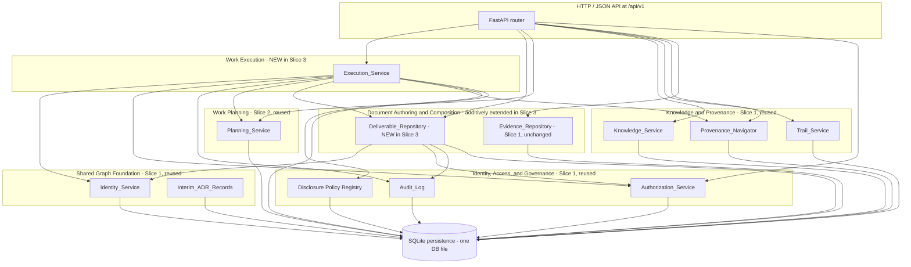

# Design Document

## Overview

This document specifies the design for the **third walking slice** of the Organizational Knowledge and Work System. It satisfies the requirements in [`requirements.md`](./requirements.md) and realizes *Release 1C — Planned Work to Deliverable* from [`07-user-story-map.md`](../../../documents/07-user-story-map.md) §4, constrained by:

- [`00-project-constitution.md`](../../../documents/00-project-constitution.md) §5.21 (Intent / Work / Output / Outcome are distinct), §5.22 (Organizational Learning Is a Closed Loop), §5.23 (events vs. projections), §5.25 (access is explicit and auditable), §5.26 (sensitive information governed), §5.6 (durable states are historical), §5.7 (no acknowledged work is silently lost), §5.9 (provenance preserved end to end), §5.29 (empirical learning constrains expansion).
- [`02-domain-model.md`](../../../documents/02-domain-model.md) §3 (Resource invariants), §4 (Resource Revision invariants), §7.1 (Document contract), §7.2 (Artifact contract), §8 (Immutable Record model), §8.2 (Execution Record), §8.4 (Audit Event), §8.5 (Governance Decision Immutable Record), §9.1 (Generated Output Role), §10.2 (Derived From), §10.5 (Relates To), §10.9 (Addresses), §10.10 (Produces), §19 (Provenance graph).
- [`03-context-map.md`](../../../documents/03-context-map.md) §2.2 (Document Authoring and Composition), §2.5 (Work Planning), §2.6 (Work Execution), §2.9 (Identity, Access, and Governance), §3 cross-context rules.
- The first walking slice (its design at [`../first-walking-slice/design.md`](../first-walking-slice/design.md) and its 13 architectural decisions AD-WS-1 through AD-WS-13) and the second walking slice (its design at [`../second-walking-slice/design.md`](../second-walking-slice/design.md) and its 9 additional architectural decisions AD-WS-14 through AD-WS-22).

### Design Goals

Slice 3 is deliberately small and additive over Slices 1 and 2. It must:

1. **Anchor every recorded completion to a prior Approved Plan Revision.** Every Work Assignment Record addresses a Plan Revision whose lifecycle state at the recorded time is `approved`. Every Completion Record traces through Milestone Acceptance, Deliverable Production, produced Deliverable Revision, Work Assignment, and back to the same Approved Plan Revision (Requirement 31).
2. **Enforce Plan/Execution separation from the execution side.** No row, column, endpoint, or response field of the Execution_Service or Deliverable_Repository carries a planning attribute beyond the explicit Identity references named in Requirements 23–29. Attempts to record planning facts on execution Records are rejected at the API boundary (Requirement 33).
3. **Enforce Output/Outcome separation.** Slice 3 records produced Deliverables, Milestone Acceptances, and Completion Records. Slice 3 SHALL NOT record any Observed Outcome, Measurement Definition, Measurement Record, Outcome Review, success-condition assessment, or attribution-evidence reference (Requirement 34).
4. **Keep four new authority types pairwise distinct.** `assign`, `contribute`, `accept_milestone`, and `complete` extend the cumulative enumeration `{view, modify, review, approve}` additively to eight values. No new authority substitutes for any other authority, in either direction (Requirement 32).
5. **Keep every recorded execution event immutable.** Once a Work Assignment, Work Event, Time Entry, Deliverable Production, Milestone Acceptance, or Completion Record is finalized, the row and its constituent fields and Relationships are byte-equivalent forever (Requirement 41 §4, Principle 5.6, [`02-domain-model.md`](../../../documents/02-domain-model.md) §8.5 invariant 4).
6. **Honor the indistinguishable-denial contract.** Every denial path on every new endpoint reuses the cumulative `slice-default-2026` policy, additively extended to cover the new Slice 3 node kinds (Requirements 30, 38).
7. **Be strictly additive over Slices 1 and 2.** Identity, Audit, Authorization, Evidence, Knowledge, Trail, Provenance, Disclosure, Planning, Interim-ADR, and Projection registries are reused; the only changes Slice 3 makes to prior-slice code are additive enumeration values, additive registry rows, and additive Disclosure-policy coverage (Requirement 40).
8. **Match the verification style of Slices 1 and 2.** Property-based tests with Hypothesis at ≥ 100 cases per property, deterministic seed capture, and one Interim ADR row per new gap (Requirements 41, 42).

### Constitutional Posture

| Constitutional concept | Slice 3 realization |
|---|---|
| Resource graph foundation (5.1) | Seven new Immutable-Record kinds plus produced Deliverable Resources/Revisions reuse the same `Identifier_Registry`, `Audit_Records`, `Disclosure_Policies`, `Disclosure_Policy_Coverage`, and `Interim_ADR_Records` Slices 1 and 2 own. |
| Bounded contexts preserve meaning (5.2) | One new `walking_slice.execution` module package subordinate to the Work Execution bounded context owns the six Execution_Service writes; one new `walking_slice.deliverables` module package subordinate to the Document Authoring and Composition bounded context owns produced Deliverable Resource/Revision persistence; cross-context calls into Planning, Identity, Audit, Authorization, Provenance, and Disclosure use those modules' public APIs unchanged. |
| Authority and derivation distinct (5.4) | Deliverable Production Records are Execution Records (per [`02-domain-model.md`](../../../documents/02-domain-model.md) §8.2). Milestone Acceptance Records and Completion Records are Governance Decision Immutable Records (per §8.5). Produced Deliverable Revisions are Document or Artifact Revisions playing the Generated Output role (per §9.1). |
| Durable identity (5.5, ADR-HT-001) | Every new identity is a UUIDv7 minted by the existing `IdentityService`; no business meaning embedded. The produced Deliverable Resource Identity set is disjoint from the Slice 1 Source Evidence Document Resource Identity set (Requirement 26.3, Requirement 41 §13). |
| Durable history (5.6, 5.7) | `Work_Assignment_Records`, `Work_Event_Records`, `Time_Entry_Records`, `Deliverable_Resources`, `Deliverable_Revisions`, `Deliverable_Production_Records`, `Milestone_Acceptance_Records`, and `Completion_Records` are insert-only with append-only triggers per AD-WS-4. |
| Authority is explicit and auditable (5.25) | Four new authority values `assign`, `contribute`, `accept_milestone`, `complete` are added to the existing `{view, modify, review, approve}` enumeration; non-substitution rule extends to eight authority types (Requirement 32). |
| Intent, Work, Output, Outcome are distinct (5.21) | Schema-level CHECK constraints reject prohibited planning attributes on execution rows and prohibited observed-outcome attributes on every execution row and produced Deliverable Revision (Requirements 33, 34). |
| Operational events vs. current projections (5.23) | One `ProjectionEnvelope`-wrapped execution-status Projection is derived from source Records and labelled with a derivation indicator (Requirement 39). |
| Sensitive information governed (5.26) | Backlink and provenance responses for new node kinds construct outputs from the authorized projection, producing indistinguishable observability with Slices 1 and 2 (Requirements 30, 38). |
| Empirical learning constrains expansion (5.29) | Slice 3 introduces only the seven Record kinds, one produced Deliverable kind, and four roles required for Release 1C; blockage observations, deliverable reviews, reassignment, supersession, and outcome measurement are deferred. |

### Writing Order

The Architecture section maps Slice 3's modules onto the existing process. Components and Interfaces details each new sub-component and its public HTTP surface. Data Models defines the new tables, append-only triggers, and value objects. Correctness Properties states the universally quantified invariants the implementation must preserve (written after running the `prework` tool over every acceptance criterion). Error Handling and Testing Strategy close the document.

---

## Architecture

### High-Level Shape

Slice 3 extends the cumulative modular monolith. There is **one process**, **one SQLite database file**, **one FastAPI router**, and **one HTTP endpoint surface** to which Slice 3 adds new routes. Two new module boundaries are introduced: `walking_slice.execution/` (the Execution_Service) under the Work Execution bounded context, and `walking_slice.deliverables/` (the Deliverable_Repository) under the Document Authoring and Composition bounded context. These are the only new bounded-context modules Slice 3 introduces.



The Execution_Service and Deliverable_Repository are **two Python module packages** rather than independent services or processes. The single-process, single-database layout matches Slices 1 and 2's granularity (one module package per bounded context) and keeps the audit-and-write atomic-transaction contract simple. The Deliverable_Repository is a *sibling* of the Slice 1 Evidence_Repository under the same bounded context but is held in a separate package because its Resource Identity set is disjoint from the Slice 1 Source Evidence Document Resource Identity set (Requirement 26.3 / Requirement 41 §13).

### Architectural Decisions

Slice 3 introduces the following decisions, numbered AD-WS-23 through AD-WS-31 (continuing the cumulative numbering started in Slice 1 and extended in Slice 2). Each is traced to the constitutional principle, the requirement that motivates it, and (where applicable) the prior-slice decision it extends or refines.

> Note: The Slice 2 design previously referred to the Slice 1 disclosure-coverage-by-lookup behavior using the local label "AD-WS-23". To preserve a single global numbering scheme across slices, **Slice 3 adopts AD-WS-23 onward**; the lookup-behavior note in Slice 2 is renumbered to its proper additive position by reference. Slice 3 does not modify any AD-WS-1..AD-WS-22 text or behavior.

#### AD-WS-23 — Execution_Service as a single new module package; Deliverable_Repository as a sibling new module package

**Decision.** Implement Slice 3 as two new packages:

- `src/walking_slice/execution/` — one module per Record kind (`work_assignments.py`, `work_events.py`, `time_entries.py`, `deliverable_productions.py`, `milestone_acceptances.py`, `completions.py`), plus shared `execution/_persistence.py` for new tables and triggers, `execution/_routes.py` for FastAPI routes, `execution/_projection.py` for the execution-status Projection, `execution/_disclosure.py` for additive `Disclosure_Policy_Coverage` rows, `execution/_interim_adr.py` for AD-WS-23..AD-WS-27 Interim ADR seeding, and `execution/models.py` for frozen Pydantic value objects.
- `src/walking_slice/deliverables/` — one module `deliverables/repository.py` for `DeliverableRepositoryService`, plus shared `deliverables/_persistence.py` for new tables, `deliverables/_routes.py` for FastAPI routes, and `deliverables/models.py` for frozen Pydantic value objects.

Both packages depend on the existing `walking_slice.identity`, `walking_slice.audit`, `walking_slice.authorization`, `walking_slice.knowledge`, `walking_slice.provenance`, `walking_slice.disclosure`, `walking_slice.interim_adr`, `walking_slice.persistence`, `walking_slice.planning`, and `walking_slice.projection` modules through their public APIs only.

**Rationale.** Requirement 40 (Reuse and Non-Modification of Slice 1 and Slice 2 Contexts) and Principle 5.2 (Bounded contexts preserve meaning). The Execution_Service package boundary aligns with the Work Execution bounded context per [`03-context-map.md`](../../../documents/03-context-map.md) §2.6. The Deliverable_Repository package boundary aligns with the Document Authoring and Composition bounded context per [`03-context-map.md`](../../../documents/03-context-map.md) §2.2 and is held *separate* from the existing `evidence.py` module so the disjointness invariant (Requirement 26.3) is statically obvious and so produced Deliverables can never be confused with Source Evidence at the module level.

**Replaceability.** A future split into independent Execution_Service and Deliverable_Repository processes requires only relocating file groups; no schema or HTTP route changes.

#### AD-WS-24 — Additive `assign`, `contribute`, `accept_milestone`, `complete` authority values (closes Gap G-11)

**Decision.** Extend the canonical authority enumeration that the Authorization_Service validates from `{view, modify, review, approve}` to `{view, modify, review, approve, assign, contribute, accept_milestone, complete}`. The change is implemented as a single additive update to the Slice 1 constant `_VALID_AUTHORITIES` in `src/walking_slice/authorization.py`; the change appends four literal values, does not remove or rename any existing value, and does not alter the non-substitution rule (`evaluate` continues to require the exact authority named by the action's `_required_authority` mapping).

The `_required_authority` mapping is extended additively with:

- `create.work_assignment` → `assign` (Requirement 23, Requirement 32.6)
- `create.work_event` → `contribute` (Requirement 24, Requirement 32.7)
- `create.time_entry` → `contribute` (Requirement 25, Requirement 32.7)
- `create.produced_deliverable` → `contribute` (Requirement 26, Requirement 32.7)
- `create.deliverable_production` → `contribute` (Requirement 27, Requirement 32.7)
- `create.milestone_acceptance` → `accept_milestone` (Requirement 28, Requirement 32.8)
- `create.completion` → `complete` (Requirement 29, Requirement 32.9)

An additional assignee-binding check (Requirements 24.5, 25.4, 26.6, 27.5) is enforced by the Execution_Service in the same transaction as the `evaluate(...)` call: even when the requesting Party holds `contribute` authority, the write is denied unless the Party is also the named assignee on the referenced Work Assignment Record. The check runs against the persisted Work Assignment row, not against the request body, so it cannot be forged.

An Interim ADR row is inserted into `Interim_ADR_Records` with `backlog_adr_id = 'ADR-HT-013'` carrying the chosen additive values, the recorded date, and the motivating Requirement 32 acceptance criteria.

**Rationale.** Requirement 32 (Distinct Assignment, Contributor, Milestone Acceptance, and Completion Authority Types) and Gap G-11. Four new values rather than overloading `assign` and `approve` preserve the Slice 1 Requirement 12.4 / Slice 2 Requirement 11.6 non-substitution invariant (Slice 1 Property 2, Slice 2 Property 17) and extend it to the cumulative eight-type enumeration.

**Compatibility.** Existing Slice 1 + Slice 2 audit rows carry the same four-value set and remain valid; new audit rows may carry any of the eight values and remain valid.

#### AD-WS-25 — Additive Disclosure-policy extension via new coverage rows (closes Gap G-12)

**Decision.** Extend the `slice-default-2026` Disclosure policy to cover the new Slice 3 node kinds by inserting a new `Disclosure_Policy_Coverage` row for each new kind. The existing `Disclosure_Policies` row is not mutated; the existing `Disclosure_Policy_Coverage` table introduced by Slice 2 AD-WS-16 is reused. The new rows cover `work_assignment_record`, `work_event_record`, `time_entry_record`, `deliverable_resource`, `deliverable_revision`, `deliverable_production_record`, `milestone_acceptance_record`, and `completion_record`. The Provenance_Navigator and the Execution_Service look up coverage through the existing `walking_slice.disclosure.policy_for(node_kind)` function, which already consults `Disclosure_Policy_Coverage`.

**Rationale.** Requirement 38 (Additive Extension of the Completeness Disclosure Policy) and Gap G-12. Coverage rows give an additive surface that does not alter the policy identity, the Slice 1 + Slice 2 rule set, or any prior behavior. An Interim ADR row carries `backlog_adr_id = 'ADR-HT-014'`.

**Replaceability.** When a future ADR formalizes a versioned policy schema, the coverage rows can be migrated into the future representation without altering the policy identity `slice-default-2026`.

#### AD-WS-26 — Canonical Relationship Types and semantic-role markers for Slice 3 (closes Gap G-13)

**Decision.** The slice's Relationships from execution Records use the following canonical Relationship Types and semantic-role markers, all permitted by [`02-domain-model.md`](../../../documents/02-domain-model.md) §§10.5, 10.9, 10.10:

| Source | Type | Target | `semantic_role` |
|---|---|---|---|
| Work Assignment Record | `Addresses` | Approved Plan Revision (Slice 2) | `NULL` |
| Work Assignment Record | `Relates To` | assignee Party | `assignee` |
| Work Event Record | `Relates To` | Work Assignment Record | `work_event` |
| Time Entry Record | `Relates To` | Work Assignment Record | `time_entry` |
| Deliverable Production Record | `Produces` | produced Deliverable Revision | `NULL` |
| Deliverable Production Record | `Addresses` | target Deliverable Expectation Revision (Slice 2) | `NULL` |
| Deliverable Production Record | `Relates To` | source Work Assignment Record | `production_source` |
| Milestone Acceptance Record | `Addresses` | produced Deliverable Revision | `NULL` |
| Completion Record | `Addresses` | target Approved Plan Revision (Slice 2) | `NULL` |

The new `semantic_role` markers are written into the existing `Relationships.semantic_role` column added additively by Slice 2 AD-WS-19. No new column or table is required for relationship semantics.

**Rationale.** Requirements 23, 24, 25, 26, 27, 28, 29, Gap G-13. The `Addresses` pattern is the precise type for "intent to act on" or "intent to satisfy" (matching Slice 1 Decisions → Recommendations and Slice 2 Plan Approvals → Plan Revisions). The `Produces` pattern is the precise type for "Execution Record created this output" per [`02-domain-model.md`](../../../documents/02-domain-model.md) §10.10. The `Relates To` + semantic-role pattern carries the assignee, work-event, time-entry, and production-source associations that do not match a more precise type.

An Interim ADR row carries `backlog_adr_id = 'ADR-HT-015'` documenting the chosen markers and the motivating Requirements.

#### AD-WS-27 — Slice 3 Records are append-only with no supersession path (closes Gap G-14)

**Decision.** Every Slice 3 Record (`Work_Assignment_Records`, `Work_Event_Records`, `Time_Entry_Records`, `Deliverable_Production_Records`, `Milestone_Acceptance_Records`, `Completion_Records`) and every produced Deliverable Resource / Revision (`Deliverable_Resources`, `Deliverable_Revisions`) is insert-only. UPDATE and DELETE triggers reject every mutation, matching the Slice 1 AD-WS-4 pattern and the Slice 2 AD-WS-19 pattern. A Slice 3 lifecycle-supersession path comparable to Slice 2's `Plan_Revisions.lifecycle_state` transition is **not** implemented in this slice; if a Record needs correction, a later slice will introduce a governed supersession path consistent with Principle 5.6.

**Rationale.** Requirements 23.9, 24.7, 25.6, 26.4, 27.7, 28.7, 29.7, 41 §4 (Execution-Record immutability), Gap G-14. The append-only stance keeps Slice 3's verification surface aligned with Slices 1 and 2 (Property 12 — Append-only immutability — extends to Slice 3 rows). An Interim ADR row carries `backlog_adr_id = 'ADR-HT-016'`.

#### AD-WS-28 — Per-Record-kind tables with append-only triggers; one schema addition on `Identifier_Registry` (closes Gap G-15)

**Decision.** The new schema adds the following SQLite tables, all insert-only, all with `UPDATE` and `DELETE` triggers that reject mutation:

- `Work_Assignment_Records`
- `Work_Event_Records`
- `Time_Entry_Records`
- `Deliverable_Resources`, `Deliverable_Revisions` (in the Deliverable_Repository)
- `Deliverable_Production_Records`
- `Milestone_Acceptance_Records`
- `Completion_Records`

No new column is added to any Slice 1 or Slice 2 table beyond the additive `Identifier_Registry.resource_kind` values already permitted by Slice 2 AD-WS-19. Slice 3 emits new `resource_kind` values `{work_assignment_record, work_event_record, time_entry_record, deliverable_resource, deliverable_revision, deliverable_production_record, milestone_acceptance_record, completion_record}` on the existing column; the underlying schema does not change.

**Rationale.** Requirement 22.8 (eight new disjoint identifier roles), Requirement 26.3 (produced Deliverable Resource identifier set disjoint from Source Evidence), Requirement 41 §4 (execution-Record immutability), Gap G-15. Per-Record-kind tables match Slices 1 and 2's pattern for Documents, Findings, Recommendations, Trails, Objectives, Projects, Plan Revisions, etc.

An Interim ADR row carries `backlog_adr_id = 'ADR-HT-017'` documenting the chosen persistence representation.

#### AD-WS-29 — Two-stage authority evaluation for Contributor writes

**Decision.** Every Execution_Service write that requires `contribute` authority (Work Event, Time Entry, produced Deliverable, Deliverable Production) follows a two-stage evaluation inside one transaction:

1. Call `Authorization_Service.evaluate(party, "<action>", target=work_assignment_record, at=now())` and require a `permit` result whose granted authority includes `contribute`.
2. Read the persisted `Work_Assignment_Records` row by the referenced Work Assignment Identity and require that the row's `assignee_party_id` equals the requesting Party Identity.

Both stages must pass; a failure of either stage produces an AD-WS-9-conformant denial response. The assignee-binding check is enforced on every Contributor write so a Party with `contribute` authority on a scope cannot record events against another Party's Work Assignment.

The Work Assignment lookup runs against the persisted row, not the request body, so the bound is forge-proof; the lookup is a single indexed `SELECT` on the primary key.

**Rationale.** Requirements 24.5, 25.4, 26.6, 27.5, 32.7. The two-stage check makes Contributor authority strictly the conjunction of (authority grant) AND (named assignee), which is the literal text of Requirement 32.7.

#### AD-WS-30 — Approved-Plan resolution uses the existing Planning_Service read API

**Decision.** When creating a Work Assignment Record, the Execution_Service resolves the target Plan Revision by querying `Plan_Revisions` through a Planning_Service read function `PlanRevisionService.get_plan_revision(plan_revision_id)` exposed additively on the existing `walking_slice.planning.plan_revisions` module. The function performs a single indexed `SELECT plan_revision_id, lifecycle_state, activity_plan_id, applicable_scope FROM Plan_Revisions WHERE plan_revision_id = :id`. Requirement 23.2 (lifecycle state must be `approved` at the recorded time) is enforced by inspecting the `lifecycle_state` column on the returned row.

When creating a Deliverable Production Record, the Execution_Service resolves the target Deliverable Expectation Revision through an additive `DeliverableExpectationService.get_revision(...)` read function and verifies Requirement 27.3 (the Deliverable Expectation must belong to the same Project as the source Work Assignment's Approved Plan Revision) by following the Planning_Service `Addresses` Relationship from Activity Plan to Project.

**Rationale.** Principle 5.2 (Bounded contexts preserve meaning) and [`03-context-map.md`](../../../documents/03-context-map.md) Cross-Context Rule 2 ("A context does not mutate another context's authoritative record"). Reading through Planning_Service public APIs keeps the Execution_Service decoupled from Slice 2's schema. Slice 2 already exposes `PlanApprovalService` reads through the HTTP surface; Slice 3 reuses the same pattern.

#### AD-WS-31 — Authority basis enumeration is reused unchanged

**Decision.** The `authority_basis.type` value persisted on Work Assignment Records, Milestone Acceptance Records, Completion Records, and on the Slice 3 authorization-evaluation audit rows is drawn from the existing Slice 1 enumeration `{role-grant-id, scope-id, delegation-chain-id}` (AD-WS-10). Slice 3 does not extend the enumeration.

**Rationale.** Requirements 23.3, 28.2, 29.2 explicitly defer to AD-WS-10. Avoiding extension keeps Slice 1 Property 2 (Decision authority), Slice 2 Property 17 (Planning-Resource authority correctness), and Slice 3 Property 2 (Execution-Record authority) all keyed on the same enumeration.

### Cross-Cutting Concerns

**Transactionality.** Every Execution_Service and Deliverable_Repository consequential write opens one SQL transaction that inserts every artifact of the action: the Record or Resource/Revision rows, every Relationship row (`Addresses`, `Produces`, `Relates To`), and the consequential `Audit_Records` row. The audit append participates in the same transaction (AD-WS-5). If any insert fails — domain row, Relationship row, or audit row — the entire transaction rolls back (Requirements 23.8/9, 24.6/7, 25.5/6/7, 26.7/8, 27.6/7, 28.6/7, 29.6, 37.6).

**Time.** Recorded timestamps are UTC ISO-8601 millisecond precision via the existing `Clock` protocol from `walking_slice.clock`. Audit-row recorded times match domain-row recorded times within the same transaction (matching Slices 1 and 2).

**Identifiers.** Every new identity is a UUIDv7 minted by the existing `IdentityService` and registered in `Identifier_Registry` with `kind ∈ {'immutable_record', 'resource', 'revision'}` and `resource_kind` set to one of the eight Slice 3 values listed under AD-WS-28. The `UNIQUE(identifier)` index already enforces global non-reuse; the `resource_kind` tag provides the disjointness assertion checked by Requirements 22.8 and 26.3.

**Authorization.** The existing `Authorization_Service.evaluate(connection, party_id, action, target, at)` is called for every Slice 3 consequential write. Action strings follow the Slice 1 form `<prefix>.<resource_kind>`; see AD-WS-24 for the full mapping. The deny path uses the separate-transaction Denial-Record pattern from Slice 1 `KnowledgeService.create_decision` and Slice 2 `PlanApprovalService.create_plan_approval`. The assignee-binding check (AD-WS-29) runs inside the caller's transaction after the `evaluate(...)` call returns `permit`; if assignee binding fails, the caller's transaction is rolled back and a Denial Record is appended in a separate transaction with `reason_code = 'no-role-assignment'` (the cumulative enumeration in Slice 1 Requirement 7.2 is not extended; the missing-assignee case is treated as "no effective Contributor role on this specific Work Assignment").

**Atomicity for Audit (Requirement 37, Property 14).** Every consequential Slice 3 write atomically appends one `Audit_Records` row in the same transaction. Denied attempts append exactly one Denial Record in a separate transaction (matching the Slice 1 + Slice 2 pattern) with the same `correlation_id` as the originating attempt so an auditor can correlate denial and the rolled-back attempt.

**Privacy and inference leakage.** Every response from a Slice 3 endpoint is materialized through the existing `walking_slice.provenance._shape_response_constant_time(...)` helper, ensuring restricted-vs-nonexistent observability remains constant (Requirements 30.7, 38.4, Property 8). The Slice 3 `execution._disclosure.seed_execution_coverage()` step adds eight new `Disclosure_Policy_Coverage` rows so the helper's `policy_for(node_kind)` lookup returns the `slice-default-2026` rule set for every Slice 3 node kind.

**Planning resource non-mutation (Requirement 33.1, Requirement 40, Property 5, Property 11).** No Slice 3 code path issues an INSERT, UPDATE, or DELETE against any Slice 1 or Slice 2 table. The append-only triggers on every prior-slice table already reject mutations at the database level; the Slice 3 code reinforces the rule by reading through Planning_Service public APIs (AD-WS-30) instead of querying prior-slice tables directly. Property 11 verifies this invariant by snapshotting every prior-slice table at test setup and comparing after every Slice 3 sequence.

---

## Components and Interfaces

The Execution_Service and Deliverable_Repository each expose one FastAPI router segment under `/api/v1` and a set of module-level service classes. Each Record kind has its own module and its own service class; the packages share a single `_persistence.py` for schema definitions and a single `_routes.py` for HTTP wiring.

### Execution_Service.WorkAssignments

**Responsibility.** Persist Work Assignment Records and the `Addresses` and `Relates To` Relationships from each Work Assignment Record to its target Approved Plan Revision and to its assignee Party. Validate that the target Plan Revision's lifecycle state at the recorded time is `approved`.

**Public surface.**

```python
@dataclass(frozen=True)
class WorkAssignmentService:
    clock: Clock
    identity_service: IdentityService
    audit_log: AuditLog
    authorization_service: AuthorizationService
    planning_reader: PlanRevisionService  # for get_plan_revision() reads only (AD-WS-30)
    party_reader: PartyReader              # for assignee resolution

    def create_work_assignment(
        self,
        connection: Connection,
        *,
        target_plan_revision_id: str,
        assignee_party_id: str,
        assignment_rationale: Optional[str],   # 0..4000 chars
        assignment_authority_party_id: str,
        authority_basis: AuthorityBasisRef,    # type ∈ AD-WS-10 set
        applicable_scope: str,
        engine: Engine,
        correlation_id: Optional[str] = None,
    ) -> CreateWorkAssignmentResult: ...
```

**HTTP surface.**

| Method | Path | Purpose |
|---|---|---|
| `POST` | `/api/v1/work-assignments` | Create a Work Assignment Record (Assignment Authority). |
| `GET` | `/api/v1/work-assignments/{work_assignment_id}` | Read a Work Assignment Record (view authority). |

**Authority.** `create.work_assignment` → `assign`. The deny path is identical to the Slice 1 + Slice 2 deny path (separate-transaction Denial Record with 3-attempt retry per Requirement 7.6 / Slice 2 Requirement 10.7).

**Validation order.**
1. Pydantic input validation (request shape; Slice 2's `_reject_prohibited_attributes` helper extended to also reject planning-attribute prefixes per Requirement 33).
2. Self-assignment rejection: `assignment_authority_party_id != assignee_party_id` (Requirement 23.5).
3. Plan Revision resolution via `planning_reader.get_plan_revision(...)`; reject if not found, `lifecycle_state != 'approved'`, or scope is outside the requesting Party's applicable Assignment Authority scope (Requirement 23.4).
4. Assignee resolution via `party_reader.resolve(assignee_party_id)`; reject if unresolvable or inactive (Requirement 23.5).
5. Authorization evaluation: `Authorization_Service.evaluate(party=assignment_authority_party_id, action="create.work_assignment", target=plan_revision_ref, at=now())`; on deny, separate-transaction Denial Record pattern (AD-WS-9).
6. On permit, open the caller's transaction, insert `Work_Assignment_Records`, the `Addresses` Relationship row (with `semantic_role IS NULL`), the `Relates To` Relationship row (with `semantic_role = 'assignee'`), and the consequential `Audit_Records` row.

**Satisfies.** Requirements 23, 32 (assign authority), 37 (audit), 42 (interim ADR).

### Execution_Service.WorkEvents

**Responsibility.** Persist Work Event Records keyed to a Work Assignment Record. Enforce the per-Work-Assignment event-kind state machine: at most one `started` event per Work Assignment; no `progress_note`, `paused`, `resumed`, or `deliverable_drafted` before `started`; no `resumed` without a prior `paused`.

**Public surface.**

```python
@dataclass(frozen=True)
class WorkEventService:
    clock: Clock
    identity_service: IdentityService
    audit_log: AuditLog
    authorization_service: AuthorizationService

    def create_work_event(
        self,
        connection: Connection,
        *,
        target_work_assignment_id: str,
        event_kind: Literal["started", "progress_note", "paused", "resumed", "deliverable_drafted"],
        event_note: Optional[str],             # 0..4000 chars
        recording_party_id: str,
        authority_basis: AuthorityBasisRef,
        applicable_scope: str,
        engine: Engine,
        correlation_id: Optional[str] = None,
    ) -> CreateWorkEventResult: ...
```

**HTTP surface.**

| Method | Path | Purpose |
|---|---|---|
| `POST` | `/api/v1/work-events` | Create a Work Event Record (assigned Contributor). |
| `GET` | `/api/v1/work-events/{work_event_id}` | Read a Work Event Record. |

**Authority.** `create.work_event` → `contribute` AND assignee binding (AD-WS-29).

**Event-kind state machine (Requirement 24.3).** The Execution_Service validates the prior event set for the target Work Assignment Record before the INSERT:

- `started`: rejected if any prior `Work_Event_Records` row with `event_kind = 'started'` exists for the same `target_work_assignment_id`.
- `progress_note` / `paused` / `deliverable_drafted`: rejected if no prior `Work_Event_Records` row with `event_kind = 'started'` exists for the same Work Assignment.
- `resumed`: rejected if no prior `started` event exists OR if the most recent prior event in `{paused, resumed}` is not `paused` (i.e. resume requires a pause that has not been resumed). The most-recent rule reads the indexed `(target_work_assignment_id, recorded_at DESC)` index added by AD-WS-28.

The check is implemented as a single covering query plus deterministic state-machine logic; it runs inside the caller's transaction so concurrent attempts at the same transition fail one of them via the SQLite write lock.

**Satisfies.** Requirements 24, 32 (contribute authority), 37.

### Execution_Service.TimeEntries

**Responsibility.** Persist Time Entry Records keyed to a Work Assignment Record. Validate that the reported effort quantity is a non-negative decimal with at most two fractional digits, at most 24.00 hours, and that effort-period times satisfy `start ≤ end ≤ recorded_at`.

**Public surface.**

```python
@dataclass(frozen=True)
class TimeEntryService:
    clock: Clock
    identity_service: IdentityService
    audit_log: AuditLog
    authorization_service: AuthorizationService

    def create_time_entry(
        self,
        connection: Connection,
        *,
        target_work_assignment_id: str,
        effort_hours: Decimal,                 # 0.00..24.00, max two fractional digits
        effort_period_start: datetime,         # UTC ms; start <= end
        effort_period_end: datetime,           # UTC ms; end <= recorded_at
        recording_party_id: str,
        authority_basis: AuthorityBasisRef,
        applicable_scope: str,
        engine: Engine,
        correlation_id: Optional[str] = None,
    ) -> CreateTimeEntryResult: ...
```

**HTTP surface.**

| Method | Path | Purpose |
|---|---|---|
| `POST` | `/api/v1/time-entries` | Create a Time Entry Record (assigned Contributor). |
| `GET` | `/api/v1/time-entries/{time_entry_id}` | Read a Time Entry Record. |

**Authority.** `create.time_entry` → `contribute` AND assignee binding (AD-WS-29).

**Effort-quantity validation (Requirement 25.2).** Reported effort is persisted as a TEXT column matching a CHECK constraint that enforces the ISO-decimal regex `^(0|[1-9][0-9]?)(\.[0-9]{1,2})?$` AND a numeric range check. The Decimal value is normalized to two-decimal-place form before persistence.

**Satisfies.** Requirements 25, 32 (contribute authority), 37.

### Execution_Service.DeliverableProductions

**Responsibility.** Persist Deliverable Production Records. Validate that the source Work Assignment and the target Deliverable Expectation belong to the same Project. Record one `Produces` Relationship to the produced Deliverable Revision, one `Addresses` Relationship to the target Deliverable Expectation Revision, and one `Relates To` Relationship with `semantic_role = 'production_source'` to the source Work Assignment Record.

**Public surface.**

```python
@dataclass(frozen=True)
class DeliverableProductionService:
    clock: Clock
    identity_service: IdentityService
    audit_log: AuditLog
    authorization_service: AuthorizationService
    deliverable_reader: DeliverableRepositoryService  # for produced Deliverable resolution
    planning_reader: DeliverableExpectationService    # for target Deliverable Expectation resolution
    project_resolver: ProjectResolver                  # walks Plan Revision -> Activity Plan -> Project

    def create_deliverable_production(
        self,
        connection: Connection,
        *,
        source_work_assignment_id: str,
        produced_deliverable_revision_id: str,
        target_deliverable_expectation_revision_id: str,
        production_rationale: Optional[str],   # 0..4000 chars
        recording_party_id: str,
        authority_basis: AuthorityBasisRef,
        applicable_scope: str,
        engine: Engine,
        correlation_id: Optional[str] = None,
    ) -> CreateDeliverableProductionResult: ...
```

**HTTP surface.**

| Method | Path | Purpose |
|---|---|---|
| `POST` | `/api/v1/deliverable-productions` | Create a Deliverable Production Record (assigned Contributor). |
| `GET` | `/api/v1/deliverable-productions/{deliverable_production_id}` | Read a Deliverable Production Record. |

**Authority.** `create.deliverable_production` → `contribute` AND assignee binding on the source Work Assignment (AD-WS-29).

**Project-membership check (Requirement 27.3).** Before INSERT, the service computes:

- `wa_plan_revision_id = work_assignment.target_plan_revision_id`
- `wa_project_id = project_resolver.resolve_project(wa_plan_revision_id)`  (joins Plan Revision → Activity Plan → Project)
- `de_project_id = deliverable_expectation_revision.target_project_id`

and requires `wa_project_id == de_project_id`. A mismatch rejects the request with no row persisted (Requirement 27.4).

**Originating-binding check (Requirement 27.4).** The service additionally requires that the produced Deliverable Revision's `originating_work_assignment_id` (recorded by the Deliverable_Repository on Revision creation per Requirement 26.2) equals the supplied `source_work_assignment_id`. This rejects attempts to "claim" a peer's produced Deliverable Revision as one's own production.

**Satisfies.** Requirements 27, 32 (contribute authority), 37.

### Execution_Service.MilestoneAcceptances

**Responsibility.** Persist Milestone Acceptance Records keyed to a Deliverable Production Record. Resolve the produced Deliverable Revision and target Deliverable Expectation Revision from the source Deliverable Production Record's `Produces` and `Addresses` Relationships. Enforce uniqueness at most one Milestone Acceptance per Deliverable Production Record.

**Public surface.**

```python
@dataclass(frozen=True)
class MilestoneAcceptanceService:
    clock: Clock
    identity_service: IdentityService
    audit_log: AuditLog
    authorization_service: AuthorizationService
    production_reader: DeliverableProductionService

    def create_milestone_acceptance(
        self,
        connection: Connection,
        *,
        source_deliverable_production_id: str,
        outcome: Literal["Accept", "Reject"],
        rationale: str,                        # 1..4000 chars
        accepting_party_id: str,
        authority_basis: AuthorityBasisRef,
        applicable_scope: str,
        engine: Engine,
        correlation_id: Optional[str] = None,
    ) -> CreateMilestoneAcceptanceResult: ...
```

**HTTP surface.**

| Method | Path | Purpose |
|---|---|---|
| `POST` | `/api/v1/milestone-acceptances` | Create a Milestone Acceptance Record (Milestone Acceptance Authority). |
| `GET` | `/api/v1/milestone-acceptances/{milestone_acceptance_id}` | Read a Milestone Acceptance Record. |

**Authority.** `create.milestone_acceptance` → `accept_milestone`.

**Uniqueness.** The schema enforces `UNIQUE(source_deliverable_production_id)` on `Milestone_Acceptance_Records` (Requirement 28.3). An application-level pre-check returns a structured 409 (`milestone_acceptance_already_exists`) with the existing `milestone_acceptance_id` when the caller holds view authority on it; otherwise the response is indistinguishable from a non-existent endpoint (AD-WS-9).

**Satisfies.** Requirements 28, 32 (accept_milestone authority), 37.

### Execution_Service.Completions

**Responsibility.** Persist Completion Records keyed to an Approved Plan Revision. Require at least one Milestone Acceptance Record with outcome `Accept` for the same target Plan Revision Identity. Enforce uniqueness at most one Completion Record per target Approved Plan Revision.

**Public surface.**

```python
@dataclass(frozen=True)
class CompletionService:
    clock: Clock
    identity_service: IdentityService
    audit_log: AuditLog
    authorization_service: AuthorizationService
    planning_reader: PlanRevisionService
    project_resolver: ProjectResolver

    def create_completion(
        self,
        connection: Connection,
        *,
        target_plan_revision_id: str,
        outcome: Literal["Completed", "Completed_With_Reservation"],
        rationale: str,                        # 1..4000 chars
        source_milestone_acceptance_ids: Sequence[str],  # 0..N; each must resolve and be Accept
        completing_party_id: str,
        authority_basis: AuthorityBasisRef,
        applicable_scope: str,
        engine: Engine,
        correlation_id: Optional[str] = None,
    ) -> CreateCompletionResult: ...
```

**HTTP surface.**

| Method | Path | Purpose |
|---|---|---|
| `POST` | `/api/v1/completions` | Create a Completion Record (Completion Authority). |
| `GET` | `/api/v1/completions/{completion_id}` | Read a Completion Record. |

**Authority.** `create.completion` → `complete`.

**Accepted-Milestone existence check (Requirement 29.1, 29.4).** The Execution_Service runs a single covering query before INSERT:

```sql
SELECT COUNT(*) FROM Milestone_Acceptance_Records mar
  JOIN Deliverable_Production_Records dpr
    ON mar.source_deliverable_production_id = dpr.deliverable_production_id
  JOIN Work_Assignment_Records wa
    ON dpr.source_work_assignment_id = wa.work_assignment_id
  WHERE wa.target_plan_revision_id = :target_plan_revision_id
    AND mar.outcome = 'Accept'
```

The query result must be ≥ 1. If `source_milestone_acceptance_ids` is supplied, every supplied identifier must resolve to an `Accept`-outcome row in the result set; otherwise the request is rejected (Requirement 29.4).

**Uniqueness.** The schema enforces `UNIQUE(target_plan_revision_id)` on `Completion_Records` (Requirement 29.3). An application-level pre-check returns a structured 409 (`completion_already_exists`) with the existing `completion_id` when the caller holds view authority on it; otherwise indistinguishable from a non-existent endpoint.

**Non-mutation guard.** The service never issues UPDATE, INSERT, or DELETE against `Plan_Revisions`, `Activity_Plans`, `Projects`, `Objectives`, `Intended_Outcomes`, `Deliverable_Expectations`, `Plan_Approval_Records`, or any Slice 1 table; the existing append-only triggers reject any such attempt at the database level (Requirement 29.7, Requirement 40, Property 11).

**Satisfies.** Requirements 29, 32 (complete authority), 37.

### Deliverable_Repository

**Responsibility.** Persist produced Deliverable Resources and immutable Deliverable Revisions in their Generated Output role per [`02-domain-model.md`](../../../documents/02-domain-model.md) §9.1. Compute SHA-256 content digest at write time. Enforce that produced Deliverable Resource Identity is disjoint from Slice 1 Source Evidence Document Resource Identity (Requirement 26.3).

**Public surface.**

```python
@dataclass(frozen=True)
class DeliverableRepositoryService:
    clock: Clock
    identity_service: IdentityService
    audit_log: AuditLog
    authorization_service: AuthorizationService
    work_assignment_reader: WorkAssignmentService  # for originating-binding check

    def create_produced_deliverable(
        self,
        connection: Connection,
        *,
        content_bytes: bytes,                  # 1..100 MB
        content_type: Literal[
            "text/markdown", "text/plain",
            "application/pdf", "application/json",
            "image/png", "image/svg+xml",
            "application/octet-stream",
        ],
        produced_deliverable_name: str,        # 1..200 chars
        originating_work_assignment_id: str,
        authoring_party_id: str,
        engine: Engine,
        correlation_id: Optional[str] = None,
    ) -> CreateProducedDeliverableResult: ...

    def get_revision(
        self, connection: Connection, *, deliverable_revision_id: str
    ) -> DeliverableRevisionRow: ...

    def get_revision_text(
        self, connection: Connection, *, deliverable_revision_id: str
    ) -> bytes: ...
```

**HTTP surface.**

| Method | Path | Purpose |
|---|---|---|
| `POST` | `/api/v1/deliverables` | Create a produced Deliverable Resource and its first Revision (assigned Contributor). |
| `POST` | `/api/v1/deliverables/{deliverable_id}/revisions` | Append a new Revision to a produced Deliverable Resource. |
| `GET` | `/api/v1/deliverables/{deliverable_id}/revisions/{deliverable_revision_id}` | Read a produced Deliverable Revision (with content digest). |
| `GET` | `/api/v1/deliverables/{deliverable_id}/revisions/{deliverable_revision_id}/content` | Stream the produced Revision's content bytes. |

**Authority.** `create.produced_deliverable` → `contribute` AND assignee binding on the originating Work Assignment (AD-WS-29).

**Identity disjointness (Requirement 26.3, Property 13).** Every produced Deliverable Resource Identity is registered in `Identifier_Registry` with `resource_kind = 'deliverable_resource'` and `kind = 'resource'`. Slice 1 Source Evidence Document Resource Identities are registered with `resource_kind = 'source_document'` (an additive `resource_kind` value Slice 3 may also need to back-fill on the existing Slice 1 rows; see *Slice 1 resource_kind back-fill* below). The Identity_Service's existing `reject_if_duplicate(...)` enforces the unique-identifier global rule; the `resource_kind` column makes the disjointness invariant observable to property tests without requiring schema-level enforcement beyond the existing UNIQUE.

**Slice 1 `resource_kind` back-fill (additive only).** On startup, the Deliverable_Repository runs a one-shot back-fill that sets `Identifier_Registry.resource_kind = 'source_document'` for every Slice 1 `Source_Documents.resource_id` row whose `Identifier_Registry.resource_kind` is currently `NULL`. The back-fill is a pure UPDATE on the `resource_kind` column added additively by Slice 2 AD-WS-19; it does not alter `identifier`, `kind`, `content_digest`, or any other column. This is the only Slice 3 mutation against a Slice 1 row, and it is permitted by Requirement 40.2 because it populates an additive column with a value that was `NULL` for every existing row.

> **Note on additivity.** Requirement 40.4 prohibits mutating `Identifier_Registry` rows "apart from the additive enumeration extensions permitted by Slice 2 Requirement 11.1 and Requirement 32.1 of this slice". Populating an additive column from `NULL` to a defined enumeration value is the same shape of additive change Slice 2 already performed when seeding `resource_kind` for new Slice 2 rows. The back-fill is recorded as Interim ADR row `ADR-HT-017` and is idempotent (re-running the seeder leaves rows byte-equivalent).

**Content digest.** Every produced Deliverable Revision row carries `content_digest_sha256` computed at INSERT time over `content_bytes`. The digest matches the Slice 1 Evidence_Repository contract (Slice 1 Requirement 2.2) so the same digest verification logic Slice 1 uses for Region Occurrences applies to produced Deliverable Revisions returned by `Provenance_Navigator` (Requirement 35.8, Property 7).

**Generated Output role marker.** Every produced Deliverable Revision row carries `role_marker = 'generated_output'` (CHECK constraint) per [`02-domain-model.md`](../../../documents/02-domain-model.md) §9.1. Slice 1 Source Evidence Document Revisions do not carry this column; the marker is the second observable distinction between produced and source Documents (Requirement 26.2, Requirement 35.8).

**Satisfies.** Requirements 22 (identity), 26 (produced Deliverable), 32 (contribute authority), 37, 40 (additive only), 42 (interim ADR).

### Provenance_Navigator (extended)

**Responsibility (additive).** Add three new traversals to the existing `walking_slice.provenance` module without modifying any existing function:

1. **`navigate_completion(completion_id, party, at)`** — walks the Execution Provenance Chain: Completion Record → Plan Approval Immutable Record → Plan Revision → Activity Plan → Project → Objective → Slice 1 Decision → and then delegates to the existing `navigate_decision` for the Decision → Recommendation → Finding → Region → Document Revision tail. In parallel, walks Completion Record → Milestone Acceptance Record(s) → Deliverable Production Record(s) → produced Deliverable Revision(s), and Completion Record → Work Assignment Record → Work Event Record(s) → Time Entry Record(s). Returns a single tree whose root is the Completion Record and whose leaves are Document Revisions and produced Deliverable Revisions. Applies the `slice-default-2026` policy (extended by AD-WS-25) for restricted-vs-nonexistent observability.
2. **`navigate_deliverable_production(deliverable_production_id, party, at)`** — short-form traversal beginning at a Deliverable Production Record. Returns the same chain but rooted lower; useful when an auditor asks "what plan authorized this production?".
3. **`navigate_produced_deliverable_revision(deliverable_revision_id, party, at)`** — short-form traversal beginning at a produced Deliverable Revision. Returns the chain rooted at the produced Revision, including the produced Revision's `content_digest_sha256` and `role_marker = 'generated_output'`.

All three are additive functions; the existing `navigate_decision` and Slice 2 `navigate_plan_approval` functions are reused unchanged. The backlink algorithm `list_backlinks(node_kind, node_id, party)` is extended to recognize the eight new Slice 3 node kinds by appending to the existing `_authorized_source_kinds` set; no change to the algorithm itself.

**Public surface.**

```python
# Additive functions in walking_slice.provenance
def navigate_completion(
    connection: Connection,
    *,
    completion_id: str,
    party_id: str,
    at: datetime,
) -> ExecutionProvenanceTree: ...

def navigate_deliverable_production(
    connection: Connection,
    *,
    deliverable_production_id: str,
    party_id: str,
    at: datetime,
) -> ExecutionProvenanceTree: ...

def navigate_produced_deliverable_revision(
    connection: Connection,
    *,
    deliverable_revision_id: str,
    party_id: str,
    at: datetime,
) -> ExecutionProvenanceTree: ...
```

**HTTP surface (additive).**

| Method | Path | Purpose |
|---|---|---|
| `GET` | `/api/v1/completions/{completion_id}/provenance` | Walk the Execution Provenance Chain rooted at a Completion Record. |
| `GET` | `/api/v1/deliverable-productions/{deliverable_production_id}/provenance` | Walk the chain rooted at a Deliverable Production Record. |
| `GET` | `/api/v1/deliverables/{deliverable_id}/revisions/{revision_id}/provenance` | Walk the chain rooted at a produced Deliverable Revision. |
| `GET` | `/api/v1/backlinks/{node_kind}/{node_id}` | Reuse existing backlink endpoint; extended to recognize Slice 3 node kinds via additive `_authorized_source_kinds`. |

**Idempotence (Requirement 41 §7, Property 7).** Each `navigate_*` function is a read-only operation over the persisted graph; repeated invocations for the same `(node_id, party_id, at)` return byte-equivalent trees because the underlying tables are append-only and the disclosure-policy evaluation is a pure function of the authorized projection.

**Satisfies.** Requirements 31, 35, 36 (backlinks), 38 (disclosure-policy enforcement).

### Execution-status Projection (single explainable Projection)

**Responsibility.** Compute one explainable Projection of current execution status for a given Plan Revision Identity, derived from source Slice 3 Records. The Projection is the only derived view Slice 3 surfaces; per Requirement 39.3 it does **not** include percent-complete, actual-cost, remaining-work, budget-variance, forecast-cost, or outcome-attainment values.

**Projection Definition.** Given a Plan Revision Identity `P`:

1. Look up the Plan Revision via the Planning_Service read API; require `lifecycle_state = 'approved'`.
2. Find Work Assignment Records targeting `P`. If zero, return `Plan Revision approved` (no execution yet).
3. For each Work Assignment, find its most-recent Work Event Record (by `(target_work_assignment_id, recorded_at DESC)`). Bucket by `event_kind`.
4. Find Deliverable Production Records sourced from any Work Assignment targeting `P`. Mark `Plan Revision deliverable produced` when ≥ 1 exists.
5. Find Milestone Acceptance Records whose source Deliverable Production is in the set from step 4 and outcome is `Accept`. Mark `Plan Revision milestone accepted` when ≥ 1 exists.
6. Find the Completion Record (if any) targeting `P`. Mark `Plan Revision completion recorded` when present.
7. Compute the projected status as the most-progressed label observed; fall back to `Plan Revision in execution` when at least one Work Event exists but no Deliverable Production yet; `Plan Revision execution paused` when the most-recent event on every Work Assignment is `paused`.

The Projection is wrapped in the existing `walking_slice.projection.ProjectionEnvelope` carrying the Projection Definition, source Record Identities, source Revision Identities, applicable temporal boundary (ISO-8601 second precision), generated time (ISO-8601 second precision), and derivation indicator. On unresolvable Projection Definition or missing source Record, the projected status is withheld and the explanation-unavailable indicator identifies the missing element (Requirement 39.5, matching the Slice 1 `walking_slice.projection` pattern).

**Public surface.**

```python
# walking_slice.execution._projection
@dataclass(frozen=True)
class ExecutionStatusProjection:
    plan_revision_id: str
    projected_status: Literal[
        "Plan Revision approved",
        "Plan Revision in execution",
        "Plan Revision execution paused",
        "Plan Revision deliverable produced",
        "Plan Revision milestone accepted",
        "Plan Revision completion recorded",
        "Provenance incomplete",
    ]
    envelope: ProjectionEnvelope

def project_execution_status(
    connection: Connection,
    *,
    plan_revision_id: str,
    party_id: str,
    at: datetime,
) -> ExecutionStatusProjection: ...
```

**HTTP surface.**

| Method | Path | Purpose |
|---|---|---|
| `GET` | `/api/v1/plan-revisions/{plan_revision_id}/execution-status` | Return the execution-status Projection wrapped in `ProjectionEnvelope`. |

**Authority.** The endpoint requires `view` authority on the target Plan Revision; restricted Plan Revisions return AD-WS-9-shaped indistinguishable responses.

**Distinction from Observed Outcome (Requirement 39.6).** The Projection is labelled as a *projection of work performed*, never as evidence of an Observed Outcome or satisfied Intended Outcome. The response body does not include any field whose value would constitute a measurement, observed-outcome time, attribution-evidence reference, or success-condition assessment.

**Satisfies.** Requirement 39 (explainable Projection), Requirement 40 (no mutation of source Records when generating Projection).

### Reused Slice 1 + Slice 2 components

- **`Identity_Service`** — unchanged. New identifiers are minted through the existing factory methods plus the resource-kind tag on `Identifier_Registry`.
- **`Audit_Log`** — unchanged. New action types are written through the existing `append_consequential` and `append_denial` methods.
- **`Authorization_Service`** — extended only by AD-WS-24 (adds four values to `_VALID_AUTHORITIES` and extends `_required_authority`).
- **`Knowledge_Service`** — read-only consumer when an Execution Provenance Chain walk reaches a Slice 1 Decision Immutable Record (via `Provenance_Navigator.navigate_decision`).
- **`Planning_Service`** — read-only consumer through new additive read methods (`PlanRevisionService.get_plan_revision`, `DeliverableExpectationService.get_revision`). No write paths are added.
- **`Provenance_Navigator`** — extended by three additive `navigate_*` functions and an extended `_authorized_source_kinds` set.
- **`ProvenanceManifestWriter`** — unchanged. Slice 3 does not introduce a new Provenance Manifest writer; Milestone Acceptance and Completion Records do not require Provenance Manifests in this slice (the upstream Plan Approval Provenance Manifest from Slice 2 covers the planning chain back to Evidence).
- **`Disclosure` registry** — extended only by `Disclosure_Policy_Coverage` rows seeded at startup (AD-WS-25).
- **`Interim_ADR_Records`** — extended by additive rows for AD-WS-24..AD-WS-28 at startup.
- **`Projection` envelope** — unchanged. Slice 3 status responses wrap their projected status in `ProjectionEnvelope`.

---

## Data Models

### Schema Additions

The following tables are added to the existing Slice 1 + Slice 2 SQLite database (one file, same connection). Every new table is insert-only. Append-only triggers reject `UPDATE` and `DELETE`, matching the cumulative AD-WS-4 pattern.

**Conventions for every table below.** UTF-8 text columns; all timestamps stored as ISO-8601 strings with millisecond precision; every Resource row carries a `created_at` column matching the recorded time of its first Revision; every Record row carries `recorded_at` in UTC ISO-8601 ms; `applicable_scope` is the scope identifier supplied by the request and persisted byte-equivalent.

#### Work_Assignment_Records

```sql
CREATE TABLE Work_Assignment_Records (
  work_assignment_id              TEXT PRIMARY KEY,
  target_plan_revision_id         TEXT NOT NULL,    -- FK enforced in application via PlanRevisionService
  assignee_party_id               TEXT NOT NULL REFERENCES Parties(party_id),
  assignment_authority_party_id   TEXT NOT NULL REFERENCES Parties(party_id),
  assignment_rationale            TEXT NULL CHECK (assignment_rationale IS NULL OR length(assignment_rationale) BETWEEN 0 AND 4000),
  authority_basis_type            TEXT NOT NULL CHECK (authority_basis_type IN ('role-grant-id','scope-id','delegation-chain-id')),
  authority_basis_id              TEXT NOT NULL,
  applicable_scope                TEXT NOT NULL,
  recorded_at                     TEXT NOT NULL,
  CHECK (assignee_party_id != assignment_authority_party_id)   -- Requirement 23.5 (no self-assignment)
);

-- Triggers reject UPDATE / DELETE on Work_Assignment_Records.
CREATE INDEX idx_work_assignments_by_plan ON Work_Assignment_Records(target_plan_revision_id, recorded_at);
CREATE INDEX idx_work_assignments_by_assignee ON Work_Assignment_Records(assignee_party_id, recorded_at);
```

#### Work_Event_Records

```sql
CREATE TABLE Work_Event_Records (
  work_event_id                   TEXT PRIMARY KEY,
  target_work_assignment_id       TEXT NOT NULL REFERENCES Work_Assignment_Records(work_assignment_id),
  event_kind                      TEXT NOT NULL CHECK (event_kind IN ('started','progress_note','paused','resumed','deliverable_drafted')),
  event_note                      TEXT NULL CHECK (event_note IS NULL OR length(event_note) BETWEEN 0 AND 4000),
  recording_party_id              TEXT NOT NULL REFERENCES Parties(party_id),
  authority_basis_type            TEXT NOT NULL CHECK (authority_basis_type IN ('role-grant-id','scope-id','delegation-chain-id')),
  authority_basis_id              TEXT NOT NULL,
  applicable_scope                TEXT NOT NULL,
  recorded_at                     TEXT NOT NULL
);

-- Partial UNIQUE index enforces at-most-one 'started' per Work Assignment (Requirement 24.3).
CREATE UNIQUE INDEX idx_work_events_one_started_per_wa
  ON Work_Event_Records(target_work_assignment_id) WHERE event_kind = 'started';

CREATE INDEX idx_work_events_by_wa_recent
  ON Work_Event_Records(target_work_assignment_id, recorded_at DESC, event_kind);
```

#### Time_Entry_Records

```sql
CREATE TABLE Time_Entry_Records (
  time_entry_id                   TEXT PRIMARY KEY,
  target_work_assignment_id       TEXT NOT NULL REFERENCES Work_Assignment_Records(work_assignment_id),
  effort_hours                    TEXT NOT NULL,    -- Decimal serialized; validated by CHECK and application
  effort_period_start             TEXT NOT NULL,
  effort_period_end               TEXT NOT NULL,
  recording_party_id              TEXT NOT NULL REFERENCES Parties(party_id),
  authority_basis_type            TEXT NOT NULL CHECK (authority_basis_type IN ('role-grant-id','scope-id','delegation-chain-id')),
  authority_basis_id              TEXT NOT NULL,
  applicable_scope                TEXT NOT NULL,
  recorded_at                     TEXT NOT NULL,
  CHECK (
    effort_hours GLOB '[0-9]'
      OR effort_hours GLOB '[0-9].[0-9]'
      OR effort_hours GLOB '[0-9].[0-9][0-9]'
      OR effort_hours GLOB '[0-9][0-9]'
      OR effort_hours GLOB '[0-9][0-9].[0-9]'
      OR effort_hours GLOB '[0-9][0-9].[0-9][0-9]'
  ),
  CHECK (CAST(effort_hours AS REAL) >= 0 AND CAST(effort_hours AS REAL) <= 24.00),
  CHECK (effort_period_start <= effort_period_end),
  CHECK (effort_period_end <= recorded_at)
);

CREATE INDEX idx_time_entries_by_wa ON Time_Entry_Records(target_work_assignment_id, recorded_at);
```

#### Deliverable_Resources and Deliverable_Revisions

```sql
CREATE TABLE Deliverable_Resources (
  deliverable_id                  TEXT PRIMARY KEY,
  produced_deliverable_name       TEXT NOT NULL CHECK (length(produced_deliverable_name) BETWEEN 1 AND 200),
  created_at                      TEXT NOT NULL
);

CREATE TABLE Deliverable_Revisions (
  deliverable_revision_id         TEXT PRIMARY KEY,
  deliverable_id                  TEXT NOT NULL REFERENCES Deliverable_Resources(deliverable_id),
  content_type                    TEXT NOT NULL CHECK (content_type IN (
    'text/markdown','text/plain','application/pdf','application/json',
    'image/png','image/svg+xml','application/octet-stream'
  )),
  content_bytes                   BLOB NOT NULL,
  content_digest_sha256           TEXT NOT NULL CHECK (length(content_digest_sha256) = 64),
  role_marker                     TEXT NOT NULL CHECK (role_marker = 'generated_output'),    -- §9.1
  originating_work_assignment_id  TEXT NOT NULL REFERENCES Work_Assignment_Records(work_assignment_id),
  authoring_party_id              TEXT NOT NULL REFERENCES Parties(party_id),
  recorded_at                     TEXT NOT NULL,
  CHECK (length(content_bytes) BETWEEN 1 AND 104857600)    -- 1 byte .. 100 MB (Requirement 26.1)
);

-- Triggers reject UPDATE / DELETE on Deliverable_Resources and Deliverable_Revisions.
CREATE INDEX idx_deliverable_revisions_by_resource ON Deliverable_Revisions(deliverable_id, recorded_at);
CREATE INDEX idx_deliverable_revisions_by_wa ON Deliverable_Revisions(originating_work_assignment_id, recorded_at);
```

#### Deliverable_Production_Records

```sql
CREATE TABLE Deliverable_Production_Records (
  deliverable_production_id                       TEXT PRIMARY KEY,
  source_work_assignment_id                       TEXT NOT NULL REFERENCES Work_Assignment_Records(work_assignment_id),
  produced_deliverable_id                         TEXT NOT NULL REFERENCES Deliverable_Resources(deliverable_id),
  produced_deliverable_revision_id                TEXT NOT NULL REFERENCES Deliverable_Revisions(deliverable_revision_id),
  target_deliverable_expectation_id               TEXT NOT NULL,    -- FK enforced via Planning_Service
  target_deliverable_expectation_revision_id      TEXT NOT NULL,    -- FK enforced via Planning_Service
  production_rationale                            TEXT NULL CHECK (production_rationale IS NULL OR length(production_rationale) BETWEEN 0 AND 4000),
  recording_party_id                              TEXT NOT NULL REFERENCES Parties(party_id),
  authority_basis_type                            TEXT NOT NULL CHECK (authority_basis_type IN ('role-grant-id','scope-id','delegation-chain-id')),
  authority_basis_id                              TEXT NOT NULL,
  applicable_scope                                TEXT NOT NULL,
  recorded_at                                     TEXT NOT NULL
);

CREATE INDEX idx_deliverable_productions_by_wa ON Deliverable_Production_Records(source_work_assignment_id, recorded_at);
CREATE INDEX idx_deliverable_productions_by_revision ON Deliverable_Production_Records(produced_deliverable_revision_id);
CREATE INDEX idx_deliverable_productions_by_expectation
  ON Deliverable_Production_Records(target_deliverable_expectation_revision_id, recorded_at);
```

#### Milestone_Acceptance_Records

```sql
CREATE TABLE Milestone_Acceptance_Records (
  milestone_acceptance_id              TEXT PRIMARY KEY,
  source_deliverable_production_id     TEXT NOT NULL UNIQUE REFERENCES Deliverable_Production_Records(deliverable_production_id),    -- Requirement 28.3
  produced_deliverable_id              TEXT NOT NULL REFERENCES Deliverable_Resources(deliverable_id),
  produced_deliverable_revision_id     TEXT NOT NULL REFERENCES Deliverable_Revisions(deliverable_revision_id),
  target_deliverable_expectation_id    TEXT NOT NULL,
  target_deliverable_expectation_revision_id   TEXT NOT NULL,
  outcome                              TEXT NOT NULL CHECK (outcome IN ('Accept','Reject')),
  rationale                            TEXT NOT NULL CHECK (length(rationale) BETWEEN 1 AND 4000),
  accepting_party_id                   TEXT NOT NULL REFERENCES Parties(party_id),
  authority_basis_type                 TEXT NOT NULL CHECK (authority_basis_type IN ('role-grant-id','scope-id','delegation-chain-id')),
  authority_basis_id                   TEXT NOT NULL,
  applicable_scope                     TEXT NOT NULL,
  recorded_at                          TEXT NOT NULL
);

-- Triggers reject UPDATE / DELETE on Milestone_Acceptance_Records.
-- The UNIQUE column already creates an implicit index on source_deliverable_production_id.
```

#### Completion_Records

```sql
CREATE TABLE Completion_Records (
  completion_id                  TEXT PRIMARY KEY,
  target_plan_revision_id        TEXT NOT NULL UNIQUE,    -- Requirement 29.3
  target_activity_plan_id        TEXT NOT NULL,
  target_project_id              TEXT NOT NULL,
  outcome                        TEXT NOT NULL CHECK (outcome IN ('Completed','Completed_With_Reservation')),
  rationale                      TEXT NOT NULL CHECK (length(rationale) BETWEEN 1 AND 4000),
  source_milestone_acceptance_ids_json    TEXT NOT NULL,    -- JSON array; may be empty if accepted Milestones exist for the target Plan Revision
  completing_party_id            TEXT NOT NULL REFERENCES Parties(party_id),
  authority_basis_type           TEXT NOT NULL CHECK (authority_basis_type IN ('role-grant-id','scope-id','delegation-chain-id')),
  authority_basis_id             TEXT NOT NULL,
  applicable_scope               TEXT NOT NULL,
  recorded_at                    TEXT NOT NULL
);

-- Triggers reject UPDATE / DELETE on Completion_Records.
```

### Relationships rows written by Slice 3

The new rows inserted into the existing `Relationships` table use the additive `semantic_role` column from Slice 2 AD-WS-19. No new column or table is required. The `source_kind`, `target_kind`, `relationship_type`, and `semantic_role` strings are listed in AD-WS-26.

### Indexes (additional to those listed in CREATE TABLE)

- `CREATE INDEX idx_relationships_slice3_backlinks ON Relationships(target_id, target_revision_id, relationship_type, recorded_at);` — already exists from Slice 1 AD-WS-8; the new Slice 3 node kinds inherit its coverage.
- No additional indexes are required; the per-table indexes named above cover every traversal in §"Components and Interfaces".

### In-Memory Value Objects

The Execution_Service uses one new module `walking_slice.execution.models` and the Deliverable_Repository uses one new module `walking_slice.deliverables.models`, each containing frozen Pydantic value objects:

```python
# walking_slice.execution.models
class WorkAssignmentRef(BaseModel):
    work_assignment_id: UUID

class WorkEventRef(BaseModel):
    work_event_id: UUID
    target_work_assignment_id: UUID
    event_kind: Literal["started", "progress_note", "paused", "resumed", "deliverable_drafted"]

class TimeEntryRef(BaseModel):
    time_entry_id: UUID
    target_work_assignment_id: UUID

class DeliverableProductionRef(BaseModel):
    deliverable_production_id: UUID
    source_work_assignment_id: UUID
    produced_deliverable_revision_id: UUID
    target_deliverable_expectation_revision_id: UUID

class MilestoneAcceptanceRef(BaseModel):
    milestone_acceptance_id: UUID
    source_deliverable_production_id: UUID

class CompletionRef(BaseModel):
    completion_id: UUID
    target_plan_revision_id: UUID

# walking_slice.deliverables.models
class DeliverableRef(BaseModel):
    deliverable_id: UUID

class DeliverableRevisionRef(BaseModel):
    deliverable_id: UUID
    deliverable_revision_id: UUID
    content_digest_sha256: str
    role_marker: Literal["generated_output"]
    originating_work_assignment_id: UUID
```

The reused `AuthorityBasisRef`, `TargetRef`, `ProvenanceNode`, `GapDescriptor`, `ProjectionEnvelope`, `RequestContext`, and `Clock` value objects come from Slices 1 and 2 unchanged.

### Persistence Invariants Summary

1. Every new Slice 3 table is insert-only; UPDATE/DELETE triggers reject mutation. (AD-WS-27, AD-WS-28)
2. Foreign Keys target either Slice 3 tables or Slice 1/Slice 2 tables by Identity; Slice 1 and Slice 2 tables are never mutated except for the additive `Identifier_Registry.resource_kind` back-fill described under *Deliverable_Repository*. (Requirement 40)
3. Every Revision row carries `recorded_at` in UTC ISO-8601 ms; every Resource and Record row carries `recorded_at` matching the consequential `Audit_Records` row's `recorded_at`. (AD-WS-5)
4. `Identifier_Registry` holds every Slice 3 identifier with `kind ∈ {'resource', 'revision', 'immutable_record'}` and `resource_kind` set to one of `{'work_assignment_record', 'work_event_record', 'time_entry_record', 'deliverable_resource', 'deliverable_revision', 'deliverable_production_record', 'milestone_acceptance_record', 'completion_record'}`. (AD-WS-28, Requirement 22.8, Requirement 26.3)
5. `Disclosure_Policy_Coverage` carries eight additive rows, one per Slice 3 node kind, all with `policy_id = 'slice-default-2026'`, the recorded date, and `backlog_adr_id = 'ADR-HT-014'`. (AD-WS-25)
6. Slice 3 inserts no row that mutates any Slice 1 or Slice 2 row beyond populating `Identifier_Registry.resource_kind` from `NULL` for existing Slice 1 Source Document identifiers (a one-shot additive back-fill that is idempotent and recorded as ADR-HT-017). (Requirement 40)
7. `Work_Event_Records` enforces at most one `started` event per Work Assignment via a partial UNIQUE index; the `paused` → `resumed` ordering rule is enforced in application code against the indexed `(target_work_assignment_id, recorded_at DESC)`. (Requirement 24.3)
8. `Milestone_Acceptance_Records` enforces `UNIQUE(source_deliverable_production_id)` and `Completion_Records` enforces `UNIQUE(target_plan_revision_id)`. (Requirements 28.3, 29.3)
9. Every produced Deliverable Revision row carries `role_marker = 'generated_output'`; no Source Evidence Document Revision row carries this column. (Requirement 26.2, Requirement 41 §13)


---

## Correctness Properties

*A property is a characteristic or behavior that should hold true across all valid executions of a system — essentially, a formal statement about what the system should do. Properties serve as the bridge between human-readable specifications and machine-verifiable correctness guarantees.*

Suitability for PBT. The Execution_Service and Deliverable_Repository are deterministic, pure-modulo-I/O services whose behavior varies meaningfully with input — Record kinds, request bodies, Party identities, role-assignment effective periods, scope strings, prior event sequences, and time inputs. The slice's invariants are exactly the kind PBT excels at: round-trip (backlink bidirectionality), idempotence (provenance traversal), structural (relationship-structure invariants, identity uniqueness, immutability), state-machine (Work Event ordering), and metamorphic (indistinguishable denial under authority-difference pairs).

The Slice 3 property suite extends the cumulative Slice 1 + Slice 2 suites. The 13 properties from Slice 1 and the 13 properties from Slice 2 continue to apply unchanged; the Slice 3 properties below add 15 new properties that exercise the Execution_Service, Deliverable_Repository, the four new authority types, and the additive disclosure-policy coverage. Slice 3 properties are numbered **31 through 45** to avoid collision with Slice 1 (1–15) and Slice 2 (16–30) — keeping a single global numbering scheme across slices.

Each entry below corresponds to the EARS Requirement 41 acceptance criterion number that defines it (Slice 3 Requirement 41 itself enumerates 15 invariants); the text below reuses the criterion's language where useful and annotates each entry with the requirements it validates.

### Property 31: Execution-creation success

*For any* authorized execution creation request (Work Assignment, Work Event, Time Entry, produced Deliverable Revision, Deliverable Production, Milestone Acceptance, or Completion) that passes input validation and authority + assignee-binding checks, exactly one Record row (and for produced Deliverables, one first Revision row), exactly one consequential `Audit_Records` row, and the prescribed Relationship rows per AD-WS-26 are persisted in one transaction with byte-equivalent recorded times.

**Validates: Requirements 23.1, 23.3, 23.8, 24.1, 24.6, 25.1, 25.5, 26.1, 26.7, 27.1, 27.6, 28.1, 28.6, 29.1, 29.6, 37.1, 41.1**

### Property 32: Execution-Record authority correctness and non-substitution

*For all* persisted Slice 3 Records and produced Deliverable Revisions, the recording Party held an effective Role Assignment at the recorded time whose granted authorities include the precise authority required by the action — `assign` for Work Assignment, `contribute` for Work Event / Time Entry / produced Deliverable / Deliverable Production (and the Party is also the named assignee on the referenced Work Assignment Record at the recorded time), `accept_milestone` for Milestone Acceptance, `complete` for Completion — whose scope covers the target Resource's applicable scope, and whose effective period encloses the recorded time. The eight authority types `{view, modify, review, approve, assign, contribute, accept_milestone, complete}` are pairwise distinct in the evaluator; no persisted execution Record exists whose recording Party held only any non-matching authority among the eight.

**Validates: Requirements 23.6, 24.5, 25.4, 26.6, 27.5, 28.5, 29.5, 30.3, 32.2, 32.3, 32.4, 32.5, 32.6, 32.7, 32.8, 32.9, 32.10, 32.11, 41.2, 41.3**

### Property 33: Execution-Record immutability

*For all* Slice 3 Records (Work Assignment, Work Event, Time Entry, Deliverable Production, Milestone Acceptance, Completion) and produced Deliverable Revisions finalized at any observation point in the test session, at every later observation point in the same session the Record row, every constituent field of the Record, every `Produces`, `Addresses`, and `Relates To` Relationship sourced from or targeting that Record, and (for produced Deliverable Revisions) the `content_digest_sha256`, `role_marker`, `originating_work_assignment_id`, and content bytes are byte-equivalent to their state at first finalization. The `Audit_Records` rows for those finalizations are also byte-equivalent. Attempts to UPDATE or DELETE any of these rows are rejected and append a Denial Record.

**Validates: Requirements 23.9, 24.7, 25.6, 26.4, 27.7, 28.7, 37.3, 37.5, 39.4, 41.4**

### Property 34: Approved-Plan-to-Completion traceability

*For all* Completion Records finalized in any test session, the Walking_Slice_System satisfies: (a) the Completion Record's `Addresses` target resolves to a Plan Revision whose `lifecycle_state` at the Completion Record's `recorded_at` is `approved`; (b) at least one Milestone Acceptance Record exists with outcome `Accept` whose `Addresses` target resolves to a produced Deliverable Revision whose `Deliverable_Production_Records` row's source Work Assignment Record targets the same Plan Revision Identity as the Completion; (c) at least one Work Assignment Record exists whose `Addresses` target equals the Completion Record's target Plan Revision Identity. No orphan Completion Record exists.

**Validates: Requirements 23.2, 23.4, 27.3, 29.1, 31.1, 41.1**

### Property 35: Plan / Execution separation enforced from the execution side

*For all* request bodies submitted to any Execution_Service or Deliverable_Repository endpoint, if the body contains any field whose name matches a prohibited planning-attribute prefix (`planned-`, `planning-assumption-`, `ordering-rationale-`, `plan-review-`, `plan-approval-`) beyond the explicit Identity references named in Requirements 23–29, the request is rejected with no row persisted. No persisted execution Record or produced Deliverable Revision carries any such attribute. No row of any Slice 2 planning table (`Objectives`, `Objective_Revisions`, `Intended_Outcomes`, `Intended_Outcome_Revisions`, `Projects`, `Project_Revisions`, `Deliverable_Expectations`, `Deliverable_Expectation_Revisions`, `Activity_Plans`, `Plan_Revisions`, `Plan_Reviews`, `Plan_Review_Revisions`, `Plan_Approval_Records`) is mutated as a consequence of any Slice 3 action.

**Validates: Requirements 33.1, 33.2, 33.3, 33.4, 40.3, 40.4, 41.5**

### Property 36: Output / Outcome separation enforced from the execution side, and Relationship structure invariants

*For all* request bodies submitted to any Execution_Service or Deliverable_Repository endpoint, if the body contains any field whose name matches a prohibited observed-outcome prefix (`observed-`, `measurement-`, `outcome-review-`, `attribution-evidence-`, `success-condition-assessment-`), the request is rejected with no row persisted. No persisted execution Record or produced Deliverable Revision carries any such attribute. Every persisted Completion Record carries `outcome ∈ {Completed, Completed_With_Reservation}` and no observed-outcome attribute; every Milestone Acceptance Record is labelled as Milestone Acceptance and not as Outcome Review. Furthermore, for every persisted Slice 3 Record, the prescribed Relationship rows from AD-WS-26 exist with the exact `relationship_type`, `source_kind`, `target_kind`, and `semantic_role` values listed there, and no additional rows of those types exist for the same source.

**Validates: Requirements 23.3, 24.2, 26.2, 27.2, 28.2, 29.2, 29.8, 34.1, 34.2, 34.3, 34.4, 34.5, 41.5, 41.6**

### Property 37: Execution Provenance Chain end-to-end

*For all* Completion Records, Deliverable Production Records, and produced Deliverable Revisions whose entire Execution Provenance Chain is visible to a requesting Party, traversal from the anchor node yields the ordered sequences listed in Requirement 31.2 / Requirement 35.1 (Completion → Milestone Acceptance(s) → Deliverable Production(s) → produced Deliverable Revision(s); Completion → Plan Approval → Plan Revision → Activity Plan → Project → Objective → Slice 1 Decision → Recommendation Revision → Finding Revision(s) → Content Region Occurrence(s) → Document Revision; Completion → Work Assignment → Work Event(s) → Time Entry(ies)). Every node identity in the returned chain resolves. The returned Content Region Occurrence span fields (start anchor, end anchor, bounded text, content digest, Document Revision Identity) are byte-equivalent to the bytes the Region Occurrence was recorded with, and the digest equals the recorded `span_content_digest_sha256`. The chain is byte-equivalent across at least five repeated invocations of the `navigate_*` function for the same `(anchor_id, party_id, at)` (idempotent retrieval). For every node restricted to the requesting Party, the chain contains a redaction marker `{kind, redacted: true}`; for every unresolved / stale / unavailable node, the chain contains a gap descriptor identifying the stage, category, and (when applicable) the next reachable node identity.

**Validates: Requirements 31.2, 31.3, 31.4, 35.1, 35.2, 35.4, 35.5, 35.8, 41.7**

### Property 38: Indistinguishable denial across Slice 3 endpoints

*For all* Parties `P` and `P′` differing only in that `P′` lacks effective `assign`, `contribute` (with assignee binding), `accept_milestone`, `complete`, or `view` authority on some execution Record or produced Deliverable target `R`, responses returned to `P′` for creation, backlink, provenance, projection, or read attempts on `R` are indistinguishable from responses produced when `R` does not exist, across observable channels result count, identifier set, ordering positions, pagination cursors, response size, response body keys, error category, error wording, and latency (within 100 milliseconds variation). The same indistinguishability holds when `R` is a Slice 3 node restricted by the `slice-default-2026` policy as extended by AD-WS-25: restricted-vs-nonexistent observability is constant.

**Validates: Requirements 30.1, 30.4, 30.5, 30.7, 31.5, 31.6, 35.3, 35.6, 35.7, 36.3, 36.5, 38.2, 38.3, 38.4, 41.8**

### Property 39: Backlink bidirectionality for Slice 3 Resources

*For all* Relationships `R` recorded between Slice 3 execution Records, between Slice 3 execution Records and produced Deliverable Revisions, between Slice 3 execution Records and Slice 2 planning Resources, between Slice 3 execution Records and Slice 1 Resources, and *for all* requesting Parties `P` holding view authority on both `R` and its source endpoint, the Provenance_Navigator returns `R` from the target's backlink query if and only if `R` is returned from the source's outbound query, and the Relationship attribute values (Relationship Identity, Relationship Type, `semantic_role`, source endpoint Identity, source endpoint Type, source endpoint Revision Identity when applicable, authoring Party Identity, `recorded_at`) returned from both directions are identical.

**Validates: Requirements 22.5, 36.1, 36.2, 36.4, 36.6, 41.9**

### Property 40: Uniqueness of Milestone Acceptance and Completion

*For all* Deliverable Production Record Identities created in any test session, at every observation point at most one Milestone Acceptance Record exists for a given source Deliverable Production Record Identity; a second Milestone Acceptance attempt against the same Deliverable Production Record is rejected, leaves no Milestone Acceptance Record persisted, and leaves the first Milestone Acceptance Record byte-equivalent to its prior state. *For all* Plan Revision Identities created in any test session, at every observation point at most one Completion Record exists for a given target Approved Plan Revision Identity; a second Completion Record attempt against the same Plan Revision is rejected, leaves no Completion Record persisted, and leaves the first Completion Record byte-equivalent to its prior state.

**Validates: Requirements 28.3, 29.3, 41.10**

### Property 41: Slice 1 and Slice 2 non-modification under Slice 3 actions

*For all* test sessions exercising the Execution_Service and Deliverable_Repository, at every observation point after any sequence of Slice 3 actions, every row created by Slice 1 or Slice 2 — `Audit_Records`, `Identifier_Registry` (apart from the additive `resource_kind` column populated for Slice 3 rows and the one-shot back-fill of `'source_document'` for existing NULL Slice 1 rows), `Interim_ADR_Records`, `Disclosure_Policies`, `Disclosure_Policy_Coverage` (apart from the additive coverage rows seeded by AD-WS-25), `Role_Assignments` (apart from the additive eight-value enumeration permitted by AD-WS-24), `Document_Revisions`, `Region_Occurrences`, `Finding_Revisions`, `Recommendation_Revisions`, `Decisions`, `Relationships` (apart from new rows inserted by Slice 3 actions and the additive `semantic_role` markers from AD-WS-26), `Trail_Revisions`, `Trail_Steps`, `Provenance_Manifests`, `Objective_Revisions`, `Intended_Outcome_Revisions`, `Project_Revisions`, `Deliverable_Expectation_Revisions`, `Activity_Plans`, `Plan_Revisions`, `Plan_Review_Revisions`, and `Plan_Approval_Records` — is byte-equivalent to its state before the Slice 3 actions began.

**Validates: Requirements 22.4, 22.6, 22.7, 22.8, 28.8, 29.7, 33.1, 40.1, 40.2, 40.3, 40.4, 41.11, 41.12**

### Property 42: Audit completeness and atomicity for consequential and denied execution actions

*For all* sequences of Slice 3 operations (Work Assignment, Work Event, Time Entry, produced Deliverable, Deliverable Production, Milestone Acceptance, Completion creation; denied attempts; attempted modifications of finalized Records), the `Audit_Records` table contains exactly one matching row per consequential write with `actor_party_id`, `action_type`, `target_id`, `target_revision_id` when applicable, `outcome`, `recorded_at`, and `correlation_id` consistent with the originating operation, appended in the same transaction; and exactly one matching Denial Record per denied attempt with the same required fields and a `reason_code` drawn from the Slice 1 enumeration. `Audit_Records.append_sequence` is monotonically non-decreasing by `recorded_at`. Denied attempts and audit-append-failure attempts leave no in-flight Slice 3 row persisted.

**Validates: Requirements 23.8, 24.6, 25.5, 25.7, 26.7, 26.8, 27.6, 28.6, 29.6, 30.2, 32.11, 37.1, 37.2, 37.4, 37.6, 41.14**

### Property 43: Produced-Deliverable vs Source-Evidence disjointness

*For all* produced Deliverable Resource Identities created by the Deliverable_Repository in any test session, the produced Deliverable Resource Identity is not also identifying any Source Evidence Document Resource recorded by the Slice 1 Evidence_Repository; and conversely, no Source Evidence Document Resource Identity is reissued as a produced Deliverable Resource Identity. Every produced Deliverable Revision carries `role_marker = 'generated_output'`; no Source Evidence Document Revision carries this column. Rename and relocate operations on a produced Deliverable Resource preserve its Resource Identity and every existing Revision Identity unchanged.

**Validates: Requirements 22.2, 22.3, 26.3, 35.8, 41.13**

### Property 44: Execution-status Projection envelope and contents

*For all* status-bearing responses returned by the Execution_Service that surface a derived execution status (`Plan Revision approved`, `Plan Revision in execution`, `Plan Revision execution paused`, `Plan Revision deliverable produced`, `Plan Revision milestone accepted`, `Plan Revision completion recorded`, `Provenance incomplete`), the response body contains a `ProjectionEnvelope` carrying the Projection Definition, source Record Identities, source Revision Identities, applicable temporal boundary in ISO-8601 second precision, generated time in ISO-8601 second precision, and a derivation indicator that distinguishes the projected status from authoritative source Records. The response does not include any derived percent-complete value, derived actual-cost value, derived remaining-work value, derived budget-variance value, derived forecast-cost value, derived outcome-attainment value, or any field whose value would constitute an observed measurement, observed outcome value, observed outcome time, attribution-evidence reference, or success-condition assessment. On unresolvable Projection Definition or missing source Record, the response withholds the projected status and returns an explanation-unavailable indicator identifying the missing element; source Records remain byte-equivalent.

**Validates: Requirements 39.1, 39.2, 39.3, 39.5, 39.6, 41.5, 41.6**

### Property 45: Slice 3 Interim ADR records retrievability

*For all* backlog ADR identifiers in the set `{ADR-HT-013, ADR-HT-014, ADR-HT-015, ADR-HT-016, ADR-HT-017}`, querying `Interim_ADR_Records` by backlog ADR identifier returns at least one row whose motivating Requirement number, motivating criterion number, observable behavior chosen, recorded date, and backlog ADR identifier match the AD-WS-24..AD-WS-28 design decisions. These rows are byte-equivalent at every observation point after their initial seeding; re-running the seeder is idempotent.

**Validates: Requirements 40.5, 42.3, 42.4, 41.15**

---

## Error Handling

The Execution_Service and Deliverable_Repository follow the same error-handling discipline Slices 1 and 2 established. All errors return JSON bodies with stable `error_code` strings; consequential transactions roll back whenever any persistence step fails; every denial response is shaped through the existing `walking_slice.provenance._shape_response_constant_time(...)` helper so restricted-vs-nonexistent observability remains constant.

### Error categories

1. **Input validation (Pydantic + service-level)** — return HTTP 400 with `error_code` drawn from `{work_assignment_validation_failed, work_event_validation_failed, time_entry_validation_failed, produced_deliverable_validation_failed, deliverable_production_validation_failed, milestone_acceptance_validation_failed, completion_validation_failed}` and a `failed_constraints` array listing each rejected attribute or constraint name. The shared helper `walking_slice.execution._helpers._reject_prohibited_attributes(request_body, prefixes)` rejects any top-level key matching a prohibited planning-prefix (`planned-`, `planning-assumption-`, `ordering-rationale-`, `plan-review-`, `plan-approval-`) or observed-outcome prefix (`observed-`, `measurement-`, `outcome-review-`, `attribution-evidence-`, `success-condition-assessment-`) per Requirements 33 and 34.

2. **Target resolution failures** — return HTTP 404 (or AD-WS-9-shaped indistinguishable response if the requesting Party lacks view authority on the target) with `error_code` drawn from `{target_plan_revision_not_resolvable, target_plan_revision_not_approved, target_work_assignment_not_resolvable, target_deliverable_expectation_not_resolvable, target_deliverable_revision_not_resolvable, target_deliverable_production_not_resolvable, target_completion_not_resolvable, assignee_party_not_resolvable, assignee_party_inactive, self_assignment_not_permitted, deliverable_expectation_project_mismatch}`.

3. **Authorization denials** — return HTTP 403 with an AD-WS-9-conformant body `{generic_denial_indicator, reason_code, correlation_id}` where `reason_code ∈ {not-yet-effective, expired, revoked, out-of-scope, no-role-assignment}` per Slice 1 Requirement 7.2. The Denial Record is appended in a separate transaction via the Slice 1 `_persist_denial` pattern; retries up to 3 attempts with backoff 0.01s / 0.02s / 0.04s. When the missing condition is the assignee-binding check rather than the authority-evaluation result, the response uses `reason_code = 'no-role-assignment'` so the response shape is indistinguishable from the missing-authority case (Requirement 30.4).

4. **State-machine violations (Work Events)** — return HTTP 409 with `error_code` drawn from `{work_event_started_already_exists, work_event_started_required, work_event_resume_requires_paused}`. A Denial Record is appended documenting the rejected event-kind transition.

5. **Duplicate / uniqueness violations** — return HTTP 409 with `error_code` drawn from `{milestone_acceptance_already_exists, completion_already_exists, identifier_conflict}`. The body carries the existing `milestone_acceptance_id` or `completion_id` only when the caller holds view authority on it; otherwise indistinguishable from a non-existent endpoint.

6. **Immutability violations** — return HTTP 409 with `error_code = execution_record_immutable` (the constraint name surfaces the Slice 3 invariant). A Denial Record is appended per Slice 1 Requirement 13.5 and Requirement 37.5.

7. **Audit append failures** — return HTTP 503 with `error_code = audit_append_failed`; the originating transaction rolls back (matching Slice 1 Requirement 13.6 / Requirement 25.7 / Requirement 26.8 / Requirement 37.6).

8. **Content-bytes errors (Deliverable_Repository)** — return HTTP 400 with `error_code` drawn from `{produced_deliverable_content_empty, produced_deliverable_content_too_large, produced_deliverable_content_type_invalid}` per Requirement 26.5.

### Disclosure policy enforcement on error responses

Every error response goes through the same `walking_slice.provenance._shape_response_constant_time(...)` helper Slices 1 and 2 use. Restricted-vs-nonexistent observability is constant for all four of the cases listed in AD-WS-9: restricted node, non-existent node, denied for missing authority (including missing assignee binding), and authentication failure. Response size, body keys, error wording, and latency are normalized within the 100 ms variation tolerance prescribed by Property 38 / Requirement 30.7 / Requirement 38.4.

### Execution-write denial side-channel

Every Execution_Service consequential write follows the Slice 2 `PlanApprovalService.create_plan_approval` pattern verbatim:

1. Run input validation and target resolution before invoking authority evaluation. Unauthorized callers must not be able to probe Slice 2 Plan Revision or Slice 3 Work Assignment existence through validation error messages.
2. Run authority evaluation on a fresh `Engine.begin()` transaction so the evaluation audit row commits independently of the caller's transaction.
3. On `deny` (including assignee-binding failures for Contributor writes), open a SEPARATE `Engine.begin()` transaction, append the Denial Record via `AuditLog.append_denial(...)`, retry up to 3 times with the documented backoff schedule on append failure, raise the corresponding `*AuthorizationError` (or `*AuditFailureError` if every retry fails — the failure indicator surfaced to the operator per Requirement 30.6 / Requirement 37.6).
4. On `permit`, continue inside the caller's transaction: insert the domain Record row, insert every prescribed Relationship row (per AD-WS-26), and append the consequential `Audit_Records` row. If any of these fails, the entire caller transaction rolls back.

### Non-mutation guard on every write

Every Slice 3 service method opens its transaction, performs every INSERT (domain rows, Relationship rows, audit rows), and commits — *without* issuing any UPDATE or DELETE against any Slice 1, Slice 2, or Slice 3 table. The existing append-only triggers on every prior-slice table already reject UPDATE/DELETE at the database level (Slice 1 AD-WS-4, Slice 2 AD-WS-19, Slice 3 AD-WS-27). The Slice 3 code never even attempts such a statement; static review of `walking_slice.execution.*` and `walking_slice.deliverables.*` confirms the only UPDATE in the entire Slice 3 package is the idempotent `Identifier_Registry.resource_kind` back-fill described under *Deliverable_Repository* (Requirement 40.2).

---

## Testing Strategy

The Slice 3 testing strategy mirrors Slices 1 and 2's. The verification surface comprises example-based unit tests, property-based tests using Hypothesis, and end-to-end HTTP integration tests against the FastAPI app.

### Property-Based Testing Approach

PBT is the appropriate primary verification approach for Slice 3 because:

- The Execution_Service and Deliverable_Repository are deterministic, pure-modulo-I/O services whose behavior varies meaningfully with input — Record kinds, request bodies, Party identities, role-assignment effective periods, scope strings, prior Work Event sequences (for the `started`/`paused`/`resumed` state machine), and time inputs.
- Universal properties exist for every consequential write (authority correctness, identifier uniqueness, audit completeness, immutability, indistinguishable denial, provenance chain, anchoring).
- 100+ iterations per property are cheap because the slice runs on SQLite with no external dependencies; Hypothesis can run thousands of cases per minute on commodity hardware.
- The slice's invariants are exactly the kind PBT excels at: round-trip (backlink bidirectionality), idempotence (provenance traversal), structural (relationship-structure invariants, identity uniqueness, immutability), state-machine (Work Event ordering), and metamorphic (indistinguishable denial under authority-difference pairs).

PBT configuration matches Slices 1 and 2's:

- **Library**: [Hypothesis](https://hypothesis.readthedocs.io/) for Python.
- **Min cases per property**: 100 (via `@settings(max_examples=100, deadline=2000)`); the `--hypothesis-seed` flag captures the seed of every invocation for re-execution.
- **Tag format on each property test**: `Feature: third-walking-slice, Property {number}: {property text}` per Slice 1 AD-WS-13.
- **Shrinking**: Hypothesis's built-in shrinking produces minimal counterexamples.

### Mapping properties to test files

Each of the 15 Slice 3 properties is implemented as a single property-based test in a dedicated test file under `tests/property/slice3/`:

| Property | Test file | Strategies used |
|---|---|---|
| 31 | `test_execution_creation_success.py` | Hypothesis strategies for each of the seven execution request bodies; assert exactly one persisted Record + Relationship rows + audit row per case |
| 32 | `test_execution_authority_correctness.py` | Role-assignment strategy varying across effective-start, expiration, revocation, scope, granted authority (all eight values); combined with execution-request strategies and assignee-binding variations |
| 33 | `test_execution_record_immutability.py` | Generate full pipelines then apply Hypothesis-drawn mutation-attempt sequences (UPDATE / DELETE attempts against every Slice 3 table); assert byte-equivalence |
| 34 | `test_approved_plan_to_completion_traceability.py` | Generate full pipelines through Completion; assert the three-leg chain via direct query and via `Provenance_Navigator.navigate_completion` |
| 35 | `test_plan_execution_separation.py` | Generate request bodies with random prohibited-planning-prefix keys; assert rejection and Slice 2 row byte-equivalence |
| 36 | `test_output_outcome_separation.py` | Generate request bodies with random prohibited-observed-outcome-prefix keys; assert rejection; assert prescribed Relationship rows per Record kind |
| 37 | `test_execution_provenance_chain.py` | Generate full Slice 1 + Slice 2 + Slice 3 pipelines with random restrictions; navigate from Completion / Deliverable Production / produced Deliverable Revision; assert chain, digest match, idempotent across 5 repetitions, gap descriptors |
| 38 | `test_indistinguishable_denial_execution.py` | Pair generator `(P, P′)` differing only in authority on `R`; assert observable equality with non-existent-endpoint baseline across creation, backlink, provenance, projection endpoints |
| 39 | `test_backlink_bidirectionality_execution.py` | Generated relationship graphs across all three slices; assert source/target query equality including `semantic_role` |
| 40 | `test_mar_completion_uniqueness.py` | Generated double-acceptance and double-completion attempts; assert only the first persists |
| 41 | `test_slice1_slice2_non_modification.py` | Snapshot Slice 1 + Slice 2 tables before any Slice 3 action; run Hypothesis-drawn Slice 3 sequences; assert snapshot equality apart from the documented additive columns |
| 42 | `test_audit_completeness_execution.py` | Sequences of execution operations; assert one audit row per consequential write and one denial row per denied attempt; assert monotonic `append_sequence`; assert rollback under injected audit failure |
| 43 | `test_produced_deliverable_disjointness.py` | Generate Slice 1 Source Documents and Slice 3 produced Deliverables in interleaved sequences; assert disjoint identifier sets, `role_marker` presence, and rename/relocate identity preservation |
| 44 | `test_execution_status_projection.py` | Generate full pipelines at various stages (no execution, started, paused, deliverable produced, milestone accepted, completed); assert ProjectionEnvelope contents and absence of prohibited derived fields; assert unresolvable-definition path |
| 45 | `test_slice3_interim_adr_records.py` | Query `Interim_ADR_Records` by each Slice 3 backlog ADR identifier (`ADR-HT-013`..`ADR-HT-017`); assert presence, byte-equivalence across sessions, and seeder idempotence |

### Unit and integration tests

Unit tests cover edge cases the property generators are unlikely to enumerate exhaustively:

- Per-attribute negative tests for each Pydantic model (missing field, over-long field, invalid enumeration value, malformed decimal effort).
- Work Event state-machine corner cases: single `started`, `started`/`paused`/`resumed`/`paused`/`resumed` chains, attempted `resumed` without prior `paused`, attempted `progress_note` before `started`, two concurrent `started` attempts.
- Time Entry boundary values: `effort_hours = 0.00`, `24.00`, `24.01` (rejected), `-0.01` (rejected), three fractional digits (rejected).
- Deliverable_Repository content boundary values: 1 byte (accepted), 100 MB (accepted), 0 bytes (rejected), 100 MB + 1 byte (rejected).
- Self-assignment rejection (`assignee_party_id == assignment_authority_party_id`).
- Cross-Project Deliverable Production rejection (Deliverable Expectation belongs to a different Project than the source Work Assignment's Plan Revision).
- Forged-production rejection (Deliverable Production names a produced Deliverable Revision whose `originating_work_assignment_id` does not match).
- Completion-without-accepted-Milestone rejection.
- Slice 3 denial side-channel retry behavior with an injected audit failure.
- AD-WS-24 additive authority values: an Authorization_Service that pre-dates Slice 3 still loads existing role assignments unchanged.
- Disclosure_Policy_Coverage seeding for Slice 3 node kinds on app startup.
- `Identifier_Registry.resource_kind` back-fill is idempotent and only affects rows whose `resource_kind` is NULL.

End-to-end HTTP integration tests drive the FastAPI app via `httpx.AsyncClient` and exercise the full user journey:

1. Capture Evidence → Finding → Recommendation → Decision (Slice 1 happy path).
2. Create Objective → Intended Outcome → Project → Deliverable Expectation → Activity Plan → Plan Revision → Plan Review → Plan Approval (Slice 2 happy path).
3. Record Work Assignment → Work Event (`started`) → consequential Work Event (`progress_note`) → Time Entry → produced Deliverable Revision → Deliverable Production → Milestone Acceptance → Completion (Slice 3 happy path).
4. Navigate from Completion back to exact Document Revision text (the Execution Provenance Chain demonstration).
5. Attempt Work Assignment as a Party with only `contribute` authority; assert AD-WS-9-shaped denial and Denial Record (non-substitution).
6. Attempt Milestone Acceptance as a Party with only `complete` authority; assert AD-WS-9-shaped denial.
7. Attempt to modify a finalized Completion Record; assert rejection and Denial Record.
8. Attempt to record an observed-outcome attribute on a Completion Record; assert rejection with no row persisted.
9. Attempt to record a planning-attribute on a Work Assignment; assert rejection with no row persisted and no Slice 2 row mutated.
10. Request execution-status Projection for a Plan Revision at each stage; assert `ProjectionEnvelope` content and derivation indicator.

### Test-data and fixture conventions

- A per-test SQLite file fixture is used, matching the Slice 1 + Slice 2 pattern. Each test gets a fresh database file so property runs cannot leak state.
- A shared Hypothesis profile `execution-default` sets `max_examples=100`, `deadline=2000`, and a shrinking-friendly random source.
- Test Parties, Role Assignments, scopes, Clocks, Decisions, Recommendations, Findings, Region Occurrences, Document Revisions, Plan Revisions, Plan Approvals, and Deliverable Expectations are generated through strategies under `tests/strategies/execution/`. The strategies compose `tests/strategies/slice1/` and `tests/strategies/slice2/` for the prerequisite chain.

### Cumulative verification with Slice 1 and Slice 2

The Slice 1 and Slice 2 property suites run unchanged. Slice 3 properties run alongside them in one Hypothesis configuration. The build artifact captures every seed so failures in any suite can be reproduced deterministically with `pytest --hypothesis-seed=<seed>`. Requirement 41.15 (operational; matching Slice 1 Property 13 and Slice 2 Property 30) covers the repeatable-property-runs operational behavior across all three slices.

### Review and Approval

This design document is the second deliverable in the requirements-first Slice 3 workflow. After review:

- If the design needs adjustment, the model returns to the design phase and updates the affected sections.
- If gaps are identified in the requirements (for example, an acceptance criterion that no design choice currently satisfies), the model offers to return to requirements clarification.
- Otherwise the workflow proceeds to the tasks phase.
