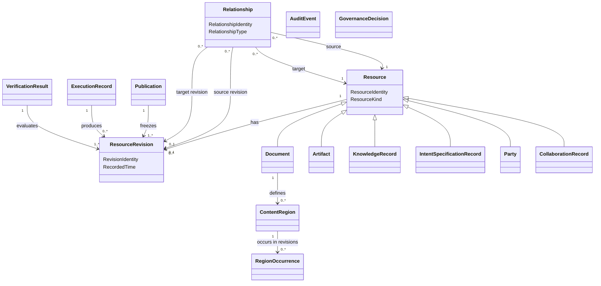

# Domain Model

**Project:** Document Management

## 1. Purpose

This document defines the conceptual domain model for the Document Management System.

The model is centered on one core pattern:

> The system is a graph of versioned Resources connected by explicit Relationships.

The model distinguishes three layers:

1. **Core domain contracts** — enduring concepts recognized by domain users.
2. **Immutable domain records** — durable records of significant activities, decisions, and outcomes.
3. **Supporting policies and mechanisms** — configuration, projection, storage, indexing, and execution details that support the domain but are not part of its conceptual core.

This is an analysis model, not an implementation design. The concepts below are not automatically database tables, services, classes, APIs, queues, indexes, or storage structures.

## 2. Core Model

The domain has three foundational concepts:

1. **Resource** — the continuing identity of something managed by the system.
2. **Resource Revision** — an immutable recorded state of a Resource.
3. **Relationship** — an explicit, typed connection between Resources or Resource Revisions.

```text
Resource
  has one stable identity
  has many revisions
  may participate in many relationships

Resource Revision
  records one immutable state of a Resource
  may derive from one or more earlier revisions

Relationship
  connects a source to a target
  has a type with defined semantics
  may target continuing Resources or exact Revisions
```

## 3. Resource

A Resource is the continuing identity of a managed thing.

A Resource has:

- Resource Identity;
- Resource Kind;
- creation information;
- zero or more Resource Revisions;
- zero or more Relationships;
- applicable governance and access rules.

### Resource invariants

1. Every Resource has exactly one stable Resource Identity.
2. Resource Identity is independent of name, title, filename, folder, repository path, or publication number.
3. Moving or renaming a Resource does not create a new Resource.
4. A Resource is not silently replaced by unrelated content.
5. Every durable state of a Resource is represented by a Resource Revision or another explicit immutable record.

## 4. Resource Revision

A Resource Revision is an immutable record of a Resource at a particular point in its history.

A Resource Revision has:

- Revision Identity;
- Resource Identity;
- zero or more parent Revision Identities;
- recorded content or payload;
- revision Metadata;
- author or Automated Agent;
- recorded time;
- change description;
- sufficient integrity information to verify recorded content.

### Resource Revision invariants

1. A recorded Resource Revision is immutable.
2. A new durable state creates a new Resource Revision.
3. A Revision belongs to exactly one Resource.
4. A Revision may have more than one parent after merge or reconciliation.
5. Revision Identity is distinct from publication numbering and repository commit identity.
6. Historical Revisions remain addressable after newer Revisions exist.

## 5. Relationship

A Relationship is an explicit, typed connection between two identified things.

A Relationship may connect:

- Resource to Resource;
- Resource Revision to Resource Revision;
- Resource to Resource Revision;
- a Resource or Revision to a Content Region;
- an immutable domain record to a Resource, Revision, Region, Relationship, or another record.

A Relationship has:

- Relationship Identity;
- Relationship Type;
- source identity;
- target identity;
- optional source Revision;
- optional target Revision;
- creation information;
- optional effective period;
- optional Metadata.

### Relationship invariants

1. Source and target are explicit.
2. Relationship Type is explicit.
3. A Relationship does not transfer ownership of its target.
4. Historical Relationships are not silently rewritten.
5. A Relationship targeting an exact Revision always resolves to that Revision.
6. A Relationship targeting a continuing Resource requires an explicit revision-selection rule when a Revision must be selected.

## 6. Contract Model

A contract defines the minimum semantics required by a Resource Kind, immutable record, or Relationship Type.

A contract states:

- required information;
- allowed or required Relationships;
- mutability or immutability rules;
- invariants;
- contextual roles.

Contracts preserve the simplified graph model. They do not create separate subsystems.

# Part I — Core Domain Contracts

## 7. Core Resource Kind Contracts

The core catalog defines six Resource Kind contracts.

## 7.1 Document Contract

A **Document** is a Resource whose Revisions contain structured text.

A Document Revision may contain:

- authored text;
- document Metadata;
- zero or more Content Regions;
- zero or more Reference Declarations;
- zero or more Executable Declarations.

### Roles

A Document may play the role of:

- Main Document;
- Partial Document;
- Composite Document;
- Template;
- Executable Specification;
- Evidence;
- Generated Output;
- Rendered Output.

### Invariants

1. Document content changes create a new Document Revision.
2. A Document Revision remains distinct from assemblies and rendered representations.
3. Ordinary prose is not executable unless explicitly declared.
4. Reference Declarations identify targets by stable identity.
5. Region identities are unique within the Document Resource.
6. Being generated or rendered does not change a Document's intrinsic Resource Kind.

## 7.2 Artifact Contract

An **Artifact** is a Resource whose Revisions contain or identify supporting content that is not primarily authored document text.

Examples include:

- images;
- diagrams;
- datasets;
- spreadsheets;
- recordings;
- PDFs;
- generated charts;
- source code;
- configuration files;
- deployment manifests.

An Artifact Revision contains:

- content or content location;
- content type;
- Artifact Metadata;
- sufficient integrity information;
- an accessible textual description where applicable;
- optional editable source reference.

### Roles

An Artifact may play the role of:

- Evidence;
- Diagram;
- Dataset;
- Template;
- Generated Output;
- Rendered Output;
- Verification Evidence.

### Invariants

1. Artifact Identity remains stable across Revisions.
2. Publication use resolves to an exact Artifact Revision.
3. An accessible description is versioned or linked to the applicable Revision.
4. A preview does not replace authoritative Artifact content.
5. Being generated does not create a distinct Resource Kind; provenance records how the Artifact Revision was produced.

## 7.3 Knowledge Record Contract

A **Knowledge Record** is a Resource whose Revisions express an observation, interpretation, conclusion, recommendation, decision, or action.

Supported kinds are:

- Observation;
- Finding;
- Insight;
- Recommendation;
- Decision;
- Action.

A Knowledge Record Revision contains:

- statement or structured content;
- author;
- context;
- recorded time;
- status;
- assumptions where applicable.

### Invariants

1. Historical Knowledge Record Revisions are never silently rewritten.
2. Competing or contradictory records may coexist.
3. Synthesized knowledge retains provenance to material sources.
4. A Finding identifies supporting Evidence or is explicitly marked as a hypothesis.
5. An Insight identifies contributing Findings, Evidence, or assumptions.
6. A Decision records rationale and decision authority.
7. A later conclusion supersedes rather than erases an earlier conclusion.

## 7.4 Intent and Specification Record Contract

An **Intent and Specification Record** is a Resource whose Revisions express a problem, desired future condition, rule, proposal, expected behavior, example, or outcome.

Supported kinds are grouped by semantic role.

### Motivation

- Need;
- Opportunity.

### Intent

- Goal;
- Objective;
- Initiative;
- Product Idea.

### Specification

- Requirement;
- Behavioral Requirement;
- Business Rule;
- Acceptance Example.

### Result

- Outcome.

A Revision contains:

- statement or structured expression;
- author or originating Party;
- context;
- status;
- rationale where applicable;
- priority or importance where applicable;
- acceptance or success conditions where applicable.

### Invariants

1. A Requirement intended for implementation is objectively testable or explicitly marked as non-verifiable with rationale.
2. A Behavioral Requirement identifies observable behavior under defined conditions.
3. A Business Rule states a domain constraint or decision rule.
4. An Acceptance Example records relevant inputs, conditions, and expected outcomes.
5. An Acceptance Example identifies the Requirement or Business Rule it covers.
6. An Outcome is explicitly distinguished as intended or observed.
7. Historical Revisions remain visible.
8. Superseding intent does not erase earlier rationale or decisions.

## 7.5 Party Contract

A **Party** is a Resource representing a person, organization, team, customer organization, or automated actor participating in the domain.

Supported kinds are:

- Person;
- Organization;
- Team;
- Customer Organization;
- Automated Agent.

A Party Revision contains:

- display name or identifier;
- Party kind;
- relevant descriptive or contact Metadata where permitted;
- status;
- applicable sensitivity and privacy Metadata.

### Roles

A Party may play the role of:

- Contributor;
- Author;
- Interview Participant;
- Interviewer;
- Reviewer;
- Approver;
- Owner;
- Decision Maker;
- Consent Grantor;
- Disclosure Recipient;
- System Operator.

### Invariants

1. Roles are contextual and do not permanently redefine the Party.
2. Sensitive Party information is governed by explicit policy.
3. Historical participation and accountability remain traceable.

## 7.6 Collaboration Record Contract

A **Collaboration Record** is a Resource whose Revisions preserve discussion, annotation, review, or collaborative interpretation associated with another Resource, Revision, Region, Relationship, or Publication.

Supported kinds are:

- Comment;
- Annotation;
- Discussion Entry;
- Review Decision;
- Follow-up Note.

A Collaboration Record Revision contains:

- author;
- recorded time;
- textual or structured content;
- target identity and optional exact target Revision or Region;
- collaboration kind;
- status.

### Invariants

1. A Collaboration Record does not become authoritative source content by default.
2. Author, time, and target are preserved.
3. Resolving a discussion does not erase its history.
4. A Review Decision identifies the exact Revision, Relationship, change, or Publication reviewed.

# Part II — Immutable Domain Records

## 8. Immutable Record Model

An immutable domain record captures a completed activity, decision, or outcome.

It differs from a normal Resource because it is not revised into a new state. A subsequent activity produces a new record.

Immutable records may still have stable identities and participate in Relationships.

## 8.1 Publication Record

A **Publication** freezes one assembled graph as a named release.

It records:

- Publication Identity;
- Publication Number;
- root Document Resource and Revision;
- Assembled Document;
- Resolution Manifest;
- publication Metadata;
- Rendered Outputs;
- approvals;
- release time;
- release actor.

### Invariants

1. Publication content is immutable.
2. Publication Number is unique within its numbering scope.
3. Every included Resource Revision is recorded.
4. Every Rendered Output is traceable to the Publication.
5. Corrections create a new Publication.
6. Supersession or withdrawal does not alter released content.
7. A Publication cannot be created from a failed Assembly.

## 8.2 Execution Record

An **Execution Record** records a controlled execution of an executable declaration, specification, generation rule, workflow, or operational instruction.

It records:

- executable source identity and Revision;
- target or environment;
- input identities and Revisions;
- interpreter, adapter, or tool identification;
- authorization context;
- start and completion times;
- outcome;
- produced outputs;
- logs and diagnostics.

### Invariants

1. Execution is explicit and authorized.
2. Exact executable source and inputs are recorded.
3. Execution does not mutate authoritative source without a governed new Revision.
4. Produced outputs remain traceable to the Execution Record.
5. A completed Execution Record is immutable.

## 8.3 Verification Result

A **Verification Result** records the outcome of evaluating a specification, claim, Requirement, Acceptance Example, or output against a target.

It records:

- evaluated Resource or Revision;
- target Resource or Revision;
- execution context;
- start and completion times;
- outcome;
- logs, diagnostics, or Evidence references.

Supported outcomes include:

- Passed;
- Failed;
- Error;
- Skipped;
- Inconclusive.

### Invariants

1. A Verification Result is immutable.
2. Exact evaluated and target Revisions are recorded where applicable.
3. Verification does not imply a passing outcome.
4. A Verification Result may play the role of Evidence.

## 8.4 Audit Event

An **Audit Event** records a significant domain action.

It records:

- event identity;
- event type;
- actor;
- time;
- affected Resource, Revision, Relationship, Publication, or immutable record;
- outcome;
- correlation to another event or process.

Audit Events are append-only records. They are not ordinary Resources and do not acquire new Revisions.

## 8.5 Governance Decision

A **Governance Decision** records an authoritative assessment, permission, restriction, or resolution.

Supported kinds include:

- Consent Decision;
- Disclosure Decision;
- Redaction Decision;
- Reconciliation Decision;
- Publication Assessment;
- Quality Gate Decision.

It records:

- authority or decision maker;
- target and scope;
- effective time or period;
- rationale;
- conditions and obligations;
- evidence or policy evaluated;
- outcome.

### Invariants

1. Scope and authority are explicit.
2. Consent, disclosure, and redaction decisions identify affected information and permitted use.
3. Reconciliation preserves acknowledged alternatives and the selected resolution.
4. Governance decisions are immutable; a change creates a later superseding decision.

# Part III — Roles

## 9. Contextual Roles

A role describes how a Resource, Revision, Party, or immutable record is used in a particular context. Roles do not create separate Resource Kinds.

Supported roles include:

- Main Document;
- Partial Document;
- Composite Document;
- Template;
- Executable Specification;
- Generated Output;
- Rendered Output;
- Evidence;
- Verification Evidence;
- System Under Test;
- Contributor;
- Author;
- Reviewer;
- Approver;
- Owner;
- Decision Maker;
- Interview Participant;
- Interviewer.

### Role invariants

1. A Resource may play multiple roles simultaneously.
2. A role is established by context, a Relationship, a process, or an immutable record.
3. A role does not silently change the Resource's intrinsic Kind.

## 9.1 Generated Output Role

A Document Revision or Artifact Revision plays the **Generated Output** role when an Execution Record produced it and its provenance is recorded.

Generated status is represented through:

- a Produces Relationship from the Execution Record;
- one or more Derived From Relationships to exact source Revisions.

### Invariants

1. Generation does not make an output authoritative source.
2. Exact source Revisions and execution context are traceable.
3. Regeneration creates a new Document or Artifact Revision when content changes.

# Part IV — Relationship Type Contracts

## 10. Relationship Type Catalog

The model defines ten Relationship Type contracts.

## 10.1 Includes

**Includes** states that one Resource Revision incorporates another Resource, Resource Revision, or Content Region.

Required information:

- inclusion location;
- Reference Mode;
- revision-selection rule when targeting a continuing Resource;
- presentation or inclusion options.

### Invariants

1. Includes participates in Assembly.
2. Target selection is deterministic.
3. Pinned inclusion resolves to an exact Revision.
4. Approval-Controlled inclusion does not adopt a newer Revision without approval.
5. The Includes graph used by one successful Assembly is acyclic.

## 10.2 Derived From

**Derived From** states that one Resource Revision was produced or synthesized using another exact Resource Revision.

Required information:

- derivation kind;
- transformation or generation rule reference where applicable;
- actor or Automated Agent;
- recorded time.

### Invariants

1. The target is an exact Revision.
2. The Relationship is immutable.
3. Derivation does not imply endorsement.
4. Material sources are recorded.

## 10.3 Supports

**Supports** states that one Resource, Revision, or record provides Evidence for another.

Optional information includes rationale, relevance, confidence, scope, and reviewer.

### Invariants

1. Support does not make the target automatically true.
2. Historical support remains visible.
3. Revision-specific Evidence identifies the exact Revision used.
4. Withdrawal of Evidence does not erase the historical Relationship.

## 10.4 Contradicts

**Contradicts** states that one Resource, Revision, or record conflicts with a claim made by another.

Required information:

- explanation;
- scope of contradiction;
- recorded time.

### Invariants

1. Contradiction does not delete or overwrite either side.
2. Multiple contradictory Resources may coexist.
3. Resolution is represented through later Revisions, Decisions, or Supersedes Relationships.

## 10.5 Relates To

**Relates To** records a meaningful association not captured by a more specific Relationship Type.

Required information:

- semantic role or reason;
- optional context.

### Invariants

1. Relates To does not replace a more precise type when one exists.
2. The reason is explicit.
3. It does not imply derivation, evidence, inclusion, coverage, verification, intent, production, or succession.

## 10.6 Supersedes

**Supersedes** states that one Resource, Revision, Publication, or immutable record replaces another for a defined purpose while preserving history.

Required information:

- effective time;
- scope or purpose;
- rationale where required.

### Invariants

1. Supersession does not modify or delete the target.
2. It is directional.
3. The target remains historically addressable.
4. Multiple successors require explicit scope or conflict handling.

## 10.7 Verifies

**Verifies** states that a Verification Result or qualifying Execution Record objectively evaluates another Resource, Revision, or claim.

Potential targets include:

- Requirement;
- Behavioral Requirement;
- Business Rule;
- Acceptance Example;
- Document Revision;
- Artifact Revision;
- Knowledge claim.

Required information:

- verification scope;
- evaluated Revision where applicable;
- outcome;
- verification method;
- recorded time.

### Invariants

1. The evaluated Revision is explicit when the target is revisioned.
2. Verifies does not imply a passing result.
3. Verification history remains visible.
4. “Verified by” is the inverse view of the same Relationship.

## 10.8 Covers

**Covers** states that an Acceptance Example, specification, test, or verification asset exercises or represents part of an Intent and Specification Record.

Required information:

- coverage scope;
- optional conditions or exclusions.

### Invariants

1. Coverage does not imply successful verification.
2. Partial coverage identifies its scope.
3. Coverage remains traceable to exact source Revisions where applicable.

## 10.9 Addresses

**Addresses** states that one Resource is intended to respond to, satisfy, reduce, resolve, or advance another Need, Opportunity, Objective, Finding, Risk, or Requirement.

Required information:

- manner or scope of response;
- optional expected Outcome.

### Invariants

1. Addresses expresses intent, not proof of success.
2. Fulfillment requires Evidence or Verification.
3. Partial response identifies its scope.

## 10.10 Produces

**Produces** states that an Execution Record created a Document Revision, Artifact Revision, Verification Result, or other explicit output.

Required information:

- production role;
- produced time;
- optional output name or channel.

### Invariants

1. The output is traceable to the Execution Record.
2. Production does not make the output authoritative source.
3. Exact input lineage remains available through Derived From Relationships.

# Part V — Document Composition

## 11. Content Region

A Content Region is a stably identified lineage within a Document Resource.

A Content Region has:

- Region Identity;
- parent Document Resource Identity;
- zero or more Region Occurrences.

A **Region Occurrence** defines the Region in one Document Revision and records:

- Document Revision;
- explicit boundary;
- Region Type;
- optional Metadata;
- content fingerprint or equivalent identity evidence.

### Invariants

1. Region Identity is unique within its parent Document.
2. A Region may have one occurrence per Document Revision.
3. A Region Occurrence has an explicit boundary.
4. Deleting a Region does not redirect References to unrelated content.
5. Split, merge, replacement, fork, or retirement is represented explicitly.

## 12. Reference Declaration and Subscription

A **Reference Declaration** is authored content within a Document Revision requesting reuse of another Resource, Revision, or Content Region.

It records:

- declaration identity;
- target identity;
- Reference Mode;
- revision-selection rule;
- inclusion options.

A **Reference Subscription** records operational synchronization when continuing tracking is needed.

It may record:

- adopted target Revision;
- latest observed target Revision;
- approval history;
- resolution condition;
- conflict condition;
- pending Update Candidate;
- propagation history.

A pinned declaration may require no subscription.

### Update Candidate

An Update Candidate identifies a newer qualifying target Revision proposed for adoption by an Approval-Controlled Reference.

It records:

- current adopted Revision;
- proposed Revision;
- detection time;
- submitter or detecting agent;
- review status;
- decision and rationale.

### Local adaptation

A destination does not directly modify included source content.

A local variation is represented as:

- a forked Resource or Region linked by Derived From;
- an overlay Document or Artifact linked by Relates To with an explicit overlay role;
- a replacement Reference Declaration targeting locally authored content.

### Status dimensions

Reference status is expressed through independent dimensions:

- Reference Mode: Live, Approval-Controlled, Pinned;
- Resolution Status: Resolved, Unresolved, Source Unavailable, Unauthorized;
- Currency Status: Current, Update Available;
- Approval Status: Not Required, Not Submitted, Pending, Approved, Rejected;
- Conflict Status: Clean, Conflicted.

Derived statuses should not be stored when they can be calculated reliably.

## 13. Assembly

Assembly resolves a selected Document Revision and the Includes Relationships reachable from it.

Assembly inputs include:

- entry-point Document Revision;
- Reference Declarations;
- Reference Subscription facts where applicable;
- assembly configuration;
- templates;
- authorization context.

Assembly produces:

- Assembled Document;
- Resolution Manifest;
- diagnostics.

The Resolution Manifest records:

- root Document Revision;
- every selected Resource Revision;
- every traversed Includes Relationship;
- assembly configuration;
- template and relevant tool identification;
- sufficient integrity information to reproduce and verify the result.

### Invariants

1. The same recorded inputs produce the same assembled result.
2. Every included Revision appears in the Resolution Manifest.
3. No unresolved inclusion is permitted in a successful Assembly.
4. The Includes graph used by one successful Assembly is acyclic.
5. Assembly does not mutate source Resources or Revisions.

# Part VI — Supporting Concepts

## 14. Policy Concepts

Policies are supporting domain concepts. They constrain behavior but are not all Resource Kind contracts.

Supported policy concepts include:

- Authorization Policy;
- Retention Policy;
- Lifecycle Policy;
- Sensitivity Classification;
- Quality Gate Policy;
- Publication Policy;
- Reference Propagation Policy;
- Revision Selection Rule;
- Generation Rule.

A policy may be represented as a Document, Artifact, or other governed configuration depending on the architecture. The conceptual model requires only that its identity, version, scope, authority, and effect be explicit where needed.

## 15. Metadata and Classification

Metadata is structured information describing a Resource, Revision, Relationship, Region, Publication, or immutable record.

A Metadata Schema may define:

- field identity and name;
- data type;
- cardinality;
- required or optional status;
- validation rules;
- applicable Resource Kinds or Relationship Types;
- sensitivity and indexing behavior.

A Tag is a flexible classification label.

A Classification is a governed category assigned according to a Classification Scheme.

### Invariants

1. Required Metadata is validated before governed operations proceed.
2. Historical revision Metadata is preserved.
3. Tags do not replace typed Relationships where domain meaning matters.
4. Sensitive Metadata follows authorization and disclosure policy.

## 16. Repository and Placement

Repository is the managed storage environment for Resources, Revisions, Relationships, Publications, and immutable domain records.

Repository Placement records where a Resource appears in a hierarchy.

The implementation may represent placement as effective-dated Metadata or as a Relationship. The conceptual requirement is:

1. placement is independent of Resource Identity;
2. movement does not break Relationships;
3. historical placement can be retained when traceability requires it.

A Library is a Resource representing a meaningful collection. Library membership is represented by an explicit Relationship.

## 17. Accountability

Accountability associates a Party with responsibility for a Resource, Revision, Relationship, Publication, or domain activity.

Responsibility roles may include:

- content stewardship;
- approval;
- sensitivity classification;
- reference maintenance;
- publication authorization;
- execution authorization.

Accountability is contextual and may be effective-dated.

## 18. Search and Discovery

Search is an application projection over authorized Resources, Revisions, Regions, Metadata, and Relationships.

Supported discovery modes may include:

- full-text search;
- Metadata and Tag filtering;
- Classification filtering;
- identity lookup;
- Relationship traversal;
- similarity or analytical discovery.

Search indexes, ranking algorithms, and projection storage are implementation concerns.

### Domain constraints

1. Search results respect authorization and sensitivity policy.
2. Search indexes are derived and are not authoritative source.
3. Hidden Resources and Relationships are not leaked through results, counts, errors, or traversal.

## 19. Graph Projections

The Versioned Resource Graph is the complete network of Resources, Revisions, Regions, Relationships, Publications, and immutable records.

Purpose-specific projections include:

- Assembly graph — Includes and structural inputs;
- Provenance graph — Derived From and Produces;
- Evidence graph — Supports and Contradicts;
- Intent and traceability graph — Addresses, Covers, Verifies, Supports, Contradicts, and Supersedes;
- Knowledge graph — Relates To, Supports, Contradicts, Addresses, and Supersedes;
- Publication graph — exact Revisions and Relationships frozen by a Publication;
- Verification graph — specifications, targets, Execution Records, outputs, Verification Results, Covers, and Verifies.

These projections are domain views. Their persistence and indexing are architecture decisions.

## 20. Conceptual Diagram



The diagram is conceptual and does not prescribe storage, inheritance, aggregate, or service design.

## 21. Principal Invariants

1. Every Resource has stable identity independent of location.
2. Every durable Resource state is represented by an immutable Revision.
3. Every Relationship has explicit source, target, and semantics.
4. Historical Revisions and Relationships are never silently rewritten.
5. Core Resource Kind contracts describe domain-recognizable continuing things.
6. Completed activities, decisions, and outcomes are immutable records rather than revisioned Resources unless the domain proves otherwise.
7. Roles do not alter intrinsic Resource Kind.
8. Generated Output is a role established through Produces and Derived From.
9. Authoritative source remains distinct from generated and rendered outputs.
10. Reference behavior follows its declared mode and revision-selection rule.
11. Pinned References never advance implicitly.
12. Approval-Controlled References never adopt changes without approval.
13. Successful Assembly has no unresolved Includes Relationships or inclusion cycles.
14. Every Assembly records the exact Revisions used.
15. Publications, completed Execution Records, Verification Results, Audit Events, and Governance Decisions are immutable.
16. Provenance is preserved through Derived From and Produces.
17. Evidence is expressed through Supports and Contradicts.
18. Requirements and examples are traceable through Addresses, Covers, and Verifies.
19. Repository movement does not break identity or Relationships.
20. Ordinary prose is not executed implicitly.
21. Consent, disclosure, redaction, and reconciliation preserve exact scope and history.
22. No acknowledged work is silently discarded.

## 22. Open Questions

1. Which additional core Resource Kinds justify formal contracts?
2. Which repeated uses of Relates To justify a more precise Relationship Type?
3. Which Metadata belongs to Resource identity and which belongs to each Revision?
4. Which Live Reference revision-selection rules are permitted?
5. How are Region split, merge, fork, replacement, and retirement represented in authoring tools?
6. What is the numbering scope for Publications?
7. Which Relationships are required before a Finding, Decision, Requirement, or Publication is considered valid?
8. How are repository commits mapped to Resource Revisions?
9. Which graph projections are persisted and which are derived?
10. How are contract changes versioned and governed?
11. Which Collaboration Records should permit later Revisions and which should be append-only contributions?
12. Which policy concepts require independent stable identity in the implementation?

## 23. Traceability

This model is governed by and derived from:

- [Project Constitution](./00-project-constitution.md)
- [Domain Glossary](./01-domain-glossary.md)
- [Customer Insight Documentation System Vision](./00.01-Interview-Constitution.md)
- [Referenced Content Management Vision](./00.02-Partial-References.md)
- [Documentation as Executable Code](./00.03.Literate-Programming.md)
- [Documentation as Test](./00.04.FitNesse.md)
- [Enterprise Work Intelligence System](.00.01.ProjectManagement.md)

Changes that conflict with the Project Constitution require a constitutional amendment. Changes that introduce or redefine canonical terms require a corresponding update to the Domain Glossary.
