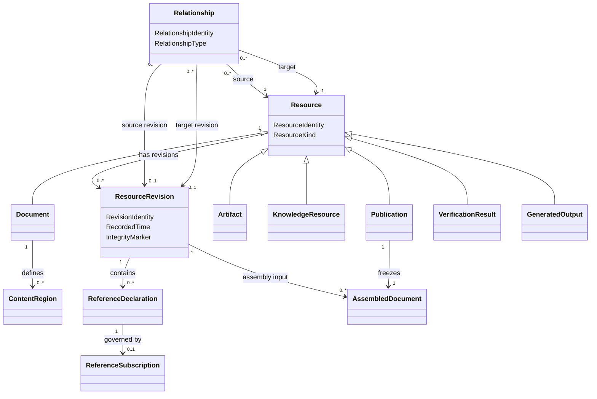

# Domain Model

**Project:** Document Management

## 1. Purpose

This document defines the conceptual domain model for the Document Management System.

The model is intentionally centered on one core pattern:

> The system is a graph of versioned Resources connected by explicit Relationships.

Documents, artifacts, comments, knowledge records, publications, generated outputs, and verification results are all understood through this pattern. The model avoids treating every capability as a separate subsystem unless the domain requires a distinct concept.

This is an analysis model, not an implementation design. The concepts below are not automatically database tables, services, classes, or API resources.

## 2. The Central Pattern

The domain has three foundational concepts:

1. **Resource** — the continuing identity of something managed by the system.
2. **Resource Revision** — an immutable recorded state of a Resource.
3. **Relationship** — an explicit, typed connection between Resources or Resource Revisions.

Everything else in the model specializes or uses these concepts.

```text
Resource
  has one stable identity
  has many revisions
  may have many relationships

Resource Revision
  records one immutable state of a resource
  may derive from one or more earlier revisions

Relationship
  connects a source to a target
  has a type and meaning
  may apply to resources or exact revisions
```

## 3. Resource

A Resource is the continuing identity of a managed thing.

Examples:

- a document;
- an image;
- a spreadsheet;
- a diagram;
- a recording;
- a comment;
- an observation;
- a finding;
- a decision;
- a generated report;
- a verification result;
- a published version.

A Resource has:

- Resource Identity;
- Resource Kind;
- creation information;
- current Repository Placement, when applicable;
- zero or more Resource Revisions;
- zero or more Relationships;
- applicable Metadata;
- applicable governance and access rules.

### Resource invariants

1. Every Resource has exactly one stable Resource Identity.
2. Resource Identity is independent of name, title, filename, folder, repository path, or publication number.
3. Moving or renaming a Resource does not create a new Resource.
4. A Resource is not silently replaced by unrelated content.
5. Every durable state of a Resource is represented by a Resource Revision or another explicit immutable record.

## 4. Resource Revision

A Resource Revision is an immutable record of a Resource at a particular point in its history.

A Resource Revision has:

- Revision Identity;
- Resource Identity;
- zero or more parent Revision Identities;
- recorded content or payload;
- Metadata applicable to that revision;
- author or Automated Agent;
- recorded time;
- change description;
- integrity marker;
- Provenance Relationships.

### Resource Revision invariants

1. A recorded Resource Revision is immutable.
2. A new durable state creates a new Resource Revision.
3. A Revision always belongs to exactly one Resource.
4. A Revision may have more than one parent after merge or reconciliation.
5. Revision Identity is distinct from publication numbering and repository commit identity.
6. Historical Revisions remain addressable even when a newer Revision exists.

## 5. Relationship

A Relationship is an explicit, typed connection between two identified things.

A Relationship may connect:

- Resource to Resource;
- Resource Revision to Resource Revision;
- Resource to Resource Revision;
- a Resource or Revision to a Content Region.

A Relationship has:

- Relationship Identity;
- Relationship Type;
- source identity;
- target identity;
- optional source Revision;
- optional target Revision;
- creation information;
- optional effective period;
- optional Metadata;
- optional governance rules.

### Relationship invariants

1. Source and target are explicit.
2. Relationship Type is explicit.
3. A Relationship does not transfer ownership of its target.
4. Historical Relationships are not silently rewritten when Resources change.
5. A Relationship targeting a specific Revision always resolves to that Revision.
6. A Relationship targeting a continuing Resource requires an explicit resolution rule when a Revision must be selected.

## 6. Relationship Families

The model uses one general Relationship concept but distinguishes several semantic families.

### 6.1 Structural Relationship

Describes composition or organization.

Examples:

- includes;
- contains;
- belongs to library;
- uses template;
- depends on configuration.

### 6.2 Provenance Relationship

Describes how one Resource or Revision was produced from another.

Examples:

- derived from;
- summarized from;
- synthesized from;
- generated from;
- transformed from;
- quoted from.

### 6.3 Evidential Relationship

Describes how Evidence relates to an assertion or conclusion.

Examples:

- supports;
- contradicts;
- weakens;
- verifies;
- invalidates.

### 6.4 Semantic Relationship

Describes meaning between knowledge Resources.

Examples:

- refines;
- addresses;
- recommends;
- informs;
- authorizes;
- results in;
- relates to.

### 6.5 Succession Relationship

Describes replacement or historical progression.

Examples:

- supersedes;
- replaces;
- withdraws;
- forks from;
- merged from.

These Relationship families share a common mechanism but retain distinct rules and meanings.

## 7. Document Resource

A Document is a Resource whose Revisions contain structured text.

A Document Revision may contain:

- authored text;
- headings;
- paragraphs;
- tables;
- lists;
- definitions;
- code blocks;
- Metadata;
- Content Regions;
- Reference Declarations;
- Executable Declarations.

### Document roles

The following are roles played by Documents rather than permanent subtypes.

#### Main Document

A Document selected as the entry point for an Assembly.

#### Partial Document

A Document reused by another Document through a Structural Relationship.

#### Composite Document

A Document Revision containing one or more Reference Declarations or inclusion points.

A Document may play more than one role at the same time.

### Document invariants

1. A Document Revision remains distinct from derived assemblies and rendered outputs.
2. Ordinary prose is not executable unless explicitly marked as an Executable Declaration.
3. Reference Declarations identify targets by stable identity.
4. Structural changes create new Document Revisions.

## 8. Content Region

A Content Region is a stably identified portion of a Document.

A Content Region has:

- Region Identity;
- parent Document Resource Identity;
- definition within one or more Document Revisions;
- Region Type;
- optional Metadata.

Examples include:

- a definition;
- a paragraph;
- a section;
- a table;
- a list;
- an example;
- an acceptance example;
- a named block.

A Region is not modeled as a separate document. It is an addressable lineage within a Document.

### Region invariants

1. Region Identity is unique within its parent Document.
2. A Region may appear in many Document Revisions.
3. A Region definition in a Revision has an explicit boundary.
4. Deleting a Region does not redirect its References to unrelated content.
5. Split, merge, replacement, fork, or retirement of Regions must be represented explicitly through Relationships.

### Region transformation relationships

Examples:

- Region B split from Region A;
- Region C merged from Regions A and B;
- Region D replaces Region A;
- Region E forked from Region A;
- Region A retired.

This preserves lineage without pretending that identity always continues unchanged.

## 9. Reference Declaration

A Reference Declaration is authored content within a Document Revision that requests reuse of another Resource, Resource Revision, or Content Region.

A Reference Declaration has:

- declaration identity within the Document Revision;
- target Resource or Region identity;
- Reference Mode;
- Resolution Rule;
- inclusion or presentation options.

Reference Declaration is part of the Document Revision. It does not itself hold operational synchronization history.

### Reference modes

#### Live

Resolve the target according to a rule selecting the current qualifying Revision.

#### Approval-Controlled

Detect a qualifying newer Revision but require explicit approval before adoption.

#### Pinned

Resolve to one specified immutable Revision until deliberately changed.

### Reference invariants

1. Reference Mode is explicit.
2. Resolution Rule is deterministic.
3. Pinned References never advance implicitly.
4. Approval-Controlled References never adopt a new Revision without approval.
5. A Reference cannot resolve to inaccessible content.

## 10. Reference Subscription

A Reference Subscription represents the operational history of a governed Reference.

It tracks:

- owning Document Resource;
- Reference Declaration lineage;
- adopted target Revision;
- latest observed target Revision;
- approval history;
- update history;
- resolution condition;
- conflict condition.

The Reference Subscription is separate from the Reference Declaration because authored intent and operational synchronization change for different reasons.

### Reference status dimensions

The model does not use one overloaded synchronization state. Instead it records independent dimensions.

#### Reference Mode

- Live
- Approval-Controlled
- Pinned

#### Resolution Status

- Resolved
- Unresolved
- Source Unavailable
- Unauthorized

#### Currency Status

- Current
- Update Available

#### Approval Status

- Not Required
- Not Submitted
- Pending
- Approved
- Rejected

#### Conflict Status

- Clean
- Conflicted

This allows combinations such as:

- Pinned and Resolved;
- Approval-Controlled, Update Available, and Pending;
- Live and Unauthorized;
- Pinned and Source Unavailable.

## 11. Versioned Resource Graph

The Versioned Resource Graph is the network formed by:

- Resources;
- Resource Revisions;
- Relationships;
- Content Regions;
- Reference Declarations;
- Reference Subscriptions.

The graph may be viewed differently for different purposes.

### Assembly graph

Contains Structural Relationships needed to assemble a Document.

### Provenance graph

Contains Provenance Relationships connecting derived Resources to their sources.

### Evidence graph

Contains Evidential Relationships connecting Evidence to assertions and conclusions.

### Publication graph

Contains the exact Resource Revisions and Relationships frozen into a Published Version.

### Verification graph

Contains specifications, systems under test, executions, outputs, and Verification Results.

There is no single universal dependency graph. Each graph is a projection of the same underlying versioned resource graph for a specific purpose.

## 12. Assembly

Assembly resolves a selected Document Revision and the Structural Relationships reachable from it.

Assembly inputs include:

- entry-point Document Revision;
- Reference Declarations;
- Reference Subscription state where applicable;
- assembly configuration;
- templates;
- authorization context.

Assembly produces:

- Assembled Document;
- Resolution Manifest;
- diagnostics.

### Assembled Document

An Assembled Document is an immutable derived value representing resolved text and included Artifact Revisions.

It is not an authoritative source Resource.

### Resolution Manifest

The Resolution Manifest records:

- root Document Revision;
- every selected Resource Revision;
- every traversed Structural Relationship;
- assembly configuration;
- template and tool versions;
- integrity marker.

### Assembly invariants

1. The same recorded inputs produce the same assembled result.
2. Every included Revision appears in the Resolution Manifest.
3. No unresolved inclusion is permitted in a successful Assembly.
4. Inclusion Relationships used by one Assembly must be acyclic.
5. Assembly does not mutate source Resources or Revisions.

## 13. Publication

A Publication freezes one assembled graph as a named, immutable release.

Publication has:

- Publication Identity;
- Publication Number;
- root Document Resource;
- root Document Revision;
- Assembled Document;
- Resolution Manifest;
- publication Metadata;
- Rendered Outputs;
- approvals;
- release time;
- release actor.

A Publication is itself an immutable Resource.

### Publication invariants

1. Publication content is immutable.
2. Publication Number is unique within its numbering scope.
3. Every included Resource Revision is recorded.
4. Every Rendered Output is traceable to the Publication.
5. Corrections create a new Publication.
6. Supersession or withdrawal does not alter released content.
7. A Publication cannot be created from a failed Assembly.

### Publication succession

Publications may be connected by Succession Relationships:

- supersedes;
- withdraws;
- replaces;
- derived from.

## 14. Artifact Resource

An Artifact is a Resource whose Revisions contain or identify supporting content that is not primarily authored document text.

Examples:

- image;
- diagram;
- dataset;
- spreadsheet;
- recording;
- PDF;
- generated chart.

An Artifact Revision may contain:

- binary or textual content;
- content type;
- checksum;
- editable source reference;
- Accessible Textual Description;
- Metadata;
- Provenance Relationships.

### Artifact invariants

1. Artifact Identity remains stable across Revisions.
2. Publications resolve Artifacts to exact Revisions.
3. Accessible descriptions are versioned or linked to the relevant Revision.
4. Derived previews do not replace authoritative Artifact content.

## 15. Knowledge Resource

Observations, Findings, Insights, Recommendations, Decisions, and Actions are modeled as Resource Kinds.

Each has:

- stable Resource Identity;
- one or more Resource Revisions;
- statement or structured content;
- author;
- context;
- status;
- Evidential Relationships;
- Semantic Relationships;
- Provenance Relationships.

### Knowledge Resource kinds

#### Observation

Records something directly noticed, measured, stated, or captured.

#### Finding

Records a supported conclusion drawn from Evidence or Observations.

#### Insight

Records an interpretation of significance, pattern, implication, or opportunity.

#### Recommendation

Proposes a course of action.

#### Decision

Records a choice, rationale, decision makers, and status.

#### Action

Records work undertaken or planned.

### Knowledge invariants

1. Historical Revisions of a knowledge Resource are never silently rewritten.
2. Findings identify supporting Evidence or are explicitly marked as hypotheses.
3. Insights identify contributing Findings, Evidence, or assumptions.
4. Synthesized knowledge retains Provenance Relationships to material sources.
5. Competing or contradictory knowledge may coexist through explicit Relationships.

## 16. Evidence

Evidence is a role played by a Resource or Resource Revision when it supports or challenges another Resource.

Examples:

- interview notes supporting a Finding;
- a screenshot supporting an Observation;
- a Verification Result supporting a Decision;
- a Dataset contradicting an Insight.

Evidence is represented through Evidential Relationships rather than a separate universal Evidence subtype.

## 17. Generated Output

A Generated Output is a Resource created from one or more source Revisions through a Generation Rule.

Examples:

- code;
- tests;
- configuration;
- diagrams;
- reports;
- deployment manifests.

A Generated Output Revision records:

- source Revision identities;
- Generation Rule Revision;
- tool version;
- generation time;
- integrity marker;
- Provenance Relationships.

Generated Output never becomes authoritative source merely by being generated.

## 18. Verification Result

A Verification Result is an immutable Resource recording the outcome of evaluating a specification against a target.

It records:

- specification Resource and Revision;
- target Resource and Revision;
- execution environment;
- adapter or tool version;
- start and completion times;
- outcome;
- Verification Evidence;
- logs and diagnostics.

Possible outcomes include:

- Passed;
- Failed;
- Error;
- Skipped;
- Inconclusive.

### Verification invariants

1. Ordinary prose is not executed implicitly.
2. Execution is explicitly authorized.
3. Exact source and tool Revisions are recorded.
4. A completed Verification Result is immutable.
5. Execution does not modify authoritative source without creating a separate new Revision.

## 19. Repository and Placement

Repository is the managed storage environment for Resources, Revisions, and Relationship records.

Repository Placement describes where a Resource currently appears in a hierarchy.

A placement has:

- Repository Identity;
- Resource Identity;
- path;
- effective period.

A Resource may have historical placements and may belong to multiple Libraries.

### Placement invariants

1. Placement does not define Resource Identity.
2. Moving a Resource does not break Relationships using stable identity.
3. Historical placement may be retained for traceability.

## 20. Library

A Library is a Resource representing a meaningful collection of other Resources.

Membership is represented by Structural Relationships rather than by ownership or containment alone.

A Resource may belong to multiple Libraries.

Library membership does not automatically grant access to every member Resource.

## 21. Contributor and Accountability

A Contributor is a person or Automated Agent that creates, revises, relates, approves, publishes, generates, or verifies Resources.

Author, Reviewer, Approver, Owner, and System Under Test are roles played in context rather than permanent types.

Accountability is represented as a Relationship between a Contributor or organizational role and a Resource.

An Accountability Relationship records:

- accountable party;
- Resource;
- responsibility type;
- effective period;
- delegation, where applicable.

Responsibility types may include:

- content stewardship;
- publication approval;
- sensitivity classification;
- reference maintenance;
- execution authorization.

## 22. Governance and Access

Governance and access rules apply to Resources, Revisions, Relationships, and operations.

A Policy Assignment connects:

- a policy;
- a Resource or scope;
- an actor or role;
- an operation;
- an effect;
- an effective period.

Governed operations include:

- view;
- revise;
- relate;
- approve;
- execute;
- publish;
- disclose;
- redact;
- administer.

Security does not change the identity model. It constrains which graph nodes and edges an actor may observe or use.

## 23. Audit Event

An Audit Event is an immutable record of a significant action.

It records:

- event identity;
- event type;
- actor;
- time;
- affected Resource, Revision, or Relationship;
- outcome;
- correlation to another event or process.

Examples:

- Resource created;
- Revision recorded;
- Relationship created;
- approval granted;
- Reference update adopted;
- Assembly completed;
- Publication released;
- Verification executed;
- Resource disclosed;
- redaction applied.

## 24. Simplified Conceptual Diagram



The diagram is conceptual. It does not prescribe storage, inheritance, aggregate, or service design.

## 25. Principal Invariants

1. Every Resource has stable identity independent of location.
2. Every durable state is represented by an immutable Resource Revision or immutable record.
3. Every Relationship has explicit source, target, and type.
4. Historical Revisions and Relationships are never silently rewritten.
5. Authoritative source remains distinct from derived outputs.
6. Reference behavior follows its declared mode and resolution rule.
7. Pinned References never advance implicitly.
8. Approval-Controlled References never adopt changes without approval.
9. A successful Assembly has no unresolved inclusion Relationships or inclusion cycles.
10. Every Assembly records the exact Revisions used.
11. Publications and completed Verification Results are immutable.
12. Provenance is preserved across synthesis, generation, assembly, publication, and verification.
13. Repository movement does not break identity or Relationships.
14. Security policy constrains visibility and operations without changing domain identity.
15. Ordinary prose is not executed implicitly.
16. No acknowledged work is silently discarded.

## 26. Open Questions

1. Which Resource Kinds require independent lifecycle rules?
2. Which Metadata belongs to Resource identity and which belongs to each Revision?
3. What exact edits create new Resource Revisions?
4. How are Region split, merge, fork, replacement, and retirement represented in authoring tools?
5. Which Live Reference resolution rules are permitted?
6. How are Reference Subscription updates approved in batches?
7. Can a Reference target a dynamic query, or only a stable Resource or Region identity?
8. What is the numbering scope for Publications?
9. Which Relationships are required before a Finding, Decision, or Publication is considered valid?
10. How are policy inheritance and exceptions evaluated?
11. How are repository commits mapped to Resource Revisions?
12. Which graph projections must be persisted and which may be derived?

## 27. Traceability

This model is governed by and derived from:

- [Project Constitution](./00-project-constitution.md)
- [Domain Glossary](./01-domain-glossary.md)
- [Customer Insight Documentation System Vision](./00.01-Interview-Constitution.md)
- [Referenced Content Management Vision](./00.02-Partial-References.md)
- [Documentation as Executable Code](./00.03.Literate-Programming.md)
- [Documentation as Test](./00.04.FitNesse.md)

Changes that conflict with the Project Constitution require a constitutional amendment. Changes that introduce or redefine canonical terms require a corresponding update to the Domain Glossary.
