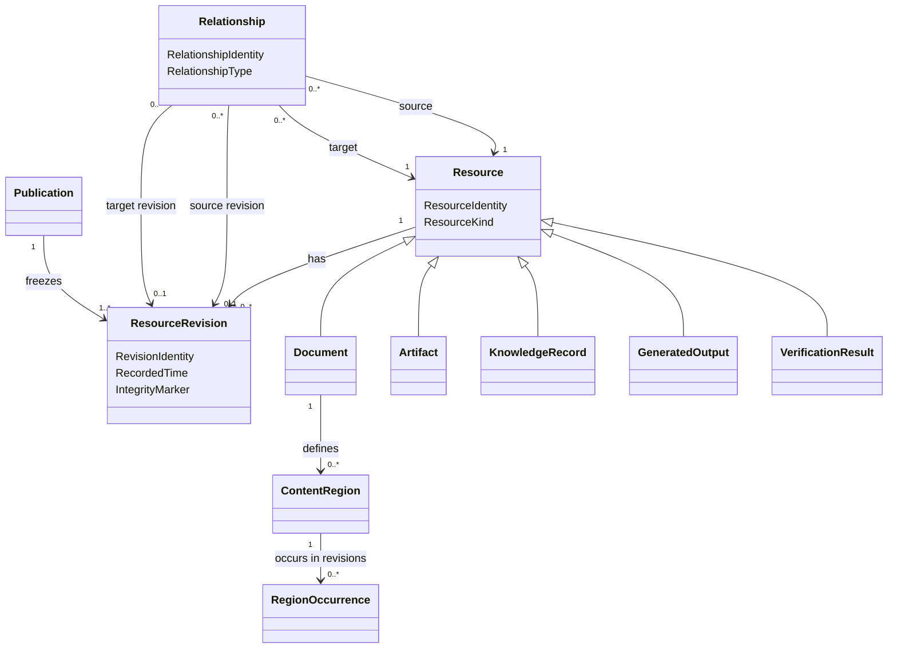

# Domain Model

**Project:** Document Management

## 1. Purpose

This document defines the conceptual domain model for the Document Management System.

The model is centered on one core pattern:

> The system is a graph of versioned Resources connected by explicit Relationships.

The model deliberately keeps the number of foundational concepts small. Documents, artifacts, knowledge records, generated outputs, verification results, and publications are expressed as Resource Kinds. Composition, provenance, evidence, meaning, and succession are expressed as Relationship Types.

This is an analysis model, not an implementation design. The concepts below are not automatically database tables, services, classes, or API resources.

## 2. Core Model

The domain has three foundational concepts:

1. **Resource** — the continuing identity of something managed by the system.
2. **Resource Revision** — an immutable recorded state of a Resource.
3. **Relationship** — an explicit, typed connection between Resources or Resource Revisions.

```text
Resource
  has one stable identity
  has many revisions
  may participate in many relationships

Resource Revision
  records one immutable state of a Resource
  may derive from one or more earlier revisions

Relationship
  connects a source to a target
  has a type with defined semantics
  may target continuing Resources or exact Revisions
```

## 3. Resource

A Resource is the continuing identity of a managed thing.

A Resource has:

- Resource Identity;
- Resource Kind;
- creation information;
- zero or more Resource Revisions;
- zero or more Relationships;
- applicable governance and access rules.

### Resource invariants

1. Every Resource has exactly one stable Resource Identity.
2. Resource Identity is independent of name, title, filename, folder, repository path, or publication number.
3. Moving or renaming a Resource does not create a new Resource.
4. A Resource is not silently replaced by unrelated content.
5. Every durable state of a Resource is represented by a Resource Revision or another explicit immutable record.

## 4. Resource Revision

A Resource Revision is an immutable record of a Resource at a particular point in its history.

A Resource Revision has:

- Revision Identity;
- Resource Identity;
- zero or more parent Revision Identities;
- recorded content or payload;
- revision Metadata;
- author or Automated Agent;
- recorded time;
- change description;
- integrity marker.

### Resource Revision invariants

1. A recorded Resource Revision is immutable.
2. A new durable state creates a new Resource Revision.
3. A Revision belongs to exactly one Resource.
4. A Revision may have more than one parent after merge or reconciliation.
5. Revision Identity is distinct from publication numbering and repository commit identity.
6. Historical Revisions remain addressable after newer Revisions exist.

## 5. Relationship

A Relationship is an explicit, typed connection between two identified things.

A Relationship may connect:

- Resource to Resource;
- Resource Revision to Resource Revision;
- Resource to Resource Revision;
- a Resource or Revision to a Content Region.

A Relationship has:

- Relationship Identity;
- Relationship Type;
- source identity;
- target identity;
- optional source Revision;
- optional target Revision;
- creation information;
- optional effective period;
- optional Metadata.

### Relationship invariants

1. Source and target are explicit.
2. Relationship Type is explicit.
3. A Relationship does not transfer ownership of its target.
4. Historical Relationships are not silently rewritten.
5. A Relationship targeting an exact Revision always resolves to that Revision.
6. A Relationship targeting a continuing Resource requires an explicit revision-selection rule when a Revision must be selected.

## 6. Contract Model

A contract defines the minimum semantics required by a Resource Kind or Relationship Type.

A contract states:

- what payload is required;
- which Relationships are required or allowed;
- whether the Resource or Relationship is mutable through new Revisions;
- which invariants apply;
- which roles it may play.

Contracts preserve the simplified graph model. They do not create separate subsystems.

## 7. Resource Kind Contracts

The model defines five Resource Kind contracts.

### 7.1 Document Contract

A **Document** is a Resource whose Revisions contain structured text.

#### Required revision payload

A Document Revision contains:

- structured textual content;
- document Metadata;
- zero or more Content Regions;
- zero or more Reference Declarations;
- zero or more Executable Declarations.

#### Allowed relationships

A Document may participate in:

- **Includes** relationships;
- **Derived From** relationships;
- **Supports** or **Contradicts** relationships;
- **Supersedes** relationships;
- library membership and accountability relationships.

#### Roles

A Document may play the role of:

- Main Document — selected as an Assembly entry point;
- Partial Document — reused by another Document;
- Composite Document — contains one or more Reference Declarations;
- Template — used to shape another output;
- Executable Specification — contains explicit executable declarations;
- Evidence — supports or challenges another Resource.

#### Invariants

1. Document content changes create a new Document Revision.
2. A Document Revision remains distinct from assemblies and rendered outputs.
3. Ordinary prose is not executable unless explicitly declared.
4. Reference Declarations identify targets by stable identity.
5. Region identities are unique within the Document Resource.

### 7.2 Artifact Contract

An **Artifact** is a Resource whose Revisions contain or identify supporting content that is not primarily authored document text.

Examples include images, diagrams, datasets, spreadsheets, recordings, PDFs, and generated charts.

#### Required revision payload

An Artifact Revision contains:

- content or content location;
- content type;
- integrity marker;
- Artifact Metadata;
- an accessible textual description where applicable;
- optional editable source reference.

#### Allowed relationships

An Artifact may participate in:

- **Includes** relationships;
- **Derived From** relationships;
- **Supports** or **Contradicts** relationships;
- **Supersedes** relationships.

#### Roles

An Artifact may play the role of:

- Evidence;
- Diagram;
- Dataset;
- Template;
- Rendered Output;
- Verification Evidence.

#### Invariants

1. Artifact Identity remains stable across Revisions.
2. Publication use resolves to an exact Artifact Revision.
3. An accessible description is versioned or linked to the applicable Revision.
4. A preview does not replace authoritative Artifact content.

### 7.3 Knowledge Record Contract

A **Knowledge Record** is a Resource whose Revisions express a meaningful assertion, interpretation, choice, or intended action.

Supported Knowledge Record kinds are:

- Observation;
- Finding;
- Insight;
- Recommendation;
- Decision;
- Action.

#### Required revision payload

A Knowledge Record Revision contains:

- statement or structured content;
- author;
- context;
- recorded time;
- status;
- assumptions where applicable.

#### Allowed relationships

A Knowledge Record may participate in:

- **Supports** and **Contradicts** relationships;
- **Derived From** relationships;
- **Relates To** relationships;
- **Supersedes** relationships.

#### Additional kind rules

- A Finding identifies supporting Evidence or is explicitly marked as a hypothesis.
- An Insight identifies contributing Findings, Evidence, or assumptions.
- A Recommendation identifies the reasoning or objectives behind it.
- A Decision records rationale and decision authority.
- An Action records the Decision, Recommendation, obligation, or Need that motivated it when known.

#### Invariants

1. Historical Knowledge Record Revisions are never silently rewritten.
2. Competing or contradictory records may coexist.
3. Synthesized knowledge retains provenance to material sources.
4. A later conclusion supersedes rather than erases an earlier conclusion.

### 7.4 Generated Output Contract

A **Generated Output** is a Resource produced from one or more source Revisions through an explicit generation rule or execution.

Examples include code, tests, configuration, diagrams, reports, and deployment manifests.

#### Required revision payload

A Generated Output Revision contains:

- generated content or content location;
- source Revision identities;
- generation rule identity and Revision;
- tool version;
- generation time;
- integrity marker.

#### Required relationships

Every Generated Output Revision has at least one **Derived From** relationship to an exact source Revision.

#### Allowed relationships

A Generated Output may participate in:

- **Derived From** relationships;
- **Verified By** relationships;
- **Supersedes** relationships;
- **Includes** relationships when reused elsewhere.

#### Invariants

1. Generated Output never becomes authoritative source merely by being generated.
2. Exact source Revisions and tool versions are recorded.
3. Regeneration creates a new Revision when the generated content changes.
4. Generated Output remains traceable to its generation inputs.

### 7.5 Verification Result Contract

A **Verification Result** is an immutable Resource recording the outcome of evaluating a specification against a target.

#### Required payload

A Verification Result records:

- specification Resource and Revision;
- target Resource and Revision;
- execution environment;
- adapter or tool version;
- start and completion times;
- outcome;
- logs, diagnostics, or Evidence references.

Supported outcomes include:

- Passed;
- Failed;
- Error;
- Skipped;
- Inconclusive.

#### Required relationships

A Verification Result has:

- a **Verifies** relationship to the specification or claim evaluated;
- a **Relates To** relationship to the target evaluated;
- **Derived From** relationships to exact execution inputs where required.

#### Roles

A Verification Result may play the role of Evidence.

#### Invariants

1. A completed Verification Result is immutable.
2. Exact specification, target, environment, and tool versions are recorded.
3. Ordinary prose is not executed implicitly.
4. Execution does not mutate authoritative source without creating a separate Revision.

## 8. Publication Record

A **Publication** is an immutable graph-snapshot record rather than a normally revisioned Resource Kind.

A Publication freezes one assembled graph as a named release.

It records:

- Publication Identity;
- Publication Number;
- root Document Resource and Revision;
- Assembled Document;
- Resolution Manifest;
- publication Metadata;
- Rendered Outputs;
- approvals;
- release time;
- release actor.

### Publication invariants

1. Publication content is immutable.
2. Publication Number is unique within its numbering scope.
3. Every included Resource Revision is recorded.
4. Every Rendered Output is traceable to the Publication.
5. Corrections create a new Publication.
6. Supersession or withdrawal does not alter released content.
7. A Publication cannot be created from a failed Assembly.

Publication succession is expressed through **Supersedes** relationships between Publication records.

## 9. Relationship Type Contracts

The model defines six Relationship Type contracts.

### 9.1 Includes Contract

**Includes** is a Structural Relationship stating that one Resource Revision incorporates another Resource, Resource Revision, or Content Region.

#### Source

- usually a Document Revision;
- may be another compositional Resource Revision.

#### Target

- Resource;
- exact Resource Revision;
- Content Region.

#### Required data

- inclusion location;
- Reference Mode;
- revision-selection rule when the target is a continuing Resource;
- presentation or inclusion options.

#### Invariants

1. Includes participates in Assembly.
2. Target selection is deterministic.
3. Pinned inclusion resolves to an exact Revision.
4. Approval-Controlled inclusion does not adopt a newer Revision without approval.
5. The Includes graph used by one successful Assembly is acyclic.

### 9.2 Derived From Contract

**Derived From** is a Provenance Relationship stating that one Resource Revision was produced using another Resource Revision.

#### Source

The derived Resource Revision.

#### Target

An exact source Resource Revision.

#### Required data

- derivation kind;
- transformation or generation rule when applicable;
- actor or Automated Agent;
- recorded time.

#### Invariants

1. The target is always an exact Revision.
2. The relationship is immutable.
3. Derivation does not imply that the source endorses the result.
4. Material sources used in synthesis or generation are recorded.

### 9.3 Supports Contract

**Supports** is an Evidential Relationship stating that one Resource or Revision provides Evidence for another Resource or Revision.

#### Source

The Evidence Resource or Revision.

#### Target

The assertion, Finding, Insight, Recommendation, Decision, Requirement, or other claim being supported.

#### Optional data

- rationale;
- relevance;
- confidence;
- scope;
- reviewer.

#### Invariants

1. Support does not make the target automatically true.
2. Historical support relationships remain visible.
3. Revision-specific Evidence identifies the exact Revision used.
4. Withdrawal of Evidence does not silently erase the historical relationship.

### 9.4 Contradicts Contract

**Contradicts** is an Evidential or Semantic Relationship stating that one Resource or Revision conflicts with a claim made by another.

#### Source

The contradicting Evidence or assertion.

#### Target

The contradicted Resource or Revision.

#### Required data

- explanation of the contradiction;
- scope of contradiction;
- recorded time.

#### Invariants

1. Contradiction does not delete or overwrite either side.
2. Multiple contradictory Resources may coexist.
3. Resolution is represented through later Revisions, Decisions, or Supersedes relationships.

### 9.5 Relates To Contract

**Relates To** is a Semantic Relationship used when two Resources have a meaningful association not captured by a more specific contract.

#### Source and target

Any Resources or Revisions allowed by policy.

#### Required data

- semantic role or reason;
- optional context.

#### Invariants

1. Relates To must not replace a more precise Relationship Type when one exists.
2. The reason for the relationship is explicit.
3. Relates To does not imply derivation, evidence, inclusion, or succession.

### 9.6 Supersedes Contract

**Supersedes** is a Succession Relationship stating that one Resource, Revision, or Publication replaces another for a defined purpose while preserving history.

#### Source

The newer Resource, Revision, or Publication.

#### Target

The earlier Resource, Revision, or Publication.

#### Required data

- effective time;
- scope or purpose of replacement;
- rationale where required.

#### Invariants

1. Supersession does not modify or delete the target.
2. Supersession is directional.
3. The target remains historically addressable.
4. Multiple successors require explicit scope or conflict handling.

## 10. Content Region

A Content Region is a stably identified lineage within a Document Resource.

A Content Region has:

- Region Identity;
- parent Document Resource Identity;
- zero or more Region Occurrences.

A **Region Occurrence** defines the Region in one Document Revision and records:

- Document Revision;
- explicit boundary;
- Region Type;
- optional Metadata;
- content fingerprint.

### Region invariants

1. Region Identity is unique within its parent Document.
2. A Region may have one occurrence per Document Revision.
3. A Region Occurrence has an explicit boundary.
4. Deleting a Region does not redirect references to unrelated content.
5. Split, merge, replacement, fork, or retirement is represented through explicit Relationships.

## 11. Reference Declaration and Subscription

A **Reference Declaration** is authored content within a Document Revision requesting reuse of another Resource, Revision, or Content Region.

It records:

- declaration identity;
- target identity;
- Reference Mode;
- revision-selection rule;
- inclusion options.

A **Reference Subscription** records operational synchronization for a declaration when ongoing tracking is needed.

It may record:

- adopted target Revision;
- latest observed target Revision;
- approval history;
- resolution condition;
- conflict condition.

A pinned Reference Declaration may require no subscription if all necessary state is contained in the declaration.

### Status dimensions

Reference status is expressed through independent dimensions:

- Reference Mode: Live, Approval-Controlled, Pinned;
- Resolution Status: Resolved, Unresolved, Source Unavailable, Unauthorized;
- Currency Status: Current, Update Available;
- Approval Status: Not Required, Not Submitted, Pending, Approved, Rejected;
- Conflict Status: Clean, Conflicted.

Derived statuses should not be stored when they can be calculated reliably from recorded facts.

## 12. Versioned Resource Graph Projections

The Versioned Resource Graph is the complete network of Resources, Revisions, Regions, and Relationships.

Processes use purpose-specific projections.

### Assembly graph

Uses Includes relationships and related structural inputs.

### Provenance graph

Uses Derived From relationships.

### Evidence graph

Uses Supports and Contradicts relationships.

### Knowledge graph

Uses Relates To, Supports, Contradicts, and Supersedes relationships.

### Publication graph

Contains the exact Revisions and Relationships frozen by a Publication.

### Verification graph

Connects specifications, targets, generated outputs, and Verification Results.

There is no single universal dependency graph. Each graph is a projection for a defined purpose.

## 13. Assembly

Assembly resolves a selected Document Revision and the Includes relationships reachable from it.

Assembly inputs include:

- entry-point Document Revision;
- Reference Declarations;
- Reference Subscription facts where applicable;
- assembly configuration;
- templates;
- authorization context.

Assembly produces:

- Assembled Document;
- Resolution Manifest;
- diagnostics.

The Resolution Manifest records:

- root Document Revision;
- every selected Resource Revision;
- every traversed Includes relationship;
- assembly configuration;
- template and tool versions;
- integrity marker.

### Assembly invariants

1. The same recorded inputs produce the same assembled result.
2. Every included Revision appears in the Resolution Manifest.
3. No unresolved inclusion is permitted in a successful Assembly.
4. The Includes graph used by one successful Assembly is acyclic.
5. Assembly does not mutate source Resources or Revisions.

## 14. Repository and Placement

Repository is the managed storage environment for Resources, Revisions, Relationships, and Publication records.

Repository Placement is an effective-dated Structural Relationship between a Resource and a location.

Moving a Resource creates a new placement relationship or effective period; it does not change Resource Identity.

A Library is a Resource representing a meaningful collection. Library membership is expressed through Structural Relationships.

## 15. Accountability and Policy

Contributor, Author, Reviewer, Approver, Owner, and Automated Agent are roles played in context.

Accountability is represented through a Relationship between a party and a Resource.

A Policy Assignment connects:

- a policy;
- a Resource or scope;
- an actor or role;
- an operation;
- an effect;
- an effective period.

Security constrains which graph nodes and edges an actor may observe or use. It does not alter Resource identity.

## 16. Audit Event

An Audit Event is an immutable record of a significant action.

It records:

- event identity;
- event type;
- actor;
- time;
- affected Resource, Revision, Relationship, or Publication;
- outcome;
- correlation to another event or process.

## 17. Conceptual Diagram



The diagram is conceptual and does not prescribe storage, inheritance, aggregate, or service design.

## 18. Principal Invariants

1. Every Resource has stable identity independent of location.
2. Every durable Resource state is represented by an immutable Revision.
3. Every Relationship has explicit source, target, and contract.
4. Historical Revisions and Relationships are never silently rewritten.
5. Resource Kind contracts define required payload and invariants.
6. Relationship Type contracts define valid semantics and endpoints.
7. Authoritative source remains distinct from generated and rendered outputs.
8. Reference behavior follows its declared mode and revision-selection rule.
9. Pinned References never advance implicitly.
10. Approval-Controlled References never adopt changes without approval.
11. Successful Assembly has no unresolved Includes relationships or inclusion cycles.
12. Every Assembly records the exact Revisions used.
13. Publications and completed Verification Results are immutable.
14. Provenance is preserved through Derived From relationships.
15. Evidence is expressed through Supports and Contradicts relationships.
16. Repository movement does not break identity or Relationships.
17. Ordinary prose is not executed implicitly.
18. No acknowledged work is silently discarded.

## 19. Open Questions

1. Which additional Resource Kinds justify formal contracts?
2. Which additional Relationship Types justify formal contracts rather than Relates To?
3. Which Metadata belongs to Resource identity and which belongs to each Revision?
4. What revision-selection rules are permitted for Live References?
5. How are Region split, merge, fork, replacement, and retirement represented in authoring tools?
6. What is the numbering scope for Publications?
7. Which relationships are required before a Finding, Decision, or Publication is considered valid?
8. How are repository commits mapped to Resource Revisions?
9. Which graph projections are persisted and which are derived?
10. How are contract changes versioned and governed?

## 20. Traceability

This model is governed by and derived from:

- [Project Constitution](./00-project-constitution.md)
- [Domain Glossary](./01-domain-glossary.md)
- [Customer Insight Documentation System Vision](./00.01-Interview-Constitution.md)
- [Referenced Content Management Vision](./00.02-Partial-References.md)
- [Documentation as Executable Code](./00.03.Literate-Programming.md)
- [Documentation as Test](./00.04.FitNesse.md)
- [Enterprise Work Intelligence System](.00.01.ProjectManagement.md)

Changes that conflict with the Project Constitution require a constitutional amendment. Changes that introduce or redefine canonical terms require a corresponding update to the Domain Glossary.
