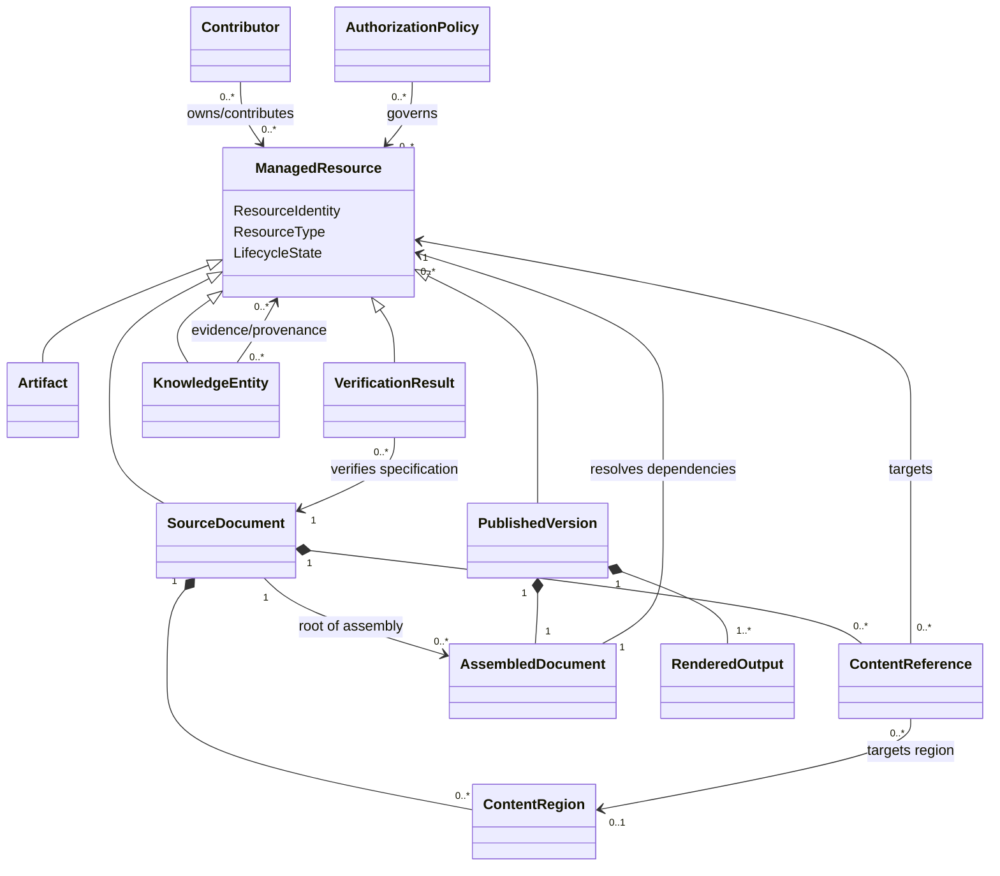

# Domain Model

**Project:** Document Management

## 1. Purpose

This document defines the conceptual domain model for the Document Management System. It translates the language established in the Project Constitution and Domain Glossary into a set of domain concepts, relationships, boundaries, lifecycle models, and invariants.

This is an analysis model rather than an implementation design. The concepts described here are not automatically database tables, service boundaries, API resources, classes, or user-interface components. Their purpose is to express the structure and behavior of the domain clearly enough to support user stories, requirements, acceptance criteria, and later architectural decisions.

## 2. Modeling Approach

The system is modeled as a network of Managed Resources connected by explicit References, Dependencies, Provenance Relationships, and Knowledge Relationships.

Several principles guide the model:

1. Identity is independent of repository location.
2. Authoritative source is distinct from assembled, generated, verified, and rendered derivatives.
3. Composition is explicit and deterministic.
4. Publications are immutable and reproducible.
5. Provenance and context are preserved.
6. Human and automated contributors participate under explicit governance.
7. Execution is intentional, controlled, and auditable.
8. Security and sensitivity policies apply across all domain areas.

## 3. Domain Areas

The model is divided into cooperating domain areas. These are conceptual boundaries and may later become bounded contexts, modules, or services.

### 3.1 Resource Management

Responsible for stable identity, version history, metadata, ownership, repository placement, classification, authorization, and lifecycle state.

Primary concepts:

- Managed Resource
- Resource Identity
- Resource Version
- Repository
- Repository Path
- Folder
- Library
- Metadata
- Tag
- Classification
- Owner
- Authorization Policy
- Lifecycle Policy

### 3.2 Document Composition

Responsible for Source Documents, Content Regions, References, Dependencies, Assembly, and impact analysis.

Primary concepts:

- Source Document
- Main Document
- Partial Document
- Aggregated Document
- Content Region
- Content Reference
- Reference Mode
- Resolution Policy
- Dependency
- Assembly
- Assembled Document
- Dependency Manifest

### 3.3 Artifact Management

Responsible for supporting files and non-document resources, including their versions, descriptions, provenance, and use within documents.

Primary concepts:

- Artifact
- Artifact Version
- Artifact Source
- Accessible Textual Description
- Diagram
- Dataset

### 3.4 Publication

Responsible for validating an assembly candidate and creating immutable, reproducible releases and rendered outputs.

Primary concepts:

- Publication Process
- Publication Candidate
- Publication Readiness
- Published Version
- Publication Number
- Source Manifest
- Dependency Manifest
- Publication Metadata
- Rendered Output

### 3.5 Knowledge and Provenance

Responsible for preserving evidence, context, interpretation, lineage, and semantic relationships.

Primary concepts:

- Evidence
- Observation
- Finding
- Insight
- Recommendation
- Decision
- Action
- Provenance
- Provenance Relationship
- Knowledge Relationship
- Contributor Perspective
- Synthesis

### 3.6 Collaboration and Governance

Responsible for contributors, ownership, comments, annotations, reviews, approvals, conflicts, reconciliation, and audit history.

Primary concepts:

- Contributor
- Human Contributor
- Automated Agent
- Owner
- Author
- Reviewer
- Approver
- Comment
- Annotation
- Review Decision
- Change Set
- Conflict
- Reconciliation
- Audit Event
- Governance Policy

### 3.7 Execution and Verification

Responsible for executable specifications, adapters, controlled execution, generated outputs, and verification evidence.

Primary concepts:

- Executable Declaration
- Executable Specification
- Acceptance Example
- Adapter
- Execution
- Execution Environment
- System Under Test
- Verification Result
- Verification Evidence
- Generated Output
- Generation Rule

### 3.8 Security and Sensitive Information

Responsible for authorization, permissions, sensitivity, consent, disclosure, redaction, and lifecycle handling.

Primary concepts:

- Authorization Policy
- Permission
- Access Control
- Sensitivity Classification
- Sensitive Information
- Consent
- Redaction
- Disclosure
- Retention Policy
- Lifecycle Policy

## 4. Core Abstractions

## 4.1 Managed Resource

Managed Resource is the common conceptual abstraction for identifiable information governed by the system.

A Managed Resource has:

- Resource Identity
- Resource Type
- Display Name
- Current Resource Version
- Version History
- Metadata
- Repository Placement
- Ownership
- Authorization Policies
- Sensitivity Classification
- Lifecycle State
- Provenance
- Audit History

Examples include:

- Source Document
- Artifact
- Published Version
- Comment
- Annotation
- Verification Result
- Generated Output
- selected semantic knowledge entities

### Managed Resource invariants

1. A Managed Resource has exactly one stable Resource Identity.
2. Resource Identity does not change when the Resource is renamed or moved.
3. Every durable change is attributable to a Contributor or Automated Agent.
4. Every durable state is represented by an identifiable Resource Version or immutable record.
5. Authorization is evaluated before protected operations are performed.
6. Sensitive Information is handled according to applicable policies.
7. A deleted repository path does not by itself erase the identity or audit history of a Managed Resource.

## 4.2 Resource Identity

Resource Identity is a stable, opaque identifier assigned when a Managed Resource is created.

Resource Identity is distinct from:

- repository path;
- display name;
- publication number;
- source-control commit identifier;
- filename;
- title.

A Resource may have historical aliases or paths, but these do not replace its identity.

## 4.3 Resource Version

A Resource Version represents an identifiable state of a Managed Resource.

A Resource Version contains or identifies:

- Resource Identity
- Version Identity
- Parent Version or Versions
- creation timestamp
- Contributor or Automated Agent
- change description
- content or content reference
- Metadata state
- checksum or equivalent integrity marker
- lifecycle state

### Versioning rules

1. Mutable authoring Resources may produce successive Resource Versions.
2. Published Versions are immutable after creation.
3. Region Versions are associated with changes inside Region Boundaries.
4. A Resource Version may have multiple parents after reconciliation or merge.
5. Version identity is not equivalent to Publication Number.

## 5. Resource Management Model

## 5.1 Repository

Repository is the managed storage environment containing Resources and their supporting records.

A Repository contains:

- Folders
- Repository Paths
- Managed Resources
- Resource Versions
- Libraries
- Governance Policies
- Audit Events

A Repository may be backed by Git, another version-control system, object storage, a database, or a combination of technologies. The domain model does not depend on one provider.

## 5.2 Repository Placement

Repository Placement associates a Managed Resource with its current Repository Path.

A Resource may have:

- one current primary path;
- historical paths;
- aliases or links;
- membership in multiple Libraries.

Moving a Resource changes its Repository Placement but not its Resource Identity.

## 5.3 Library

Library groups related Resources into a meaningful body of knowledge.

A Library has:

- Library Identity
- Name
- Description
- Owners
- Member Resources
- Entry Points
- Metadata
- Authorization Policies

A Library may include multiple Main Documents and may overlap with other Libraries.

### Library invariants

1. Library membership does not change Resource Identity.
2. A Resource may belong to multiple Libraries.
3. Access to a Library does not automatically grant access to every member Resource when a more restrictive policy applies.

## 5.4 Metadata

Metadata is structured information describing a Resource.

Metadata values may be:

- intrinsic, such as content type or checksum;
- descriptive, such as title or summary;
- contextual, such as interview date or business objective;
- administrative, such as owner or lifecycle state;
- security-related, such as sensitivity classification;
- publication-related, such as release date;
- provenance-related, such as source or generator.

Metadata Schema defines allowed fields, data types, cardinality, validation rules, required fields, and applicable Resource Types.

## 6. Document Model

## 6.1 Source Document

Source Document is the aggregate root for authored textual content.

A Source Document contains:

- Resource Identity
- current Resource Version
- Document Structure
- Metadata
- zero or more Content Regions
- zero or more Content References
- zero or more Executable Declarations
- Ownership
- Authorization Policies
- Lifecycle State

A Source Document may be designated as:

- Main Document
- Partial Document
- Aggregated Document

These designations are roles or characteristics and are not necessarily mutually exclusive.

### Source Document invariants

1. Source content remains distinct from derived assemblies and rendered outputs.
2. Content References must identify their targets by stable identity.
3. Addressable Content Regions have unique Region Identities within the Resource.
4. A Source Document cannot publish itself directly; it participates in a Publication Process.
5. Ordinary prose is not executable unless explicitly represented as an Executable Declaration.

## 6.2 Main Document

Main Document is a Source Document designated as an assembly entry point.

A Main Document has:

- entry-point designation;
- default Assembly Configuration, where defined;
- default Publication Policy, where defined;
- associated Libraries;
- publication history.

A Main Document may include original content and may reference Partial Documents, Content Regions, and Artifacts.

## 6.3 Partial Document

Partial Document is a Source Document primarily intended for reuse.

A Partial Document:

- has its own Resource Identity and Version History;
- can be referenced by multiple Destination Resources;
- may contain Content Regions;
- may itself contain References;
- may have an Owner distinct from its consumers.

Consumers of a Partial Document do not become its Owners merely by referencing it.

## 6.4 Aggregated Document

Aggregated Document is a Source Document containing at least one Inclusion Point.

Its content consists of:

- locally authored content;
- Inclusion Points;
- structural markup;
- optional executable or validation declarations.

## 6.5 Content Region

Content Region is an identifiable part of a Source Document.

A Content Region has:

- Region Identity
- Parent Document Identity
- Region Type
- Region Boundary
- current Region Version
- Region Version History
- optional Owner
- Metadata
- Authorization and sensitivity rules where needed

Possible Region Types include:

- definition;
- paragraph;
- section;
- table;
- list;
- example;
- code block;
- acceptance example;
- arbitrary named block.

### Content Region invariants

1. Region Identity is stable across ordinary edits and movement.
2. Region Identity is unique within its parent Source Document.
3. Region Boundary is explicit and unambiguous.
4. Changes outside the Region Boundary do not create a new Region Version.
5. Changes inside the Region Boundary create a new Region Version according to policy.
6. Deleting or replacing a Region must not silently redirect existing References to unrelated content.

## 7. Reference and Dependency Model

## 7.1 Content Reference

Content Reference is an entity representing a managed reuse relationship.

A Content Reference has:

- Reference Identity
- Destination Resource Identity
- Destination Location
- Source Resource Identity
- optional Region Identity
- Reference Mode
- Resolution Policy
- adopted Source Version
- last observed Source Version
- Synchronization State
- Owner or governing policy
- creation and modification history

### Content Reference invariants

1. Source and destination identities are explicit.
2. The Reference Mode is always specified.
3. Resolution is deterministic for a given recorded state.
4. Reference history is auditable.
5. A Reference never changes ownership of its Source Resource.
6. A Reference cannot silently adopt a source change contrary to its Reference Mode.
7. A Reference cannot resolve to a Resource the consumer is not authorized to use.

## 7.2 Reference Modes

### Live Reference

A Live Reference resolves according to a policy selecting the currently qualifying source state.

Behavior:

- qualifying source changes become visible without destination approval;
- every resolution records the actual source version used;
- publication freezes the resolved source version in the Dependency Manifest.

### Approval-Controlled Reference

An Approval-Controlled Reference detects qualifying source changes but does not adopt them until approval.

Behavior:

- source changes produce an update candidate;
- the current adopted version remains active until approval;
- approval or rejection is recorded;
- pending updates are visible to authorized users.

### Pinned Reference

A Pinned Reference identifies a specific immutable source version.

Behavior:

- later source changes do not affect resolution;
- changing the pin is an explicit governed change;
- the pinned target must remain identifiable and retrievable.

## 7.3 Synchronization State

A Content Reference may be in one of these conceptual states:

- Current
- Update Available
- Approval Pending
- Pinned
- Unresolved
- Conflicted
- Source Unavailable
- Unauthorized

### Reference state transitions

- Current → Update Available when a qualifying source version changes.
- Update Available → Approval Pending when an approval-controlled update is submitted.
- Approval Pending → Current when approved and adopted.
- Approval Pending → Update Available when rejected but still available.
- Any resolvable state → Unresolved when identity or policy resolution fails.
- Any state → Unauthorized when policy denies access.
- Conflicted → Current only through explicit Reconciliation.

The exact transition rules will be refined in requirements and acceptance criteria.

## 7.4 Dependency

Dependency is the semantic relationship created when one Resource relies on another.

Dependency Types include:

- inclusion;
- rendering;
- generation;
- verification;
- evidence;
- template;
- configuration;
- execution;
- publication.

Dependencies may be direct or transitive.

## 7.5 Dependency Graph

Dependency Graph is the directed graph used for Assembly, impact analysis, generation, validation, or Publication.

### Dependency Graph invariants

1. Inclusion Dependencies used for Assembly must be acyclic.
2. Every resolved Dependency records the exact Resource Version selected.
3. Authorization is evaluated during traversal.
4. Hidden or inaccessible Dependencies must not be leaked through error messages or search results.
5. The graph used for a Published Version is captured in an immutable Dependency Manifest.

## 8. Assembly Model

## 8.1 Assembly

Assembly is a domain process that begins with a Main Document and produces an Assembly Result.

Inputs include:

- Main Document Version
- Assembly Configuration
- Reference Policies
- required Artifacts
- templates
- generation or transformation rules
- authorization context

The Assembly process:

1. establishes the Main Document as the root;
2. resolves Content References;
3. traverses Dependencies;
4. detects unresolved References and cycles;
5. validates authorization and sensitivity rules;
6. incorporates source content and Artifacts;
7. produces the Assembled Document;
8. records the Dependency Manifest and diagnostics.

## 8.2 Assembly Result

Assembly Result is a value-bearing record containing:

- status;
- Assembled Document, if successful;
- Dependency Manifest;
- warnings;
- errors;
- unresolved References;
- detected cycles;
- validation findings;
- source and configuration identifiers.

Possible statuses:

- Successful
- Successful with Warnings
- Failed

## 8.3 Assembled Document

Assembled Document is an immutable result of one Assembly operation.

It contains or identifies:

- root Main Document Version;
- resolved text;
- embedded or linked Artifact Versions;
- Dependency Manifest;
- Assembly Configuration;
- integrity marker;
- diagnostics.

An Assembled Document is not yet a Published Version.

### Assembly invariants

1. The same recorded inputs produce the same resolved text.
2. Every included Resource Version appears in the Dependency Manifest.
3. No unresolved inclusion Reference is permitted in a successful Assembly.
4. No unresolved Inclusion Cycle is permitted in a successful Assembly.
5. Assembly does not mutate authoritative Source Documents.

## 9. Artifact Model

## 9.1 Artifact

Artifact is the aggregate root for a non-document managed resource.

An Artifact has:

- Resource Identity
- Artifact Type
- current Artifact Version
- Version History
- Metadata
- Accessible Textual Description
- optional Artifact Source
- Ownership
- Provenance
- Authorization Policies
- Sensitivity Classification

## 9.2 Artifact Version

Artifact Version contains or identifies:

- binary or textual content;
- content type;
- checksum;
- source version, where applicable;
- creation information;
- Metadata;
- Provenance;
- preview or derived forms.

### Artifact invariants

1. Artifact identity remains stable across versions.
2. Published use resolves to a specific Artifact Version.
3. The Artifact's accessible description is versioned or linked to the applicable Artifact Version.
4. Derived previews do not replace the authoritative Artifact content or source.
5. Sensitive Artifacts are not included in publications without authorization.

## 10. Publication Model

## 10.1 Publication Candidate

Publication Candidate represents an Assembled Document being evaluated for release.

It has:

- Assembled Document
- proposed Publication Number
- Publication Metadata
- required approvals
- validation results
- sensitivity and disclosure evaluation
- proposed Rendered Outputs

## 10.2 Publication Readiness

Publication Readiness is determined by a set of policies and validations.

A candidate may be ready only when:

- Assembly succeeded;
- all required References resolved;
- required Metadata is present;
- required approvals are complete;
- required Verification Results satisfy policy;
- disclosure and sensitivity rules permit release;
- Publication Number is valid and unused;
- required Rendered Outputs can be produced.

## 10.3 Publication Process

Publication Process is a domain service coordinating validation and release.

The process:

1. accepts a Publication Candidate;
2. evaluates Publication Readiness;
3. assigns or confirms a Publication Number;
4. freezes the Source Manifest and Dependency Manifest;
5. renders required outputs;
6. records Publication Metadata and approvals;
7. creates the immutable Published Version;
8. emits Audit Events.

## 10.4 Published Version

Published Version is an immutable aggregate root representing a released body of content.

A Published Version contains or identifies:

- Published Version Identity
- Publication Number
- Main Document Identity
- Assembled Document
- Source Manifest
- Dependency Manifest
- Publication Metadata
- Rendered Outputs
- approvals
- Verification Results required for release
- integrity markers
- release timestamp
- release actor
- lifecycle state

### Published Version invariants

1. A Published Version is immutable.
2. Publication Number is unique within its numbering scope.
3. Every Rendered Output is traceable to the Published Version.
4. Every source and dependency version is recorded.
5. Corrections create a new Published Version.
6. Withdrawal or supersession changes lifecycle status without modifying released content.
7. A Published Version cannot be created from a failed Assembly Result.

## 10.5 Published Version lifecycle

Conceptual states:

- Published
- Superseded
- Withdrawn
- Archived

Transitions:

- Published → Superseded when a newer Published Version replaces it for current use.
- Published or Superseded → Withdrawn when it should no longer be relied upon.
- Published, Superseded, or Withdrawn → Archived when moved out of ordinary use.

The content remains immutable through all lifecycle states.

## 11. Knowledge and Provenance Model

## 11.1 Knowledge Entity

Knowledge Entity is the common abstraction for semantically meaningful information that may exist independently of a complete Document.

Candidate Knowledge Entity Types:

- Observation
- Finding
- Insight
- Recommendation
- Decision
- Action

A Knowledge Entity has:

- stable identity;
- type;
- statement or structured content;
- context;
- creator;
- creation date;
- status;
- supporting Evidence;
- Provenance Relationships;
- Knowledge Relationships;
- applicable Metadata and authorization.

Whether each Knowledge Entity Type is modeled as a separate aggregate or as a typed entity will be resolved during implementation design.

## 11.2 Evidence

Evidence is a role played by a Managed Resource or Knowledge Entity when used to support another claim or conclusion.

Evidence may point to:

- a Source Document;
- a Content Region;
- an Artifact Version;
- a Dataset;
- a recording;
- a Verification Result;
- another Knowledge Entity.

Evidence Relationship records:

- supported entity;
- evidence source;
- evidence version;
- relationship type;
- relevance or rationale;
- contributor;
- date.

## 11.3 Observation, Finding, and Insight

### Observation

Records something directly noticed, measured, stated, or captured.

### Finding

Records a supported conclusion drawn from one or more Observations or pieces of Evidence.

### Insight

Records an interpretation of significance, pattern, implication, or opportunity derived from Findings or Evidence.

### Invariants

1. Findings identify supporting Evidence or explicitly state that they are unsupported hypotheses.
2. Insights identify contributing Findings, Evidence, or assumptions.
3. Synthesized entities preserve links to all material contributing sources.
4. Updating a source does not silently rewrite an existing historical Finding or Insight.

## 11.4 Recommendation, Decision, and Action

### Recommendation

Proposes a course of action and identifies supporting Findings, Insights, objectives, or policies.

### Decision

Records a choice, decision makers, alternatives, rationale, date, status, and supporting information.

### Action

Records work undertaken or planned as a result of a Decision, Recommendation, obligation, or Need.

Typical relationships:

- Insight supports Recommendation.
- Recommendation informs Decision.
- Decision authorizes Action.
- Action addresses Need.
- Verification Result evaluates Action outcome.

## 11.5 Provenance Relationship

Provenance Relationship records lineage between a derived entity and its source.

Relationship Types may include:

- derived from;
- summarized from;
- synthesized from;
- generated from;
- transformed from;
- verified by;
- supported by;
- quoted from;
- supersedes;
- contradicts.

A Provenance Relationship contains:

- relationship identity;
- source identity and version;
- derived identity and version;
- relationship type;
- transformation or rationale;
- Contributor or Automated Agent;
- timestamp;
- optional confidence or review status.

## 12. Collaboration and Governance Model

## 12.1 Contributor

Contributor is a role played by a Human Contributor or Automated Agent.

Contributor actions may include:

- authoring;
- reviewing;
- approving;
- commenting;
- executing;
- generating;
- publishing;
- administering.

## 12.2 Ownership

Ownership associates a Contributor or organizational role with accountability for a Managed Resource.

Ownership may include responsibility for:

- maintaining authoritative content;
- approving changes;
- governing Reference propagation;
- classifying sensitivity;
- authorizing Publication;
- responding to conflicts.

Ownership does not automatically grant every Permission.

## 12.3 Change Set

Change Set groups related changes for review, commitment, approval, or reconciliation.

A Change Set has:

- Change Set Identity
- base Version or Versions
- proposed changes
- Contributor
- rationale
- status
- review history
- conflicts
- resulting Version, when applied

Conceptual states:

- Draft
- Submitted
- Under Review
- Approved
- Rejected
- Applied
- Superseded

## 12.4 Conflict and Reconciliation

Conflict occurs when changes or policies cannot be combined automatically without violating an invariant or losing meaning.

Conflict Types may include:

- concurrent content edit;
- Region deletion versus Reference use;
- source update versus local override;
- Metadata conflict;
- authorization conflict;
- policy conflict;
- publication-number conflict.

Reconciliation:

- preserves all acknowledged inputs;
- records the selected resolution;
- records the Contributor or Agent responsible;
- records rejected or superseded alternatives;
- emits an Audit Event.

## 12.5 Comment and Annotation

Comment is a Managed Resource participating in a discussion.

Annotation is a Managed Resource attached to a specific Resource, Version, Content Region, or location.

Comments and Annotations:

- do not become authoritative source content by default;
- retain author and timestamp;
- may have lifecycle states;
- may be resolved, superseded, or archived;
- inherit or refine authorization from their target.

## 12.6 Audit Event

Audit Event is an immutable record of a significant domain action.

Audit Event includes:

- event identity;
- event type;
- actor;
- timestamp;
- target Resource;
- relevant before and after identities;
- outcome;
- authorization context;
- correlation to a Change Set, Execution, or Publication Process.

Auditable events include:

- creation and durable modification;
- approval and rejection;
- Reference adoption or pin change;
- conflict resolution;
- privileged access;
- execution;
- publication;
- redaction;
- disclosure;
- lifecycle transition.

## 13. Execution and Verification Model

## 13.1 Executable Declaration

Executable Declaration is a structured, explicitly marked part of a Source Document or Content Region.

It identifies:

- declaration type;
- interpreter or Adapter;
- input parameters;
- expected output or assertion;
- authorization requirements;
- execution policy;
- source location and Version.

## 13.2 Executable Specification

Executable Specification is a Source Document or Content Region containing one or more Executable Declarations or Acceptance Examples.

An Executable Specification remains human-readable and traceable to Behavioral Requirements.

## 13.3 Execution

Execution is a controlled domain process.

Inputs:

- Executable Specification Version;
- Adapter Version;
- Execution Environment;
- System Under Test Version;
- authorization context;
- input data;
- Dependency Manifest.

Outputs:

- Verification Result;
- Verification Evidence;
- Generated Output, where applicable;
- Audit Events.

### Execution invariants

1. Ordinary prose is never executed implicitly.
2. Execution requires explicit authorization.
3. Execution records exact source and tool Versions.
4. Execution does not mutate authoritative source unless a separate governed Change Set is created.
5. Sensitive inputs and outputs obey applicable policies.
6. A Verification Result is immutable after completion.

## 13.4 Verification Result

Verification Result is an immutable Managed Resource.

It records:

- Verification Result Identity
- specification identity and Version
- System Under Test identity and Version
- Adapter and tool Versions
- Execution Environment
- start and completion times
- Outcome
- assertions evaluated
- Verification Evidence
- logs and diagnostics
- Contributor or Automated Agent

Conceptual Outcomes:

- Passed
- Failed
- Error
- Skipped
- Inconclusive
- Not Executed

## 13.5 Generated Output

Generated Output is a derived Managed Resource produced by a Generation Rule or Execution.

Examples:

- source code;
- test code;
- configuration;
- diagrams;
- reports;
- deployment manifests;
- operational instructions.

Generated Output has:

- stable identity where it is independently managed;
- source identities and Versions;
- Generation Rule Version;
- tool Version;
- generation timestamp;
- Provenance;
- integrity marker;
- regeneration policy.

Generated Output never becomes authoritative source merely by being produced.

## 14. Security and Sensitive Information Model

## 14.1 Authorization Policy

Authorization Policy determines whether an actor may perform an operation on a Resource.

Policy evaluation may consider:

- actor identity and roles;
- Resource ownership;
- Resource Type;
- Library membership;
- Sensitivity Classification;
- requested operation;
- lifecycle state;
- purpose or context;
- inherited and explicit policies.

## 14.2 Permission

Conceptual Permissions include:

- View
- Create
- Modify
- Comment
- Review
- Approve
- Reference
- Execute
- Publish
- Disclose
- Redact
- Administer

## 14.3 Policy precedence

When policies differ:

1. explicit denial overrides inherited grant unless an approved exception applies;
2. Resource-specific policy overrides broader Library or Repository policy;
3. Sensitivity restrictions cannot be weakened by ordinary ownership;
4. Publication and Disclosure require their own authorization checks;
5. Automated Agents receive no implicit privileges beyond assigned policy.

## 14.4 Sensitive Information

Sensitive Information may exist in:

- Source Documents;
- Content Regions;
- Artifacts;
- Metadata;
- Comments;
- Verification Evidence;
- Rendered Outputs;
- Published Versions.

A Resource or Region may carry a Sensitivity Classification.

Sensitive-information controls may include:

- access restriction;
- redacted views;
- consent validation;
- disclosure approval;
- retention policy;
- publication exclusion;
- audit requirements.

## 14.5 Redaction

Redaction creates a controlled representation in which protected content is concealed or removed.

Redaction does not silently alter authoritative source. It records:

- target identity and Version;
- redaction rule;
- redacted location or field;
- actor;
- date;
- reason;
- resulting representation.

## 15. Aggregate Boundaries

The following aggregate boundaries are proposed for consistency and transaction control.

## 15.1 Source Document Aggregate

Aggregate root: Source Document

Contains or governs:

- Document Structure
- Content Regions
- Inclusion Points
- Content References owned by the Document
- Executable Declarations
- local Metadata

External references:

- Artifacts
- Owners and Contributors
- Libraries
- Authorization Policies
- Comments and Annotations

Primary consistency rules:

- Region identities are unique within the Document.
- local structure and Region Boundaries remain valid.
- Content References have valid Destination Locations.

## 15.2 Artifact Aggregate

Aggregate root: Artifact

Contains or governs:

- Artifact Versions
- Artifact Source relationship
- Accessible Textual Descriptions
- Artifact Metadata

Primary consistency rules:

- Version history is ordered and attributable.
- integrity markers correspond to content.
- applicable description and provenance are preserved.

## 15.3 Content Reference Aggregate

Aggregate root: Content Reference

Contains or governs:

- Reference Mode
- Resolution Policy
- adopted and observed Versions
- Synchronization State
- update candidates
- approval history

Primary consistency rules:

- state transitions follow Reference Mode.
- adoption is explicit where approval is required.
- source identity and Version history are retained.

## 15.4 Published Version Aggregate

Aggregate root: Published Version

Contains or governs:

- Publication Number
- Assembled Document
- Source Manifest
- Dependency Manifest
- Publication Metadata
- Rendered Outputs
- release approvals
- required Verification Results

Primary consistency rules:

- aggregate is immutable after creation.
- manifests are complete.
- outputs correspond to the recorded assembly.

## 15.5 Knowledge Entity Aggregate

Aggregate root: Knowledge Entity

Contains or governs:

- entity statement or structured content
- Context
- Evidence links
- Knowledge Relationships
- Provenance Relationships
- review status

Primary consistency rules:

- required evidence and provenance are present by entity type.
- semantic relationships are typed.
- historical conclusions are not silently rewritten when evidence changes.

## 15.6 Verification Result Aggregate

Aggregate root: Verification Result

Contains or governs:

- execution details
- assertions
- Outcome
- Verification Evidence references
- diagnostics

Primary consistency rules:

- result is immutable after completion.
- all execution inputs are identified.
- evidence remains traceable and authorized.

## 16. Domain Services

The following behaviors cross aggregate boundaries and are modeled as domain services.

### Reference Resolver

Resolves a Content Reference according to identity, policy, authorization, and Version state.

### Dependency Analyzer

Builds Dependency Graphs, discovers inbound and outbound Dependencies, and performs impact analysis.

### Assembly Service

Coordinates deterministic traversal and creates an Assembly Result.

### Publication Service

Evaluates Publication Readiness and creates Published Versions.

### Provenance Service

Records and validates Provenance Relationships across Resources and Knowledge Entities.

### Search and Discovery Service

Indexes and retrieves Resources while enforcing authorization and sensitivity policies.

### Reconciliation Service

Coordinates conflict resolution across Change Sets or Reference updates.

### Execution Service

Executes explicitly designated content in a controlled environment and creates Verification Results.

### Generation Service

Applies Generation Rules and records Generated Outputs and Provenance.

### Authorization Service

Evaluates Authorization Policies for Resources, operations, execution, Publication, and Disclosure.

### Redaction Service

Produces authorized redacted representations without modifying authoritative source.

## 17. Key Relationships

The principal relationships are summarized below.

- Repository contains Managed Resources.
- Folder locates Managed Resources hierarchically.
- Library groups Managed Resources semantically.
- Source Document contains Content Regions.
- Main Document is an assembly role of Source Document.
- Partial Document is a reuse role of Source Document.
- Aggregated Document owns Inclusion Points.
- Content Reference connects a Destination Resource to a Source Resource or Content Region.
- Content Reference creates a Dependency.
- Assembly traverses a Dependency Graph.
- Assembly produces an Assembled Document and Dependency Manifest.
- Publication Process consumes an Assembled Document.
- Publication Process creates a Published Version.
- Published Version owns or identifies Rendered Outputs.
- Evidence supports Findings, Insights, Recommendations, or Decisions.
- Provenance Relationship connects derived information to source information.
- Decision authorizes or motivates Action.
- Executable Specification is evaluated against a System Under Test.
- Execution creates a Verification Result.
- Generation Rule produces a Generated Output.
- Contributor performs actions recorded as Audit Events.
- Authorization Policy governs operations on Managed Resources.

## 18. Conceptual Model Diagram

This diagram is intentionally simplified. It shows conceptual relationships rather than complete cardinality or implementation ownership.

## 19. Principal Invariants

The following invariants govern the model as a whole:

1. Every Managed Resource has stable identity independent of location.
2. Authoritative Source Documents remain distinct from derived representations.
3. Every durable change is attributable and auditable.
4. A successful Assembly has no unresolved inclusion References or invalid cycles.
5. Every Assembly and Published Version records exact dependency Versions.
6. Published Versions and completed Verification Results are immutable.
7. Reference behavior follows its declared Reference Mode.
8. Approval-controlled changes are never adopted without approval.
9. A Pinned Reference never advances implicitly.
10. No acknowledged work is silently discarded.
11. Provenance is preserved across synthesis, generation, publication, and verification.
12. Authorization is enforced during search, resolution, assembly, execution, publication, and disclosure.
13. Ordinary prose is not executed implicitly.
14. Generated Outputs never replace authoritative source merely by being generated.
15. Sensitive Information is not disclosed or published contrary to policy.
16. Historical conclusions and publications are not silently rewritten when their sources change.
17. Repository movement does not break stable identity or resolvable References.
18. The same recorded Assembly inputs produce the same Assembled Document.

## 20. Open Modeling Questions

The following questions should be resolved through user stories, requirements, acceptance examples, and architecture decisions:

1. Are Knowledge Entities always independent Managed Resources, or may some exist only as typed Content Regions?
2. Which Source Document roles may coexist on one Document?
3. What exact events create a new Resource Version and Region Version?
4. How are deleted or split Content Regions represented without breaking history?
5. Can a Content Reference target a query or collection, or only a stable identity?
6. What Resolution Policies are allowed for Live References?
7. Are local overlays on referenced content permitted, or must a consumer fork the source?
8. How are Reference updates batched and approved?
9. What is the numbering scope for Publication Numbers?
10. Which Verification Results are required for Publication Readiness?
11. How are generated outputs reviewed and promoted into authored source, if ever?
12. How are policy inheritance and exceptions represented?
13. What privacy and consent rules apply to recordings, photographs, interview identities, and derived insights?
14. Which audit events are immutable and how are they retained?
15. How does repository synchronization map source-control commits to domain Change Sets and Resource Versions?
16. How are relationship types governed and extended?
17. How are search indexes updated while preserving authorization boundaries?
18. How are withdrawn Published Versions presented to users and automated consumers?

## 21. Traceability to Governing Documents

This model is governed by and derived from:

- [Project Constitution](./00-project-constitution.md)
- [Domain Glossary](./01-domain-glossary.md)
- [Customer Insight Documentation System Vision](./00.01-Interview-Constitution.md)
- [Referenced Content Management Vision](./00.02-Partial-References.md)
- [Documentation as Executable Code](./00.03.Literate-Programming.md)
- [Documentation as Test](./00.04.FitNesse.md)

Changes to this model that conflict with the Project Constitution require a constitutional amendment. Changes that introduce or redefine canonical terms require a corresponding update to the Domain Glossary.
