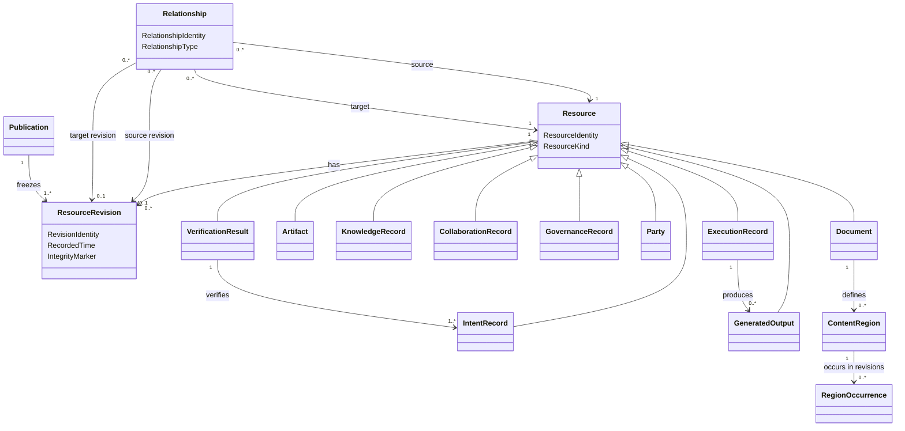

# Domain Model

**Project:** Document Management

## 1. Purpose

This document defines the conceptual domain model for the Document Management System.

The model is centered on one core pattern:

> The system is a graph of versioned Resources connected by explicit Relationships.

The model deliberately keeps the number of foundational concepts small. Documents, artifacts, knowledge records, generated outputs, verification results, parties, intent records, collaboration records, governance records, and execution records are expressed as Resource Kinds. Composition, provenance, evidence, meaning, coverage, verification, intent, and succession are expressed as Relationship Types.

This is an analysis model, not an implementation design. The concepts below are not automatically database tables, services, classes, or API resources.

## 2. Core Model

The domain has three foundational concepts:

1. **Resource** — the continuing identity of something managed by the system.
2. **Resource Revision** — an immutable recorded state of a Resource.
3. **Relationship** — an explicit, typed connection between Resources or Resource Revisions.

```text
Resource
  has one stable identity
  has many revisions
  may participate in many relationships

Resource Revision
  records one immutable state of a Resource
  may derive from one or more earlier revisions

Relationship
  connects a source to a target
  has a type with defined semantics
  may target continuing Resources or exact Revisions
```

## 3. Resource

A Resource is the continuing identity of a managed thing.

A Resource has:

- Resource Identity;
- Resource Kind;
- creation information;
- zero or more Resource Revisions;
- zero or more Relationships;
- applicable governance and access rules.

### Resource invariants

1. Every Resource has exactly one stable Resource Identity.
2. Resource Identity is independent of name, title, filename, folder, repository path, or publication number.
3. Moving or renaming a Resource does not create a new Resource.
4. A Resource is not silently replaced by unrelated content.
5. Every durable state of a Resource is represented by a Resource Revision or another explicit immutable record.

## 4. Resource Revision

A Resource Revision is an immutable record of a Resource at a particular point in its history.

A Resource Revision has:

- Revision Identity;
- Resource Identity;
- zero or more parent Revision Identities;
- recorded content or payload;
- revision Metadata;
- author or Automated Agent;
- recorded time;
- change description;
- integrity marker.

### Resource Revision invariants

1. A recorded Resource Revision is immutable.
2. A new durable state creates a new Resource Revision.
3. A Revision belongs to exactly one Resource.
4. A Revision may have more than one parent after merge or reconciliation.
5. Revision Identity is distinct from publication numbering and repository commit identity.
6. Historical Revisions remain addressable after newer Revisions exist.

## 5. Relationship

A Relationship is an explicit, typed connection between two identified things.

A Relationship may connect:

- Resource to Resource;
- Resource Revision to Resource Revision;
- Resource to Resource Revision;
- a Resource or Revision to a Content Region.

A Relationship has:

- Relationship Identity;
- Relationship Type;
- source identity;
- target identity;
- optional source Revision;
- optional target Revision;
- creation information;
- optional effective period;
- optional Metadata.

### Relationship invariants

1. Source and target are explicit.
2. Relationship Type is explicit.
3. A Relationship does not transfer ownership of its target.
4. Historical Relationships are not silently rewritten.
5. A Relationship targeting an exact Revision always resolves to that Revision.
6. A Relationship targeting a continuing Resource requires an explicit revision-selection rule when a Revision must be selected.

## 6. Contract Model

A contract defines the minimum semantics required by a Resource Kind or Relationship Type.

A contract states:

- what payload is required;
- which Relationships are required or allowed;
- whether the Resource or Relationship is mutable through new Revisions;
- which invariants apply;
- which roles it may play.

Contracts preserve the simplified graph model. They do not create separate subsystems.

## 7. Resource Kind Contracts

The model defines ten Resource Kind contracts.

### 7.1 Document Contract

A **Document** is a Resource whose Revisions contain structured text.

#### Required revision payload

A Document Revision contains:

- structured textual content;
- document Metadata;
- zero or more Content Regions;
- zero or more Reference Declarations;
- zero or more Executable Declarations.

#### Allowed relationships

A Document may participate in:

- **Includes** relationships;
- **Derived From** relationships;
- **Supports** or **Contradicts** relationships;
- **Covers** relationships;
- **Addresses** relationships;
- **Supersedes** relationships;
- library membership and accountability relationships.

#### Roles

A Document may play the role of:

- Main Document — selected as an Assembly entry point;
- Partial Document — reused by another Document;
- Composite Document — contains one or more Reference Declarations;
- Template — used to shape another output;
- Executable Specification — contains explicit executable declarations;
- Evidence — supports or challenges another Resource.

#### Invariants

1. Document content changes create a new Document Revision.
2. A Document Revision remains distinct from assemblies and rendered outputs.
3. Ordinary prose is not executable unless explicitly declared.
4. Reference Declarations identify targets by stable identity.
5. Region identities are unique within the Document Resource.

### 7.2 Artifact Contract

An **Artifact** is a Resource whose Revisions contain or identify supporting content that is not primarily authored document text.

Examples include images, diagrams, datasets, spreadsheets, recordings, PDFs, and generated charts.

#### Required revision payload

An Artifact Revision contains:

- content or content location;
- content type;
- integrity marker;
- Artifact Metadata;
- an accessible textual description where applicable;
- optional editable source reference.

#### Allowed relationships

An Artifact may participate in:

- **Includes** relationships;
- **Derived From** relationships;
- **Supports** or **Contradicts** relationships;
- **Supersedes** relationships.

#### Roles

An Artifact may play the role of:

- Evidence;
- Diagram;
- Dataset;
- Template;
- Rendered Output;
- Verification Evidence.

#### Invariants

1. Artifact Identity remains stable across Revisions.
2. Publication use resolves to an exact Artifact Revision.
3. An accessible description is versioned or linked to the applicable Revision.
4. A preview does not replace authoritative Artifact content.

### 7.3 Knowledge Record Contract

A **Knowledge Record** is a Resource whose Revisions express a meaningful assertion, interpretation, choice, or intended action.

Supported Knowledge Record kinds are:

- Observation;
- Finding;
- Insight;
- Recommendation;
- Decision;
- Action.

#### Required revision payload

A Knowledge Record Revision contains:

- statement or structured content;
- author;
- context;
- recorded time;
- status;
- assumptions where applicable.

#### Allowed relationships

A Knowledge Record may participate in:

- **Supports** and **Contradicts** relationships;
- **Derived From** relationships;
- **Relates To** relationships;
- **Addresses** relationships;
- **Supersedes** relationships.

#### Additional kind rules

- A Finding identifies supporting Evidence or is explicitly marked as a hypothesis.
- An Insight identifies contributing Findings, Evidence, or assumptions.
- A Recommendation identifies the reasoning or objectives behind it.
- A Decision records rationale and decision authority.
- An Action records the Decision, Recommendation, obligation, or Need that motivated it when known.

#### Invariants

1. Historical Knowledge Record Revisions are never silently rewritten.
2. Competing or contradictory records may coexist.
3. Synthesized knowledge retains provenance to material sources.
4. A later conclusion supersedes rather than erases an earlier conclusion.

### 7.4 Generated Output Contract

A **Generated Output** is a Resource produced from one or more source Revisions through an explicit generation rule or execution.

Examples include code, tests, configuration, diagrams, reports, and deployment manifests.

#### Required revision payload

A Generated Output Revision contains:

- generated content or content location;
- source Revision identities;
- generation rule identity and Revision;
- tool version;
- generation time;
- integrity marker.

#### Required relationships

Every Generated Output Revision has at least one **Derived From** relationship to an exact source Revision.

#### Allowed relationships

A Generated Output may participate in:

- **Derived From** relationships;
- inverse **Verifies** relationships from Verification Results;
- **Supersedes** relationships;
- **Includes** relationships when reused elsewhere.

#### Invariants

1. Generated Output never becomes authoritative source merely by being generated.
2. Exact source Revisions and tool versions are recorded.
3. Regeneration creates a new Revision when the generated content changes.
4. Generated Output remains traceable to its generation inputs.

### 7.5 Verification Result Contract

A **Verification Result** is an immutable Resource recording the outcome of evaluating a specification, claim, requirement, acceptance example, or output against a target.

#### Required payload

A Verification Result records:

- specification, claim, Requirement, or Acceptance Example identity and Revision;
- target Resource and Revision;
- execution environment;
- adapter or tool version;
- start and completion times;
- outcome;
- logs, diagnostics, or Evidence references.

Supported outcomes include:

- Passed;
- Failed;
- Error;
- Skipped;
- Inconclusive.

#### Required relationships

A Verification Result has:

- a **Verifies** relationship to the specification, claim, Requirement, Acceptance Example, or output evaluated;
- a **Relates To** relationship to the target evaluated;
- **Derived From** relationships to exact execution inputs where required.

#### Roles

A Verification Result may play the role of Evidence.

#### Invariants

1. A completed Verification Result is immutable.
2. Exact specification, target, environment, and tool versions are recorded.
3. Ordinary prose is not executed implicitly.
4. Execution does not mutate authoritative source without creating a separate Revision.

### 7.6 Intent Record Contract

An **Intent Record** is a Resource whose Revisions express a problem, desired outcome, governing rule, planned change, or expected behavior.

Supported Intent Record kinds are:

- Need;
- Goal;
- Objective;
- Requirement;
- Behavioral Requirement;
- Business Rule;
- Acceptance Example;
- Outcome;
- Initiative;
- Opportunity;
- Product Idea.

#### Required revision payload

An Intent Record Revision contains:

- statement or structured expression;
- author or originating party;
- context;
- status;
- rationale where applicable;
- priority or importance where applicable;
- acceptance or success conditions where applicable.

#### Additional kind rules

- A Need states a problem, opportunity, or unmet condition.
- A Goal or Objective states a desired future condition.
- A Requirement states a testable capability, behavior, quality, or constraint.
- A Behavioral Requirement identifies observable behavior under defined conditions.
- A Business Rule states a rule governing domain behavior or decisions.
- An Acceptance Example records inputs, relevant conditions, and expected outcomes.
- An Outcome records an intended or observed result.
- An Initiative groups coordinated work toward one or more Goals.

#### Allowed relationships

An Intent Record may participate in:

- **Addresses** relationships;
- **Covers** relationships;
- **Verifies** relationships from Verification Results;
- **Supports** and **Contradicts** relationships;
- **Derived From** relationships;
- **Relates To** relationships;
- **Supersedes** relationships.

#### Invariants

1. A Requirement intended for implementation is objectively testable or explicitly marked as non-verifiable with rationale.
2. An Acceptance Example identifies the Requirement or Business Rule it covers.
3. Historical Intent Record Revisions remain visible.
4. Superseding intent does not erase earlier rationale or decisions.

### 7.7 Collaboration Record Contract

A **Collaboration Record** is a Resource whose Revisions preserve discussion, annotation, review, or collaborative interpretation associated with another Resource, Revision, Region, Relationship, or Publication.

Supported Collaboration Record kinds are:

- Comment;
- Annotation;
- Discussion Entry;
- Review Decision;
- Follow-up Note.

#### Required revision payload

A Collaboration Record Revision contains:

- author;
- recorded time;
- textual or structured content;
- target identity and optional exact target Revision or Region;
- collaboration kind;
- status.

#### Additional kind rules

- A Comment contributes to a discussion.
- An Annotation refers to a specific target location or object.
- A Review Decision records approval, rejection, changes requested, or another review outcome.
- A Follow-up Note records subsequent interpretation, clarification, or action information.

#### Allowed relationships

A Collaboration Record may participate in:

- **Relates To** relationships;
- **Supports** or **Contradicts** relationships;
- **Addresses** relationships;
- **Supersedes** relationships.

#### Invariants

1. A Collaboration Record does not become authoritative source content by default.
2. Author, time, and target are preserved.
3. Resolving a discussion does not erase its history.
4. A Review Decision identifies the exact Revision, Relationship, change, or Publication reviewed.

### 7.8 Governance Record Contract

A **Governance Record** is an immutable or revisioned Resource that records a policy, authorization, consent, controlled disclosure, redaction, retention rule, conflict, or reconciliation decision.

Supported Governance Record kinds are:

- Authorization Policy;
- Sensitivity Classification;
- Consent Record;
- Disclosure Record;
- Redaction Record;
- Retention Policy;
- Lifecycle Policy;
- Change Set;
- Conflict;
- Reconciliation Decision;
- Publication Assessment;
- Quality Gate Decision.

#### Required revision payload

A Governance Record Revision contains, as applicable:

- governing rule, finding, or decision;
- actor or authority;
- target Resource, Revision, Relationship, Region, Publication, or scope;
- effective period;
- status;
- rationale;
- conditions and obligations;
- resulting action or outcome.

#### Additional kind rules

- A Consent Record identifies the consenting party, permitted use, scope, and period.
- A Disclosure Record identifies recipient, purpose, disclosed content, authority, and time.
- A Redaction Record identifies source, redaction rule, concealed content scope, and resulting representation.
- A Conflict records competing changes or rules without discarding either side.
- A Reconciliation Decision records how a Conflict was resolved and which inputs were retained, rejected, or superseded.
- A Publication Assessment records readiness checks, approvals, validation findings, and outcome.
- A Quality Gate Decision records the policy evaluation and whether progression is allowed or blocked.

#### Allowed relationships

A Governance Record may participate in:

- **Relates To** relationships;
- **Addresses** relationships;
- **Derived From** relationships;
- **Supports** or **Contradicts** relationships;
- **Supersedes** relationships.

#### Invariants

1. Privileged and sensitive actions identify the governing authority.
2. Consent, disclosure, and redaction preserve exact scope and time.
3. Conflict and reconciliation records preserve acknowledged alternatives.
4. Publication and quality-gate decisions identify the evidence and policy evaluated.
5. Governance history is never silently rewritten.

### 7.9 Party Contract

A **Party** is a Resource representing a person, organization, team, role-bearing group, customer, or automated actor that participates in the domain.

Supported Party kinds are:

- Person;
- Organization;
- Team;
- Customer Organization;
- Automated Agent.

#### Required revision payload

A Party Revision contains:

- display name or identifier;
- Party kind;
- relevant contact or descriptive Metadata where permitted;
- status;
- applicable sensitivity and privacy Metadata.

#### Allowed relationships

A Party may participate in:

- **Relates To** relationships;
- **Addresses** relationships where acting toward a Need or Objective;
- accountability, participation, authorship, review, approval, consent, and organizational membership relationships;
- **Supersedes** relationships where one organizational identity replaces another.

#### Roles

A Party may play the role of:

- Contributor;
- Author;
- Interview Participant;
- Interviewer;
- Reviewer;
- Approver;
- Owner;
- Decision Maker;
- Consent Grantor;
- Disclosure Recipient;
- System Operator.

#### Invariants

1. Roles are contextual and do not permanently redefine the Party.
2. Sensitive Party information is governed by explicit policy.
3. Historical participation and accountability remain traceable.

### 7.10 Execution Record Contract

An **Execution Record** is an immutable Resource recording a controlled execution of an executable declaration, specification, generation rule, workflow, or operational instruction.

#### Required payload

An Execution Record contains:

- executable declaration, specification, or rule identity and Revision;
- target Resource or environment;
- input identities and Revisions;
- adapter, interpreter, or tool version;
- execution environment;
- authorization context;
- start and completion times;
- outcome;
- produced outputs;
- logs and diagnostics.

Supported outcomes include:

- Succeeded;
- Failed;
- Error;
- Cancelled;
- Inconclusive.

#### Allowed relationships

An Execution Record may participate in:

- **Derived From** relationships to exact execution inputs;
- **Produces** relationships to Generated Outputs;
- **Relates To** relationships to execution targets;
- **Supports** or **Contradicts** relationships when the execution is used as Evidence;
- **Verifies** relationships when the execution performs verification.

#### Invariants

1. Execution is explicit and authorized.
2. Exact executable source, inputs, environment, and tool versions are recorded.
3. Execution does not mutate authoritative source without creating a new Revision through a governed change.
4. Produced outputs remain traceable to the Execution Record.
5. A completed Execution Record is immutable.

## 8. Publication Record

A **Publication** is an immutable graph-snapshot record rather than a normally revisioned Resource Kind.

A Publication freezes one assembled graph as a named release.

It records:

- Publication Identity;
- Publication Number;
- root Document Resource and Revision;
- Assembled Document;
- Resolution Manifest;
- publication Metadata;
- Rendered Outputs;
- approvals;
- release time;
- release actor.

### Publication invariants

1. Publication content is immutable.
2. Publication Number is unique within its numbering scope.
3. Every included Resource Revision is recorded.
4. Every Rendered Output is traceable to the Publication.
5. Corrections create a new Publication.
6. Supersession or withdrawal does not alter released content.
7. A Publication cannot be created from a failed Assembly.

Publication succession is expressed through **Supersedes** relationships between Publication records.

## 9. Relationship Type Contracts

The model defines ten Relationship Type contracts.

### 9.1 Includes Contract

**Includes** is a Structural Relationship stating that one Resource Revision incorporates another Resource, Resource Revision, or Content Region.

#### Source

- usually a Document Revision;
- may be another compositional Resource Revision.

#### Target

- Resource;
- exact Resource Revision;
- Content Region.

#### Required data

- inclusion location;
- Reference Mode;
- revision-selection rule when the target is a continuing Resource;
- presentation or inclusion options.

#### Invariants

1. Includes participates in Assembly.
2. Target selection is deterministic.
3. Pinned inclusion resolves to an exact Revision.
4. Approval-Controlled inclusion does not adopt a newer Revision without approval.
5. The Includes graph used by one successful Assembly is acyclic.

### 9.2 Derived From Contract

**Derived From** is a Provenance Relationship stating that one Resource Revision was produced using another Resource Revision.

#### Source

The derived Resource Revision.

#### Target

An exact source Resource Revision.

#### Required data

- derivation kind;
- transformation or generation rule when applicable;
- actor or Automated Agent;
- recorded time.

#### Invariants

1. The target is always an exact Revision.
2. The relationship is immutable.
3. Derivation does not imply that the source endorses the result.
4. Material sources used in synthesis or generation are recorded.

### 9.3 Supports Contract

**Supports** is an Evidential Relationship stating that one Resource or Revision provides Evidence for another Resource or Revision.

#### Source

The Evidence Resource or Revision.

#### Target

The assertion, Finding, Insight, Recommendation, Decision, Requirement, or other claim being supported.

#### Optional data

- rationale;
- relevance;
- confidence;
- scope;
- reviewer.

#### Invariants

1. Support does not make the target automatically true.
2. Historical support relationships remain visible.
3. Revision-specific Evidence identifies the exact Revision used.
4. Withdrawal of Evidence does not silently erase the historical relationship.

### 9.4 Contradicts Contract

**Contradicts** is an Evidential or Semantic Relationship stating that one Resource or Revision conflicts with a claim made by another.

#### Source

The contradicting Evidence or assertion.

#### Target

The contradicted Resource or Revision.

#### Required data

- explanation of the contradiction;
- scope of contradiction;
- recorded time.

#### Invariants

1. Contradiction does not delete or overwrite either side.
2. Multiple contradictory Resources may coexist.
3. Resolution is represented through later Revisions, Decisions, or Supersedes relationships.

### 9.5 Relates To Contract

**Relates To** is a Semantic Relationship used when two Resources have a meaningful association not captured by a more specific contract.

#### Source and target

Any Resources or Revisions allowed by policy.

#### Required data

- semantic role or reason;
- optional context.

#### Invariants

1. Relates To must not replace a more precise Relationship Type when one exists.
2. The reason for the relationship is explicit.
3. Relates To does not imply derivation, evidence, inclusion, coverage, verification, intent, production, or succession.

### 9.6 Supersedes Contract

**Supersedes** is a Succession Relationship stating that one Resource, Revision, or Publication replaces another for a defined purpose while preserving history.

#### Source

The newer Resource, Revision, or Publication.

#### Target

The earlier Resource, Revision, or Publication.

#### Required data

- effective time;
- scope or purpose of replacement;
- rationale where required.

#### Invariants

1. Supersession does not modify or delete the target.
2. Supersession is directional.
3. The target remains historically addressable.
4. Multiple successors require explicit scope or conflict handling.

### 9.7 Verifies Contract

**Verifies** is a Verification Relationship stating that a Verification Result or qualifying Execution Record objectively evaluates another Resource or Revision.

#### Source

- Verification Result;
- qualifying Execution Record.

#### Target

- Requirement;
- Behavioral Requirement;
- Business Rule;
- Acceptance Example;
- Document Revision;
- Generated Output Revision;
- Knowledge claim;
- other explicitly verifiable Resource or Revision.

#### Required data

- verification scope;
- evaluated Revision;
- outcome;
- verification method;
- recorded time.

#### Invariants

1. The target Revision is explicit when the target is revisioned.
2. Verifies does not imply a passing result; outcome remains explicit.
3. Verification history remains visible after later executions.
4. The inverse phrase “verified by” is a view of this same Relationship, not a separate Relationship Type.

### 9.8 Covers Contract

**Covers** is a Traceability Relationship stating that an Acceptance Example, specification, test, or other verification asset exercises or represents part of an Intent Record.

#### Source

- Acceptance Example;
- Document Revision playing the role of specification or test;
- Generated Output playing the role of test asset.

#### Target

- Requirement;
- Behavioral Requirement;
- Business Rule;
- Goal or Objective where justified.

#### Required data

- coverage scope;
- optional conditions or exclusions.

#### Invariants

1. Coverage does not imply successful verification.
2. Partial coverage identifies its scope.
3. Coverage relationships remain traceable to exact source Revisions where applicable.

### 9.9 Addresses Contract

**Addresses** is an Intent Relationship stating that one Resource is intended to respond to, satisfy, reduce, resolve, or advance another Intent Record or Knowledge Record.

#### Source

Examples include:

- Goal;
- Objective;
- Requirement;
- Initiative;
- Recommendation;
- Decision;
- Action;
- Generated Output;
- Publication.

#### Target

Examples include:

- Need;
- Opportunity;
- Objective;
- Finding;
- Insight;
- Risk;
- Requirement.

#### Required data

- manner or scope of response;
- optional expected Outcome.

#### Invariants

1. Addresses expresses intent, not proof of success.
2. Fulfillment or effectiveness requires Evidence or Verification.
3. Partial response identifies its scope.

### 9.10 Produces Contract

**Produces** is an Execution Relationship stating that an Execution Record created a Generated Output, Artifact Revision, Verification Result, or other execution result.

#### Source

An Execution Record.

#### Target

- Generated Output Revision;
- Artifact Revision;
- Verification Result;
- other explicitly produced Resource or Revision.

#### Required data

- production role;
- produced time;
- optional output name or channel.

#### Invariants

1. The produced target is traceable to the Execution Record.
2. Production does not make the output authoritative source.
3. Exact input lineage remains available through Derived From relationships.

## 10. Content Region

A Content Region is a stably identified lineage within a Document Resource.

A Content Region has:

- Region Identity;
- parent Document Resource Identity;
- zero or more Region Occurrences.

A **Region Occurrence** defines the Region in one Document Revision and records:

- Document Revision;
- explicit boundary;
- Region Type;
- optional Metadata;
- content fingerprint.

### Region invariants

1. Region Identity is unique within its parent Document.
2. A Region may have one occurrence per Document Revision.
3. A Region Occurrence has an explicit boundary.
4. Deleting a Region does not redirect references to unrelated content.
5. Split, merge, replacement, fork, or retirement is represented through explicit Relationships.

## 11. Reference Declaration and Subscription

A **Reference Declaration** is authored content within a Document Revision requesting reuse of another Resource, Revision, or Content Region.

It records:

- declaration identity;
- target identity;
- Reference Mode;
- revision-selection rule;
- inclusion options.

A **Reference Subscription** records operational synchronization for a declaration when ongoing tracking is needed.

It may record:

- adopted target Revision;
- latest observed target Revision;
- approval history;
- resolution condition;
- conflict condition;
- pending Update Candidate;
- propagation policy and history.

A pinned Reference Declaration may require no subscription if all necessary state is contained in the declaration.

### Update Candidate

An Update Candidate identifies a newer qualifying target Revision proposed for adoption by an Approval-Controlled Reference.

It records:

- Reference Subscription;
- current adopted Revision;
- proposed Revision;
- detected time;
- submitter or detecting agent;
- review status;
- decision and rationale.

### Local adaptation

A destination does not directly modify included source content.

A local variation must be represented explicitly as one of:

- a forked Resource or Region linked by **Derived From**;
- an overlay Resource linked through **Relates To** with an explicit overlay role;
- a replacement Reference Declaration targeting locally authored content.

This preserves source ownership and prevents ambiguous hidden overrides.

### Status dimensions

Reference status is expressed through independent dimensions:

- Reference Mode: Live, Approval-Controlled, Pinned;
- Resolution Status: Resolved, Unresolved, Source Unavailable, Unauthorized;
- Currency Status: Current, Update Available;
- Approval Status: Not Required, Not Submitted, Pending, Approved, Rejected;
- Conflict Status: Clean, Conflicted.

Derived statuses should not be stored when they can be calculated reliably from recorded facts.

## 12. Metadata and Classification Contract

Metadata is structured information describing a Resource, Revision, Relationship, Region, Publication, or other record.

A Metadata Schema defines:

- field identity and name;
- data type;
- cardinality;
- required or optional status;
- validation rules;
- applicable Resource Kinds or Relationship Types;
- sensitivity and indexing behavior.

A Tag is a flexible classification label.

A Classification is a governed category assigned according to a Classification Scheme.

### Invariants

1. Required Metadata is validated before governed operations proceed.
2. Historical revision Metadata is preserved.
3. Tags do not replace typed Relationships where domain meaning matters.
4. Sensitive Metadata follows authorization and disclosure policy.

## 13. Versioned Resource Graph Projections

The Versioned Resource Graph is the complete network of Resources, Revisions, Regions, Relationships, Publications, and immutable records.

Processes use purpose-specific projections.

### Assembly graph

Uses Includes relationships and related structural inputs.

### Provenance graph

Uses Derived From and Produces relationships.

### Evidence graph

Uses Supports and Contradicts relationships.

### Intent and traceability graph

Uses Addresses, Covers, Verifies, Supports, Contradicts, and Supersedes relationships.

### Knowledge graph

Uses Relates To, Supports, Contradicts, Addresses, and Supersedes relationships.

### Publication graph

Contains the exact Revisions and Relationships frozen by a Publication.

### Verification graph

Connects Intent Records, specifications, targets, Execution Records, Generated Outputs, Verification Results, Covers, and Verifies relationships.

There is no single universal dependency graph. Each graph is a projection for a defined purpose.

## 14. Assembly

Assembly resolves a selected Document Revision and the Includes relationships reachable from it.

Assembly inputs include:

- entry-point Document Revision;
- Reference Declarations;
- Reference Subscription facts where applicable;
- assembly configuration;
- templates;
- authorization context.

Assembly produces:

- Assembled Document;
- Resolution Manifest;
- diagnostics.

The Resolution Manifest records:

- root Document Revision;
- every selected Resource Revision;
- every traversed Includes relationship;
- assembly configuration;
- template and tool versions;
- integrity marker.

### Assembly invariants

1. The same recorded inputs produce the same assembled result.
2. Every included Revision appears in the Resolution Manifest.
3. No unresolved inclusion is permitted in a successful Assembly.
4. The Includes graph used by one successful Assembly is acyclic.
5. Assembly does not mutate source Resources or Revisions.

## 15. Search and Discovery Projection

Search is a read projection over authorized Resources, Revisions, Regions, Metadata, and Relationships.

Supported discovery modes include:

- full-text search;
- Metadata and Tag filtering;
- Classification filtering;
- identity lookup;
- relationship traversal;
- similarity or analytical discovery where configured.

### Search invariants

1. Search results respect authorization and sensitivity policy.
2. Search indexes are derived and are not authoritative source.
3. Stale or incomplete index state must not be presented as authoritative completeness.
4. Hidden Resources and Relationships are not leaked through result counts, errors, or traversal.

## 16. Repository and Placement

Repository is the managed storage environment for Resources, Revisions, Relationships, Publication records, and immutable event records.

Repository Placement is an effective-dated Structural Relationship between a Resource and a location.

Moving a Resource creates a new placement relationship or effective period; it does not change Resource Identity.

A Library is a Resource representing a meaningful collection. Library membership is expressed through Structural Relationships.

## 17. Accountability and Policy

Contributor, Author, Reviewer, Approver, Owner, Interview Participant, Interviewer, Decision Maker, and Automated Agent are roles played by Parties in context.

Accountability is represented through a Relationship between a Party and a Resource.

A Policy Assignment connects:

- a Governance Record or policy;
- a Resource or scope;
- a Party or role;
- an operation;
- an effect;
- an effective period.

Security constrains which graph nodes and edges an actor may observe or use. It does not alter Resource identity.

## 18. Audit Event

An Audit Event is an immutable record of a significant action.

It records:

- event identity;
- event type;
- actor;
- time;
- affected Resource, Revision, Relationship, Publication, or immutable record;
- outcome;
- correlation to another event or process.

Auditable events include:

- Resource or Revision creation;
- Relationship creation or supersession;
- Reference update detection and adoption;
- propagation action;
- conflict and reconciliation;
- execution;
- verification;
- publication assessment and release;
- privileged access;
- consent, disclosure, and redaction action.

## 19. Conceptual Diagram



The diagram is conceptual and does not prescribe storage, inheritance, aggregate, or service design.

## 20. Principal Invariants

1. Every Resource has stable identity independent of location.
2. Every durable Resource state is represented by an immutable Revision.
3. Every Relationship has explicit source, target, and contract.
4. Historical Revisions and Relationships are never silently rewritten.
5. Resource Kind contracts define required payload and invariants.
6. Relationship Type contracts define valid semantics and endpoints.
7. Authoritative source remains distinct from generated and rendered outputs.
8. Reference behavior follows its declared mode and revision-selection rule.
9. Pinned References never advance implicitly.
10. Approval-Controlled References never adopt changes without approval.
11. Successful Assembly has no unresolved Includes relationships or inclusion cycles.
12. Every Assembly records the exact Revisions used.
13. Publications, completed Execution Records, and completed Verification Results are immutable.
14. Provenance is preserved through Derived From and Produces relationships.
15. Evidence is expressed through Supports and Contradicts relationships.
16. Requirements and examples are traceable through Addresses, Covers, and Verifies relationships.
17. Repository movement does not break identity or Relationships.
18. Ordinary prose is not executed implicitly.
19. Consent, disclosure, redaction, and conflict resolution preserve exact scope and history.
20. No acknowledged work is silently discarded.

## 21. Open Questions

1. Which additional Resource Kinds justify formal contracts?
2. Which additional Relationship Types justify formal contracts rather than Relates To?
3. Which Metadata belongs to Resource identity and which belongs to each Revision?
4. What revision-selection rules are permitted for Live References?
5. How are Region split, merge, fork, replacement, and retirement represented in authoring tools?
6. What is the numbering scope for Publications?
7. Which Relationships are required before a Finding, Decision, Requirement, or Publication is considered valid?
8. How are repository commits mapped to Resource Revisions?
9. Which graph projections are persisted and which are derived?
10. How are contract changes versioned and governed?
11. Which Governance Record kinds should remain revisioned Resources and which should be immutable records?
12. Which metric definitions and quality-gate policies require their own Resource Kind contracts?

## 22. Traceability

This model is governed by and derived from:

- [Project Constitution](./00-project-constitution.md)
- [Domain Glossary](./01-domain-glossary.md)
- [Customer Insight Documentation System Vision](./00.01-Interview-Constitution.md)
- [Referenced Content Management Vision](./00.02-Partial-References.md)
- [Documentation as Executable Code](./00.03.Literate-Programming.md)
- [Documentation as Test](./00.04.FitNesse.md)

Changes that conflict with the Project Constitution require a constitutional amendment. Changes that introduce or redefine canonical terms require a corresponding update to the Domain Glossary.
