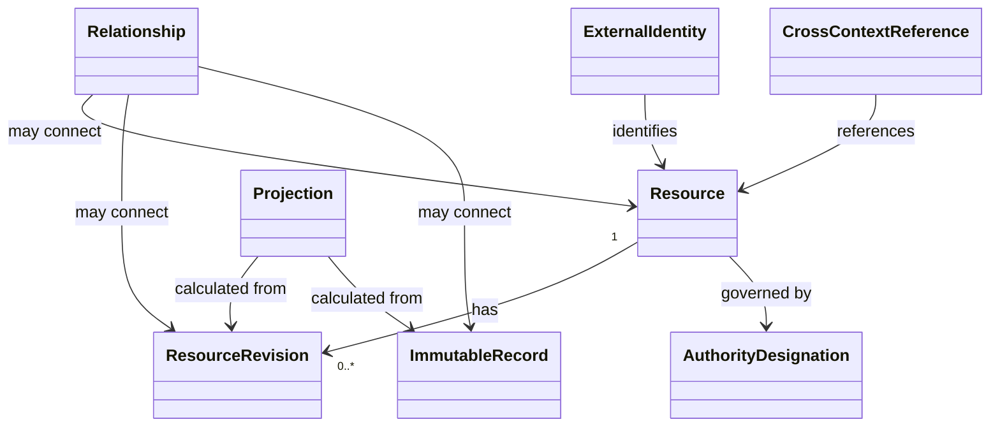

# Shared Foundation Domain Model

**Project:** Organizational Knowledge and Work System

## 1. Purpose

This document defines the shared conceptual foundation used across bounded contexts.

It standardizes identity, revision addressing, relationship semantics, immutable-record references, authority designation, temporal references, provenance, and projection reproducibility.

It does not define the internal lifecycle of Documents, Projects, Publications, Outcomes, financial concepts, or external systems.

## 2. Foundational Concepts

### 2.1 Resource

A Resource is the continuing identity of something managed within a bounded context.

A Resource has:

- Resource Identity;
- Resource Kind;
- owning bounded context;
- creation information;
- zero or more Resource Revisions;
- zero or more Relationships;
- Authority Designation.

#### Invariants

1. Resource Identity is stable and independent of location.
2. Resource Kind has meaning within an owning bounded context.
3. A Resource is not silently replaced by unrelated content or state.
4. Another bounded context references a Resource through its stable identity and published contract, not through internal object identity.

### 2.2 Resource Revision

A Resource Revision is an immutable recorded state of a Resource.

A Revision has:

- Revision Identity;
- Resource Identity;
- zero or more parent Revision Identities;
- recorded time;
- actor or producing agent;
- state or content reference;
- change description;
- sufficient integrity information.

#### Invariants

1. A recorded Revision is immutable.
2. A new durable state creates a new Revision.
3. Historical Revisions remain addressable.
4. A Revision belongs to exactly one Resource.
5. Merge or reconciliation may produce a Revision with multiple parents.

### 2.3 Relationship

A Relationship is an explicit, typed connection between identified domain objects.

A Relationship may connect:

- Resources;
- Resource Revisions;
- Content Regions;
- immutable records;
- external references.

A Relationship has:

- Relationship Identity;
- Relationship Type;
- source;
- target;
- owning bounded context;
- recorded time;
- optional effective period;
- optional context and metadata.

#### Invariants

1. Source, target, and type are explicit.
2. Relationship semantics are defined by the owning bounded context or a shared contract.
3. A Relationship does not transfer authority unless its contract explicitly does so.
4. Historical Relationships are not silently rewritten.
5. A Relationship targeting a continuing Resource defines how an applicable Revision is selected when needed.

### 2.4 Immutable Record

An Immutable Record is a durable account of a completed event, decision, execution, measurement, publication, allocation, or other consequential occurrence.

An Immutable Record has:

- Record Identity;
- Record Type;
- owning bounded context;
- actor or authority;
- recorded time;
- effective time where different;
- subjects and affected identities;
- outcome or recorded fact;
- provenance.

#### Invariants

1. An Immutable Record is append-only.
2. Corrections create a superseding or correcting record.
3. A later interpretation does not alter the original record.
4. The record identifies its authority and source.

### 2.5 Projection

A Projection is a reproducible current or historical view calculated from Resources, Revisions, Relationships, and Immutable Records.

A Projection has or identifies:

- Projection Definition identity and version;
- input identities and applicable Revisions;
- recorded-time boundary;
- effective-time boundary;
- filters, assumptions, parameters, and policies;
- generated time;
- uncertainty or confidence where applicable.

#### Invariants

1. A Projection is derived and is not authoritative source merely because it is displayed.
2. A Projection does not overwrite the facts from which it was calculated.
3. A historical Projection can be reproduced when its inputs and definition remain available.
4. A Projection states whether it is current, historical, estimated, forecast, or scenario-based.

## 3. Shared Identity Concepts

### 3.1 External Identity

External Identity associates a local Resource or record with an identifier in another system.

It records:

- external system;
- external identifier;
- local identity;
- authority status;
- synchronization policy;
- effective period.

### 3.2 Authority Designation

Authority Designation states how a system or context relates to a concept.

Supported designations include:

- Authoritative;
- Replica;
- Projection;
- Index;
- Federation Point;
- External Reference.

#### Invariants

1. Import or synchronization does not silently transfer authority.
2. Conflicting authoritative claims are surfaced rather than silently merged.
3. Local modification rules depend on the authority designation.

## 4. Shared Temporal Concepts

### Recorded Time

When information was recorded by the system.

### Effective Time

When information applies in the domain.

### Observation Time

When an observed fact or measurement occurred.

### Generated Time

When a Projection or generated output was calculated.

#### Temporal invariants

1. Recorded Time and Effective Time are not assumed to be equal.
2. Historical reconstruction may use both recorded-time and effective-time boundaries.
3. Late-arriving information preserves its original observation or effective time when known.

## 5. Shared Provenance Concepts

### Provenance Reference

A Provenance Reference identifies the source, transformation, actor, rule, or execution that contributed to a Resource Revision, Immutable Record, or Projection.

Shared provenance relationship semantics include:

- Derived From;
- Produced By;
- Supersedes;
- Corrects;
- Imported From.

#### Invariants

1. Material source Revisions are exact where reproducibility matters.
2. Provenance does not imply endorsement.
3. Generated and imported information remains distinguishable from authoritative source.

## 6. Shared Classification Reference

Classification Reference points to a classification defined and governed by an owning context.

Examples include:

- sensitivity;
- work type;
- capitalization treatment;
- risk category;
- publication status.

The Shared Foundation does not define the classification's domain meaning.

## 7. Cross-Context Reference

A Cross-Context Reference identifies an object owned by another bounded context.

It contains:

- target context;
- target identity;
- optional target Revision;
- expected contract;
- authority designation;
- last verified time where applicable.

#### Invariants

1. A Cross-Context Reference does not permit mutation of the target.
2. Consumers tolerate unavailable or stale referenced information according to policy.
3. Translation is explicit when the same term has different meanings across contexts.

## 8. Shared Relationship Contracts

The Shared Foundation standardizes only relationship semantics that retain the same meaning across contexts.

### Derived From

One Revision, record, or Projection materially uses another exact source.

### Supersedes

One Resource, Revision, or record replaces another for a stated purpose without erasing history.

### Corrects

One Immutable Record corrects a factual error in another while preserving both.

### Imported From

A local Resource, Revision, or record originated in an external system.

### Relates To

A meaningful association whose more specific semantics belong to the owning context.

Context-specific relationships such as Includes, Covers, Addresses, Allocates To, or Measures remain owned by their bounded contexts.

## 9. Shared Kernel Boundary

The Shared Kernel contains only:

- identity formats and uniqueness rules;
- revision and record addressing;
- relationship addressing;
- temporal references;
- authority designation;
- provenance addressing;
- cross-context reference conventions;
- projection provenance requirements.

It does not contain:

- one universal status model;
- one universal lifecycle;
- project hierarchy rules;
- document assembly rules;
- financial calculations;
- publication approval rules;
- outcome attribution rules.

## 10. Conceptual Diagram

## 11. Open Questions

1. Which identifier formats must be globally unique?
2. Which shared relationship types justify a common contract?
3. How are cross-context contract versions negotiated?
4. Which temporal queries must be supported from the first vertical slice?
5. How are authority conflicts escalated and resolved?
6. Which Projection Definitions are themselves versioned Resources?