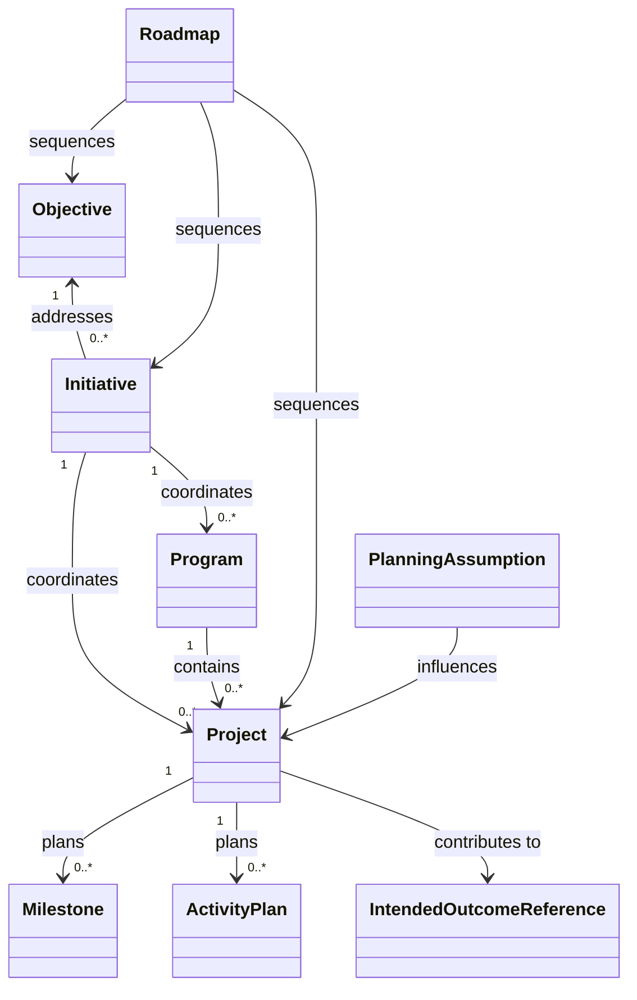

# Work Planning Domain Model

**Project:** Organizational Knowledge and Work System

## 1. Purpose

This document defines the Work Planning bounded context.

The context explains why work exists, what future condition is intended, how coordinated work is organized, and what assumptions and dependencies shape the plan.

It does not record completed work, actual effort, expenditures, or observed outcomes. Those belong to Work Execution, Portfolio and Financial Intelligence, and Outcome Measurement and Learning.

## 2. Core Concepts

### 2.1 Objective

An Objective is a continuing Resource expressing a desired future condition.

An Objective Revision records:

- statement;
- owner;
- scope;
- effective period;
- success conditions;
- priority;
- rationale;
- status;
- related Evidence and Decisions.

#### Invariants

1. An Objective describes an intended condition, not work to be performed.
2. Completion of work does not prove achievement of the Objective.
3. Objective changes create new Revisions.
4. Superseded Objectives remain historically addressable.

### 2.2 Initiative

An Initiative is a continuing Resource representing a coordinated response to one or more Objectives, Needs, Opportunities, Findings, or Decisions.

An Initiative Revision records:

- purpose;
- sponsor;
- intended Outcomes;
- scope;
- planning horizon;
- assumptions;
- status;
- included Programs or Projects.

#### Invariants

1. An Initiative explains why related work is grouped.
2. An Initiative may exist before detailed Projects are defined.
3. Initiative success is evaluated through Outcomes, not merely Project completion.

### 2.3 Program

A Program is a continuing Resource coordinating multiple related Projects or Activities to pursue a broader Objective or Outcome.

A Program Revision records:

- governing Objective or Initiative;
- constituent Projects;
- cross-project dependencies;
- coordination milestones;
- shared constraints;
- governance model;
- planning horizon.

#### Invariants

1. A Program coordinates related work; it is not merely a folder of Projects.
2. Program membership is explicit and effective-dated where necessary.
3. A Program may continue across changes to its constituent Projects.

### 2.4 Project

A Project is a continuing Resource representing a temporary, governed body of work intended to produce defined Deliverables or enable intended Outcomes.

A Project Revision records:

- purpose;
- sponsor;
- accountable owner;
- scope;
- expected Deliverables;
- intended Outcomes;
- start and target completion dates;
- constraints;
- assumptions;
- risks;
- status;
- governing Initiative, Program, Decision, or Objective.

#### Invariants

1. A Project is temporary and outcome-oriented.
2. Project status describes the plan or current governing state, not historical execution facts.
3. A Project completion decision does not prove that intended Outcomes occurred.
4. Material scope or governance changes create a new Project Revision.

### 2.5 Roadmap

A Roadmap is a versioned planning Resource that presents expected sequencing across Objectives, Initiatives, Programs, Projects, Milestones, or Outcomes.

A Roadmap Revision records:

- included planning items;
- planning horizon;
- sequencing;
- assumptions;
- scenario or confidence;
- applicable audience.

#### Invariants

1. A Roadmap is a planning view, not a record of completed execution.
2. Roadmap dates may be forecasts and must be identified as such.
3. A Roadmap does not become authoritative for a Project unless the Project contract explicitly adopts it.

### 2.6 Milestone

A Milestone is a planned checkpoint or significant state in a Project, Program, or Initiative.

A Milestone records:

- milestone identity;
- parent planning Resource;
- intended condition;
- target date or period;
- acceptance criteria;
- accountable Party;
- dependencies.

#### Invariants

1. A Milestone has no duration as a planning concept.
2. Achievement is recorded by an immutable Milestone Acceptance in Work Execution.
3. Changing acceptance criteria creates a new governing Revision.

### 2.7 Activity Plan

An Activity Plan is a planned unit of work.

It records:

- purpose;
- parent Project, Program, or Initiative;
- expected Deliverables;
- planned effort or duration;
- required capabilities or roles;
- dependencies;
- target period;
- acceptance or completion conditions.

#### Invariants

1. An Activity Plan is not proof that work occurred.
2. Actual execution is represented by immutable Work Events and related records.
3. Planned effort and actual effort remain distinct.

### 2.8 Planning Assumption

A Planning Assumption is a versioned assertion accepted for planning despite uncertainty.

It records:

- statement;
- source or rationale;
- confidence;
- applicable scope;
- review date;
- consequences if false.

#### Invariants

1. Assumptions are explicit and reviewable.
2. Contrary Evidence does not erase an assumption; it may challenge or supersede it.
3. Plans influenced by an assumption remain traceable to it.

### 2.9 Intended Outcome Reference

Work Planning references Intended Outcomes owned by the Outcome Measurement and Learning context.

The reference records:

- target Intended Outcome identity;
- expected contribution;
- scope;
- attribution assumption;
- planning confidence.

## 3. Relationship Contracts

### Addresses

A planning Resource responds to a Need, Opportunity, Objective, Finding, Risk, Requirement, or Decision.

### Contributes To

An Initiative, Program, Project, Milestone, or Activity Plan is expected to contribute to an Intended Outcome or Objective.

Contributes To expresses intent, not proof.

### Contains

A Program contains Projects; a Project contains Milestones or Activity Plans; an Initiative may contain Programs or Projects.

Containment is explicit and may be effective-dated.

### Depends On

One planning Resource requires another condition, Deliverable, Milestone, or decision.

The relationship records:

- dependency kind;
- required condition;
- timing constraint;
- consequence of delay;
- owner.

### Governed By

A planning Resource is governed by a Decision, policy, Program, Initiative, or approval authority.

### Supersedes

A later plan or planning Resource replaces an earlier one for a stated scope while preserving history.

## 4. Planning States

The context may use lifecycle states such as:

- Proposed;
- Under Review;
- Approved;
- Active;
- Paused;
- Completed;
- Cancelled;
- Superseded.

These states are contract-specific. They are not a universal shared-kernel lifecycle.

State changes that represent consequential decisions should produce immutable governance or approval records.

## 5. Plan Revision

A Plan Revision is the applicable Revision of an Objective, Initiative, Program, Project, Roadmap, or Activity Plan.

A Plan Revision captures the planned understanding at a point in time.

### Invariants

1. Historical plans remain reconstructable.
2. Actual execution never rewrites the historical plan.
3. Replanning creates a new Revision or a superseding planning Resource.
4. Current-plan projections identify the rule used to select applicable Revisions.

## 6. Context Inputs

The Work Planning context consumes:

- Needs, Findings, Recommendations, and Decisions from Knowledge and Provenance;
- Requirements from Document Authoring or a specification context;
- Intended Outcomes from Outcome Measurement and Learning;
- capacity and financial constraints from Portfolio and Financial Intelligence;
- external planning references through Integration and External Systems.

## 7. Context Outputs

The context publishes:

- approved or proposed Plan Revisions;
- Objectives and intended contribution relationships;
- Project, Program, Milestone, and Activity Plan references;
- planning assumptions;
- dependency information;
- expected Deliverables;
- intended Outcome links.

Work Execution consumes these through stable cross-context references.

## 8. Conceptual Diagram

## 9. Open Questions

1. When should an Initiative be distinct from a Program?
2. Can a Project belong to more than one Program at the same time?
3. Which planning states require formal approval records?
4. Which changes require a new Resource versus a new Revision?
5. How are portfolio scenarios represented without becoming authoritative plans?
6. How are recurring operational activities distinguished from temporary Projects?
7. Which dependency types are required for the initial vertical slice?
