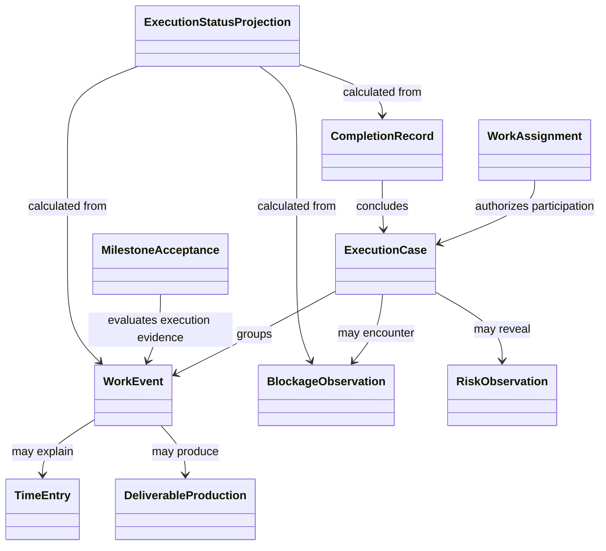

# Work Execution Domain Model

**Project:** Organizational Knowledge and Work System

## 1. Purpose

This document defines the Work Execution bounded context.

The context records what work actually occurred, who or what performed it, what was produced, what impeded progress, and which planned conditions were accepted as complete.

Work Execution consumes plans from Work Planning but does not rewrite them. Current execution status is derived from immutable execution records and applicable plan references.

## 2. Core Distinction

The context distinguishes:

- **planned work** — owned by Work Planning;
- **performed work** — recorded here as immutable facts;
- **delivered output** — a produced Document, Artifact, or external deliverable;
- **observed outcome** — owned by Outcome Measurement and Learning.

```text
Activity Plan
  authorizes or guides

Work Execution
  produces

Deliverable
  may contribute to

Observed Outcome
```

Completion of work does not prove achievement of an intended Outcome.

## 3. Continuing Resources

### 3.1 Work Assignment

A Work Assignment is a continuing Resource that associates planned work with responsible or contributing Parties over an effective period.

A Work Assignment Revision records:

- Assignment Identity;
- referenced Activity Plan, Project, Milestone, or operational obligation;
- assigned Party or role;
- assignment authority;
- expected contribution;
- effective period;
- planned capacity or effort where applicable;
- status;
- conditions or constraints.

#### Invariants

1. Assignment does not prove that work occurred.
2. Assignment authority is explicit.
3. Assignment changes create new Revisions or effective-dated replacements.
4. Historical assignments remain reconstructable.
5. A Party may reject, accept, delegate, or complete an Assignment only through an authorized domain action.

### 3.2 Execution Case

An Execution Case is an optional continuing Resource that groups related Work Events for a particular Activity Plan, operational obligation, incident, service request, or repeated execution.

An Execution Case Revision may record:

- governing plan or obligation;
- accountable owner;
- execution scope;
- current governing constraints;
- applicable environment;
- status projection reference.

#### Invariants

1. Execution Case status is a projection over immutable records where practical.
2. The Execution Case does not replace the Activity Plan or Project that authorized the work.
3. Repeated executions may use separate Execution Cases even when they share one Activity Plan.

## 4. Immutable Execution Records

### 4.1 Work Event

A Work Event is the general immutable record of a consequential execution occurrence.

It records:

- Work Event Identity;
- event type;
- actor or producing agent;
- related Work Assignment or Execution Case;
- referenced Activity Plan, Project, or Milestone;
- recorded time;
- effective or occurrence time;
- description;
- affected Resources or records;
- Evidence and provenance.

Work Event kinds include:

- Work Started;
- Work Resumed;
- Work Paused;
- Work Cancelled;
- Work Completed;
- Scope Concern Raised;
- Handoff Completed;
- Rework Requested;
- External Dependency Changed.

#### Invariants

1. A Work Event is immutable.
2. A later event may supersede an interpretation but does not rewrite the original event.
3. Event type semantics are explicit.
4. The event identifies the plan or obligation under which the work occurred where known.

### 4.2 Time Entry

A Time Entry records effort contributed by a Party or automated agent during a period.

It records:

- contributor;
- work reference;
- start and end time or duration;
- recorded time;
- work classification;
- applicable rate reference where permitted;
- source and authority;
- approval or correction reference.

#### Invariants

1. A Time Entry is an immutable operational record.
2. Corrections create a correcting record.
3. Recorded effort and planned effort remain distinct.
4. Financial value is not intrinsic unless calculated under an explicit rate and policy.
5. Imported time identifies its external authority.

### 4.3 Deliverable Production

A Deliverable Production record states that execution produced or materially changed a Deliverable.

It records:

- producing Work Event or Execution Record;
- exact output Resource and Revision;
- producing Party or agent;
- production time;
- referenced plan, requirement, or acceptance condition;
- provenance.

#### Invariants

1. A Deliverable is a Resource owned by its appropriate bounded context, not by the production record.
2. The exact produced Revision is identified.
3. Production does not prove acceptance, use, or Outcome achievement.
4. Generated outputs remain traceable to exact sources and execution context.

### 4.4 Milestone Acceptance

A Milestone Acceptance records an authorized decision that a planned Milestone's acceptance criteria were satisfied, rejected, or conditionally accepted.

It records:

- Milestone identity and applicable plan Revision;
- decision authority;
- decision time;
- outcome;
- evaluated criteria;
- Evidence;
- conditions or exceptions.

Supported outcomes include:

- Accepted;
- Rejected;
- Conditionally Accepted;
- Withdrawn.

#### Invariants

1. Acceptance evaluates the criteria from an explicit plan Revision.
2. Acceptance does not rewrite the Milestone plan.
3. A changed decision creates a superseding record.
4. Acceptance of a Milestone does not prove achievement of an intended Outcome.

### 4.5 Completion Record

A Completion Record states that an authorized Party concluded that an Activity Plan, Execution Case, Project, or defined work scope was completed, cancelled, or terminated.

It records:

- completed scope;
- applicable plan Revision;
- authority;
- completion time;
- completion outcome;
- produced Deliverables;
- unresolved items;
- Evidence and rationale.

#### Invariants

1. Completion is a consequential decision and is immutable.
2. Completion does not erase unresolved work or exceptions.
3. Completion does not prove intended Outcome achievement.
4. Reopening work creates a new Work Event or execution cycle rather than deleting completion history.

### 4.6 Blockage Observation

A Blockage Observation records Evidence that work cannot proceed as expected.

It records:

- affected work;
- observed condition;
- observer;
- occurrence time;
- expected consequence;
- dependency or constraint involved;
- severity;
- Evidence;
- resolution reference when known.

#### Invariants

1. A blockage is an observation, not a mutable status field.
2. Current blocked status is a Projection over unresolved Blockage Observations and resolution records.
3. Resolution does not erase the historical blockage.

### 4.7 Risk Observation

A Risk Observation records a newly identified or changed uncertainty that may affect work, Deliverables, cost, timing, or Outcomes.

It records:

- risk statement;
- affected scope;
- observer;
- likelihood and impact assessment;
- assumptions;
- occurrence or review time;
- proposed response;
- Evidence.

Risk governance and planning responses may be owned by Work Planning or Governance, while the observation remains an execution fact.

## 5. Relationship Contracts

### Performs

A Party or automated agent Performs work associated with a Work Assignment, Execution Case, or Work Event.

### Executes

A Work Event or Execution Record Executes an Activity Plan, specification, workflow, or operational instruction.

### Produces

A Deliverable Production or Execution Record Produces an exact Resource Revision or Verification Result.

### Fulfills

A Deliverable, Milestone Acceptance, or Completion Record is asserted to fulfill an acceptance condition, Requirement, or planned obligation.

Fulfills is an assertion requiring Evidence; it does not prove an Outcome.

### Blocked By

An Execution Case, Assignment, or Activity Plan is impeded by a dependency, condition, decision, or external fact.

### Corrects

A later immutable record corrects a factual error in an earlier record while preserving both.

### Imported From

An execution record originated in an external system and retains its external authority and identity.

## 6. Execution Status Projections

Current operational state is a Projection rather than the sole historical truth.

Examples include:

- Not Started;
- In Progress;
- Paused;
- Blocked;
- Completed;
- Cancelled;
- Reopened.

A status Projection identifies:

- governing plan Revision;
- included Work Events;
- unresolved blockage records;
- applicable acceptance or completion records;
- calculation rule;
- generated time.

### Invariants

1. Status can be explained from source records.
2. Corrected or late-arriving events may change a current Projection without rewriting history.
3. Different valid Projections may exist for different policy or reporting purposes.

## 7. Context Inputs

Work Execution consumes:

- Objectives, Projects, Milestones, Activity Plans, dependencies, and assignments from Work Planning;
- Requirements and specifications from Document Authoring and Composition;
- Decisions from Knowledge and Provenance;
- authorization and role information from Identity, Access, and Governance;
- external work and time records through Integration and External Systems.

## 8. Context Outputs

Work Execution publishes:

- Work Events;
- Time Entries;
- Deliverable Production records;
- Milestone Acceptances;
- Completion Records;
- Blockage and Risk Observations;
- execution status Projections;
- exact links to produced Deliverables.

Outcome Measurement consumes execution facts and produced Deliverables. Portfolio and Financial Intelligence consumes effort, assignment, timing, and completion records.

## 9. Conceptual Diagram



## 10. Open Questions

1. Which work events are required for the first vertical slice?
2. When is an Execution Case necessary rather than linking events directly to an Activity Plan?
3. Which imported work systems remain authoritative for status, time, and assignments?
4. Which completion decisions require approval?
5. How are delegated assignments represented?
6. Which risk concepts belong in Work Execution versus Work Planning?
7. What event ordering guarantees are required for status Projections?
