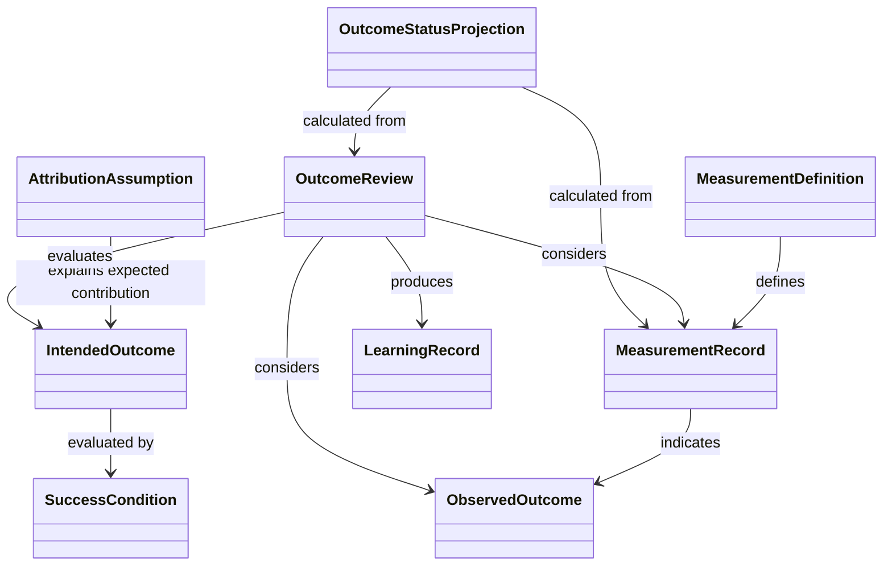

# Outcome Measurement and Learning Domain Model

**Project:** Organizational Knowledge and Work System

## 1. Purpose

This document defines the Outcome Measurement and Learning bounded context.

The context distinguishes intended outcomes from observed outcomes, defines how outcomes are measured, preserves attribution assumptions and confidence, and feeds new evidence back into future decisions and plans.

It does not own Projects, Activity Plans, Work Events, Deliverables, or financial calculations. It references those concepts through stable cross-context identities.

## 2. Core Distinction

The context distinguishes:

- **Intended Outcome** — a desired future condition;
- **Measurement Definition** — a rule for observing or calculating evidence;
- **Measurement Record** — an immutable observation or calculation result;
- **Observed Outcome** — an interpreted result supported by measurements and evidence;
- **Outcome Review** — an immutable assessment comparing intended and observed results;
- **New Evidence** — information that may change future knowledge, decisions, or plans.

```text
Intended Outcome
  evaluated through

Measurement Definition
  produces

Measurement Record
  supports interpretation of

Observed Outcome
  assessed by

Outcome Review
  produces

New Evidence
```

## 3. Continuing Resources

### 3.1 Intended Outcome

An Intended Outcome is a continuing Resource expressing a desired change in behavior, condition, performance, capability, risk, cost, quality, or stakeholder experience.

An Intended Outcome Revision records:

- statement;
- originating Objective, Decision, Initiative, Program, or Project;
- owner;
- target population or scope;
- success conditions;
- baseline reference;
- target value or condition where applicable;
- observation window;
- attribution assumptions;
- confidence;
- review date;
- status.

#### Invariants

1. An Intended Outcome describes a desired result, not a Deliverable or Activity.
2. Completion of work does not establish Outcome achievement.
3. Success conditions are explicit enough to support later review.
4. Changes to success conditions or scope create a new Revision.
5. Historical intended Outcomes remain addressable.

### 3.2 Measurement Definition

A Measurement Definition is a versioned Resource defining how an observation or calculated measure is produced and interpreted.

It records:

- measure name and purpose;
- subject and population;
- unit or scale;
- data source;
- collection or calculation rule;
- inclusion and exclusion criteria;
- aggregation rule;
- temporal window;
- quality constraints;
- uncertainty treatment;
- owner;
- applicable policy.

#### Invariants

1. A Measurement Record identifies the exact Measurement Definition Revision used.
2. A changed calculation or collection rule creates a new Revision.
3. A measure is not assumed to be a valid proxy for an Outcome unless that relationship is explicit.
4. Derived measures preserve their input provenance.

### 3.3 Success Condition

A Success Condition is a versioned criterion used to evaluate an Intended Outcome.

It records:

- target measure or observable condition;
- threshold, range, trend, or qualitative criterion;
- applicable population and scope;
- required observation window;
- confidence or evidence standard;
- exceptions;
- evaluation rule.

#### Invariants

1. Success Conditions are established before or during planning where practical.
2. Retrospective changes are preserved as new Revisions and do not rewrite prior criteria.
3. A Success Condition may be partially satisfied, unmet, inconclusive, or not yet observable.

### 3.4 Attribution Assumption

An Attribution Assumption is a versioned assertion about how work, Deliverables, external conditions, or other causes are expected to influence an Outcome.

It records:

- proposed causal or contributory relationship;
- affected Outcome;
- contributing work or Deliverables;
- external factors;
- rationale;
- confidence;
- review date;
- consequences if false.

#### Invariants

1. Attribution is an assumption unless supported by appropriate evidence.
2. Correlation is not represented as proven causation without explicit justification.
3. Contrary Evidence may challenge or supersede an Attribution Assumption without erasing it.

## 4. Immutable Measurement and Learning Records

### 4.1 Measurement Record

A Measurement Record is an immutable observation or calculation result produced under a specific Measurement Definition Revision.

It records:

- Measurement Definition Revision;
- subject or population;
- observation or effective time;
- recorded time;
- value or qualitative result;
- unit or scale;
- data source;
- input references;
- quality indicators;
- uncertainty or confidence;
- producing Party, agent, or external system;
- authority designation.

#### Invariants

1. A Measurement Record is immutable.
2. Corrections create a correcting record.
3. Late-arriving data preserves its observation time.
4. Imported measurements identify their external authority.
5. Calculated measurements preserve exact input provenance where reproducibility matters.

### 4.2 Observed Outcome

An Observed Outcome is an immutable interpretation of what result occurred during a defined period and scope.

It records:

- related Intended Outcome;
- relevant Measurement Records;
- observed condition or change;
- observation window;
- interpretation;
- analyst or reviewing authority;
- confidence;
- attribution assessment;
- competing explanations;
- recorded time.

#### Invariants

1. An Observed Outcome is distinct from its underlying measurements.
2. Interpretation identifies the Evidence on which it relies.
3. Competing Observed Outcomes may coexist.
4. A later interpretation supersedes rather than rewrites an earlier one.
5. An Observed Outcome does not claim causation beyond its stated attribution confidence.

### 4.3 Outcome Review

An Outcome Review is an immutable assessment comparing one or more Intended Outcomes with observed Evidence and Outcomes.

It records:

- Intended Outcome Revision;
- Success Conditions evaluated;
- Measurement Records and Observed Outcomes considered;
- review authority;
- review time;
- assessment;
- confidence;
- attribution findings;
- unresolved questions;
- recommended Decisions, Actions, or plan changes.

Supported assessments include:

- Achieved;
- Partially Achieved;
- Not Achieved;
- Inconclusive;
- Not Yet Observable;
- Invalidated.

#### Invariants

1. An Outcome Review is immutable.
2. The review identifies the exact intended criteria evaluated.
3. The assessment does not alter the Intended Outcome or source measurements.
4. A later review may supersede an earlier review.
5. Recommendations from a review remain distinct from Decisions and Actions.

### 4.4 Learning Record

A Learning Record is an immutable statement of a lesson drawn from Outcome Reviews, contrary Evidence, repeated patterns, or failed assumptions.

It records:

- lesson or changed understanding;
- source Outcome Reviews and Evidence;
- affected assumptions, Decisions, Objectives, Plans, or policies;
- author or reviewing group;
- confidence;
- recorded time;
- proposed implications.

#### Invariants

1. A Learning Record preserves the evidence and reasoning that produced it.
2. It does not silently revise affected Resources.
3. Adoption of a lesson occurs through explicit Decisions, Revisions, or Supersedes Relationships.

## 5. Relationship Contracts

### Measures

A Measurement Definition or Measurement Record Measures a subject, condition, behavior, Deliverable, process, or Outcome.

### Evaluates

An Outcome Review Evaluates an Intended Outcome or Success Condition using explicit Evidence.

### Observes

A Measurement Record Observes a subject during a defined time or window.

### Indicates

A Measurement Record or set of records Indicates an Observed Outcome or condition.

Indicates is evidential and does not imply causation.

### Contributes To

A Project, Activity, Deliverable, Decision, or external factor is asserted to contribute to an Outcome.

Contributes To records the claim and scope; its strength is supported or challenged by Evidence.

### Challenges

An Outcome Review, Observed Outcome, or Learning Record Challenges an Assumption, Finding, Decision, Objective, or Plan.

### Informs

A Learning Record or Outcome Review Informs a later Decision, Objective, Initiative, Project, policy, or Measurement Definition.

### Supports / Contradicts

Measurements and Outcome Reviews may support or contradict Findings, assumptions, causal claims, or success assertions.

### Supersedes

A later Outcome interpretation, Success Condition, Measurement Definition, or Review replaces an earlier one for a stated purpose without erasing history.

## 6. Outcome Status Projections

Current Outcome status is a Projection over Intended Outcomes, observation windows, Success Conditions, Measurement Records, and Outcome Reviews.

Possible projected states include:

- Not Yet Measurable;
- Awaiting Data;
- On Track;
- At Risk;
- Achieved;
- Partially Achieved;
- Not Achieved;
- Inconclusive;
- Review Overdue.

### Invariants

1. Projected status is explainable from source records and rules.
2. A status is not a substitute for the underlying review and Evidence.
3. Different projections may be valid for different audiences or policies.
4. Late-arriving evidence may change a current Projection without rewriting history.

## 7. Context Inputs

The context consumes:

- Objectives, Intended Outcome references, planning assumptions, and contribution claims from Work Planning;
- Work Events, Completion Records, Deliverables, Time Entries, and Milestone Acceptances from Work Execution;
- Evidence, Findings, Decisions, and Recommendations from Knowledge and Provenance;
- financial and portfolio projections where relevant;
- imported measures through Integration and External Systems.

## 8. Context Outputs

The context publishes:

- Intended Outcomes and Success Conditions;
- Measurement Definitions;
- Measurement Records;
- Observed Outcomes;
- Outcome Reviews;
- Learning Records;
- challenges to assumptions and conclusions;
- evidence for revised Decisions and Plans.

Knowledge and Provenance consumes Outcome Reviews and Learning Records as new Evidence and interpretation. Work Planning consumes adopted learning through explicit Decisions and new Revisions.

## 9. Closed Learning Loop

The canonical loop is:

```text
Evidence
  leads to
Interpretation
  informs
Decision
  authorizes
Plan
  guides
Execution
  produces
Measurement
  supports
Outcome Review
  creates
New Evidence and Learning
```

No transition is implicit. Each step is represented by explicit Resources, records, and Relationships.

## 10. Conceptual Diagram



## 11. Open Questions

1. Which Outcome types are needed for the first vertical slice?
2. When is an Observed Outcome distinct from a Finding?
3. Which qualitative measurement methods require formal contracts?
4. Who has authority to approve a Success Condition or Outcome Review?
5. How should conflicting Measurement Records from different authorities be handled?
6. Which attribution methods are supported initially?
7. When should a Learning Record become a revised Finding, Decision, or policy?
8. Which Outcome status projections should be standardized across contexts?
